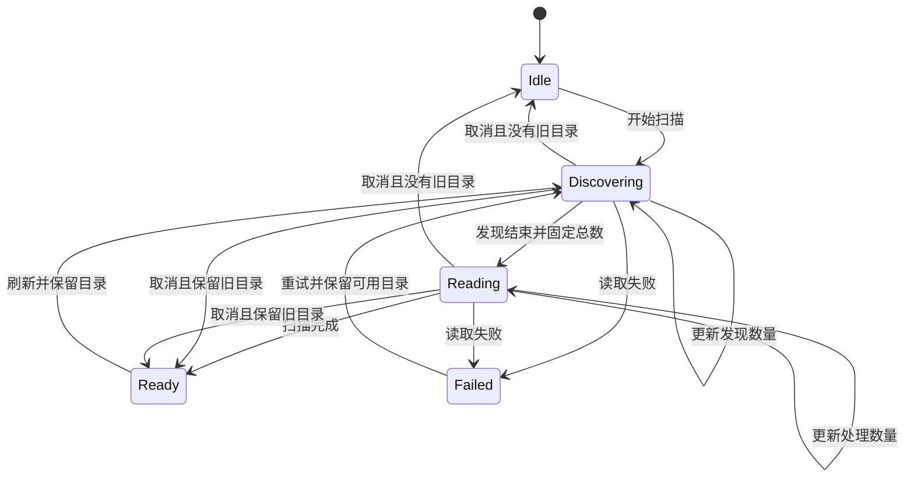

# Gupi 数据获取与加载状态

- 状态：Done。目录扫描与会话数据加载拆分已实现，必要验证完成，可交付试用。
- 日期：2026-09-11。
- 所属：Issue #220；关联[会话工作区设计](README.md)和[第三阶段开发计划](../../../../../docs/dev/issue-220/README.md)。

## 目标与本轮边界

梳理会话目录扫描、打开会话和后续数据刷新的生命周期，使加载反馈与实际工作对应，避免多个不同操作共用笼统的 loading。目录扫描报告真实进度，会话核心数据与附加数据按依赖分别加载。

本文记录已确认的行为、实施边界和必要验证。私有类型、消息命名和控件文案在实现时按这些约定收敛，不另设逐项确认流程。

## 已确认的方向

- 数据获取的调整需要同时设计状态转换、数据所有权和 UI 投影，不能只在现有 loading 上增加进度条。
- 目录扫描采用 Gupi 自定义的业务状态机，复用 `gpui_operation::Transition` trait；不强行嵌入 `refresh::Operation` 的首次加载、刷新、重试等通用状态。
- 自定义状态应直接表达实际扫描阶段，避免通用操作状态和内部扫描阶段形成两套需要共同匹配的生命周期。
- 读取失败就让本次扫描失败，不为权限错误或坏文件增加逐文件补救、自动修复或新旧条目拼接。刷新失败可保留上次完整目录供展示，同时明确报告本次失败。
- 先实施目录扫描，再拆分会话数据加载；两部分分别管理状态，共享 crate 不增加新框架。

已有数据边界继续适用：目录只读扫描用于发现与导航元数据；会话正文、历史和执行状态由 Pi 原生 RPC 提供。PiState 继续负责进程和连接，不因本轮状态设计另建进程管理器。会话发现范围仍为默认目录和已知配置目录，不扩展为全盘搜索、索引数据库或文件监听服务。

## 实现归属与调研依据

| 归属 | 当前行为 |
| --- | --- |
| [目录扫描](../../../src/foundation/session_catalog.rs) | 先从 header 的 cwd 和项目配置找齐文件集合，再有界并发读取元数据；以回调报告进度，成功返回整个 Catalog，读取失败返回错误 |
| [目录状态机](../../../src/state/conversation/catalog.rs) | 保存唯一的目录生命周期、运行任务、扫描标识和后续刷新需求；阶段转换不释放任务，取消或结算后拒绝旧回调 |
| [ConversationState](../../../src/state/conversation.rs) | 协调草稿恢复、目录扫描和 Pi 连接；核心 snapshot 只读 state 与 entries，检查事件及模型版本后应用 |
| [读取状态](../../../src/state/conversation/loading.rs)与[附加读取](../../../src/state/conversation/reads.rs) | 模型、思考能力、统计和 fork 信息分别持有数据、错误与读取任务；请求标识及会话 binding 校验完成结果 |
| [模型修改](../../../src/state/conversation/model_change.rs) | 一个任务覆盖提交与实际状态读回；读回结束后单独加载思考档位，期间的核心刷新需求合并后处理 |
| [Transition trait](../../../../../crates/gpui-operation/src/transition.rs) 只约定消息输入、接收者与输出类型 | 复用 trait 不会自动获得任务所有权、合法转换检查、取消恢复或过期结果保护 |

Pi 0.85.1 的 `--resume` 选择器通过会话扫描的进度回调显示 `Loading loaded/total`；这里是计数文字，不是填充式进度条。扫描在取得候选文件集合后，以有界并发读取元数据，每处理完一个文件便更新计数，失败或无效文件也计入已处理数，最终统一更新列表。它衡量文件处理数量，不估算剩余时间。[Pi session-manager 源码](https://github.com/earendil-works/pi/blob/v0.85.1/packages/coding-agent/src/core/session-manager.ts)、[选择器源码](https://github.com/earendil-works/pi/blob/v0.85.1/packages/coding-agent/src/modes/interactive/components/session-selector.ts)

## 目录扫描状态图

| 状态 | 持有的数据 |
| --- | --- |
| `Idle` | 尚未扫描 |
| `Discovering` | 扫描标识、任务、发现数量、可选旧目录 |
| `Reading` | 扫描标识、任务、固定总数、已处理数量、可选旧目录 |
| `Ready` | 最近一次完整成功的目录结果 |
| `Failed` | 本次扫描错误、可选旧目录 |

状态机消息为 `Start`、带扫描标识的 `Progress` / `Finish`、`QueueRefresh` 和 `Cancel`。`Progress` 分发现和读取两种载荷，首次读取进度固定总数；`Finish` 携带整个成功结果或错误。可选旧目录只是展示数据，不是嵌套的 operation；首次加载与刷新由是否保留旧目录推导。

### 扫描与呈现

- 采用两阶段流程：先枚举目录并读取 header，通过 cwd 找齐已知配置目录；发现结束后固定文件集合，再完整读取元数据。接受重复读取少量 header，不增加元数据缓存。
- 发现阶段显示不定进度；读取阶段显示进度条与“已处理 / 总数”。总数固定，已处理数量单调增加且不超过总数；正常发现结果为零时成功进入空目录状态。
- 目录或文件读取失败立即结算本次扫描为 `Failed`，停止后续工作，不发布部分结果。没有旧目录时展示失败与重试；有旧目录时保留上次完整结果并提示刷新失败。不逐文件保留旧条目、不拼接新旧结果，不为权限问题增加恢复流程。
- 首次扫描完成后统一排序展示，刷新完成后统一替换目录。选择、项目展开状态和内存中未落盘会话独立保留；新对话不因目录扫描被阻塞。
- 运行期间禁用手动刷新，并在动作入口拒绝重复请求。应用自身操作触发的刷新合并为一次后续扫描；运行期间不反复取消重启。仅在成功完成且仍有更新需求时启动后续扫描；失败后清除该需求，等待显式重试，不形成自动重试循环。
- 当前最多并发读取 8 个文件，进度通知按约 100 毫秒节流，阶段切换和最终计数立即通知。这些是可调整的实现参数。

### 状态与任务所有权

- 使用一个业务运行时 enum 实现 `Transition`，暂不另建具名状态的消费式转换体系。合法消息、载荷移动和状态转换集中在该状态机中处理，不镜像保存 phase、data、task。
- 每轮扫描由一个任务完成，运行态持有任务；发现到读取阶段转移同一任务句柄。完成或取消时先安装最终状态，再释放旧任务和载荷。
- 每轮扫描分配唯一标识，进度与完成消息均携带它；同时检查标识和当前阶段，拒绝旧扫描消息及不合法进度。阻塞读取检查取消，取消后仍存活的生产者不得更新当前状态。
- 取消时有旧目录就回到 `Ready`，没有就回到 `Idle`。开始新一轮扫描清除上一轮错误，不恢复历史错误状态。首版不增加用户可见的取消按钮，退出或替换扫描范围时按该规则结束工作并清除后续刷新需求。
- 草稿恢复与目录扫描继续由 ConversationState 协调：启动先恢复非空草稿，再把已知 cwd 交给扫描；恢复过程单独表达，不伪装成目录读取进度。

## 会话数据加载

- 核心 state 与 entries 就绪后展示会话；发送仍受连接状态、运行状态和待处理交互约束，不等待统计与 fork 信息。
- 历史可用性由 `Transcript::{New, Unloaded, Ready(History)}` 表达，成功的空历史也进入 `Ready`。Pi 握手与模型初始化不改变历史可用性；新对话收到实时消息后进入内容呈现。
- 正文与历史面板共同使用派生的 `BodyState`，穷尽匹配新对话、首次加载、已就绪、刷新中、首次失败、刷新失败。首次加载展示 skeleton；首次失败停止占位并提供重试；刷新与刷新失败保留已有内容。就绪后的空历史显示独立空态，不显示新对话欢迎页。
- 模型列表、思考能力、统计和 fork 信息按各自依赖管理加载与错误，只刷新受影响的数据。模型列表刷新不顺带重读全部历史；Pi 进程生命周期仍由 PiState 管理。
- 模型弹层首次打开即加载尚未读取的选项，加载中不重复请求，成功的空列表也视为已加载。新空白会话为读取模型启动连接时，使用连接握手取得实际模型状态，再分别读取模型与思考档位；不读取 entries、统计或 fork 信息。仅为模型选项启动的空白会话不进入侧边栏，首次发送可复用该连接。
- 读取模型或应用核心快照不触发目录扫描。目录扫描只由启动、显式刷新、工作目录变化、会话重命名或 fork 成功、生成结束等目录相关事件触发；会话内存元数据通过列表投影直接反映，不用扫描作为通用同步手段。
- 附加数据错误显示在对应功能附近。统计失败不阻塞对话；模型列表失败时可继续使用已经确认的当前模型。核心打开失败、连接异常和运行最终失败才提升为会话级错误。
- 侧边栏继续优先表达等待输入、会话级失败、运行中、正在打开，空闲不显示状态标记。“正在打开”仅表示核心会话尚未就绪，附加数据刷新在对应区域反馈。
- 修改模型或思考强度后，命令完成并读回实际状态再解除相应控件禁用。请求失败也不能假定实际值未变，应核对状态；核对失败就在相关操作处报告，不伪造成功或继续自动补救。
- 实际模型与思考值确认后即可恢复发送；思考档位作为独立请求继续加载，只禁用思考调节。模型列表读取失败时禁止选择旧列表里的其他模型，已有的实际模型仍可用于发送。
- 先保证一致性再安排并发。读取结果绑定连接实例、会话 binding 和相关内容版本；模型能力结果还须对应实际模型。旧读取不能覆盖更新的 Pi 事件，不用附加数据完成去清除其他操作的运行状态。

## 状态与派生查询

- 只保存必要的权威事实。不同阶段或载荷用枚举表达；仅需一个条件时直接查询状态或任务句柄，不另存 `loading`、`running` 等派生标记。可并存的压缩、重试和停止请求是独立事实，不合并成互斥阶段。
- 模型选择器在渲染和操作时读取会话投影，不保存或自行修改业务标记。界面只保留弹层、搜索、滑块草稿，以及维持拖动所需的绑定缓存；任务启动与重复请求由会话状态层决定。
- `RunState` 持有本轮活动消息，运行状态由它查询；非 streaming 快照不能代替 `agent_settled` 结束本轮。`ToolExecution` 携带执行中、成功或失败对应的输出。
- 重命名和 fork 的 `SessionCommand` 持有任务；fork 的临时编辑器文本仅属于该运行变体。模型修改的已确认失败和无法确认分别表达，后者继续阻止发送。
- 配置错误保留原始错误类型，冲突、需要重读、写入来源和文案键按需查询。启动页面即时派生为 `StartupScreen` 后穷尽匹配；已应用配置直接读取配置所有者，退出和复制反馈直接由各自任务句柄表达。
- 保留的 Pi 快照用于显示，不证明连接仍然可用；模型刷新在实例已经断开时重新连接。

## 实施顺序与必要验证

1. 目录扫描：实现业务状态机、两阶段进度、直接失败与取消语义，再接入侧边栏。验证进度有效、过期消息失效、成功统一替换、失败不发布部分结果，以及任务在阶段切换和退出时正确释放。
2. 会话数据：拆开核心与附加读取，收紧局部错误及控件禁用范围。验证读取与事件的一致性、模型修改读回和附加数据失败不阻塞核心会话。

实现未增加依赖、索引缓存或 Pi 私有协议。目录与附加读取状态局限在 Gupi；模型修改后的核心刷新按实际事件需求执行，刷新模型列表不触发整份历史读取。

### 验证结果

- `cargo build -p gupi --locked`、Gupi 全目标/全特性 Clippy（`-D warnings`）与 workspace 格式检查通过；原有状态回归及消息/压缩回归通过。相关文档链接和中英文 Fluent 键及参数检查通过。
- 目录回归覆盖发现项目的自定义目录、固定总数、正常空目录、坏文件直接失败、取消、过期回调、进度范围、任务跨阶段存活，以及刷新失败保留完整旧目录但不自动重试。
- 受控 Pi 进程回归覆盖附加请求卡住/失败不阻塞核心与发送、首次发送跨连接启动保留、局部重试不重读历史、模型命令失败后读回实际值、慢档位请求不阻塞已确认模型的发送，以及旧历史快照不能覆盖读取期间的新事件。
- 新空白会话回归确认：首次模型读取只使用一次连接握手及模型/思考请求，不产生历史、统计、fork 请求或目录扫描；显式刷新模型与目录互不触发，模型连接启动期间提交消息仍只发送一次。弹层回归确认首次打开自动加载、加载中去重，以及成功的空列表不被误判为未加载。
- 正文回归覆盖模型初始化仍保持新对话、实时消息进入内容态、既有空历史的文件检查与首次加载、首次失败后重试成功，以及空历史刷新失败后保留原数据版本。
- 状态收敛回归覆盖：模型选择器读取尚未同步到控件的最新业务状态、忽略的请求不遗留 loading、断线后保留快照仍可刷新模型、无法确认模型时禁止发送且重试不重复写入，以及重命名/fork 任务与编辑器文本的完整生命周期。
- 状态收敛后的 macOS 隔离窗口已确认启动、模型弹层自动加载、刷新后进入模型列表、设置页返回与正常退出；刷新只新增模型列表和思考档位两个请求，无真实模型调用。
- macOS 隔离窗口已确认正文和历史面板的 skeleton、同时显示失败与重试入口、重试后呈现成功的空历史。原生检查发现并修复了两个重试入口的可访问性 ID 冲突及窄面板按钮被挤出的布局问题，修复后同一路径通过。
- macOS 隔离新对话窗口确认模型弹层自动取得选项；手动刷新后进程记录只新增模型列表与思考档位两个请求，可访问性树中的侧边栏保持原状，未加入空白会话。该窗口已通过应用退出流程关闭。
- macOS 隔离窗口确认核心历史在模型列表加载期间可用，统计与 fork 错误分别出现在本地入口；目录刷新实际显示 `210 / 1025` 的计数和对应进度，列表、选择与展开状态保留。
- 注入坏 header 后，窗口显示目录失败与实际出错路径，旧列表保持；移除测试文件并显式重试后，可访问性树确认错误入口和旧测试条目已清除。最后一次重试截图受系统捕获错误影响，未据此声称获得该步骤截图。
- 原生验证使用临时配置、会话文件和假的 Pi 进程，不调用真实模型；受控退出与临时窗口数据清理已完成。本地开发应用 `target/debug/Gupi.app` 的可执行文件已同步到最终构建。
