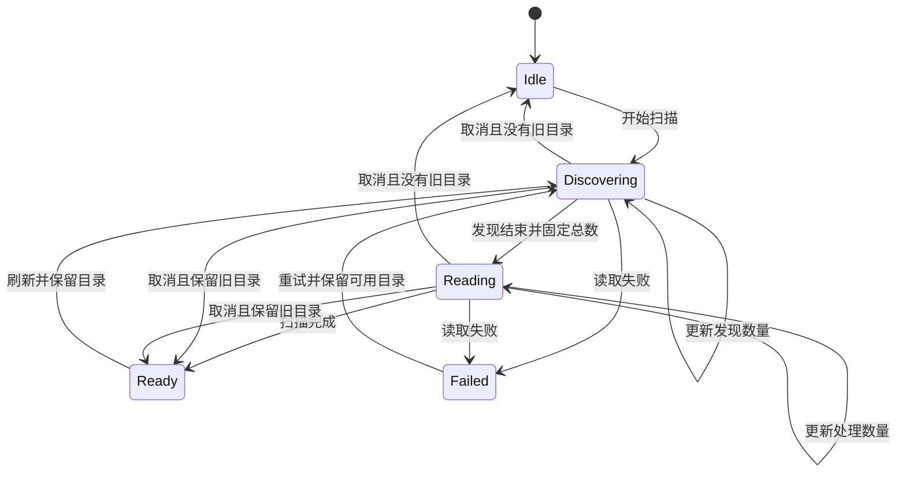

# Gupi 数据获取与加载状态

- 状态：Ready。方案方向已确认；尚未进入实现。
- 日期：2026-09-11。
- 所属：Issue #220；关联[会话工作区设计](README.md)和[第三阶段开发计划](../../../../../docs/dev/issue-220/README.md)。

## 目标与本轮边界

梳理会话目录扫描、打开会话和后续数据刷新的生命周期，使加载反馈与实际工作对应，避免多个不同操作共用笼统的 loading。目录扫描报告真实进度，会话核心数据与附加数据按依赖分别加载。

本轮只维护设计文档，记录已确认的行为和实施边界。私有类型、消息命名和控件文案在实现时按这些约定收敛，不另设逐项确认流程。

## 已确认的方向

- 数据获取的调整需要同时设计状态转换、数据所有权和 UI 投影，不能只在现有 loading 上增加进度条。
- 目录扫描采用 Gupi 自定义的业务状态机，复用 `gpui_operation::Transition` trait；不强行嵌入 `refresh::Operation` 的首次加载、刷新、重试等通用状态。
- 自定义状态应直接表达实际扫描阶段，避免通用操作状态和内部扫描阶段形成两套需要共同匹配的生命周期。
- 读取失败就让本次扫描失败，不为权限错误或坏文件增加逐文件补救、自动修复或新旧条目拼接。刷新失败可保留上次完整目录供展示，同时明确报告本次失败。
- 先实施目录扫描，再拆分会话数据加载；两部分分别管理状态。本轮仅更新文档，不修改共享 crate 或应用代码。

已有数据边界继续适用：目录只读扫描用于发现与导航元数据；会话正文、历史和执行状态由 Pi 原生 RPC 提供。PiState 继续负责进程和连接，不因本轮状态设计另建进程管理器。会话发现范围仍为默认目录和已知配置目录，不扩展为全盘搜索、索引数据库或文件监听服务。

## 当前实现与调研依据

| 已核实事实 | 设计影响 |
| --- | --- |
| [目录扫描](../../../src/foundation/session_catalog.rs) 同步遍历目录并逐文件读取 JSONL 元数据，最后排序返回整个 Catalog | 后台执行避免阻塞界面，但不会自动产生可供 UI 使用的进度 |
| [ConversationState](../../../src/state/conversation.rs) 以 `catalog`、`scan_task` 等字段表达目录数据与工作；`scanning()` 同时包含草稿恢复和目录扫描 | 当前只能判断是否忙，不能准确表达扫描阶段；草稿恢复也需要明确归属 |
| 扫描从会话 header 的 cwd 发现项目，再读取项目配置，可能加入新的 sessionDir | 文件总数会随发现过程变化，不能直接把最初枚举的文件数当作最终分母 |
| 扫描把单文件或部分目录错误收入 warnings；当前入口直接返回 Catalog | 新实现改为读取错误使本次扫描失败，不把部分成功结算为完整目录，也不把错误呈现为空列表 |
| `snapshot()` 等待连接就绪后，依次请求 state、entries、models、thinking levels、stats、fork messages，最后统一应用 | 后置请求的延迟或失败会影响核心历史的交付；拆分时还必须处理数据间依赖与事件一致性 |
| Session 的 `operation`、`refresh`、错误及运行字段共同影响 loading 和控件禁用 | 修改模型、读取数据和打开会话的反馈边界需要重新明确 |
| [Transition trait](../../../../../crates/gpui-operation/src/transition.rs) 只约定消息输入、接收者与输出类型 | 复用 trait 不会自动获得任务所有权、合法转换检查、取消恢复或过期结果保护 |

Pi 0.85.1 的 `--resume` 选择器通过会话扫描的进度回调显示 `Loading loaded/total`；这里是计数文字，不是填充式进度条。扫描在取得候选文件集合后，以有界并发读取元数据，每处理完一个文件便更新计数，失败或无效文件也计入已处理数，最终统一更新列表。它衡量文件处理数量，不估算剩余时间。[Pi session-manager 源码](https://github.com/earendil-works/pi/blob/v0.85.1/packages/coding-agent/src/core/session-manager.ts)、[选择器源码](https://github.com/earendil-works/pi/blob/v0.85.1/packages/coding-agent/src/modes/interactive/components/session-selector.ts)

## 目录扫描状态图

| 状态 | 持有的数据 |
| --- | --- |
| `Idle` | 尚未扫描 |
| `Discovering` | 扫描标识、任务、发现数量、可选旧目录 |
| `Reading` | 扫描标识、任务、固定总数、已处理数量、可选旧目录 |
| `Ready` | 最近一次完整成功的目录结果 |
| `Failed` | 本次扫描错误、可选旧目录 |

消息按业务含义组织为 `StartScan`、`DiscoveryProgress`、`DiscoveryFinished`、`ReadProgress`、`ScanFinished`、`ScanFailed`、`CancelScan`。可选旧目录只是展示数据，不是嵌套的 operation；首次加载与刷新由是否保留旧目录推导。

### 扫描与呈现

- 采用两阶段流程：先枚举目录并读取 header，通过 cwd 找齐已知配置目录；发现结束后固定文件集合，再完整读取元数据。接受重复读取少量 header，不增加元数据缓存。
- 发现阶段显示不定进度；读取阶段显示进度条与“已处理 / 总数”。总数固定，已处理数量单调增加且不超过总数；正常发现结果为零时成功进入空目录状态。
- 目录或文件读取失败立即结算本次扫描为 `Failed`，停止后续工作，不发布部分结果。没有旧目录时展示失败与重试；有旧目录时保留上次完整结果并提示刷新失败。不逐文件保留旧条目、不拼接新旧结果，不为权限问题增加恢复流程。
- 首次扫描完成后统一排序展示，刷新完成后统一替换目录。选择、项目展开状态和内存中未落盘会话独立保留；新对话不因目录扫描被阻塞。
- 运行期间禁用手动刷新，并在动作入口拒绝重复请求。应用自身操作触发的刷新合并为一次后续扫描；运行期间不反复取消重启。仅在成功完成且仍有更新需求时启动后续扫描；失败后清除该需求，等待显式重试，不形成自动重试循环。
- 先采用小规模有界并发和进度通知节流，例如最多 8 个文件、约每 100 毫秒通知一次，阶段结束立即通知。这些是可调整的实现参数。

### 状态与任务所有权

- 使用一个业务运行时 enum 实现 `Transition`，暂不另建具名状态的消费式转换体系。合法消息、载荷移动和状态转换集中在该状态机中处理，不镜像保存 phase、data、task。
- 每轮扫描由一个任务完成，运行态持有任务；发现到读取阶段转移同一任务句柄。完成或取消时先安装最终状态，再释放旧任务和载荷。
- 每轮扫描分配唯一标识，进度与完成消息均携带它；同时检查标识和当前阶段，拒绝旧扫描消息及不合法进度。阻塞读取检查取消，取消后仍存活的生产者不得更新当前状态。
- 取消时有旧目录就回到 `Ready`，没有就回到 `Idle`。开始新一轮扫描清除上一轮错误，不恢复历史错误状态。首版不增加用户可见的取消按钮，退出或替换扫描范围时按该规则结束工作并清除后续刷新需求。
- 草稿恢复与目录扫描继续由 ConversationState 协调：启动先恢复非空草稿，再把已知 cwd 交给扫描；恢复过程单独表达，不伪装成目录读取进度。

## 会话数据加载

- 核心 state 与 entries 就绪后展示会话；发送仍受连接状态、运行状态和待处理交互约束，不等待统计与 fork 信息。
- 模型列表、思考能力、统计和 fork 信息按各自依赖管理加载与错误，只刷新受影响的数据。模型列表刷新不顺带重读全部历史；Pi 进程生命周期仍由 PiState 管理。
- 附加数据错误显示在对应功能附近。统计失败不阻塞对话；模型列表失败时可继续使用已经确认的当前模型。核心打开失败、连接异常和运行最终失败才提升为会话级错误。
- 侧边栏继续优先表达等待输入、会话级失败、运行中、正在打开，空闲不显示状态标记。“正在打开”仅表示核心会话尚未就绪，附加数据刷新在对应区域反馈。
- 修改模型或思考强度后，命令完成并读回实际状态再解除相应控件禁用。请求失败也不能假定实际值未变，应核对状态；核对失败就在相关操作处报告，不伪造成功或继续自动补救。
- 先保证一致性再安排并发。读取结果绑定连接实例、会话 binding 和相关内容版本；模型能力结果还须对应实际模型。旧读取不能覆盖更新的 Pi 事件，不用附加数据完成去清除其他操作的运行状态。

## 实施顺序与必要验证

1. 目录扫描：实现业务状态机、两阶段进度、直接失败与取消语义，再接入侧边栏。验证进度有效、过期消息失效、成功统一替换、失败不发布部分结果，以及任务在阶段切换和退出时正确释放。
2. 会话数据：拆开核心与附加读取，收紧局部错误及控件禁用范围。验证读取与事件的一致性、模型修改读回和附加数据失败不阻塞核心会话。

剩余工作是实现时的技术收敛：确定私有消息载荷、数据依赖顺序和版本检查位置，结合实际任务运行方式落实取消和通知节流。无需预建通用框架或追加缓存方案；按改动完成受影响构建、关键回归和必要启动检查后交付试用。

本轮仅更新方案并检查文档内容与链接，尚未修改代码或执行应用验证。
