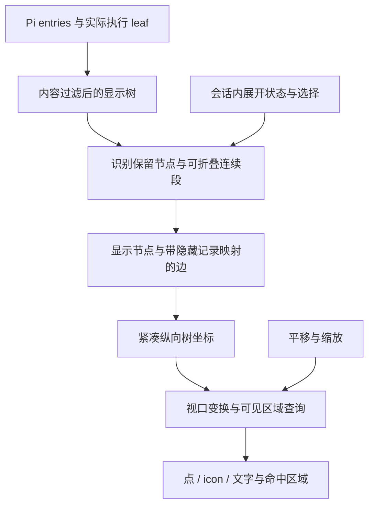

# Gupi 会话树画布

- 状态：Implemented。首版实现和必要验证已完成，可交付试用；真实触控板 pinch 尚待设备验证。
- 调研日期：2026-09-11。
- 所属：Gupi，Issue #220。与[会话工作区设计](README.md)共用历史数据、预览和会话操作；本文负责新增画布的交互、布局及验证。
- 下文记录当前设计、实现边界与验证结果；交互细节按试用反馈调整。

## 目标与已确定方向

会话通常是少量分叉连接很长的连续对话。画布应优先帮助用户辨认分支、定位节点和预览对应内容，同时避免长链占满画面。

用户已确定：

- 树从上到下展开，后续节点在父节点下方。
- 采用连续段折叠；折叠段表现为虚线，线中间有数字，普通连线为实线。
- 不增加专门的“展开”节点。悬停折叠线提供展开 tooltip，悬停和点击范围要宽于可见线条。
- 使用可以放大、缩小的画布。
- 高亮从根到所选节点的祖先路径，实际执行位置使用独立标记。
- 不为节省少量实现工作引入维护依据不足的布局库；可以自己实现用途明确的算法。

画布作为第三种历史模式，内容沿用详细模式的过滤结果。节点随缩放依次呈现实心点、类型 icon、icon 加文字摘要；普通连线与折叠线采用相同的路径高亮规则。完整交互约定见后文“已确定的产品规则”。

## 当前实现与可复用部分

| 源码事实 | 对画布的影响 |
| --- | --- |
| [History](../../../src/state/history.rs) 保存 Pi entries、原始 parent_id、执行 leaf 和标签；`path` 根据父指针还原路径 | 沿用这份历史权威，不在画布里维护另一份 transcript，也不改写原始树 |
| `tree_rows` 按简略/详细规则过滤记录，把子节点连接到最近可见祖先，标记 `indirect_parent` | 复用详细投影，再对投影后的显示树折叠；过滤已改变显示树的连接端点 |
| [HistoryGraph](../../../src/state/history/graph.rs) 是固定行高、从旧到新的轨道图 | 不是二维紧凑树布局，不能通过旋转或缩放现有列表完成新画布 |
| [历史列表](../../../src/features/home/history.rs) 使用 List 的虚拟滚动、选择和确认事件；[绘制](../../../src/features/home/history/graph.rs) 把间接连接画成虚线 | 新画布必须补齐命中、焦点与键盘行为；现有虚线不具备“点击展开”的含义 |
| [节点呈现](../../../src/features/home/history/presentation.rs) 已有用户、助手、工具、失败、压缩等 icon、颜色和 tooltip | 可以复用类型映射和主题色，不需要另建图标系统。多个过程类型目前共用弱化颜色，并非每种类型都有独立颜色 |
| [HomeView](../../../src/features/home.rs) 区分列表选择、正文 preview 和实际执行 leaf；`preview_node` 可定位正文 | 画布点击接回原预览流程，不直接调用 Pi 改变执行分支 |
| [History](../../../src/state/history.rs) 的 `revision` 在历史快照替换后增加，独立于正文 `content_revision` | HomeView 按历史 revision 更新画布输入；正文流式刷新不重建画布布局 |
| 实时消息先存入 `live`，其 `entry` 为 None；历史在 RPC 快照后更新 | 第一版只显示已有稳定 entry ID 的节点，沿用现有刷新时机，不增加逐 token 的临时树节点 |
| [面板布局](../../../src/features/home/panes.rs) 与 HomeView 将历史宽度限制在 240–520px | 首版沿用现有面板，宽分叉通过平移和缩放浏览，不增加主区域放大入口 |

历史界面在同一模式切换入口提供简略列表、详细列表和画布；画布内部没有第二组过滤开关。

## 技术调研结论

### 布局可以由应用自己实现

这里的父子关系是单父节点树；缺失父节点或过滤后可能出现多个显示根。无需一般有向图的消环、多父节点排序或跨节点端口路由。

在 Gupi 内实现固定布局占位的 Reingold–Tilford / Buchheim 紧凑树布局：单子节点上下对齐，兄弟子树保持稳定顺序，比较子树轮廓后安排横向间距。D3 的树布局采用这一类算法，并提供节点间距与坐标输出，适合作为算法参考。[D3 tree 文档](https://d3js.org/d3-hierarchy/tree)、[实现源码](https://github.com/d3/d3-hierarchy/blob/main/src/tree.js)

不要以“按深度复制整个子树轮廓”的简化实现代替线性算法：长链下可能出现平方级时间或内存。使用索引数组、显式前后序遍历和延迟位移，避免递归深度依赖。多个显示根可以在布局内部接到不绘制的虚拟根，虚拟根不参与计数、选择或 Pi 数据。

布局采用索引数组和延迟位移的线性算法，已通过 1 万节点展开单链、2000 个同父分支及嵌套分叉回归；未进行专项性能基准测试。[tidy.rs](../../../src/state/history/canvas/tidy.rs) 保留 D3 算法的版权与 ISC 许可声明。[D3 许可](https://github.com/d3/d3-hierarchy/blob/main/LICENSE)

`tidy-tree` 的已发布版本仍是 2023 年的 0.1.0，文档覆盖有限；现有证据不足以将其作为首选依赖。Rust Dagre 移植版的长期维护也需要独立判断，不能直接继承 JS 上游的成熟度。本方案不新增布局库。[tidy-tree 发布资料](https://docs.rs/crate/tidy-tree/latest)、[Rust dagre](https://docs.rs/crate/dagre/latest)

### 当前 GPUI 依赖具备基础能力

已核对根 Cargo.toml、Cargo.lock 和本机安装源码：`gpui-kit / gpui-component / gpui-base = 0.6.0`，`gpui-pre / gpui-pre-macos = 0.3.3`。源码能力如下，实际验证结果见文末。

| 能力 | 版本内源码依据 | 接入判断 |
| --- | --- | --- |
| 滚动与拖动 | `gpui-pre/src/interactive.rs` 的 `ScrollWheelEvent`、`MouseMoveEvent`；`elements/div.rs` 的事件监听 | 可在画布容器处理平移，手势不能穿透到正文或面板拖拽 |
| 触控板缩放 | `PinchEvent`、`InteractiveElement::on_pinch`；macOS `events.rs` 将 `NSEventTypeMagnify` 转为 PinchEvent | macOS 原生接入路径存在；其他平台与真实触控板体验仍需实测，保留按钮/快捷键入口 |
| 自绘线、点、SVG | `elements/canvas.rs`、`path_builder.rs`、`Window::paint_svg` | 可复用底层绘制，canvas 本身没有树布局、相机和完整交互控制器 |
| 裁剪 | `Window::with_content_mask` 与容器 overflow；`Window::paint_layer` | `paint_layer` 负责绘制层次，不能单独当作新的裁剪遮罩 |
| tooltip、焦点、菜单 | 现有 Stateful Div / Tooltip / FocusHandle / PopupMenu | 尽量复用；纯绘制像素不会自动成为可聚焦或可访问的节点 |
| 现成 Tree 控件 | `gpui-component/src/tree.rs` 返回 ListItem，委托 `gpui-base::Tree` 管理行 | 属于列表树，不能直接承担二维缩放画布 |

实现组合交互容器、连线绘制层和当前可见节点元素。节点位置、文字和命中范围统一使用同一套坐标转换；原生 tooltip 由画布持有延迟任务，离开目标、拖动或更新布局时失效。

### 前端参考的具体用途

- [React Flow Contextual Zoom](https://reactflow.dev/examples/interaction/contextual-zoom)：随缩放决定显示内容。借鉴呈现分级，不直接复制其节点形状或阈值。
- [React Flow BaseEdge](https://reactflow.dev/api-reference/components/base-edge)：可见线条之外有独立的不可见交互宽度。文档默认值为 20；Gupi 可按自身尺寸调整，不能把 SVG 世界坐标宽度直接当成缩放后的屏幕命中宽度。
- [React Flow 视口交互](https://reactflow.dev/learn/concepts/the-viewport)：区分滚动平移与滚动缩放两类习惯，可参考其设计工具式控制。
- [React Flow Expand and Collapse](https://reactflow.dev/examples/layout/expand-collapse)：完整数据与可见投影分离。该示例折叠的是后代子树，且属于 Pro 示例；我们要折叠连续路径，不能直接等同于其行为或假设示例源码可直接使用。

以上只作为算法和交互参考，不引入 React、WebView 或 JS 运行时。

## 数据与布局流程

过滤、折叠和缩放分别处理内容范围、节点可见性和呈现大小，均保持原始 entries 与 Pi 执行位置不变。

### 过滤、折叠和计数

过滤决定哪些记录属于画布的内容范围，折叠只临时收起该范围中的连续节点。两者都不删除原始 entries。画布先使用详细模式的过滤结果，再折叠显示树；“展开 N 个节点”恢复的 N 个节点均属于该内容范围。

一个可折叠段形如 `A → u1 → u2 → … → uk → B`：内部节点在显示树中都只有一个父节点、一个子节点，且没有必须单独展示的节点。k 至少为 3 时默认折叠；折叠后仍只有 A、B 两个实际节点，中间是带数字的虚线，数字为 k，不含 A、B，也不表示消息轮数或 Token 数。悬停显示“展开 k 个节点”，点击一次恢复整段相同的 entry ID。

分叉、显示根和叶子是结构边界。当前执行位置、所选节点、预览定位点，以及用户消息、assistant 最终回答、带标签、压缩和分支摘要的可见节点均保留。过程中的错误继续显示失败状态，但不再仅因失败而阻止折叠。内容过滤本身不显示的定位点映射到最近可见祖先；不额外恢复被过滤的记录。当前分支同样允许折叠，用户消息和最终回答之间的过程链按阈值收起。

每条折叠边保存可追溯的有序内部节点索引，以及是否跨越了内容过滤记录。展开意图按会话和 entry ID 保留；快照内索引用于布局查询，替换快照时重建。

展开后在段端点的右键菜单提供“收起此连续段”。只有内部不含当前保留节点的段才能收起；如果选中或预览位置仍在段内，应先移动该位置再收起，不能静默隐藏或更改选择。新增历史不会收回用户已展开的部分，重新识别连续段时按稳定 ID 保留展开意图。

普通实线可表示显示树中的父子关系，未必是原始 JSONL 中相邻的两个 entry。对于单纯经过过滤记录的边保持实线，tooltip 可解释过滤；只有存在可展开内部节点时才使用“虚线 + 数量”。当前列表原有的间接边虚线保留在原视图，不能直接继承到画布而制造无效展开入口。

沿用详细投影意味着部分实际分叉点仍会被过滤，分支连接到较早的可见祖先。首版接受这一呈现，不补充额外结构节点，也不把显示连接描述成原始 JSONL 中的直接相邻关系。

### 压缩后的几何

布局针对折叠后的显示树计算。折叠边占正常的短连接距离，并留出数字空间，不能仍按被隐藏节点数量保留巨大纵向空白。纵坐标表示当前显示树中的先后层次，不是跨分支的墙钟时间，也不是原始深度；展开不同段后，不同分支的同一行不代表同一时间。

给节点预留固定的逻辑占位，缩放仅改变绘制呈现，不能在“显示文字”的临界点改变布局输入并触发整树跳动。缩小时绘制实心点，正常大小显示类型 icon，放大且空间足够时附加一至两行文字摘要，不常驻文本框。文字按屏幕空间选择性展示，优先选中/悬停节点，再处理其他标签碰撞。类型颜色复用已有语义色，工具内部主要通过 icon 区分。

### 视口与交互

统一以画布局部逻辑像素计算：`screen = world × zoom + pan`，逆变换用于命中与可见区域查询。GPUI 的逻辑 Pixels 与显示器设备像素缩放分开，不能重复乘 DPI。

围绕指针缩放时，先由旧变换求出指针下的世界坐标，再调整 pan，让该世界点在新 zoom 下仍位于同一屏幕位置。展开、重新布局或面板变宽时，优先保持用户操作节点/段端点的屏幕位置；选中节点不在视口中时不要因锚定把画面拉回远处。

基础控制：

| 操作 | 行为 |
| --- | --- |
| 双指滚动、普通滚轮 | 平移画布；可利用横向分量 |
| pinch、缩放按钮、平台对应的修饰键加滚轮 | 围绕指针或视口中心缩放，限制有效缩放范围 |
| 空白区拖动 / 空格加拖动 | 平移；节点暂不提供自由拖动或连线编辑 |
| 点击节点 | 选择并复用正文预览；保持 Pi 执行 leaf |
| 悬停/点击折叠边 | 提示/执行展开；不更改正文预览或 Pi 分支 |
| 定位当前节点、查看全图 | 用户主动触发；查看全图不在每次新消息后自动执行 |

每个会话首次打开画布时，以可读缩放定位当前执行节点的可见代表；没有可见节点时显示空状态。关闭后重开、切换模式或切回同一会话时保留其视口和展开状态。首版使用现有历史面板，不增加主区域放大入口。

折叠边命中区域为 24px 屏幕逻辑宽度，按到绘制曲线的距离判定，数字标签也可命中。相邻目标重叠时，节点优先于边，再按距离与稳定顺序选取；画布外、工具栏和面板拖拽区不参与命中。

拖动达到阈值后取消本次点击；平移、缩放、切换会话及目标失效时关闭旧 tooltip。极小缩放下多个目标无法同时拥有互不重叠的大命中范围，此时保留最近目标规则并允许放大后精确选择。

### 选择、路径和运行位置

高亮根到所选节点的祖先路径，折叠边如果承载这段路径也高亮，其他连接弱化；实际执行 leaf 使用独立标记。类型颜色继续属于节点，路径强调使用统一主题强调色，避免与类型颜色争夺含义。

现有 `preview_leaf` 可能为所选节点找到该分支中更晚的后代，用于正文上下文。路径高亮仍在所选节点结束，不随正文上下文延伸到后代。

键盘操作不再由 List 自动提供，需要补足画布局部焦点和可见节点导航。方向键按父子/兄弟关系只移动选择，Enter 确认正文预览；鼠标点击直接选择并预览。折叠连接提供可访问的展开操作，具体绑定沿用应用惯例。命中辅助目标不作为伪造会话节点加入数据树。缩放和平移快捷键只在画布获得焦点时生效，不能占用输入框编辑按键。

## 所有权、更新与性能

- History 继续拥有记录和描述；折叠投影与布局作为 Gupi 内部派生数据。Pi RPC 的协议、生命周期和会话文件格式无需为画布变化。
- 会话级视图状态在同一次应用运行期间保存选择、展开记录、pan 和 zoom，不能在切换 session 时串用。退出后恢复默认，不扩展持久化文件。
- 树结构、展开状态或保留节点集合发生变化时更新投影/布局；正文流式文本、颜色、hover、路径高亮和缩放不应各自触发树坐标重算。仅移动到已有可见节点时更新选择与高亮；外部定位落在折叠段内部时先显露该节点，再按锚点规则更新布局。标签或类型变化影响保留规则时重新投影。
- 平移/缩放只查询可见节点与穿过视口的边。端点均在屏幕外的连线仍可能穿过视口，不能仅按端点是否可见剔除。
- 布局后建立按层和横向范围查询的索引，避免每一帧重新创建全部节点元素；每条边保存一次，避免为跨越的每一行重复存储线段。
- 全局重排可能改变其他节点位置。锚定视口和稳定兄弟顺序可以降低跳动，但不能宣称所有旧节点坐标永远不变。增量布局不是第一版的前提。
- 开始时使用有失效条件的派生缓存；若测量发现布局阻塞 UI，再把纯数据计算移到后台，并按输入版本丢弃迟到结果。不要先增加一套独立后台服务。

## 已确定的产品规则

用户已确认以下选择。完成首版必要验证后交付试用，根据实际反馈调整，不为常规尺寸或手势参数另设确认步骤。

| 编号 | 主题 | 已确定规则 |
| --- | --- | --- |
| D1 | 模式与内容范围 | 增加第三种画布模式，使用详细投影；保留现有简略/详细列表，不增加第二组过滤开关，不补回被过滤的实际分叉节点 |
| D2 | 数字口径 | 展开后出现的隐藏节点数，不包含两端；tooltip 为“展开 N 个节点” |
| D3 | 默认折叠 | 至少隐藏 3 个节点才折叠；保留显示树的分叉、根、叶、选择/预览/执行定位点，以及用户消息、assistant 最终回答、带标签、压缩和分支摘要的可见节点；失败状态本身不阻止折叠，当前分支也允许折叠 |
| D4 | 展开与收起 | 一次展开整段；段端点右键菜单提供“收起此连续段”，不增加展开节点，不隐藏段内仍需保留的节点 |
| D5 | 节点呈现 | 缩小为实心点，正常为类型 icon，放大且有空间时附文字摘要；无常驻文本框；颜色区分主要类型，工具内部主要通过 icon 区分 |
| D6 | 高亮与预览 | 根到所选节点高亮；点击节点预览，方向键只移动选择，Enter 确认；实际执行位置独立标记 |
| D7 | 打开位置与容器 | 首次以可读缩放定位执行节点的可见代表，重开保留会话视口；提供查看全图；首版沿用历史面板 |
| D8 | 状态寿命 | 本次应用运行内按会话保留视口和展开状态，新增消息不自动收起已展开部分；不跨重启保存 |

当前缩放范围为 0.001–4，按钮每步乘除 1.2；小于 0.65 显示点，从 1.25 起按空间显示摘要，选中/悬停节点从 0.65 起优先显示摘要。tooltip 延迟为 450ms。参数可按试用反馈调整。

## 实现归属

- [state/history/canvas.rs](../../../src/state/history/canvas.rs)：连续段识别、语义保留节点、展开意图、选择路径、按层可见查询。
- [canvas/tidy.rs](../../../src/state/history/canvas/tidy.rs)：迭代式 Buchheim 布局，含虚拟根，保持兄弟顺序。
- [features/home/history/canvas.rs](../../../src/features/home/history/canvas.rs) 与 [geometry.rs](../../../src/features/home/history/canvas/geometry.rs)：相机、曲线绘制与命中、文字避让、原生 tooltip/菜单、焦点和键盘。
- [HomeView](../../../src/features/home.rs)：每个 SessionView 持有独立画布实体，按历史 revision 同步，预览和 fork 复用既有流程。第三模式入口、图标和中英文本分别归属历史视图、资源映射和应用 locales。

没有新增依赖、Pi RPC 命令或持久化字段。

## 验证结果

2026-09-11 完成受影响构建、关键回归和必要原生试用：

- 默认保留规则调整后，`cargo test -p gupi history --locked` 通过 19 项。新增回归确认用户消息和最终回答保持可见、过程中的失败节点可折叠且展开后保留失败类型；已有覆盖包括折叠展开往返、计数与保留节点、选中后禁止收起、快照追加保留展开状态、1 万节点单链、2000 个同父分支、嵌套分叉、多个显示根、穿屏边、缩放锚点、曲线命中和标签避让。
- `cargo build -p gupi --locked`、`cargo clippy -p gupi --all-targets --locked -- -D warnings`、格式及差异空白检查通过。现有依赖 `block 0.1.6` 仍有 Rust future-incompat 提示。中英文新增本地化键与参数一致。
- 此前 macOS 原生交互验证使用隔离模拟 Pi RPC 和临时会话：在线条旁 9px 点击可展开，端点菜单可收回整段，展开保持端点位置。拖动折叠线只平移，不误展开；停留后出现展开节点数提示。新的角色保留规则通过上述投影回归验证。
- 缩放按钮、滚动平移、宽分叉查看全图、节点预览、方向键只选中而 Enter 确认、E 展开均已验证。选中其他分支时，正文进入预览，原执行位置圆形标记保持；放大后的父节点摘要避让折叠数量。
- 切换模式/会话、关闭重开面板保留会话视口和展开状态；重启后恢复默认列表与新画布视口。测试进程与临时数据已清理，未调用模型。

原生 pinch 已接入 GPUI 事件，但 Computer Use 无法产生真实触控板 pinch，本轮未验证该手势的设备体验；Linux/Windows 原生表现与专项性能基准也未验证。

先前准备的 105 个原始 entries、8 个分叉点、21 个叶子、最大原始深度 26 的本地模拟会话继续供用户试用。计数包含元数据，不能当作画布节点数；仓库自动回归不依赖该会话路径。
