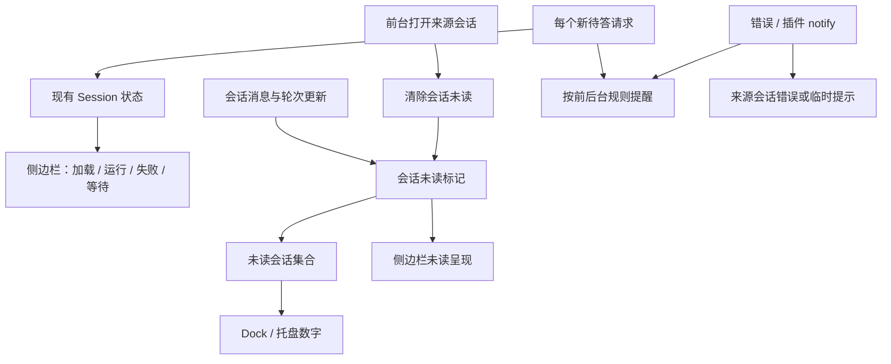

# 通知与用户提醒

归属 [#241](https://github.com/suxiaoshao/gpui/issues/241)，父 Issue #217。状态：代码已实现、自动化验证通过；应用内实机检查通过，用户已确认 macOS 完成通知及 Dock/Tray 数字正常（产品决定已确认，计数按未读会话口径，提醒按请求处理）；系统通知、Dock 注意力、数字标记和托盘提示统一在此实现，不作为 #223 新增前置条件。保留已经存在的错误反馈、插件 `notify` 和交互请求，不把“暂不做”解释成删除或屏蔽它们。重试倒计时属于原位置的运行状态展示，已确认在 #236 中实施。

**当前实现：** [事件消费](../../../src/state/conversation.rs) 发布带来源和实例绑定的 `Attention(Notice)`，保留 RPC request id 和完整严重等级；[统一投递](../../../src/app/notifications.rs) 在应用层只订阅每个会话 owner 一次，选择前台 toast / 后台系统通知，管理撤回与回源。`pending_ui`、运行和错误仍由原 Session 持有。阅读只增加 `Session.unread`，插件/压缩提醒保存在来源 `notices`；渲染不会重新发送提醒。

## 实现边界与验证

- `state/notifications.rs` 定义 `Kind`、`Notice`、`NoticeContent` 和可持久化 `Preferences`；不新增 RPC schema、数据库或第二套等待/执行状态。
- `app/notifications.rs` 的来源引用是 `WeakEntity<ConversationState>`；窗口只登记当前展示关系。临时窗口关闭不释放全局 Session，投递与系统点击不依赖旧窗口 entity。系统标签包含 owner/session/binding/request，旧请求、已删除来源或旧实例不会被点击恢复。
- `agent_settled` 以本轮实际 assistant 文本形成未读，合并历史与 live 数据读取；正常结果才通知完成，错误结果按失败路由，主动取消不报完成或失败。`agent_end`、工具进度和中间重试不发通知。手动压缩只由 RPC 结果提醒，避免与 `compaction_end` 双报；自动压缩只保留未取消且不再重试的失败详情。
- 页面可见性与窗口实际激活状态共同决定已读/投递。锁定版本 GPUI 的 macOS `active_window()` 读取 `mainWindow`，不足以证明应用在前台，当前逐窗口读取实际 activation 标记；不做消息视口阅读检测。
- 只有会话元数据/状态、选择、目录变化触发汇总；正文 delta 和草稿输入不遍历全局会话。托盘投影、数字无变化时不更新原生 UI；语言变化单独更新菜单文字。
- 设置页每个偏好是独立 `SettingItem`。Dock 复用 `platform-ext` 的 objc2 接口，托盘复用 `tray-icon`；`platform-ext` 直接声明已被 GPUI 锁定的 `objc2-user-notifications 0.3.2`，补充 Badge 授权，不新增第三方通知封装。Windows 展示托盘菜单/提示计数及原生注意力，不实现任务栏数字覆盖图标。
- 未读与临时提示在当前进程内保存；不做跨重启通知历史。进入来源等同查看，不逐条跟踪提示阅读；内容仍留在“会话提醒”中，直到用户清除。
- 验证：`cargo test -p gupi --locked` **233 项通过**；`cargo clippy -p gupi -p platform-ext --all-targets --locked -- -D warnings`、格式与差异检查通过。专项覆盖路由默认值、逐请求提醒/撤回、未读计数与待答分离、前台打开清除未读、设置页不代替阅读、同一 owner 不重复投递、取消/最终失败分流、回源不新建/重连/代答、发送回执不阻塞最终提醒。配置回归同时覆盖通知偏好写入磁盘、保留 Pi 编辑草稿和后续保存不覆盖通知设置。
- `cargo run -p xtask --locked -- bundle gupi` 已生成独立 `.app`。隔离配置与模拟 Pi 实测：通知开关、完成模式切换与配置写入；多条插件提醒展开、严重等级区分与清除；后台完成后来源项目显示未读计数 1；待答显示“等待输入”和确认控件，确认后恢复输入框。实测修复了配置差异合并遗漏 `notifications` 导致设置保存仍为旧值的问题，并通过定向回归、Clippy、格式检查和重新打包。
- 系统通知中心、Dock 自动化读取出现超时或只返回无关窗口，此前未能由工具取得完整系统界面证据；后续用户截图确认完成通知，手测确认 Tray 菜单计数与数字、修复后的 Dock 数字正常。系统点击回源、Dock 跳动、真实前台激活后清除未读及 Windows 原生效果仍未完成实机验收。上述路由/计数/回源的自动化回归通过，但不能代替原生验收。
- 当前没有产品待确定项。未完成的原生验证边界见上述记录；测试使用临时目录与本地模拟 Pi，没有连接真实模型，也没有安装或替换日常应用。


| 场景 | 用户正在看来源界面 | Gupi 在前台，但用户在其他会话/页面 | 应用在后台或没有可见窗口 | 实施边界 |
| --- | --- | --- | --- | --- |
| 需要用户确认、选择、输入或编辑（包括插件通过标准 UI 发出的确认） | 直接显示现有交互，不重复弹通知 | 应用内提醒来源会话正在等待操作 | 默认发送系统通知；点击回到仍有效的请求 | 每个新请求按前后台规则提醒，不跨请求合并；不能仅凭 confirm 推断为权限审批 |
| 任务最终失败、Pi 意外断连、保存失败等错误 | 来源界面显示错误与已有恢复操作 | 对影响任务的最终失败发送一次应用内提醒 | 最终失败默认发送系统通知；可自动恢复的中间失败不逐次推送 | 区分业务失败、连接和存储故障，不将所有 error 都升级为系统通知 |
| 插件主动 notify | 应用内显示并区分 info/warning/error | 应用内显示来源 | 默认不发系统通知，用户可开启；保留未读提示供返回查看 | 插件级别本身不能决定是否打断用户 |
| 回答完成/临时模板任务完成 | 更新完成状态即可 | 显示未读状态 | 默认仅后台发送系统通知 | 以 agent_settled 等最终状态判断，不能每次 agent_end/工具结束都通知；失败、取消不报完成 |
| 用户发起的导出、安装/更新/删除资源、清理等操作结果 | 局部反馈或已有应用内提示 | 必要时用带对象名称的应用内通知 | 暂不增加通用系统成功通知；失败按错误规则评估 | 已有反馈保留；未来确有长耗时任务再讨论，不凭空增加任务中心 |
| 复制、保存设置、模型切换、改名、队列变更 | 控件或列表反馈；有必要才简短提示 | 同步对应界面 | 不发系统通知 | 避免每项成功操作都弹提示；失败仍保留既有反馈 |
| 重试等待、压缩过程、工具进度、用量更新 | 更新所属状态区域 | 更新已有必要状态 | 不发系统通知 | 倒计时不每秒通知；阶段进展不等于需要用户注意 |
| 系统权限缺失、附件无法读取、配置校验失败 | 在触发操作的位置说明问题及可用操作 | 无来源操作时不凭空提示 | 不用桌面通知代替权限对话框或表单校验 | 保留既有交互；统一错误提示也随错误项延后 |

实现约束：

- 根据**来源界面是否正被用户查看**选择交互位置；根据**应用是否在前台**决定是否适合系统通知，不能把“后台 session”直接等同于“应用在后台”。系统通知与应用内弹出提醒避免重复，来源界面的状态仍保留。
- 通知携带稳定来源会话/操作或请求标识。临时窗口可销毁，系统提醒不依赖窗口 entity 存活；点击时定位已有会话，不自动新建或发送内容。
- 同一等待请求只提醒一次；答复、超时、取消、断连后不再显示过期操作。点击陈旧通知时核对请求，不延长 Pi 的超时，也不自动确认。
- 系统通知（含锁屏）默认只显示应用、通用事件类型，不包含正文、插件报错详情、完整路径或敏感会话名；详情在应用内查看。平台权限被拒绝时保持应用内状态可见，不反复索权。
- 不为提醒增加历史数据库、独立错误中心或另一套 session 状态。手动压缩可能同时收到 compaction_end 和 RPC 失败，按实际操作去重；不以任意时间窗口过滤所有相似报错。非致命插件错误不能直接改变任务结果，也不把提示写入模型上下文。

## 原生复测与人工接续（2026-09-23）

用户截图已确认 macOS 通知中心显示 Gupi“回答已完成”。再次复现日志显示后台未读数从 0 变成 1 且没有清零；用户随后确认 Tray 有数字，只有 Dock 没有。只读检查系统设置发现 Gupi 未启用“标记”能力，锁定 GPUI 仅申请 Alert/Sound。已补充首次未读时的 Badge 授权，授权完成后重设当时的最新计数；不在启动时索权，也不循环重试拒绝结果。用户重启修复后的测试包并确认 Dock 数字已正常，系统点击回源仍未验收。

使用独立 release `.app`、隔离配置和本地模拟 Pi，没有调用模型或读取日常会话。

- 通过：主窗口隐藏后重新打开，原待答请求仍存在；RPC 日志证实仍为同一个 Pi 进程，恢复窗口没有新增 prompt 或自动回复。用户点击确认后等待状态消失。
- 通过：模拟最终失败显示侧边栏错误状态和具体失败内容。
- 发现：同一 assistant `errorMessage` 同时由 `features/home/messages.rs` 和 `features/home/composer.rs` 显示，正文末尾和输入框上方出现重复失败文本。尚未修复；这不等于重复发送系统通知。
- 验证限制：工具读取隐藏的 Gupi 窗口会触发重新显示，日志证实 hide 后随即 show；调整为隐藏后只访问系统界面，Gupi 保持隐藏，但通知中心工具仅返回小组件，系统菜单读取超时。因此工具未能可靠验证点击回源、Dock 跳动、临时窗口焦点和原生前台清除未读。完成通知和 Dock/Tray 数字的通过结论来自后续用户手测，不能推及其余未测场景。

人工接续（默认通知设置）：

| 操作 | 预期 |
| --- | --- |
| 发送延迟完成请求后切到其他应用 | 后台完成时提示“回答已完成”；同一会话未读只计 1，返回前台来源会话后清除 |
| 发送延迟待答请求后切到其他应用 | 提示“等待你的输入”，Dock 请求注意力；待答本身不增加未读数字；点击通知只回源，不自动确认 |
| 发送延迟失败请求后切到其他应用 | 提示“任务失败，需要查看”，不报完成；进入来源可见具体错误 |
| 在临时窗口发送延迟待答请求，离开使窗口隐藏，再点系统通知 | 恢复同一临时会话及待答内容，不回退主窗口、不重新发送 |
| 通过托盘打开等待/未读会话 | 定位对应来源；计数与侧边栏一致，数字归零后清除 |
| 前台看着来源会话完成/等待；关闭对应系统通知后再测后台 | 前台来源不重复发系统通知；关闭系统通知不影响已有状态与未读计数 |

首次系统通知授权、允许/拒绝后的系统行为以及 Windows 原生效果仍需目标设备人工验证。拒绝权限时，来源会话仍应可见待答/错误/提醒。

## 已确认的产品规则

| 决定 | 行为 |
| --- | --- |
| D1 计数 | 按 Codex 的未读会话口径汇总；每个未读会话计 1。待答请求、错误状态和插件 notify 本身不直接增加数字 |
| D2 已读 | 前台打开来源会话后清除未读，不做逐条阅读或消息进入视口检测；待答请求仍需回答、取消或超时才清除，断连按已有逻辑使请求失效 |
| D3 默认通知 | 待答和最终失败默认在后台发系统通知；回答完成默认仅后台通知；插件提醒默认应用内显示，可开启系统通知 |
| D4 提醒强度与内容 | 后台每个新待答请求可触发一次 Dock 跳动，几个请求就分别处理，不判断或合并连续问卷；系统通知默认显示通用描述，点击回到来源主/临时会话 |
| D5 提醒保留 | 来源会话临时保留尚未读的插件提醒，可展开查看，多条不同提醒不互相覆盖；本轮不做跨重启通知历史 |

以上已按用户对 Codex/Zed 对照结果的最新决定修订。计数采用 Codex 未读口径，取消跨请求问卷合并；其他已确认规则保留。首次实际通知沿用 GPUI 授权流程；权限拒绝时保留应用内反馈。平台适配与具体 Rust 类型按下文实施，不再将常规实现细节列作产品待确认项。实现和验证结果以上节为准。


## Pi / Codex 桌面提醒调研（2026-09-23）

此处“系统消息”按桌面系统通知处理，归本 Issue；聊天正文中的 `custom_message display:true` 仍由 #242 承接。两项可以由同一业务事件驱动，但不把提醒写成 Pi 的 system message 或模型上下文。

### ask-user 为什么会让终端的 Dock 图标跳动

核对本机实际安装的 `@juicesharp/rpiv-ask-user-question` **2.11.0**：`ask-user-question.ts::emitTerminalAttention` 写出 `BEL = "\x07"`，并以 `process.stdout.isTTY` 为条件。TUI 问卷显示前调用该函数；RPC 分支也经过该函数，但管道 stdout 不是 TTY，因此不会向 RPC 输出混入 BEL。

这是终端响铃信号；终端应用决定声音、Dock 跳动等响应。例如 [Ghostty 的 bell-features](https://ghostty.org/docs/config/reference#bell-features) 中 `attention` 会在失焦时请求注意力，macOS 表现为 Dock 图标跳动一次。不能把这个行为描述成 Pi RPC 已携带桌面通知，也不应让 Gupi 解析/模拟终端控制序列。

Pi 官方另有两个不同机制：

- `examples/extensions/notify.ts` 在 `agent_settled` 发终端通知：一般终端用 OSC 777，Kitty 用 OSC 99，WSL/Windows Terminal 分支调用 Windows Toast。它是示例扩展，不能据此认定所有 Pi TUI 默认都通知。
- `packages/tui/src/terminal.ts::setProgress` 用 OSC 9;4 表示运行进度和清除进度。进度、响铃、系统通知及未读数量不能混为一项。

Gupi 应从已消费的标准 `extension_ui_request` / `pending_ui` 得到“需要用户输入”，覆盖 select/confirm/input/editor，而不是按 `ask_user_question` 工具名称硬编码。插件的内部 blocked/prompt 扩展事件也不等于通用 RPC 事件。

### 当前 Codex Electron 的实际实现

只读提取本机 `/Applications/ChatGPT.app/Contents/Resources/app.asar`，确认 bundle id 为 `com.openai.codex`，包为 `openai-codex-electron` **26.917.51856**。旧的 26.915 解包未作为当前版本证据。以下为安装包源码结论，未触发真实系统通知或改变应用设置。

| 部分 | 实际实现 | 可借鉴的规则 |
| --- | --- | --- |
| 系统通知 | 主进程构造 Electron `Notification`，处理 show/click/action/close/failed；按 id 替换，部分事件 deduplicate | 稳定来源 id；点击能定位来源，而非只显示无归属 toast |
| 类型 | permission、question、turn-complete 分开；等待类传 timeoutType never（平台是否采用由系统决定） | 等待输入与普通完成使用不同路由和生命周期 |
| 等待用户输入 | 监听待答请求；前台窗口正在展示来源会话时抑制系统通知；其他会话或后台可通知 | 不能只判断应用有没有焦点，还要判断用户是否看着来源会话 |
| 异步问题 | 另监听问题 item；发出和点击前检查问题未提交、未跳过且仍属于有效 turn | 无效请求不继续引导用户处理；Gupi 先复用自己已经存在的请求生命周期 |
| 完成通知 | off / unfocused / always，未设置时为 unfocused；过滤尚有 continuation 的完成，自动化可明确不通知 | 每轮最终状态通知一次，不按每个工具结束发送；这是 Codex 行为，不直接变成 Gupi 默认值 |
| 请求解决/查看 | serverRequest/resolved 按请求 id 隐藏通知；进入来源会话或其窗口恢复焦点时清除对应通知 | 用户已经处理或查看后，系统提示与页面状态一起更新 |
| Dock 数字 | renderer 计算聚合数量，经 electron-set-badge-count 调用 app.setBadgeCount | 数字由应用状态推导，不等于系统通知发送次数 |
| Dock 计数范围 | 侧边栏相关未读会话、自动化未读运行，以及启用的 Work 范围汇总并去重；关联会话的未读也会传播。待审批/待输入另有状态推导，不能声称每个待答请求都独立增加 badge | 不是简单数 assistant 消息、所有后台任务或所有运行中任务 |
| 托盘 | renderer 发送 running/unread/pinned/recent 等线程列表；macOS 当前路径通过原生 addon 的 updateStatusItemMenuState，其他路径用 Electron Tray/Menu | 运行中与未读/待处理分组，点击回到具体会话；不要推断托盘数字必然与 Dock 是同一公式 |
| 声音/动作 | 声音可配置；审批通知可带操作，完成通知有回复入口 | Gupi 首轮只需点击回来源，不自动扩展为通知内问卷、授权或发送回复 |

本次未在提取的主进程通知路径发现 `app.dock.bounce` 调用；Electron 提供 [dock.bounce](https://www.electronjs.org/docs/latest/api/dock#dockbouncetype-macos) 不代表 Codex 已使用。macOS 托盘最终数字绘制位于原生 addon，本次只确认传入的状态列表，未核实原生绘制公式。

安装包检索入口（均可由上述 asar 重现）：

- `.vite/build/main-9ZiZs9Y1.js`：`showNotification`、`electron-set-badge-count`、`updateStatusItemMenuState`、`dismissByConversationId`。
- `webview/assets/app-initial-512cdcfeac48.js`：`[desktop-notifications] service starting`、`serverRequest/resolved`、`electron-set-badge-count`、`tray-menu-threads-changed`；本次构建中的 `Qoa` 为聚合 badge selector，`Cqr` 判断本地未读/待请求。
- `webview/assets/notifications-settings-87a871019579.js`：turnMode、permissionsEnabled、questionsEnabled、sound。

### 提交失败与通知点击补充核对（2026-09-24）

通知点击仅选择已保留的来源会话，不调用普通打开会话所用的连接路径。Pi 断开后的失败通知仍保留原错误与草稿，用户主动重新连接才启动新进程。回归测试使用模拟 Pi 子进程，待其退出后模拟系统通知点击回调，检查没有新进程、没有新增 prompt，并检查显式重连仍有效；未重新进行原生通知点击实测。

重新只读提取本机 Codex Electron **26.917.62051**（build 10789）的 `app.asar`，核对 `webview/assets/app-initial-37097744327a.js`：

- `turn/start` 请求明确失败时，提交路径将本地 turn 标成 `failed`，添加 `type: error`、`willRetry: false` 的消息并向调用者抛出错误；这一分支没有发布 `emitTurnCompleted`。
- `lNc` 桌面通知服务订阅 `addTurnCompletedListener`、审批及用户输入请求；`emitTurnCompleted` 的业务发布点来自 `turn/completed` 事件处理，并非本地提交失败后的状态更新。正常结束通知受 off / unfocused / always 等设置约束。
- 因此，核对到的普通本地提交失败路径不会单独触发系统失败通知。若服务端另行发出 `turn/completed`，则属于另一条结束事件路径，不能与请求被拒绝混同。

这是安装包静态源码核对，未在日常 Codex 会话中注入失败做实机验证。Gupi 当前提交失败保留会话错误和应用内 toast；是否额外发送后台系统通知属于产品选择，不能以“Codex 已如此实现”为依据。本轮只修复通知点击的隐式重连，保留提交失败路由不变。

### 实施前的依赖能力核对

以下是实施前基线；当前接入见“当前实现”。核对锁定版本 `gpui-pre 0.3.5`、`gpui-pre-macos 0.3.5`、`tray-icon 0.25.1`：

| 能力 | 已有接口 / 缺口 |
| --- | --- |
| 系统通知发送、撤回、点击 | `App::show_system_notification`、`dismiss_system_notification`、`on_system_notification_response`；`SystemNotification` 带 tag/title/body/actions。优先复用，无需为基础通知另加库 |
| 应用身份 | `App::set_app_identity`；实施前未调用；现已在 `app::run` 启动时设置 |
| macOS 实现 | GPUI 使用 UNUserNotificationCenter；首次发送申请 Alert/Sound 授权。普通 cargo run 缺 app bundle 时明确禁用，必须在打包 .app 中验证 |
| Dock 跳动 | `Window::request_attention` 在 macOS 调用 NSApplication requestUserAttention，类型为 informational；当前 window active 时直接返回。应用层仍须按整个应用/来源可见性路由 |
| 无窗口提醒 | 系统通知可以由 App 全局发出；window.request_attention 需要存活窗口，临时窗口销毁后不能持有失效 handle。若要求无窗口也跳动，需要补应用级原生注意力入口，不为了跳动重建临时窗口 |
| Dock 数字 | 锁定 GPUI 没有公开 badge setter；已确认可用 platform-ext 现有 objc2-app-kit 直接接 NSDockTile.setBadgeLabel，不需要新增库，详见下文 |
| 托盘数字 | 已有 tray-icon 的 set_title 可用于 macOS 文本计数；Windows 不支持该方法，需图标/菜单方案。实施前只有四个固定入口；现已保留固定入口并增加计数/来源菜单 |
| 声音和 badge 授权 | GPUI 通知结构没有声音/数字字段；macOS 实现虽申请 Sound，但未显式 setSound，授权也未包含 Badge。不能把申请权限当作声音或 badge 已实现 |

系统接口参考：[Electron app.setBadgeCount](https://www.electronjs.org/docs/latest/api/app#appsetbadgecountcount-linux-macos) 明确数字为 0 时隐藏，macOS badge 受通知权限影响。Windows 平台 backend 的当前源码和实机行为本轮未验证，不承诺所有原生能力跨平台一致。

### Gupi 页面与系统分工

- **正在查看且应用在前台**：直接呈现已有待答表单/运行结果，不重复发系统通知或跳 Dock。
- **前台但在别的会话**：侧边栏保留“等待输入”，给予一次可点击的应用内提示；不自动切走当前会话。
- **应用后台或无窗口**：待答请求发一次系统通知，点击恢复主/临时来源会话；每个新待答请求按规则触发一次 informational Dock 跳动，不合并连续问卷，不持续跳动、不强行抢焦点。
- **角标**：按 Codex 的未读会话集合计数，每个未读会话贡献 1；不把 pending_ui、error 和插件 notify 的数量或存在性直接计入。一个会话可能既等待输入又未读，此时贡献的 1 来自未读标记。
- **托盘**：数字使用同一未读会话总数；菜单仍可分别列出“等待输入”“未读信息”“运行中”，点击回来源。菜单状态与数字独立，不照搬 Gupi 尚无的自动化、Work、多宿主计数。
- **数据与刷新**：待答与运行状态直接来自现有全局 Session；完成未读如需增加，使用最小阅读标记，不复制消息/请求/会话对象、不新建通知历史库。由已有定向事件更新，重复 render 不重发提醒；主/临时窗口共用来源 id，避免各窗口独立发一遍。
- **设置**：等待输入和最终失败的后台系统通知默认开启；完成通知默认仅后台；插件提醒默认应用内，可开启系统通知；Dock 跳动可关闭。通知设置归本 Issue，不并入快捷键或 #242 会话阅读，不扩展自定义声音库。

上述规则已接入。验证需覆盖有效/已解决请求、来源可见/不可见、临时窗口已关闭；原生系统效果需要真实 .app 验证，不能用测试平台投递记录替代。


## RPC 提醒接入与 Dock 依赖方案

### 已确认的接入决定

用户确认并已采用以下方案：

- 补全已有 RPC notify 链路，保留来源会话、请求 id 和 info/warning/error 等级，接入统一通知路由；待答提醒继续从 pending_ui 驱动。
- 系统通知复用 GPUI 已有发送、撤回与点击接口。
- macOS Dock 数字在现有 platform-ext::app 中用 objc2-app-kit 接 NSApplication.dockTile.setBadgeLabel；主线程调用，零时清除，应用级生效，不依赖临时窗口存活。
- 托盘复用现有 tray-icon。上述能力不新增 Tauri、Tao 或 notify-rust 依赖；Badge 授权在现有 platform-ext 中通过已锁定的 objc2-user-notifications 接入。

接入方式与 D1–D5 产品规则已确定；Windows 使用 GPUI 系统通知/注意力及托盘菜单计数。具体完成项以上节源码与验证为准。

### RPC 提醒契约

用户已要求将 RPC 提醒纳入接入范围。Pi 本地 main `898ab804` 的 `rpc-mode.ts` 中，插件 `ctx.ui.notify(message, type)` 输出：

```json
{
  "type": "extension_ui_request",
  "id": "request-id",
  "method": "notify",
  "message": "插件提示内容",
  "notifyType": "info"
}
```

`notifyType` 可为 info/warning/error，也可省略；notify 为 fire-and-forget，**不发送 extension_ui_response，不加入 pending_ui，不让会话进入等待用户状态**。协议提供提醒内容与级别，没有规定必须弹系统通知，也没有 badge、bounce、未读计数或锁屏公开范围字段。

`pi-rpc::UiMethod::Notify` 解析 message/notifyType，ConversationState 在 `Notice` 中保留来源 session、实例绑定、request id 和 warning 等级，应用层统一选择投递位置。notify 内容保存在来源提示区域，不写入模型上下文。

实施范围：

1. 保留来源 owner/session、当前实例绑定及原 request id，完整映射 info/warning/error。复用现有事件路由，在统一通知 owner 决定在哪个窗口或系统层展示，避免多个 HomeView 各自重复弹出；无可见窗口时也能处理。
2. 插件 notify 与待答请求分开：select/confirm/input/editor 已有 pending_ui，新增/移除时驱动等待提醒；不能把普通 notify 算成未处理问题。
3. 应用内展示现有插件提示；转系统通知由用户设置和前后台策略决定，不能仅凭 error 就无条件跳 Dock。计数按下文的会话未读规则处理，不按严重等级直接累加通知条数。
4. 回答完成来自 agent_settled；致命失败/断连及 extension_error 各自按现有事件与来源处理。这些是客户端依据 RPC 状态派生的提醒，不是 Pi 发来的通用桌面通知指令。
5. 未知 notifyType 使用普通提示，保留原内容；不改写插件文本，不解析文本来推断“权限审批”或要求用户确认。

原始协议不提供任意插件 notify 的撤销事件，不能承诺像 pending_ui 一样随插件内部状态即时撤回。待答请求则沿用已有答复/超时/取消/断连清理，不额外延长生命周期。

依据：[Pi RPC notify 实现](/Users/sushao/Documents/code/pi/packages/coding-agent/src/modes/rpc/rpc-mode.ts:152)、[协议映射](../../../../../crates/pi-rpc/src/protocol.rs)、[Gupi 消费](../../../src/state/conversation.rs)、[窗口内提醒](../../../src/features/home.rs)。

### Tauri 的底层是什么，能否独立使用

核对本机正式源码 `tauri-runtime-wry 2.11.1`、`tao 0.35.2`、`notify-rust 4.18.0`，并查看 Tauri 官方 notification 插件 v2 分支（当次 manifest 版本 2.4.0）。不同能力走不同链路：

| 能力 | Tauri 路径 | 框架独立性 / Gupi 选择 |
| --- | --- | --- |
| macOS Dock 数字 | set_badge_count → tauri-runtime-wry → Tao WindowExtMacOS::set_badge_label → NSApplication 的 dockTile → setBadgeLabel | 系统接口独立；Tao 外层属于窗口/事件循环集成，没有必要只为角标引入。复用现有 objc2-app-kit |
| 桌面通知 | tauri-plugin-notification → notify-rust | 插件依赖 Tauri Runtime/AppHandle；notify-rust 本身可独立使用。但 Gupi 的 GPUI 已有发送、tag、撤回及点击接口，优先复用 |
| notify-rust 的 macOS backend | 默认 mac-notification-sys；4.18.0 另有可选 preview-macos-un → mac-usernotifications | 都不是 Dock 计数的必要依赖；不为数字接入这些通知库 |
| notify-rust 的 Windows backend | tauri-winrt-notification | 虽带 tauri 前缀，但独立的 WinRT Toast 封装；与任务栏数字覆盖图标不同 |
| Windows 任务栏角标 | Tauri 明确不支持 setBadgeCount，使用 setOverlayIcon | 若本期做 Windows 对等提示，复用已有 windows crate 的任务栏原生接口另做适配；不能假装有 macOS 的数字 setter |
| 托盘 | Tauri 生态的 tray-icon | 本项目已使用独立 tray-icon 0.25.1；macOS 的文字计数可用 set_title，无需另装 Tauri 插件 |

Tauri 通知插件的当前桌面实现主要使用 title/body/icon/sound，声明调度、分组及 action 选项不用于桌面；不能因接口字段多，就认为它比当前 GPUI 更适合我们的请求跳转与撤回。也不照搬其桌面 permission_state 恒为 Granted 的封装结果作为系统实际授权状态。

参考：[Tauri 通知插件 manifest](https://github.com/tauri-apps/plugins-workspace/blob/v2/plugins/notification/Cargo.toml)、[桌面实现](https://github.com/tauri-apps/plugins-workspace/blob/v2/plugins/notification/src/desktop.rs)、[Tauri badge/overlay API](https://tauri.app/reference/javascript/api/namespacewindow/#setbadgecount)。本机 Tao 的具体落点为 `tao-0.35.2/src/platform_impl/macos/badge.rs`，只有取得 dockTile 与调用 setBadgeLabel 的薄封装。

### 已确认的 Dock 接入方式

**macOS 复用现有 objc2 生态。** `crates/platform-ext/Cargo.toml` 已直接依赖 objc2 0.6.4、objc2-app-kit 0.3.2、objc2-foundation 0.3.2，默认 feature 已包含 NSApplication/NSDockTile/NSString；当前 typed API 已提供 sharedApplication、dockTile、setBadgeLabel。

- 在现有 `platform-ext::app` 添加应用级设置角标的薄接口；业务层给出数量，平台层只负责显示/清除，不拥有会话、未读规则或计数缓存。
- 在 GPUI 主线程调用，通过安全的 MainThreadMarker 检查访问 AppKit；无需采用 Tao 源码里的 new_unchecked 或手写 msg_send。
- 数量大于零时转字符串，零时传 None 清除。不要原样套用 Tauri 的 Some(0) → "0"，否则可能留下不必要的零角标。
- 使用 NSApplication.dockTile，而非 NSWindow.dockTile；这是整个应用的角标，主窗口和临时窗口共用，临时窗口销毁后仍可更新。不需要持有或创建 Tao 窗口。
- 在“未读会话总数”发生变化时更新一次，来自当前全局状态；不按 token 或每次 render 调用原生接口。
- Dock 角标设置不等于发送系统通知或请求注意力。通知权限和用户系统设置可能影响实际展示；保留真实 .app 验证，不能只凭 setBadgeLabel 调用成功就宣称系统效果已验收。当前原生复测已证实需要补充 Badge 能力申请；不能将 GPUI 的 Alert/Sound 授权视为覆盖 Badge。

依赖结论：系统通知先用 GPUI；Dock 数字用现有 platform-ext + objc2-app-kit；托盘用现有 tray-icon。现阶段不引入 tauri、tao 或 notify-rust，也不切换依赖版本。

以上调研已用于实现。RPC 提醒和数字显示按 D1–D5 接入；当前验证结果及 Dock 授权修复见文首。


## 内部数据结构、计数与侧边栏状态

需要一份应用内部的类型约定，使页面、系统通知、Dock 和托盘使用同一来源。无需新增 JSON Schema 文件、数据库或修改 Pi RPC 协议。具体 Rust 类型已落在 `state/notifications.rs`；计数和已读行为遵循 D1–D5。

### 保留三层职责

| 层次 | 最小数据 / 来源 | 用途 |
| --- | --- | --- |
| 提醒事件 | 来源会话或应用操作；来源 request/run/operation 标识；类别（待答、最终回答、失败、插件提醒）；级别；内容引用或瞬时文本 | 路由应用内/系统提醒及点击目标。Pi notify 不带 session id 时，从发出该事件的实例所属 session 补足 |
| 现有业务状态 | Session 的 pending_ui、run、error、连接与操作状态 | 继续作为等待、运行、失败的唯一权威来源；不另存 waiting/running/failed 副本 |
| 阅读状态 | 会话未读标记及必要的消息/轮次定位 | 对应 Codex 的 hasUnreadTurn 语义，供侧边栏、Dock 和托盘统一计数；不建立 waiting/error/notify 未读原因并集 |

最终回答引用现有消息/轮次，错误引用现有来源错误。插件 notify 不进入 Pi 历史；后台收到的未读插件提醒在来源会话的提示区域临时保留，可展开查看。多条不同提醒不覆盖为“只留最后一条”，否则用户返回后会漏掉前面的内容。系统 toast 消失不清除这些未读提醒。

前台打开来源会话即将这些临时提醒标为已查看；插件提醒本身不参与 Dock/托盘计数，当前提示区域仍可展开查看，不因标记已读而在用户展开前立即删除内容。按现有视图生命周期管理这批临时展示内容，不新增完整通知日志、持久化通知历史或每条提醒的阅读检测。

待答请求直接从 pending_ui 推导。未知来源的全应用错误保留应用级提醒，不随便归给当前所选会话；无会话来源的操作提示不计入未读会话数。

### 已确认的数字计算规则

用户在对照 Codex 后明确采用其计数口径，替换此前“待答或未读回答/错误/插件提醒”的原因并集。

```text
dock_count = tray_count = 未读会话集合的大小
```

- 每个未读会话计 1；多条未读消息不重复累加。
- 待答请求显示 Waiting 并按请求发提醒，但 pending_ui 非空本身不增加角标。
- 错误保留 Failed/错误展示及通知，但 error 非空本身不增加角标；若同一会话已有未读内容，照常计 1，不额外加一项错误数字。
- 插件 notify 按原规则提示并临时保留可回看的内容，不因收到 notify 直接设置会话未读或增加角标。
- 运行中、后台实例数量、工具进度、重试次数均不是角标来源。

例如 A 等待回答但没有未读内容，B 有未读回答且多次收到插件提醒，C 有未读回答，则总数为 2。前台打开 B 后，即使 B 仍等待用户或仍显示错误，未读计数也可降为 1；业务状态不因此清除。

“会话未读标记如何随消息/轮次更新”应与 Codex 的阅读状态语义对齐，在现有内容事件处接入，不能继续套用旧的多原因合并公式。消息内容仍由 Pi/Session 持有，不为计数复制消息。完成通知的 agent_settled 判定与未读状态各司其职，不能把所有提醒投递事件当作未读消息事件。

已读以应用在前台且来源会话打开为准，不检测每条消息是否进入视口。关闭系统通知只影响投递，不自动清除未读。本次计数对齐不扩大已确认的范围，不追加自动化、跨宿主同步或跨重启通知历史。

### 侧边栏已有等待状态，需要补未读呈现

源码已存在 `Activity::{Idle, Loading, Running, Failed, Waiting}`。`Session::activity` 在 pending_ui 非空时优先返回 Waiting，`features/home/navigation.rs::activity_mark` 已用 warning 色 MessageCircle 展示等待输入；临时窗口也复用该 Activity。这里需要扩展已有展示，不新增另一个 Waiting 状态机。

运行状态和阅读状态相互独立：

- 运行中可以同时有未读插件提醒；看过提醒后仍运行。
- 前台打开会话可清除会话未读，但不会把 Failed 改成 Idle。
- 前台打开待答会话可清除会话未读并减少数字，但 Waiting 保留至请求处理结束。
- 正常完成后运行态是 Idle；如果回答未读，侧边栏仍显示未读标记，阅读后消失，不新增永久“完成”徽标。

保留现有状态图标优先级 Waiting > Failed > Running > Loading，并以标题强调/未读点表达阅读状态；具体组件外观在实现时沿用现有侧边栏密度，不把两套含义挤进一个互斥枚举。项目分组汇总未读会话数，Dock 与托盘按同一会话身份去重。

下图补充的是通知与阅读状态投影，不改动 Pi 执行状态机或既有数据加载状态图：



接入验证只需覆盖具体新增行为：同一未读会话只计一次、待答/错误/插件提醒不直接增加数字、前台打开清除未读但不解除待答/失败状态、前台正在查看不产生未读、主/临时窗口不重复计数、插件提示可回到来源查看。侧边栏、投递与计数已经按此接入，验证结果见本文开头。


## D1–D5 与 Codex / 最新 Zed 的逐项复核

2026-09-23：本地 Zed `/Users/sushao/Documents/code/zed` 在干净 main 上 fetch 官方 upstream，并快进从 `ba7da93e5c` 更新到 `7fecbb2c4b0cb296e8bb91dc6ff654c4a076c8ff`；更新后仍干净，没有对 Zed 自行修改功能。Codex 安装包仍为 `openai-codex-electron 26.917.51856`，追加读取其会话页面与阅读状态实现。以下是源码证据；没有启动 Zed、触发系统提醒或对两个客户端做原生行为验收。

### 对照结果

| 规则 | Codex Electron | Zed（上述最新 main） | 对 Gupi 方案的影响 |
| --- | --- | --- | --- |
| D1 数字与状态 | Dock selector 汇总未读任务，不按通知条数计数。hasUnreadTurn 与待审批/待答状态分开；关联会话未读会传播到父视图。不能据此推导“仅存在待答请求一定贡献 1”或“每条 error 都标未读” | Agent 侧边栏独立呈现 Running、WaitingForConfirmation、Error、Completed；后台 Running → Completed 时加入 notified_threads 集合。等待数量另有 waiting_thread_count。本次 crates 全局检索未发现 set_badge/setBadgeLabel/badge_count 的 Agent Dock 数字实现 | 用户已改为采用 Codex 未读会话口径，不再把待答和插件 notify 直接并入计数 |
| D2 已读 | 会话正文组件可见且窗口聚焦时，自动调用 markConversationAsRead；会跟踪 turn/request 变化，不做消息逐字或滚到末尾的阅读判定。系统通知隐藏与请求是否解决分别处理 | 活跃且非后台保留的会话会移出 notified_threads；其读取逻辑本身没有检查系统窗口焦点。另外 Agent popup 以 agent_status_visible 判断去留，线程列表可见也可能抑制/关闭 popup，即使不是来源正文 | Gupi 的“前台打开来源会话即已读”更接近 Codex。不要照搬 Zed popup 的“线程列表可见”作为 Gupi 正文已读 |
| D3 默认通知 | 完成默认 unfocused，可 off/always；问题和审批默认开，前台正在看来源会话才抑制，所以前台看其他会话也可能发系统通知。所检路径只有 permission/question/turn-complete 分类，没有独立的最终错误通知开关 | 默认 primary_screen，其他选项 all_screens/never；完成、错误、拒绝、工具确认、等待输入走共同 notify_with_sound 路径。Agent 状态不可见就可能提醒，不局限整个应用后台。声音默认 never | Gupi 的“前台其他会话用应用内提醒，后台才系统提醒”比二者更克制；错误独立分类属于 Gupi 方案 |
| D4 重复提醒与内容 | 问题/审批按 request id，完成按 turn id；异步问题另按 item/turn 标识并检查有效性。未发现跨不同 request 的“整份连续问卷只提醒一次”规则。通知可能带会话标题、最终回答文本或审批原因，不能称为默认通用文案；所检通知路径未发现 dock.bounce | Agent popup 尚存在时，同一 ConversationView 的 show_notification 直接返回；这抑制的是重复 popup，不等同于一次问卷。notify_with_sound 在这一检查前处理声音。弹窗使用会话标题、项目与状态 caption，同时 request_attention（macOS informational） | 通用内容仍沿用已确认规则；重复提醒按请求处理，不再辨认或合并连续问卷 |
| D5 保留与重启 | 原生 Notification 实例和去重 id 为内存集合，按会话/请求关闭；任务未读状态另由 host-backed read-state 保存，保留 legacy unread-thread-ids-by-host-v1 迁移。不是“所有提醒都仅内存、不跨重启”。没发现可与 Pi notify 等价的通用插件未读消息列表 | Agent popup 随视图生命周期关闭，SidebarContents.notified_threads 为内存集合。错误/问答属于原会话内容。此 Agent 提醒链路没有通用插件 notify 未读消息历史 | Gupi 保留多条未读插件 notify 是弥补其不进入 Pi 历史的特性；不做跨重启通知历史是我们此前选定的范围，不能说 Codex 也一样 |

### 需要纠正的研究结论

前文曾把 Codex 本地未读 selector 的关联集合误解释为“待处理请求”。追加追踪证明 `FWr` 是对 `AWr` 中关联会话以 `hE == hasUnreadTurn` 过滤；待审批/待输入由 `HWr/zWr` 等另外推导。已修正文中的错误归纳。实际某个待答任务也可能同时未读，但不能据此把两种状态等同。

还需明确：Zed 当前 Agent 提醒是 GPUI `WindowKind::PopUp` 自绘窗口，加 `window.request_attention()`；它不是通过系统通知中心发送的通用 Notification。其完成提醒集合、错误状态和待确认数量也分开存在，不应合并成一套等待/错误/提醒未读原因枚举。

### 对照后已确定的调整

- 计数按 Codex 的未读会话集合处理；等待、运行、失败仍来自现有业务状态，插件提醒仍是提醒，不直接抬高数字。
- 每个新请求正常提醒，几个请求就分别处理。同一个请求不因重复 render 再次发送；不增加问卷识别、跨请求合并、时间窗口或按工具名猜测的逻辑。
- 前台来源会话按已确认规则抑制系统提醒；不为连续问卷边缘情况建立额外状态机或待办。
- 保留已确认的临时插件提醒展示，与未读会话计数解耦；不因 Codex 存在持久阅读状态而擅自扩展本轮持久化范围。

### 源码证据入口

Zed 固定在本次更新的提交，便于复核：

- [通知触发与错误](https://github.com/zed-industries/zed/blob/7fecbb2c4b0cb296e8bb91dc6ff654c4a076c8ff/crates/agent_ui/src/conversation_view.rs#L1672)：ToolAuthorizationRequested、ElicitationRequested、Stopped、Error/Refusal。
- [通知可见性、声音与重复 popup](https://github.com/zed-industries/zed/blob/7fecbb2c4b0cb296e8bb91dc6ff654c4a076c8ff/crates/agent_ui/src/conversation_view.rs#L2851)：agent_status_visible、show_notification、dismiss_notifications。
- [自绘弹窗](https://github.com/zed-industries/zed/blob/7fecbb2c4b0cb296e8bb91dc6ff654c4a076c8ff/crates/agent_ui/src/ui/agent_notification.rs#L31)：WindowKind::PopUp，不聚焦创建。
- [默认设置](https://github.com/zed-industries/zed/blob/7fecbb2c4b0cb296e8bb91dc6ff654c4a076c8ff/assets/settings/default.json#L1338)：primary_screen / never（声音）。
- [侧边栏提醒集合更新](https://github.com/zed-industries/zed/blob/7fecbb2c4b0cb296e8bb91dc6ff654c4a076c8ff/crates/sidebar/src/sidebar.rs#L1768)：Running → Completed、活跃会话清除、等待独立计数；集合定义在 SidebarContents。

Codex 可从同版本 asar 重现：`app-initial-512cdcfeac48.js` 中 Qoa/tJr/Cqr/FWr/hE（badge 与未读）、dNc/lNc（通知路由）、unread-thread-ids-by-host-v1（持久阅读状态）；`local-conversation-thread-e0c4b5e613f5.js` 中 Jj/qj/Yj（正文可见时启用读取观察，LM 窗口焦点判断、markConversationAsRead）。原生通知管理器仍在 main-9ZiZs9Y1.js。
