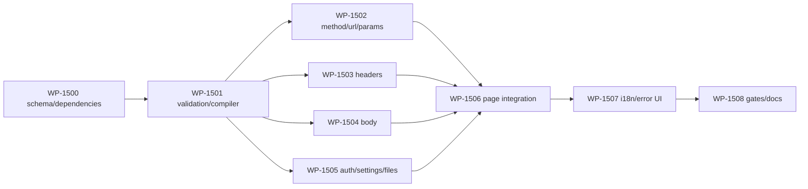

# Issue #199：HTTP Client Request Form、prepared request 与 Store 适用性实施计划

## 状态与执行边界

- 状态：`Done`
- 子任务：`HTTP-199-02`
- 关联 issue：[#199](https://github.com/suxiaoshao/gpui/issues/199)
- 目标分支：`codex/199-adopt-gpui-store-form-operation`
- 实施引用：`933ee09 refactor(http-client): adopt typed request form`，已推送至
  `origin/codex/199-adopt-gpui-store-form-operation`；未创建 PR
- owner 索引：[HTTP Client Issue #199 跟踪](README.md)
- 产品决定权威：[HTTP Client 产品与迁移草稿](http-client-product-and-migration-draft.md)
- 消费的 Form 契约：`C-900`–`C-904`，状态为 `consumer-complete`
- 文档语言：中文；类型名、API、crate 名和命令保留源码拼写
- 实施结果：Request Form 与 prepared request 已交付；56 个定向测试及 Check、Clippy、格式、残留扫描通过；实际桌面 UI 操作未执行

本文是 HTTP Client 分阶段做到“单请求基础可用”的第一份可执行计划。它只负责把 Request 编辑器迁成
统一、可验证的 `Form<RequestDraft>`，补齐五种 Body、Auth、redirect 与文件选择，并把一次通过
Submit validation 的草稿编译成后续网络层可直接消费的不可变 `PreparedRequest`。

本计划不实现真实 HTTP Send、`refresh::Operation`、Cancel、Response 收集或 Response UI。下一份
Send / Operation / Response 计划必须消费本文固定的 `PreparedRequest`，不得再从 live Form 拼装请求。
产品草稿要求“五种 Body 最终进入 transport”继续有效；本文只是该交付的 Request 子阶段，不是缩减
最终产品范围。

## 完成定义

本计划完成时必须同时满足：

1. 当前页面只存在一个 `Entity<Form<RequestDraft>>`，method、URL、Headers、Body、Auth 和请求级
   redirect 都由它统一拥有；native control 不再保存第二份可提交业务值。
2. URL 输入与 Params 编辑器通过同一个 `RequestDraft::URL` path 双向投影；Params 不是 Form 中的
   `Vec<QueryParam>`，无效 URL 时组件内部禁用且不得改写原字符串。
3. Headers、urlencoded rows 与 multipart parts 使用 Form collection 的 runtime occurrence identity；
   同父重排保留 `PathKey` 与原 native control，删除再插入不会让旧 callback 命中新行。
4. Body 菜单完整包含 `none`、`form-data`、`x-www-form-urlencoded`、`text`、`binary`；Text 只能选择
   固定的 typed format，编辑器内容与其他 active payload 都可编辑并进入提交快照；Text 是文本 body，
   不代表任意原始字节；Auth 完整包含
   `None`、Basic、Bearer、API Key。
5. 初始渲染、Change 和 Blur 不运行完整业务 validation；只有显式提交调用 `prepare` 后显示精确字段
   错误。
6. 通过提交的 `RequestDraft` 可同步编译为不可变 `PreparedRequest`，并固定 URL、Header、Body、
   Auth 派生项、redirect 与当时的应用级 timeout。
7. `gpui-store` 在本阶段有明确“不适用”结论；manifest 不增加 `gpui-store`。`RequestDraft`、Form、
   native control 与本地 timeout 均不包装进 Store。
8. 旧 `HttpForm` / `HttpFormEvent` / `HttpBodyForm` / `HttpBodyEvent` / `HttpHeader` entity 与基于 index 的
   可提交状态全部删除，不保留兼容桥。
9. 定向测试、Check、Clippy、格式与残留扫描通过；实际 HTTP 请求和实际桌面 UI 操作不在本计划的
   自动化完成门禁内。

## 明确不做

- 不增加 `reqwest`、`gpui-operation` 或 `gpui-store` 依赖。
- 不实现网络连接、DNS、TLS、redirect 执行、timeout 计时、请求取消、重发或迟到 completion。
- 不定义 `ResponseData`、`RequestProblem`、response body 截断或 binary 展示；这些由
  `HTTP-RUN-Q01` 和下一份计划闭环。
- 不实现 multi-tab、History、Favorites、Environment、Cookie Jar、GraphQL、OAuth、脚本、代理、
  客户端证书或持久化。
- 不把 Form entity、`PathKey`、native `InputState`、文件字节或 multipart boundary 放进业务 Draft。
- 不修改三个 gpui-form crate 的公开 API，也不在 HTTP Client 内建立 Form 兼容 façade。

## 系统面适用性

| ID | 系统面 | 本计划 | 结论 | 工作包 |
| --- | --- | --- | --- | --- |
| `S-1500` | 入口与生命周期 | 适用 | `RequestView` 是单页 owner，直接拥有 Form、控件、行 controller 与文件选择 Task | `WP-1501`、`WP-1505` |
| `S-1501` | action / command / keybinding | 无变更 | 本阶段不新增快捷键；Send 保持不可执行，下一计划接入 | `WP-1506` |
| `S-1502` | UI 结构与交互 | 适用 | 顶栏 method/URL，五个 tab，动态表格、Body、Auth、Settings 与字段错误 | `WP-1502`–`WP-1506` |
| `S-1503` | focus / IME / native identity | 适用 | source-aware binding；动态行按 `PathKey`；Params 用组件私有 occurrence reconcile | `WP-1502`–`WP-1505` |
| `S-1504` | 异步与 Task owner | 局部适用 | 只有文件选择器 Task；由对应 control entity 持有，drop 即取消，不 detach | `WP-1505` |
| `S-1505` | Operation / 状态机 | 不适用 | Request 编辑与同步编译不是运行态；Send runtime 后置 | — |
| `S-1506` | Form | 适用 | 一个 root Form、typed total/dynamic path、Submit validation、prepared snapshot | `WP-1500`–`WP-1506` |
| `S-1507` | Store | 不适用 | 当前只有一个页面 consumer；无共享 catalog、history 或跨窗口 setting owner | `WP-1500`、`WP-1508` |
| `S-1508` | 外部协议 | 适用 | `url`、`http`、`mime`、Basic base64 与文件路径形成 prepared contract | `WP-1500`、`WP-1501` |
| `S-1509` | 错误与恢复 | 适用 | 用户可修错误落精确 Form path；编译竞态错误为 typed error；无 repair | `WP-1501`、`WP-1506` |
| `S-1510` | 数据库与持久化 | 不适用 | 不保存 request、secret、history 或文件内容 | — |
| `S-1511` | generated / synchronized 内容 | 不适用 | 无代码生成器之外的新同步产物 | — |
| `S-1512` | assets / icon | 无变更 | 不新增资源或 bundle icon | — |
| `S-1513` | Fluent i18n | 适用 | 两个 runtime locale 同步新增 Request、Body、Auth、Settings 与 validation key | `WP-1507` |
| `S-1514` | 安全与隐私 | 适用 | Header injection、文件路径、Auth 派生与 secret 日志边界明确 | `WP-1500`、`WP-1501` |
| `S-1515` | tracing | 无新增业务日志 | RequestDraft、Auth value、body 与文件内容不得进入 Debug/info 日志 | `WP-1508` |
| `S-1516` | packaging / CI | 无变更 | app identifier、bundle 与 workflow 不变 | `WP-1508` |
| `S-1517` | 依赖 | 适用 | 增加 Form/adapter、`http 1.4.2`、`mime 0.3.17`、`mime_guess 2.0.5`、`base64 0.23.0`；测试增加`tempfile 3.27.0` | `WP-1500` |
| `S-1518` | owner 文档 | 适用 | 本文承载执行计划；README 只索引；产品草稿继续保留后续问题 | `WP-1508` |
| `S-1519` | 验证证据 | 适用 | pure compiler、GPUI Form/control、i18n、残留扫描与 Cargo 门禁 | `WP-1508` |

## 实施前证据

### 当前执行流

1. `HttpFormView` 创建 `Entity<HttpForm>`；`HttpForm` 只含 method、URL 与
   `Vec<Entity<HttpHeader>>`。
2. Method、URL、Params、Headers 通过 `HttpFormEvent` 手工传播；Params 回写 URL 后会重建整个 URL
   `InputState`，URL 回写 Params 后会重建所有参数行。
3. `HttpHeader` 的 name/value 只存在于两个 `InputState`，无法从一个可验证 model 原子读取。
4. Body 另建 `Entity<HttpBodyForm>`；Text 与 x-form 只更新这份平行状态，multipart 只是空视图，
   Binary/Auth/Settings 不存在。
5. `HttpFormEvent::Send` 分支仍为 `todo`；manifest 中没有 transport，现有页面不能产生可执行请求。

### 证据注册表

| ID | 分类 | 已核实事实或决定 | 证据 | 计划后果 |
| --- | --- | --- | --- | --- |
| `E-1500` | 当前事实 | 根 model 不含 Body/Auth/Settings，Headers 业务值位于 native entity | `src/features/request.rs`、`request/headers.rs` | 新建统一 `RequestDraft`；删除平行 authority |
| `E-1501` | 当前事实 | URL/Params 依靠 `HttpFormEvent` 循环并重建 native control | `request/url_input.rs`、`request/params.rs` | 改为同一 total path 的两个 source-aware binding |
| `E-1502` | 当前事实 | Params、Headers、x-form 删除与回调以数组 index 识别 | `request/params.rs`、`headers.rs`、`body/x_form.rs` | Form collection 使用 `ItemPath`/`PathKey`；Params 使用组件私有 identity |
| `E-1503` | 当前事实 | Body 只有菜单四项；真正有状态的只有 Text 与 urlencoded；multipart 为空 | `request/body.rs`、`body/form_data.rs` | 一次补齐五种完整 Body，不保留占位 variant |
| `E-1504` | 当前事实 | `HttpTab::from(&usize)` 对未知 index `unimplemented!()` | `request/tab.rs` | 改成受控 index 映射，不允许 UI 输入导致 panic |
| `E-1505` | 当前事实 | app 尚无测试，`cargo test -p http-client --no-run` 只构建 main target | 当前源码与定向基线命令 | 建立 pure/GPUI/i18n 行为测试 |
| `E-1506` | 依赖事实 | app 没有 Form/Store/Operation/HTTP transport；lock 已有目标 `http`、`mime`、`mime_guess`、`base64` 版本 | `Cargo.toml`、`Cargo.lock` | 只增加本计划所需 direct dependencies；不改 transport |
| `E-1507` | 用户决定 | Request 使用一个 Form；Params 绑定同一 URL；无效 URL 时组件禁用；Params 写入可规范化 URL | `HTTP-FORM-D01`、`Q02`、`Q03` | 固定 `D-1500`、`D-1503` |
| `E-1508` | 用户决定 | Header 由 `http` crate 校验；重复项保留；显式 Content-Type 优先 | `HTTP-FORM-Q04`、`Q05` | 固定 compiler 的 append 与 override 顺序 |
| `E-1509` | 用户决定 | Body 固定五种；multipart/Binary 本轮完整实现 | `HTTP-FORM-Q05`、`Q06` | 固定 nested schema、文件选择与 prepared body |
| `E-1510` | 用户决定 | Auth 生成项优先；redirect 属于 request；timeout 属于 app setting并在 Send 冻结 | `HTTP-FORM-Q07`、`Q08` | 固定 Auth merge、settings ownership 与 snapshot |
| `E-1511` | 用户决定 | Send 使用 accepted immutable snapshot，运行中编辑不改变 active request | `HTTP-RUN-Q05` | 本文交付 `PreparedRequest`；下一计划只消费它 |
| `E-1512` | Form 契约 | Form 已支持显式 owner、typed tree、runtime item identity、source-aware binding、snapshot validation | `C-900`–`C-904` 与当前三个 Form crate | 不修改 producer，不造 app-local同步协议 |
| `E-1513` | Store 契约 | Store 用于具有明确多 consumer 的共享内存 authority；Form/native control 不应存入 Store | `gpui-store` 当前 README/guide | 当前单页 Request 不引入 Store |
| `E-1514` | GPUI 契约 | `prompt_for_paths` 提供原生文件选择；Task drop 取消 future | 当前 GPUI source 与 repo-local skill | 文件选择不增加第三方 picker，不 detach Task |

## 消费的共享契约

| 契约 | 本计划消费的能力 | 使用位置 |
| --- | --- | --- |
| `C-900` | `FormSchema`、infallible `Form::new`、total/dynamic typed path | 根 model、nested child/case、动态 rows |
| `C-901` | 一次 model change、精确 `PathImpact` 与通知 | collection controller 只对 structure/retired reconcile；页面 observer 只重绘 |
| `C-902` | `ControlBinding`、`ControlWriter`、`ControlProjection` 与来源抑制 | URL/Params、多种 scalar select、文件 path control |
| `C-903` | request-bound Submit validation 与 `Prepared<M>` | `RequestValidator`、`prepare_request` |
| `C-904` | lifecycle、mailbox、retirement 与 stale callback 防护 | replace/reset 后 total control 继续；旧动态 row callback no-op |

三个 producer contract 已为 `consumer-complete`。HTTP Client 只能消费公开 Form API；不得暴露或依赖
canonical address、control origin、mailbox、Transition 消息或 topology token。

## 架构决定

### `D-1500`：单页 Form 是 Request 唯一 authority，Store 本阶段不适用

- `RequestView` 直接拥有 `Entity<Form<RequestDraft>>`、页面 observer、method/URL controls、tab views、
  动态行 controller、应用级 `HttpClientTransportSettings` 与文件选择 control。
- Form model 是可提交 method、URL、headers、body、auth、redirect 的唯一业务值。
- native component 只保存 focus、IME、selection、popover、滚动、临时输入与 adapter 生命周期。
- 当前只有一个窗口中的一个 Request page，没有第二 consumer、catalog、history、environment 或 settings
  page；因此既不创建 `Store<RequestDraft>`，也不创建 timeout Store。
- timeout 暂由 page/controller 的 `HttpClientTransportSettings { timeout_ms: u64 }` 持有；`0` 表示不限时。
  本计划的 `prepare_request` 把调用当时的值复制进 `PreparedRequest`，下一计划只负责在 Send 时调用该
  入口。未来出现跨窗口设置页时再以独立计划评估 Store。
- `Entity<Form<_>>`、`ControlBinding`、`InputState`、`PathKey` 与 file picker Task 永远不进入 Store。

### `D-1501`：Request typed schema 固定

```rust,ignore
#[derive(Clone, PartialEq, Eq, FormSchema)]
struct RequestDraft {
    method: HttpMethod,
    #[form(required)]
    url: String,
    #[form(items)]
    headers: Vec<HeaderDraft>,
    #[form(child)]
    body: RequestBodyDraft,
    #[form(child)]
    auth: RequestAuthDraft,
    #[form(child)]
    settings: RequestSettingsDraft,
}

#[derive(Clone, PartialEq, Eq, FormSchema)]
struct HeaderDraft {
    enabled: bool,
    name: String,
    value: String,
}

#[derive(Clone, PartialEq, Eq, FormSchema)]
enum RequestBodyDraft {
    None,
    FormData(FormDataDraft),
    UrlEncoded(UrlEncodedBodyDraft),
    Text(TextBodyDraft),
    Binary(BinaryBodyDraft),
}

#[derive(Clone, PartialEq, Eq, FormSchema)]
struct UrlEncodedBodyDraft {
    #[form(items)]
    fields: Vec<KeyValueDraft>,
}

#[derive(Clone, PartialEq, Eq, FormSchema)]
struct KeyValueDraft {
    enabled: bool,
    key: String,
    value: String,
}

#[derive(Clone, PartialEq, Eq, FormSchema)]
struct TextBodyDraft {
    format: TextBodyFormat,
    content: String,
}

#[derive(Clone, Copy, PartialEq, Eq)]
enum TextBodyFormat {
    PlainText,
    Json,
    JavaScript,
    Html,
    Xml,
    Css,
}

#[derive(Clone, PartialEq, Eq, FormSchema)]
struct FormDataDraft {
    #[form(items)]
    parts: Vec<MultipartPartDraft>,
}

#[derive(Clone, PartialEq, Eq, FormSchema)]
struct MultipartPartDraft {
    enabled: bool,
    name: String,
    #[form(child)]
    value: MultipartPartValueDraft,
}

#[derive(Clone, PartialEq, Eq, FormSchema)]
enum MultipartPartValueDraft {
    Text(MultipartTextDraft),
    File(MultipartFileDraft),
}

#[derive(Clone, PartialEq, Eq, FormSchema)]
struct MultipartTextDraft {
    value: String,
    content_type: Option<String>,
}

#[derive(Clone, PartialEq, Eq, FormSchema)]
struct MultipartFileDraft {
    path: Option<PathBuf>,
}

#[derive(Clone, PartialEq, Eq, FormSchema)]
struct BinaryBodyDraft {
    file: Option<PathBuf>,
}

#[derive(Clone, PartialEq, Eq, FormSchema)]
enum RequestAuthDraft {
    None,
    Basic(BasicAuthDraft),
    Bearer(BearerAuthDraft),
    ApiKey(ApiKeyAuthDraft),
}

#[derive(Clone, PartialEq, Eq, FormSchema)]
struct BasicAuthDraft { username: String, password: String }

#[derive(Clone, PartialEq, Eq, FormSchema)]
struct BearerAuthDraft { token: String }

#[derive(Clone, PartialEq, Eq, FormSchema)]
struct ApiKeyAuthDraft {
    name: String,
    value: String,
    location: ApiKeyLocation,
}

#[derive(Clone, Copy, PartialEq, Eq)]
enum ApiKeyLocation { Header, Query }

#[derive(Clone, PartialEq, Eq, FormSchema)]
struct RequestSettingsDraft {
    follow_redirects: bool,
    follow_original_method: bool,
}
```

- `RequestDraft::default()` 使用 GET、空 URL、空 Headers、`Body::None`、`Auth::None`、自动 redirect 开启、
  follow-original-method 关闭。
- Request root与含body/credential/path的nested draft不派生`Debug`；测试和诊断通过脱敏摘要检查结构，
  不格式化完整model。
- 业务 Draft 不含 Form-only ID；所有 collection identity 由 Form runtime 生成。
- `HeaderDraft`、`KeyValueDraft` 与 `MultipartPartDraft` 新增时默认 `enabled = true`。本计划不维护隐式
  “永远存在的空白占位行”；用户显式 Add 后的空 enabled row 会在 Submit 时得到对应字段错误。
- Body/Auth/part-value 的 enum payload 使用一元 tuple wrapper；这是当前 derive 支持的精确形状。
- 所有case构造值固定：FormData为`parts = []`；UrlEncoded为`fields = []`；Text为
  `format = TextBodyFormat::PlainText`、`content = ""`；Binary为`file = None`；Basic username/password为空；
  Bearer token为空；API Key name/value为空且location为Header。
- 新增multipart part默认为enabled、空name和Text payload；Text value为空且content-type为None；切换
  File时只有`path = None`。文件名和媒体类型不是 Draft 值，始终由选中的源文件派生。这样每次case切换
  都有唯一constructor，不由UI owner各自猜测。
- `HttpMethod::to_http_method()` 必须穷尽映射现有九种method到`http::Method`，包括
  `CONNECT -> http::Method::CONNECT`；prepared compiler不通过字符串parse或fallback产生method。

### `D-1502`：case 切换使用真实 enum lifecycle，不缓存 dormant payload

- Body、Auth 和 multipart part type selector 先把当前enum投影成case kind；用户确认不同kind时，才按
  `D-1501` 的唯一constructor通过typed total/dynamic path一次`set`新enum value。确认当前同一kind是
  complete no-op，绝不能用default payload覆盖当前输入。
- 切离 case 会退休其全部 dynamic path、adapter 与 picker Task；切回同一 case创建默认 payload和新的
  occurrence identity，不恢复上次离开 case 时的输入。
- 同一次 active case 内的 collection add/remove/reorder 不重建 case；同父 reorder 保留既有 row owner。
- 不在 view 或 Store 中缓存每种模式的第二份 payload。若未来产品要求跨模式保留输入，应先修改业务
  model 与产品契约，而不是把缓存藏在 native control。

### `D-1503`：Params 是 URL total path 的单一自定义 adapter

`HttpParamsInput` 只建立一次 `RequestDraft::URL.bind_control_in(...)`：

```rust,ignore
let (binding, writer) = RequestDraft::URL.bind_control_in(
    form,
    &params,
    |params, projection, window, cx| match projection {
        ControlProjection::Value(url) => params.project_url_silently(url, window, cx),
        ControlProjection::Retired => params.retire(window, cx),
    },
    window,
    cx,
);
```

- `ControlProjection::Value` 只解析和静默 reconcile，不调用 writer、不发送 native Change。
- 解析成功时保存该 URL 作为组件当前 base，并恢复 row/add/delete/reorder 操作。
- 解析失败时保留 Form 中的原字符串，保留最后一次成功投影的 rows 作为只读上下文，并禁用全部 Params
  编辑操作；初次即失败时显示空的 disabled 表。组件可显示“URL 无效，参数编辑不可用”的 availability
  提示，但不得产生 Form validation issue。
- Params native 修改先同步更新组件自己的 rows/base，再用 `url::Url` 序列化候选完整 URL并
  `writer.defer_set(candidate)`。来源抑制保证该候选不立即回投自身，普通 URL `FormInput` 会收到它。
- rows 保留顺序与重复key，key/value都允许为空；用户显式Add会创建一个真实query pair，删除最后一项
  会清除query。`?a`与`?a=`等字面差异可在首次Params写操作后按serializer规范化。
- Params 实际写操作允许规范化整个 URL；单纯打开 tab、外部投影或解析失败不得规范化。
- Params adapter 不持有 Form entity、不订阅 `FormEvent`、不使用 direction flag，也不为每行建立 URL
  binding。

Params rows 没有 Form path，组件内部使用 crate-private 单调 `ParamRowId`。外部 URL 投影按完整
`(decoded_key, decoded_value)` occurrence 匹配旧 rows：同值重复项按旧顺序逐个消费，匹配项保留 native
row entity，未匹配项分配新 ID，未消费旧项 drop。来源为 Params 自身的 leaf/add/remove/reorder 不经过
投影，因此天然保留正在编辑行的 identity、focus 与 IME。

### `D-1504`：真实 collection 只按 ItemPath/PathKey 协调 native rows

- Headers controller 枚举 `RequestDraft::HEADERS.items(form, cx)`。
- Urlencoded controller 先 resolve active `RequestBodyDraft::URL_ENCODED` case，再枚举 `FIELDS`。
- FormData controller 同理 resolve `FORM_DATA` case并枚举 `PARTS`；每个 part 再 resolve Text/File case。
- controller 使用 `HashMap<PathKey, RowControls>` 持有 row entity、dynamic `FormInput::try_new` adapter、
  scalar checkbox/select binding和 file picker adapter；显示顺序来自本次 `ItemPath` 列表。
- `FormEvent::ModelChanged(change)` 只在对应 collection 的 `PathImpact.structure_changed` 或
  `retired` 时 reconcile；普通 leaf value change和 `ValidationChanged` 不重建 row。
- reconcile先从最新items计算live `PathKey`集合，并立即从候选map排除/丢弃所有已退休rows；退休row
  绝不能为了回退继续显示。随后复用仍live的旧rows并staged创建新增rows，最后一次安装新map/order。
- 新增live row意外resolve/bind失败时，只保留仍live且已成功构造的rows，失败row暂不显示并记录脱敏
  内部诊断；安排下一次reconcile重试。不能回装已退休row，也不能用全量rebind掩盖失败。
- remove 只接受当前 `ItemPath`；删除后再插入即使业务值相同也有新 `PathKey`，旧 writer 必须 no-op。

### `D-1505`：validation 只在 Submit 运行，并精确定位 active field

- `RequestDraft::URL` 的 `#[form(required)]` 使用默认 Submit trigger；不声明 `on_change` 或 `on_blur`。
- `RequestValidator` 只消费一个 `ValidationRequest`，所有 dynamic item/case path 从该 request snapshot
  resolve；不读取 live Form、不做网络请求、不修改 model。
- validator入口先检查`request.trigger() == ValidationTrigger::Submit`，其他trigger直接返回；本阶段也不
  发起`External` validation。每条规则仍使用`request.includes(path)`限制scope，不能因为是Submit就绕过
  request-bound path契约。
- 页面初始、普通输入和 Blur 不出现完整业务错误。点击下一阶段启用的 Send 时才调用
  `form.prepare(cx)`；失败后页面读取每个 visible path 的第一条 issue。
- 本阶段 Send 按钮尚未接 transport，测试通过 `RequestView::prepare_request` 或 Form harness 显式触发。

Submit 规则固定为：

| 区域 | 规则 | 错误 path |
| --- | --- | --- |
| URL | trim 后必须为带 host 的绝对 `http`/`https` URL；其他 scheme、相对 URL与空 host 非法 | `RequestDraft::URL` |
| Header | disabled row跳过；enabled row name 用 `HeaderName`，value 用 `HeaderValue`；空 value 合法 | 对应 item 的 `NAME` / `VALUE` |
| Text | `TextBodyFormat` 只允许六个固定 format，按 format 映射 MIME；content 可空 | 无额外业务错误 |
| UrlEncoded | enabled rows 的 key/value 均可空；disabled row跳过 | 无额外业务错误 |
| Multipart Text | enabled part name trim 后非空且不得含 CR/LF/NUL；可选 content type 必须合法；text 可空 | part `NAME` / Text `CONTENT_TYPE` |
| Multipart File | 满足 part name；path必须为绝对路径且存在、可读、为普通文件，并必须具有安全的 basename | File `PATH` |
| Binary | file必须选择、为绝对路径，并在提交时存在、可读、为普通文件 | Binary `FILE` |
| Basic | username 不得含 `:`；username/password 可空；最终 Basic header 必须能构造 | Basic `USERNAME` / `PASSWORD` |
| Bearer | token 可空，但 `Bearer {token}` 必须是合法 `HeaderValue` | Bearer `TOKEN` |
| API Key/Header | name 必须是合法非空 `HeaderName`，value 必须是合法 `HeaderValue` | API Key `NAME` / `VALUE` |
| API Key/Query | name trim 后非空；value 可空并按 URL query 编码 | API Key `NAME` |
| Redirect | 无格式错误；关闭 follow 时 `follow_original_method` 保留但不生效 | — |

文件验证与编译之间仍存在外部文件系统竞态。validator 与 compiler 共用同一组 pure/parser/filesystem
helper，避免规则漂移；文件在验证后消失时由 `RequestCompileError::FileUnavailable` 返回，不 panic。

### `D-1506`：`PreparedRequest` 是下一阶段唯一请求输入

```rust,ignore
struct PreparedRequest {
    method: http::Method,
    url: url::Url,
    headers: http::HeaderMap,
    body: PreparedBody,
    body_content_type: BodyContentType,
    redirect: PreparedRedirect,
    timeout: Option<Duration>,
}

enum PreparedBody {
    None,
    Text(Vec<u8>),
    UrlEncoded(Vec<u8>),
    Multipart(Vec<PreparedMultipartPart>),
    Binary(PathBuf),
}

enum PreparedMultipartPart {
    Text {
        name: String,
        value: String,
        content_type: Option<mime::Mime>,
    },
    File {
        name: String,
        path: PathBuf,
        file_name: String,
        content_type: mime::Mime,
    },
}

enum BodyContentType {
    None,
    Fixed(http::HeaderValue),
    MultipartBoundary,
}

struct PreparedRedirect {
    follow: bool,
    max_hops: u8,
    preserve_method: bool,
    forward_authorization_cross_host: bool,
}
```

- `max_hops = 10`；`forward_authorization_cross_host = false`；关闭 follow 时其余 redirect 参数不执行。
- timeout 从 page-owned setting 读取：`0 -> None`，否则 `Some(Duration::from_millis(value))`。
- Text content 按 UTF-8 bytes 冻结；urlencoded 使用 `url::form_urlencoded::Serializer` 按 enabled row顺序
  编码，保留重复 key 与空 key/value。
- Multipart 只冻结有序 part metadata、文本和绝对文件路径，不读取文件字节、不生成 boundary。
- File part 的发送文件名始终取源路径 basename；媒体类型由 `mime_guess` 按源路径扩展名推导，未知扩展名
  固定回退为 `application/octet-stream`。二者均不在 Draft 中保存，也没有 UI 覆盖入口。
- Binary 只冻结路径，不自动生成 Content-Type。
- `BodyContentType::Fixed` 用于 Text 和 UrlEncoded；Multipart 使用 `MultipartBoundary`；None/Binary 为
  `None`。如果最终 HeaderMap 已含显式 `Content-Type`，下一阶段 executor 必须忽略该自动策略。
- `PreparedRequest` 不含 Form entity、FormVersion、PathKey或native entity，也不派生会展开URL query、
  headers、body或file path的`Debug`；如诊断需要摘要，手写脱敏formatter。它可移动进唯一request Task，
  Task不得回读Form。

准备入口固定为同步两阶段：

```rust,ignore
fn prepare_request(
    &mut self,
    cx: &mut Context<Self>,
) -> Result<PreparedRequest, RequestPrepareError> {
    let prepared = self.form.update(cx, |form, cx| form.prepare(cx))?;
    let (_, draft) = prepared.into_parts();
    compile_request(draft, &self.transport_settings).map_err(Into::into)
}
```

本应用不保存 Form，因此丢弃 `FormVersion`，不调用 `rebase_if_current`。compiler 不接收 live Form。

### `D-1507`：Header、Content-Type 与 Auth 合并顺序固定

compiler 按以下顺序生成最终 executable URL/HeaderMap：

1. trim 并解析 URL；保留 authority/path/query 等可发送component，对prepared URL显式
   `set_fragment(None)`；Form原字符串不被反向修改。
2. 按 HeaderDraft 行顺序对每个 enabled row调用 `HeaderMap::append`。Header name编译后小写；不同 name
   的最终迭代/wire 顺序不作为契约。
3. 计算 Body 自动 Content-Type 策略，但不写回 Form。已有显式 enabled `Content-Type` 时保留显式值；
   executor 不再添加自动值。
4. Auth 为 None 时不改 URL/headers。Basic/Bearer 先移除全部显式 `Authorization` values，再 append 一条
   生成值。Basic对UTF-8 `username:password` bytes使用base64 STANDARD并加`Basic `前缀；Bearer原样加
   `Bearer `前缀，二者最终都由`HeaderValue`构造。API Key/Header按大小写不敏感name移除全部冲突
   values，再append生成值。
5. API Key/Query 按精确 decoded key 移除全部冲突 pair、保留其余 pair顺序，再在末尾 append生成 pair。
   该规范化只作用于 prepared URL，不反向改 live Form。

生成 Auth item 不出现在可编辑 Headers/Params Form 数据中。UI 可以根据 live Draft 显示“由 Auth 生成并
覆盖显式项”的只读提示，但不能让用户从该提示直接修改派生项；完全手工控制需选择 `Auth::None`。

### `D-1508`：控件适配遵循 Form 的统一来源协议

- URL 使用内建 `FormInput`。
- Method、Text format preset与API Key location使用app-local scalar Select adapter；其delegate item可与Form
  value类型不同，但`SelectItem::Value`必须等于typed path的value类型。
- Body/Auth/part kind使用单独的case Select adapter：projector由完整enum只提取kind；native confirm不同
  kind时才用唯一constructor写完整新enum，确认同kind不写Form、不清空payload。
- 每个adapter持有不可clone的`ControlBinding`，native callback只捕获cloneable writer，projector静默
  设置选中项。
- Checkbox 不持有第二份状态；render 时 typed `get/try_get`，点击时 typed `set/try_set`。
- String leaf 使用 `FormInput::new/try_new`；password/token 的 native input使用相应 masked content type，
  Form adapter语义不变。
- Text editor绑定 `CONTENT`；`TextBodyFormat` 的固定 Select 静默更新编辑器高亮器，并作为 Text MIME 的唯一
  authority。页面不显示、更不提供自由编辑 MIME 的输入框；gpui-component code editor 占据 Body tab 除
  format Select 外的剩余空间。
- 页面 `cx.observe(&form, |_, _, cx| cx.notify())` 只负责页面重绘。结构化 controller 可订阅 typed
  `FormEvent` 做 reconcile；任何 value control 都不得手工订阅 FormEvent 完成双向同步。

### `D-1509`：文件选择是 control-owned UI Task

- File part 与 Binary 都使用 app-local `FormFilePathInput`，绑定对应 `Option<PathBuf>` total/dynamic path。
- 点击选择调用
  `prompt_for_paths(PathPromptOptions { files: true, directories: false, multiple: false, prompt: None })`；
  Cancel不写Form。completion先拒绝非绝对路径，再通过writer写入唯一选择结果；validator/compiler仍重复
  检查absolute与file状态，不能只信platform dialog。
- control entity 持有 `Option<Task<()>>`，新的选择替换旧 Task；control drop或 dynamic path Retired 会取消
  picker callback。Task 不 `detach`，不使用 `gpui-operation`。
- projector 静默更新当前路径 label；Clear 通过 writer 写 `None`。它不读取文件内容，不保存 Form entity。
- GPUI 测试使用 `simulate_path_prompt_response`，不打开真实系统 dialog。

### `D-1510`：分阶段交付期间 Send 明确禁用

本计划结束时 Request editor 与 `prepare_request` 已可被自动化测试和下一阶段调用，但没有 transport
consumer。为避免用户点击后“验证通过却什么也没发生”：

- 删除旧 `HttpFormEvent::Send` 空分支；
- 页面继续显示 Send 按钮，但以显式 disabled 状态渲染；
- 下一份 Send / Operation / Response 计划在安装 runtime consumer 后重新启用，并把 click handler 接到
  `prepare_request`；
- 不创建临时 `Prepared` event、不把 snapshot 塞进 page字段，也不假装请求已经发送。

### `D-1511`：依赖只服务 Request schema 与编译

`app/http-client/Cargo.toml` 增加：

```toml
gpui-form.workspace = true
gpui-form-gpui-component.workspace = true
http = "1.4.2"
mime = "0.3.17"
mime_guess = "2.0.5"
base64 = { version = "0.23.0", default-features = false, features = ["std"] }

[dev-dependencies]
gpui = { workspace = true, features = ["test-support"] }
tempfile = "3.27.0"
```

- 不直接依赖 `gpui-form-macros`；derive 由 `gpui-form` 正常公开 surface 提供。
- 不增加 `gpui-store`、`gpui-operation`、`reqwest`、file-picker crate 或 async runtime。
- 继续使用现有 `url = "2.5.8"`。
- `gpui` dev-dependency只为`#[gpui::test]`、模拟path prompt与window/entity harness开启`test-support`；
  production dependency保持现状。
- `tempfile` 只用于文件存在/消失/类型变化的隔离测试，不进入production dependency。
- 以上 registry version 已存在于当前 lockfile；实现若因 feature resolution 改动 `Cargo.lock`，只保留该
  直接依赖带来的机械变化并登记。

### `D-1512`：旧事件总线与平行 model 直接删除

迁移完成后删除而不保留 deprecated/compatibility façade：

- `HttpForm`、`HttpFormEvent`、`HttpFormView`；入口改名为 `RequestView`。
- `HttpHeader` entity 与 Headers 的 index event。
- `HttpBodyForm`、`HttpBodyEvent`、`HttpText`、`XForm` 业务 model及其 index event。
- `UrlInput` 持有 Form entity并重建 `InputState` 的手工订阅。
- Params 持有 `Entity<HttpForm>`、手工订阅 URL event 与 index callback 的实现。
- `HttpTab::from(&usize)` 的 panic 分支。

可复用的 presentation code可以在新 owner 下重写，但不得用旧 type包装新 Form或维持双写期。

## 文件与 owner 地图

任何实施中新出现且不在本表中的源文件，必须先在本文分配新的 `F-15xx`；不能事后以“顺手拆分”绕过
owner 与测试责任。

| ID | 文件 | 动作 | 唯一职责 / 禁止项 | 工作包 |
| --- | --- | --- | --- | --- |
| `F-1500` | `app/http-client/Cargo.toml` | 修改 | 增加 Form/adapter 与编译依赖；禁止 Store/Operation/transport | `WP-1500` |
| `F-1501` | `app/http-client/src/features/request/draft.rs` | 新增 | 全部 Request FormSchema、defaults、枚举与 transport setting | `WP-1500` |
| `F-1502` | `app/http-client/src/features/request/prepared.rs` | 新增 | `PreparedRequest`、prepared body/part/redirect、共享 parse/compile helper | `WP-1501` |
| `F-1503` | `app/http-client/src/features/request/validation.rs` | 新增 | request-bound Submit validator、精确 issue 与 helper error映射 | `WP-1501` |
| `F-1504` | `app/http-client/src/features/request.rs` | 重写 | `RequestView` owner、Form、tabs、observer、settings、禁用 Send与 prepare入口 | `WP-1501`、`WP-1506` |
| `F-1505` | `app/http-client/src/features/request/controls.rs` | 新增 | scalar/case Select binding与`FormFilePathInput`；不含业务model | `WP-1502`、`WP-1505` |
| `F-1506` | `app/http-client/src/features/request/method.rs` | 修改 | 保留 method domain/select presentation，写入 typed Form path | `WP-1502` |
| `F-1507` | `app/http-client/src/features/request/url_input.rs` | 重写 | URL `FormInput` 包装/呈现；不持有 Form entity作业务 authority | `WP-1502` |
| `F-1508` | `app/http-client/src/features/request/params.rs` | 重写 | 单 URL binding、private row identity、disabled invalid projection | `WP-1502` |
| `F-1509` | `app/http-client/src/features/request/headers.rs` | 重写 | Header collection controller、dynamic row adapters 与 override提示 | `WP-1503` |
| `F-1510` | `app/http-client/src/features/request/body.rs` | 重写 | 五种 Body selector、active case resolve与子 view owner | `WP-1504` |
| `F-1511` | `app/http-client/src/features/request/body/http_text.rs` | 重写 | Text typed format Select、占满剩余空间的 code editor 与派生高亮 | `WP-1504` |
| `F-1512` | `app/http-client/src/features/request/body/x_form.rs` | 重写 | UrlEncoded collection controller；不保留 `XForm` 业务 type | `WP-1504` |
| `F-1513` | `app/http-client/src/features/request/body/form_data.rs` | 重写 | Multipart collection、Text/File case、文件 adapter | `WP-1504`、`WP-1505` |
| `F-1514` | `app/http-client/src/features/request/body/binary.rs` | 新增 | Binary file选择/清除与精确错误显示 | `WP-1505` |
| `F-1515` | `app/http-client/src/features/request/auth.rs` | 新增 | Auth selector、Basic/Bearer/API Key active case UI与冲突提示 | `WP-1505` |
| `F-1516` | `app/http-client/src/features/request/settings.rs` | 新增 | redirect controls与 page-owned timeout编辑器 | `WP-1505` |
| `F-1517` | `app/http-client/src/features/request/tab.rs` | 重写 | Params/Auth/Headers/Body/Settings 五 tab及安全 index映射 | `WP-1506` |
| `F-1518` | `app/http-client/src/features/request/tests.rs` | 新增 | GPUI Form/control/controller/picker测试 harness | `WP-1502`–`WP-1508` |
| `F-1519` | `app/http-client/src/features.rs` | 修改 | re-export `RequestView` | `WP-1506` |
| `F-1520` | `app/http-client/src/main.rs` | 修改 | 创建 `RequestView`；不增加 Store/Operation global | `WP-1506` |
| `F-1521` | `app/http-client/src/features/request/prepared.rs`（实际归位；与 `F-1502` 同一文件） | 归入 `F-1502` | `RequestPrepareError` / `RequestCompileError` 与 prepared compiler 同域；`src/errors.rs` 继续只管理 app startup 错误 | `WP-1501` |
| `F-1522` | `app/http-client/src/foundation/i18n.rs` | 修改 | `ValidationMessage` 翻译 helper与 locale parity tests | `WP-1507` |
| `F-1523` | `app/http-client/locales/en-US/main.ftl` | 修改 | 英文 Request/Form UI与validation keys | `WP-1507` |
| `F-1524` | `app/http-client/locales/zh-CN/main.ftl` | 修改 | 与 en-US 同 key/变量的中文文案 | `WP-1507` |
| `F-1525` | `app/http-client/docs/dev/issue-199/README.md` | 修改 | 子任务状态与计划链接；不放计划正文 | `WP-1508` |
| `F-1526` | `app/http-client/docs/dev/README.md` | 修改 | app级状态摘要与 owner入口 | `WP-1508` |
| `F-1527` | `docs/dev/issue-199/README.md` | 修改 | root多轮索引中登记 Request子阶段 | `WP-1508` |
| `F-1528` | `docs/dev/issue-199/application-migration-decisions.md` | 修改 | 只更新 HTTP总状态与 owner plan链接；不复制细节 | `WP-1508` |

`http-client-product-and-migration-draft.md` 在实现期间仍保存未进入代码的 Response/Store/future问题。
本计划完成并有代码证据后，才按草稿规则删除其中已由代码与本文承接的 Request 完成态副本；不能在
实现前清空产品决定。

实施归位：原计划把 `F-1521` 预留给 `src/errors.rs`，实际将 Request prepare/compile error 类型留在
`prepared.rs`，与其唯一 producer/consumer 同域；`src/errors.rs` 保持 app startup 错误职责。该归位不改变
Request 与 transport 错误分层，也不新增 transport error。

## 精确接口契约

### `L-1500`：Form construction 与 page fields

```rust,ignore
struct RequestView {
    form: Entity<Form<RequestDraft>>,
    transport_settings: HttpClientTransportSettings,
    method: FormScalarSelect<RequestDraft, Vec<HttpMethod>, HttpMethod>,
    url: FormInput,
    tabs: Entity<RequestTabsView>,
    form_observer: Subscription,
    focus_handle: FocusHandle,
}

impl RequestView {
    fn new(window: &mut Window, cx: &mut Context<Self>) -> Self;
    fn prepare_request(
        &mut self,
        cx: &mut Context<Self>,
    ) -> Result<PreparedRequest, RequestPrepareError>;
}
```

Form 构造固定为 `Form::new(RequestDraft::default()).with_validator(RequestValidator)`。observer只
`cx.notify()`，不执行 value写回或 controller rebuild。tab子 view共享同一个 Form entity作为显式 owner
参数，但 adapter/control本身不保留 Form。

### `L-1501`：纯 parser 与 compiler

```rust,ignore
enum RequestFieldError {
    Required,
    InvalidUrl,
    UnsupportedUrlScheme,
    MissingUrlHost,
    InvalidHeaderName,
    InvalidHeaderValue,
    InvalidMediaType,
    UnsafeDispositionText,
    BasicUsernameContainsColon,
    ApiKeyNameRequired,
    File(FileCheckError),
}

#[derive(Clone, Copy, Debug, PartialEq, Eq)]
enum FileCheckError {
    NotAbsolute,
    Missing,
    NotRegular,
    Unreadable,
    MissingFileName,
}

struct RequestFile {
    absolute_path: PathBuf,
    file_name: String,
    content_type: Mime,
}

#[derive(Clone, Copy, Debug, PartialEq, Eq)]
enum RequestFileField {
    Binary,
    MultipartPart { draft_index: usize },
}

fn parse_request_url(raw: &str) -> Result<Url, RequestFieldError>;
fn parse_header_name(raw: &str) -> Result<HeaderName, RequestFieldError>;
fn parse_header_value(raw: &str) -> Result<HeaderValue, RequestFieldError>;
fn parse_media_type(raw: &str) -> Result<Mime, RequestFieldError>;
fn inspect_request_file(path: &Path) -> Result<RequestFile, RequestFieldError>;

fn compile_request(
    draft: RequestDraft,
    settings: &HttpClientTransportSettings,
) -> Result<PreparedRequest, RequestCompileError>;
```

- helper 不访问 GPUI，不翻译文案，不记录 secret/body/path内容。
- `RequestFieldError`和`FileCheckError`只保存分类，不保存原始输入。`RequestFileField`最多保存非敏感的
  Draft ordinal，`RequestCompileError`不得携带完整path。
- validator 调用 helper并把 typed failure映射到 path；compiler复用相同 helper，禁止复制另一套 regex或
  “validator已经跑过所以 unwrap”。
- `inspect_request_file`先检查`Path::is_absolute()`，再检查metadata/regular/readable与basename；basename
  必须安全后以`to_string_lossy`形成可发送的`file_name`。同一 helper 使用`mime_guess`按源路径扩展名得到
  `content_type`，未知扩展名回退`application/octet-stream`。`RequestFile`只表示已核验的绝对path及其派生
  metadata，不持有open file handle或bytes，也不实现展开path的`Debug`；用户没有单独覆盖入口。
- compiler 允许外部文件在 validation 后变化并返回 error；除内部不可能 enum mapping 外不得 panic。

### `L-1502`：自定义 scalar / case Select adapter

```rust,ignore
struct FormScalarSelect<M, D, V> {
    state: Entity<SelectState<D>>,
    _binding: ControlBinding,
    _subscription: Subscription,
    _marker: PhantomData<fn() -> (M, V)>,
}

struct FormCaseSelect<M, D, E, K> {
    state: Entity<SelectState<D>>,
    current_kind: Rc<Cell<K>>,
    _binding: ControlBinding,
    _subscription: Subscription,
    _marker: PhantomData<fn() -> (M, E)>,
}
```

`FormScalarSelect`的delegate item实现`SelectItem<Value = V>`。它提供total/dynamic两个入口，分别消费
`IntoTotalPath<M, V>`与已resolve的dynamic path；动态入口返回`Result<Self, ResolveError>`。projector
只静默选择与`V`对应的index，native Confirm通过writer写完整`V`。

`FormCaseSelect`绑定完整enum `E`，构造时显式接收`kind: fn(&E) -> K`与`build: fn(K) -> E`。projector
只更新`current_kind`与selected index；Confirm先验证目标仍active并比较kind，相同即no-op。不同kind时
必须先静默选择新index并`current_kind.set(k)`，再`writer.defer_set(build(k))`；来源抑制后不会等待
Form把该值回投给自己。目标已Retired时不更新本地kind。它同样提供total/dynamic入口。两类adapter遇到未知/越界index都忽略并保留当前值，不使用
`unimplemented!()`；两者都穷尽处理`ControlProjection::Retired`并禁用native state。

### `L-1503`：Params adapter owner

```rust,ignore
struct HttpParamsInput {
    state: Entity<HttpParamsState>,
    _binding: ControlBinding,
    _native_subscription: Subscription,
}

struct HttpParamsState {
    mode: ParamsMode,
    last_valid_url: Option<Url>,
    rows: Vec<ParamRow>,
    next_row_id: u64,
}

enum ParamsMode { Editable, DisabledInvalidUrl }
```

`next_row_id` 溢出属于内部 invariant panic，不进入 public错误。`ParamRowId` 不实现可持久化格式，不
暴露给 Form或prepared snapshot。local edit若在 disabled/retired状态触发则直接丢弃，不排队。

### `L-1504`：collection row controller

每类 Form collection使用各自 concrete controller，不建立把 total/dynamic path擦成 trait object的 façade：

```rust,ignore
struct HeaderRowsController {
    rows: HashMap<PathKey, HeaderRow>,
    order: Vec<PathKey>,
}

struct UrlEncodedRowsController { /* concrete DynamicItemsPath rows */ }
struct MultipartRowsController { /* concrete DynamicItemsPath rows */ }
```

root Header collection使用 total API；Body case内 collection使用 dynamic API。`Row`拥有其 adapter与
native entity；renderer只按 `order`克隆 entity。不存在 index捕获的 mutation callback。

### `L-1505`：文件 path control

```rust,ignore
struct FormFilePathInput {
    state: Entity<FilePathState>,
    picker_task: Rc<RefCell<Option<Task<()>>>>,
    _binding: ControlBinding,
    _subscription: Subscription,
}
```

writer可被 picker completion捕获；binding不可 clone。picker completion执行时仍由 writer/lifecycle检查
目标是否 active；动态 part已删除或 case已退休时选择结果不得写入之后的新 occurrence。projector捕获
与adapter相同的`picker_task`；收到`Retired`时先`take()`并drop Task，再把native state标为retired。
adapter drop同样drop最后一个task owner，不能只把按钮禁用却让prompt callback继续存活。

### `L-1506`：validation message 翻译

```rust,ignore
fn validation_message(message: &ValidationMessage, cx: &App) -> SharedString;
```

`ValidationMessage::Key` 使用 Fluent key与参数；literal仅用于内部/测试兜底。页面只显示精确 visible
field的第一条 issue，不做全局错误汇总。Params disabled提示不是 Form错误。

## 状态 authority 与 mutation 顺序

| ID | 数据 | 唯一 authority | 写入口 | 发布/投影 | 禁止事项 |
| --- | --- | --- | --- | --- | --- |
| `ST-1500` | Request业务草稿 | `Form<RequestDraft>` | typed path与control writer | Form event/observer | native entity、Store或事件总线保存副本 |
| `ST-1501` | URL raw string | `RequestDraft::URL` | URL FormInput或Params writer | 同path peer projection | `Vec<QueryParam>` Form字段、direction flag |
| `ST-1502` | Header/Body rows | Form collection | append/remove/move/leaf writer | `PathImpact` + dynamic adapter | index callback或业务ID伪装PathKey |
| `ST-1503` | Params row UI | `HttpParamsState` | projector/native event | component notify | 作为可提交请求数据读取 |
| `ST-1504` | focus/IME/selection | native control entity | native component | component内部 | 写入Form model |
| `ST-1505` | validation report | Form | Submit validator/control issue | `ValidationChanged` | page自建errors Vec |
| `ST-1506` | app timeout | `RequestView.transport_settings` | Settings control | page notify | 当前放入Store或RequestDraft |
| `ST-1507` | file picker lifecycle | 对应 `FormFilePathInput` | Select/Clear | writer投影 | detach或page全局picker回调 |
| `ST-1508` | executable snapshot | `PreparedRequest` value | `prepare_request` | 下一阶段move进Task | runtime回读Form或native control |

一次 native leaf写入顺序固定为：native state先接受用户输入 → writer deferred command → Form typed preflight
与原子commit → 非来源peer收到最新投影 → 页面重绘。一次 collection结构变化固定为：Form mutation原子commit
→ controller收到 structure/retired impact → 先构造新增rows → 整体替换map/order → notify。

## 错误契约

### `ERR-1500`：错误层级

```rust,ignore
enum RequestPrepareError {
    Invalid(gpui_form::PrepareError),
    Compile(RequestCompileError),
}

enum RequestCompileError {
    InvalidUrl,
    InvalidHeader,
    InvalidMediaType,
    InvalidAuth,
    FileUnavailable {
        field: RequestFileField,
        reason: FileCheckError,
    },
    UnsupportedInvariant,
}
```

- `Invalid(gpui_form::PrepareError)` 表示 Form 已发布精确字段 issues；页面不再生成第二套详情。
- compile error是validation后外部状态变化或内部契约漂移；不得把 secret、header value、body、token、
  username/password或完整文件路径写入 Display/Debug。
- `UnsupportedInvariant` 仅用于非用户可构造的内部不一致并记录安全诊断；实现不得以它替代缺失验证。
- transport/DNS/TLS/timeout/redirect errors不进入这些类型，下一计划另建 `RequestProblem`。

### `ERR-1501`：无副作用失败

- Form prepare失败：不产生 `PreparedRequest`、不清空/replace/rebase Form、不启动 picker/network Task。
- compiler失败：Form与native UI保持不变；不部分写入 Auth URL/HeaderMap到共享状态。
- dynamic row resolve/bind失败：已退休row立即drop；仍live旧row继续保留；失败的新row暂不显示并等待
  下一次reconcile，stale writer不写新行。
- picker Cancel或error：不修改Form；可显示局部非Form提示，不能把Cancel当validation error。
- Params parse失败：只进入disabled模式；不清空URL、不清空最后有效rows、不writer回传。

### `ERR-1502`：安全边界

- Header name/value只由`http` crate接受；拒绝CR/LF与不合法控制字符，禁止自写宽松regex。
- Multipart name与从源路径派生的file name拒绝CR/LF/NUL，避免把未净化文本传入Content-Disposition构造。
- Auth派生header在日志中只记录类型与placement，不记录credential。
- UI可以显示用户当前输入，但 tracing、panic message、Debug snapshot与测试失败输出不得打印secret/body。
- File path只用于UI与下一阶段打开文件；不读取整个Binary/Multipart文件进Form或日志。

## UI 与本地化契约

### 页面结构

```text
RequestView
├── MethodSelect + URL FormInput + disabled Send
└── Tabs
    ├── Params       # URL derived custom adapter
    ├── Authorization
    ├── Headers      # Form collection
    ├── Body         # None / FormData / UrlEncoded / Text / Binary
    └── Settings     # redirects + app timeout
```

- 继续优先使用 gpui-component 的 `Select`、`Input`、`Checkbox`、`Button`、`TabBar`、`Label`、`field` 与
  editor能力，不新增通用组件库控件。
- field issue显示在其control附近；动态行错误不汇总到页面顶部。
- Text 只显示六个固定 format 的 Select 与 gpui-component code editor；不展示 MIME 字符串输入。editor 的
  父容器是 Body tab 唯一的剩余高度 owner，Text active 时由它承接内部滚动，不让外层 tab 滚动挤压编辑器。
- Auth/Content-Type被派生值覆盖的行以只读辅助提示表达，不自动删除或改写原Draft。
- Params invalid状态禁用自身全部动作；URL输入保持可编辑。
- `follow_original_method` 在 `follow_redirects = false` 时UI禁用但保留Form值。
- Body/Auth selector切换必须先写Form，再由active case渲染；view不得预先切换到未commit的native页面。

### Fluent key表

两个 locale必须具有相同key与变量名。实现可按最终布局合并纯装饰性label，但下列行为key不得缺失：

| 分类 | keys |
| --- | --- |
| Form通用 | `gpui-form-error-required` |
| actions | `button-send`、`button-add`、`button-delete`、`button-select-file`、`button-change-file`、`button-clear-file`、`button-move-up`、`button-move-down` |
| tabs | `tab-params`、`tab-authorization`、`tab-headers`、`tab-body`、`tab-settings` |
| fields | `field-method`、`field-url`、`field-name`、`field-key`、`field-value`、`field-content-type`、`field-file`、`field-username`、`field-password`、`field-token`、`field-timeout-ms` |
| Params | `params-invalid-url-disabled` |
| Body modes | `body-none`、`body-form-data`、`body-urlencoded`、`body-text`、`body-binary` |
| Text presets | `text-format-plain`、`text-format-json`、`text-format-javascript`、`text-format-html`、`text-format-xml`、`text-format-css` |
| multipart | `multipart-text`、`multipart-file`、`multipart-file-not-selected` |
| Auth | `auth-none`、`auth-basic`、`auth-bearer`、`auth-api-key`、`auth-location-header`、`auth-location-query`、`auth-generated-override` |
| Settings | `settings-follow-redirects`、`settings-follow-original-method`、`settings-timeout-help` |
| validation | `request-url-invalid`、`request-url-scheme-invalid`、`request-header-name-invalid`、`request-header-value-invalid`、`request-media-type-invalid`、`request-multipart-name-required`、`request-multipart-name-invalid`、`request-file-required`、`request-file-unavailable`、`request-basic-username-colon`、`request-auth-value-invalid`、`request-api-key-name-required`、`request-api-key-name-invalid` |

`I18n` 增加带 Fluent args的翻译入口，并以测试核对 en-US/zh-CN key集合与参数名一致。已有 bundle
本地化文件不变。

## 需求与测试映射

| ID | 需求 | 代码证据 | 自动化证据 |
| --- | --- | --- | --- |
| `R-1500` | 单 Form拥有完整Request | `F-1501`、`F-1504` | `T-1500`、`T-1501` |
| `R-1501` | Params与URL同path、invalid禁用、写入可规范化 | `F-1507`、`F-1508` | `T-1502`、`T-1503` |
| `R-1502` | Header合法/重复/空值/顺序语义 | `F-1501`–`F-1503`、`F-1509` | `T-1504` |
| `R-1503` | 五种Body完整Form与prepared表示 | `F-1510`–`F-1514` | `T-1505`、`T-1506` |
| `R-1504` | Auth生成项覆盖显式项 | `F-1501`–`F-1503`、`F-1515` | `T-1507` |
| `R-1505` | redirect与timeout冻结 | `F-1501`、`F-1502`、`F-1516` | `T-1508` |
| `R-1506` | dynamic row identity与stale callback安全 | `F-1509`、`F-1512`、`F-1513` | `T-1509`、`T-1510` |
| `R-1507` | Submit-only精确validation | `F-1503`、`F-1522`–`F-1524` | `T-1511`、`T-1512` |
| `R-1508` | file picker lifecycle与文件快照 | `F-1505`、`F-1513`–`F-1514` | `T-1513` |
| `R-1509` | Store/Operation不误接入 | `F-1500`、`F-1504`、`F-1520` | `T-1514` |
| `R-1510` | 旧authority/event/index模型零残留 | `F-1504`、`F-1507`–`F-1517` | `T-1515` |
| `R-1511` | 下一阶段只消费immutable PreparedRequest | `F-1502`、`F-1504` | `T-1506`、`T-1508` |
| `R-1512` | 双语runtime文案完整 | `F-1522`–`F-1524` | `T-1516` |
| `R-1513` | Draft/prepared/error诊断不泄漏credential、body与file path | `F-1501`–`F-1503`、`F-1521` | `T-1517` |

### 自动化场景

| ID | 测试场景 | 断言 |
| --- | --- | --- |
| `T-1500` | RequestDraft initial topology | 所有total field可get；Headers空；Body/Auth默认case可resolve；无Form-only ID；九种HttpMethod穷尽映射到http::Method |
| `T-1501` | URL validation与prepare | initial/change/blur无业务issue；Submit空URL只显示required；绝对http/https通过，relative/其他scheme拒绝；prepared trim外层空白并移除fragment |
| `T-1502` | 两个control绑定URL | Params写入不回投自身、URL input收到；URL input写入反向投影Params |
| `T-1503` | Params projection/reconcile | invalid URL保留raw Form并禁用；valid恢复；同值重复/reorder保留可匹配row identity；只有native edit规范化 |
| `T-1504` | Header compiler | empty value合法；invalid name/value精确issue；同名多value按append顺序；不同casing冲突归一 |
| `T-1505` | Body case validation | None/Text/UrlEncoded/Multipart/Binary逐一prepare；inactive case不报错；切换使旧dynamic path retired；切换后不等Form回投就立即再次Confirm同kind，payload仍不重置 |
| `T-1506` | Body compiler | Text format 到固定 MIME 的穷尽映射及 UTF-8；urlencoded顺序/重复/空key/value；multipart 文件名与 MIME 由源路径派生、未知扩展名回退 octet-stream；Binary无auto CT；显式CT优先 |
| `T-1507` | Auth compiler | None无派生；Basic/Bearer覆盖Authorization；API Key Header/Query移除冲突并保留非冲突顺序；Form不被反写 |
| `T-1508` | settings snapshot | redirect flags与固定10 hop；跨host auth false；timeout 0/正数冻结；之后编辑setting不改变prepared值 |
| `T-1509` | Header/UrlEncoded reorder | same-parent reorder保留每个PathKey/native row；leaf/validation-only不重建row |
| `T-1510` | remove/reinsert/stale writer | 新row取得新PathKey；旧queued writer不能修改重插值；case retirement立即移除旧row并drop picker/binding；新增bind失败不回装retired row |
| `T-1511` | dynamic precise issues | Header、multipart、Binary、Auth错误只落对应active field；页面不汇总inactive错误 |
| `T-1512` | compile race | validation后文件删除/变目录返回typed compile error；Form/revision/UI不被修改且不panic |
| `T-1513` | picker harness | absolute select写Some(path)；非绝对结果拒绝；Cancel不写；Clear写None；retired后迟到completion no-op且Task已drop；无真实dialog |
| `T-1514` | owner/dependency scan | app无`gpui_store`/`gpui_operation`引用且manifest无依赖；全页只创建一个Form session，子view只显式引用同一Entity，不创建平行Form/model |
| `T-1515` | legacy residual scan | 旧type/event/index mutation与URL重建实现零命中；`HttpTab`未知index不panic |
| `T-1516` | i18n parity | 两locale key相同、Fluent parse通过、validation key与变量可翻译 |
| `T-1517` | redacted diagnostic surface | Draft/Prepared不提供展开secret的Debug；errors/摘要格式不含username、password、token、body、header value或完整path |

## 工作包

### `WP-1500`：冻结依赖、schema 与 Store 边界

**依赖：** 无。

1. 按 `D-1511` 修改 manifest；只接受必要 lockfile机械变化。
2. 新建 `draft.rs`，实现 `D-1501` 的全部 schema/default与page-owned transport setting。
3. 为derive形状补compile coverage，确认enum case/items/Option<PathBuf> descriptors可用。
4. 在代码注释与测试中固定 Store不适用；不增加任何global/store wrapper。

**完成门禁：** `R-1500`、`R-1509`；`T-1500`、`T-1514` 的schema/dependency部分。

### `WP-1501`：实现 Submit validator 与 prepared compiler

**依赖：** `WP-1500`。

1. 实现pure helper、`RequestValidator`、`PreparedRequest`与typed errors。
2. 覆盖URL/Header/media/file/Auth/body/settings编译顺序，禁止unwrap用户输入。
3. 在`RequestView`建立Form与`prepare_request`，不接网络runtime。
4. 让validator与compiler共用helper；精确区分Form invalid和validation后外部竞态。

**完成门禁：** `R-1502`–`R-1505`、`R-1507`、`R-1511`、`R-1513`；`T-1501`、`T-1504`–`T-1508`、
`T-1511`、`T-1512` 的pure/Form部分与`T-1517`。

### `WP-1502`：迁移Method、URL与Params

**依赖：** `WP-1500`、`WP-1501` 的Form owner签名。

1. 建立scalar Select adapter并迁移Method。
2. 用内建FormInput替换旧UrlInput事件/重建逻辑。
3. 按`D-1503`完整重写Params，固定private row identity与invalid disabled状态。
4. 补source suppression、peer projection、editor freshness与规范化测试。

**完成门禁：** `R-1501`；`T-1502`、`T-1503`。

### `WP-1503`：迁移Headers collection

**依赖：** `WP-1500`–`WP-1502` 的control/controller模式。

1. 删除`HttpHeader` entity与index事件；建立Header rows controller。
2. 每行绑定enabled/name/value dynamic paths；add/remove/move只用collection API。
3. 显示精确validation与Auth/Content-Type覆盖提示，但不改原Draft。
4. 补重复Header、reorder、remove/reinsert与stale writer测试。

**完成门禁：** `R-1502`、`R-1506`；`T-1504`、`T-1509`、`T-1510` 的Header部分。

### `WP-1504`：迁移五种Body

**依赖：** `WP-1500`、`WP-1501`、`WP-1503` 的动态行模式。

1. Body selector改为enum case set；删除独立`HttpBodyForm`与旧Body事件。
2. Text 接固定 typed `TextBodyFormat` Select 与绑定 `CONTENT` 的 gpui-component code editor；不提供自定义
   MIME 输入，editor 填满 Body tab 剩余空间，format 同时派生 MIME 与语法高亮；任意二进制数据仍使用
   Binary，而非 Text。
3. UrlEncoded使用dynamic collection，保留enabled、顺序、重复与空key/value。
4. FormData实现有序Text/File parts、part type切换、字段错误和controller；File 只选择源路径，prepared
   compiler 派生发送文件名与 MIME，Text 的可选 Content-Type 保持可编辑。
5. Binary实现single file path UI；五种菜单不允许placeholder。

**完成门禁：** `R-1503`、`R-1506`；`T-1505`、`T-1506`、`T-1509`、`T-1510` 的Body部分。

### `WP-1505`：实现Auth、Settings与文件选择器

**依赖：** `WP-1500`、`WP-1501`、`WP-1502` 的adapter模式。

1. 实现Basic/Bearer/API Key active-case UI与generated override只读提示。
2. 实现request redirect checkboxes与page timeout输入；disabled状态不修改保留值。
3. 实现control-owned file picker并接Multipart/Binary dynamic/total paths。
4. 补Auth merge、picker取消/retire与setting snapshot测试。

**完成门禁：** `R-1504`、`R-1505`、`R-1508`；`T-1507`、`T-1508`、`T-1513`。

### `WP-1506`：整合五tab页面并删除旧authority

**依赖：** `WP-1502`–`WP-1505`。

1. `HttpFormView -> RequestView`，更新features/main入口。
2. Tabs固定为Params/Auth/Headers/Body/Settings；安全映射selected index。
3. 页面observer只重绘；controller订阅只做structure reconcile。
4. 删除旧Form/Body/Header/事件总线与compatibility code。
5. 按`D-1510`禁用Send，保留`prepare_request`给下一计划。

**完成门禁：** `R-1500`、`R-1510`；`T-1514`、`T-1515`。

### `WP-1507`：补齐runtime i18n与错误呈现

**依赖：** `WP-1501`–`WP-1506` 的最终visible fields。

1. 增加`ValidationMessage`翻译helper。
2. 按key表同步更新两个FTL；删除只在旧UI存在且已无consumer的key。
3. 所有field使用gpui-component form/label/help模式显示第一条精确issue。
4. 补locale parse/parity与参数插值测试。

**完成门禁：** `R-1507`、`R-1512`；`T-1511`、`T-1516`。

### `WP-1508`：定向验收、残留扫描与文档状态

**依赖：** `WP-1500`–`WP-1507`。

1. 运行本文全部自动化/Cargo/格式门禁，一种状态下不重复跑等价命令。
2. 执行精确legacy/Store/Operation残留扫描；修复本计划范围内命中。
3. 将本文与owner/root索引状态从`Ready`更新为真实实施状态并登记命令结果。
4. 只有代码与证据齐备后，才从产品草稿删除已被代码承接的Request完成态内容；保留Response、future
   Store、multi-tab与repair未决项。
5. owner/root索引继续把Send/Operation/Response标为待后续独立计划；在`HTTP-RUN-Q01`闭环前不提前
   创建伪`Ready`执行文档。

**完成门禁：** `R-1500`–`R-1513`；`T-1500`–`T-1517` 全部有实际证据。

## 依赖顺序与并行边界



- `WP-1500`/`WP-1501` 先冻结producer contract；其余UI owner不得自行改schema/compiler签名。
- `WP-1502`、`WP-1503`、`WP-1504`、`WP-1505` 可在签名冻结后按互斥文件并行。
- `controls.rs` 的scalar/case/file adapter若并行共享，先由单一owner冻结接口，其他work package只消费。
- `WP-1506` 必须在四个UI consumer汇合后执行，避免保留兼容事件总线。
- i18n最终key由可见UI汇合后一次补齐；实现中可先用key常量，不提前写两套反复变动的文案。

## 实施验证命令

实现轮只运行与本计划直接相关的最小充分门禁：

```bash
cargo fmt --package http-client
cargo fmt --package http-client -- --check
cargo test -p http-client --bin http-client --all-features --locked
cargo check -p http-client --bin http-client --all-features --locked
cargo clippy -p http-client --all-targets --all-features --locked -- -D warnings
git diff --check -- app/http-client docs/dev/issue-199
```

残留扫描必须使用具体旧type/API，不能用会误中合法`InputState::value`或普通event的宽泛模式：

```bash
! rg -n 'HttpFormEvent|struct HttpForm\b|Entity<HttpForm>|HttpBodyEvent|struct HttpBodyForm\b|struct HttpHeader\b|struct XForm\b|struct HttpText\b' app/http-client/src
! rg -n 'gpui_store|gpui::store|gpui_operation|gpui-operation|gpui-store' app/http-client/src app/http-client/Cargo.toml
! rg -n 'SetUrlByInput|SetUrlByParams|DeleteHeader\(usize\)|DeleteXForm\(usize\)|unimplemented!\(\)' app/http-client/src/features/request.rs app/http-client/src/features/request
```

三条反向断言均应返回成功；任一`rg`命中都会让对应命令失败。`gpui_form::FormEvent` 的typed structure subscription、native Input/Select event、
`url::Url::query_pairs` 与合法 `Vec` enumeration不属于残留。

实际系统文件选择dialog、真实窗口focus/IME与真实HTTP请求不由上述自动化证明：

- picker通过GPUI模拟响应测试；
- focus/IME由source suppression与row identity harness证明结构契约；
- 真实网络请求与Response UI由下一份计划验证；
- 如用户在实现轮明确要求实际UI测试，再单独执行并登记，不能把“未执行”写成“通过”。

## 完成证据

`HTTP-199-02` 已完成 `WP-1500`–`WP-1508`：统一 `Form<RequestDraft>`、prepared compiler、五种 Body、
Auth、redirect、timeout 快照、控件迁移、双语错误呈现及旧 authority 删除均已落地；Send 继续显式禁用，
未实现 transport、Operation 或 Response。

| 证据 | 实际结果 |
| --- | --- |
| 实施 commit/PR | 实现提交 `933ee09` 已推送至目标分支；未创建 PR |
| 定向测试 | 56 个测试通过 |
| 编译检查 | `cargo check -p http-client --bin http-client --all-features --locked` 通过 |
| Clippy | `cargo clippy -p http-client --all-targets --all-features --locked -- -D warnings` 通过 |
| 格式 | `cargo fmt --package http-client` 与 `cargo fmt --package http-client -- --check` 通过 |
| 残留扫描 | 本文列出的 legacy、Store / Operation、index/event 三组精确反向断言通过 |
| 实际 UI | 未执行真实桌面 UI 操作、系统文件选择 dialog、focus / IME 验证 |
| 明确未交付 | 未实现真实 Send、HTTP transport、`refresh::Operation`、Cancel、Response 收集或 Response UI；页面 Send 保持 disabled，Store 不适用 |

已完成的 Request Form 契约从产品草稿移除；后续 Send / Operation / Response 的未实施目标和运行语义仍由该草稿维护。

## 风险、失败处理与回退

| 风险 | 预防 | 失败处理 |
| --- | --- | --- |
| Form schema与derive不支持目标嵌套 | `WP-1500`先做compile fixture，wrapper payload保持一元tuple | 在schema阶段修计划或producer；禁止UI先造compatibility model |
| Params双向回路/旧投影覆盖输入 | 单binding、silent projector、writer协议与freshness测试 | 修adapter根因，不加direction bool |
| dynamic row重排丢焦点 | PathKey map + staged reconcile | 失败保留旧controller，不能全量rebind兜底 |
| Header/Auth/Content-Type合并漂移 | validator/compiler共享helper与pure matrix | compiler返回typed error；不unwrap、不静默重复发送 |
| 文件validation后变化 | compiler复查metadata；下一executor打开全部文件后才发网 | 返回FileUnavailable；Form保持可编辑 |
| partial阶段Send误导用户 | 明确disabled，下一计划有runtime后才启用 | 不发临时event、不缓存PreparedRequest |
| 为app-level timeout过早引入Store | 单页owner与manifest残留门禁 | 出现真实第二consumer后另建Store计划 |
| secret/body进入日志或Debug | 自定义脱敏Debug、日志仅类型/placement | 测试format输出不含credential/body/path |

若某个work package失败，只回退该package新增的Request代码；不得回退已交付的Form producer，也不得恢复
旧双写事件总线作为长期兜底。实现期间若发现会改变已确认产品行为的新问题，停止相关work package并回写
产品草稿；不在代码中暗自选择另一套语义。

## 实施交接清单

- [x] `WP-1500` schema、依赖与Store边界完成。
- [x] `WP-1501` validator/compiler完成。
- [x] `WP-1502` Method/URL/Params完成。
- [x] `WP-1503` Headers完成。
- [x] `WP-1504` 五种Body完成。
- [x] `WP-1505` Auth/Settings/file picker完成。
- [x] `WP-1506` page整合与旧authority删除完成。
- [x] `WP-1507` i18n与精确error UI完成。
- [x] `WP-1508` 自动化、残留扫描与文档状态完成。

后续 `HTTP-RUN-Q01`、未来 multi-tab、History / Environment / secret Store 与 repair 问题继续留在产品草稿，
但不属于本计划已完成的 Request Form 阶段。
