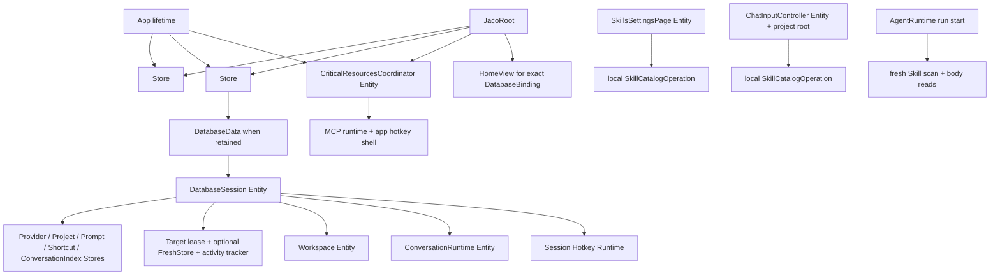

# Issue #177：Jaco 启动状态初始化、同步与刷新

关联 issue：[suxiaoshao/gpui#177](https://github.com/suxiaoshao/gpui/issues/177)

状态：已实施。`gpui-operation`、`gpui-store` 与 Jaco 已按本文目标架构完成接入；自动化验证
已通过，UI 场景按用户要求留给人工测试。本文最初以
`480d4c025e41f19efea82624ece7beffab2268af` 及当时的新 `gpui-store` /
`gpui-operation` 实现为规划基线。

实施验证：

- `cargo fmt --all`
- `cargo check -p jaco --locked`
- `cargo test -p gpui-operation --locked`
- `cargo test -p gpui-store --locked`
- `cargo test -p jaco-db -p jaco-agent --locked`
- `cargo test -p jaco 'state::' --locked`
- `cargo clippy -p jaco --all-targets --all-features --locked -- -D warnings`
- `git diff --check`
- legacy Global/backend 残留查询无生产命中；repository 命中仅位于
  `DatabaseSession` 内部执行边界与 `#[cfg(test)]` fixture。

## 1. 状态与范围

### 目标

1. Config、Database、Provider、Project、Prompt、Shortcut 和 Conversation Index 都只有一份
   共享内存事实源；各 Skill 使用者拥有自己的局部读取状态。加载、刷新、失败、重试和修复状态
   不再被压缩成空列表、默认值或字符串字段。
2. Config 和 Database 使用 `gpui_operation::repair::Operation`；普通 catalog 使用
   `gpui_operation::refresh::Operation`。Operation 直接保存在 `gpui_store::Store` 中，
   Store 不感知 Operation。
3. 应用先创建可渲染的根窗口，再加载 Config 和 Database。配置或数据库损坏时应用不退出，
   而是给出可恢复的全屏 UI。
4. Config 或 Database 有最后有效 Data、但正在刷新或带有 Problem 时，保留当前 Home /
   Settings / Temporary 内容用于查看，同时通过同一 capability gate 禁止所有持久化、
   发送、选择和运行操作。
5. Config 或 Database 没有 Data 时，不创建或继续使用 DatabaseSession，也不允许通过菜单、
   hotkey、secondary window 或旧 Entity 绕过门禁。
6. Provider、Project、Prompt、Shortcut、Conversation Index 分别刷新；一个 child Resource
   的刷新不会隐式刷新兄弟 Resource。Skill Settings 与 ChatInput 各自刷新局部 catalog，
   Agent 每次实际运行都重新扫描并读取当前 Skill。
7. 共享业务投影使用具名 `Select`，不能在不同消费者中重复同一 select 闭包。需要表达完整
   Operation phase/problem 的组件直接保存 Store handle 并 match Operation。
8. 模型、Project、Prompt 等 picker 在有最后有效数据时可以展示旧值和列表，但只能在对应
   Resource 恰好为 `Ready` 时选择或提交；错误、进度和刷新入口必须在使用位置可见。
9. 删除生产代码中的 `FreshStoreGlobal`、`database::repository(cx)`、legacy Store backend、
   Global 缺失 fallback 和页面级 committed snapshot 镜像。
10. 数据库写入成功与系统 hotkey、catalog reconciliation 等后续副作用分别报告，不能再把
    “已提交但同步失败”误报成“保存失败”。

### 非目标

- Plugin Skill 的来源层级等真正接入 Plugin 时再设计；本轮只处理
  `ProjectLocal > Global`。
- 不给 Config、Skill 或 SQLite 增加文件系统 watcher；本轮只保证应用内写入后的状态发布和
  用户显式 Refresh/Reload。外部文件监听由
  [#178](https://github.com/suxiaoshao/gpui/issues/178) 单独处理。
- 不接线 `http_proxy` 到 provider、MCP、OAuth 或其他网络客户端；本轮只保留现有 Config
  字段。运行时代理接入由
  [#179](https://github.com/suxiaoshao/gpui/issues/179) 单独处理。
- 不实现数据库备份的 restore、import、部分数据恢复、合并或独立检查工具；Database UI
  只有不修改数据库文件的 Refresh，以及保留当前问题数据库后创建合法新库两个操作。
- 不把 conversation timeline、全文搜索、keychain secret、附件文件或一次性 provider 网络请求
  改成全局 Resource。它们继续使用 page/controller-local Operation 或按需 command。Skill 正文
  不另建 Operation：Settings 的一次 catalog 读取同时得到全部条目与详情，AgentRuntime 每次运行
  重新扫描并读取当前正文。
- 不修改数据库业务 schema、migration 版本或现有用户数据内容。
- 不处理 tracing 在 GPUI 启动前失败时的图形化错误页。

### 用户决定

- 可以大规模重构；以单一数据源、职责和生命周期清晰、严格状态机及开发者人体工学为目标，
  不以最小 diff 为目标。
- `gpui-store` 是纯内存状态容器；source、持久化、Operation、依赖和恢复策略都属于 Jaco。
- 使用 `gpui-operation` 已有 refresh/repair 两个完整 enum，不在 Jaco 重写另一套 phase enum。
- UI owner 需要完整状态时直接保存 Store 并 match Operation，不把它再镜像为
  `Result<Vec<_>, _> + loading + last_error`。
- `Refreshing`、`Degraded` 及其运行态可以展示最后有效 Data，但不能执行依赖该 Resource 的
  操作；所有 callback/command 也必须在执行时再次验证 `Ready`。
- Config 和 Database 是关键 Resource。没有有效 Data 时整个应用功能不可用；有旧 Data 时只读。
- “Config 无效”只指目录/文件无法读取、TOML 无法反序列化或无法安全推导数据库路径。MCP、
  theme、temporary hotkey 等可隔离字段的运行时错误归各自 side-effect diagnostics，不把一份
  可解析配置整体判为无效。
- Config 重建前必须复制原文件；Database 重建前必须保留主库和存在的 sidecar。
- Database 备份路径只属于当前 attempt：用户选择的路径由当前 Repair/Task 持有；备份失败时
  当前 Backup Problem携带该路径，备份成功时只发送一次 transient Notification。后续
  CreateFresh 等其他错误不携带该路径，下一次 attempt也不能展示上一次 Problem中的路径；
  路径不写入 Data、Config、DB或 journal。
- side-effect repair 不向用户提供 Cancel；取消仍保留给依赖切换、Session teardown 和 owner
  销毁等内部生命周期。
- `storage.data_dir` 保存成功后立即切换 DatabaseSession，不要求重启。相对路径以
  `config.toml` 所在目录为基准做词法归一化，不调用 `canonicalize`。
- 当前 Skill 来源优先级固定为 `ProjectLocal > Global`。它们分别映射现有序列化
  `SkillSourceKind::{Project, User}`，不重命名磁盘/API 值。跨来源同名项直接由高优先级覆盖；
  同一来源内按稳定路径顺序保留第一个并记录 warning，不让用户替应用选择。
- Skill catalog 不是 app-global Resource。`SkillsSettingsPage` 与 ChatInput 分别保存局部
  Operation；AgentRuntime 不消费 UI snapshot，每次运行都重新扫描并读取当前文件。
- Jaco 本轮在 app-local `PickerListDelegate` 实现可浏览但不可提交的动态只读状态；不修改外部
  `gpui-component`。通用能力由
  [longbridge/gpui-component#2600](https://github.com/longbridge/gpui-component/issues/2600)
  跟踪。
- tracing 日志目录或文件在 GPUI application 启动前创建失败时，保持进程启动失败；本轮不提供
  图形化恢复页、临时日志目录、内存日志或重试。

### 兼容与迁移策略

- 应用尚未发布，本轮一次性删除 legacy Global/backend/fallback API，不保留双写、兼容 facade
  或 feature flag。
- `JacoConfig` 的 TOML 字段名和现有默认值保持兼容；只把 `load_error`、`config_path` 等运行时
  字段移出序列化业务类型。
- 现有 SQLite 文件和 schema 不变。Database repair 创建的新库仍走当前 fresh migration。
- 现有设置表单 draft/baseline 继续由 `gpui-form` 持有；Resource 刷新不得 rebase 或清空表单值。
- `gpui-operation` 直接切换到消息式 API，不保留尚未被 Jaco 使用的命令式兼容层；
  `gpui-store` 不修改。
- `app/jaco/Cargo.toml` 增加 workspace 内部 `gpui-operation` 并启用其可选 `tracing` feature，
  同时把已经锁定的
  `tempfile = 3.27.0` 从 dev-dependency 移为普通 dependency，供跨平台同目录原子替换使用。
  没有版本升级；`Cargo.lock` 只允许出现 Jaco package dependency 列表的机械变化。

## 2. 证据快照

- [Jaco 全局状态与底层数据绕过现状审计](global-state-audit.md)
- [剩余问题草稿](resource-store-design-draft.md)

### 当前实现

| 当前事实 | 证据 | 结果 |
| --- | --- | --- |
| 任意同步 `init` 错误都会 `cx.quit()` | `app/jaco/src/app.rs::run/init` | Config/Database 失败时没有窗口可承载恢复 UI |
| main root 直接创建 `HomeView` | `app/jaco/src/app.rs::create_main_root` | root 查找、聚焦、菜单刷新都假设 Home 已存在 |
| malformed TOML 返回默认 `JacoConfig` | `app/jaco/src/state/config.rs::load_or_create_from_path` | 默认 data dir 可能在错误配置下被误用 |
| Config 仍实现旧 `StoreBackend` / `StoreCommitBackend` | `app/jaco/src/state/config.rs` | 与当前纯内存 `gpui-store` 契约不一致 |
| Database 是裸 `FreshStoreGlobal` | `app/jaco/src/database.rs` | feature/state 可以任意 clone repository 并绕过 catalog |
| Provider、Project、Shortcut 加载错误变成空集合 | `state/{providers,projects,shortcuts}.rs::init` | “无数据”和“加载失败”无法区分 |
| Provider/Project refresh 错误被丢弃 | `state/{providers,projects}.rs::refresh_snapshot` | 旧数据没有 stale/error/retry UI |
| Prompt/Shortcut 写 DB 后再次全量读取 | `state/{prompts,shortcuts}.rs` | reconciliation 失败会把已提交写入误报为失败 |
| Workspace 观察 Project 后再次查询 Project/Conversation | `state/workspace.rs::build_sidebar_snapshot` | Project 有两条数据与错误通道 |
| 四个窗口重复相同 `(language, theme)` select 闭包 | Home、Settings、Temporary、About | 同一副作用被四个 owner 分别维护 |
| model choices 被压缩为 `Result<Vec<_>, SharedString>` | `components/run_settings.rs::ModelControlState` | 无法表达 Refreshing/Degraded，组件也无法展示 retry |
| app-local Picker 的 `confirm` 总会提交 | `components/picker.rs::PickerListDelegate::confirm` | trigger 灰掉不能构成交互与 command 边界 |
| Shortcut dialog 使用一次性 Prompt `SelectState` | `features/settings/shortcuts/dialog.rs` | Prompt 刷新后 dialog 不同步，也没有 phase/problem |
| interrupted-run recovery 失败会终止启动 | `state/conversation_runtime.rs::init` | 一个运行时恢复问题错误地阻断全部只读功能 |
| Layout load 失败会终止启动，Global 缺失时又重读文件 | `state/layout.rs` | optional UI cache 同时具有致命路径和隐式 fallback |
| app Quit 直接调用 `cx.quit()`，宿主 quit hook只有 bounded wait | `app.rs::quit_app`、当前 GPUI `on_app_quit` | agent persistence/event publication可能尚未排空 |

### 已确认约束

- `gpui_store::Store<S>` 提供 `new/install_global/global/read/set/update/update_if/select/observe/
  observe_select/observe_select_in`；selection output 必须是 owned `PartialEq`，Store 本身不提供
  backend 或持久化。
- `gpui_operation::{refresh,repair}::Operation` 已保存运行 Task、上一个稳定状态、Data 和
  Problem。完整 enum 通过 `Transition<Message>` 接收 lifecycle message；非法的
  state/message组合保持原状态并忽略消息，启用可选 `tracing` feature时记录
  `tracing::debug!`。精确 `Ready` variant通过同一 trait把应用 domain message转发给 Data。
- GPUI `Task` drop 是 app 层的取消边界。global Resource 的 completion 通过 typed-global Store
  重新查找，不捕获 Store clone；session child completion 只捕获 `WeakEntity<DatabaseSession>`。
- 同步文件和 Diesel 工作使用 GPUI background executor 加 `smol::unblock`；需要 Tokio 的 MCP、
  provider 和 agent future 继续显式使用 `gpui-tokio`。
- `gpui-form` 的 typed draft 在 options 改变时不能被 catalog 自动 rebase。不可用旧值必须保留，
  由校验和 submit policy 决定是否可提交。
- 当前锁定的 `gpui-component 0.5.2`
  (`5b45bcb26b9343d91a123a4d5ed8a654360512e5`) 已有 Alert、Button loading、
  Spinner、Progress 和 Notification；这些足以组合状态 UI。
- 当前通用 Select/Combobox 的动态 disabled 与逐项 disabled 不能可靠阻止所有键盘/已打开 popover
  路径。本轮 Resource picker 统一迁移到可控的 Jaco `PickerListDelegate`，不依赖该缺口。

### 无变化项

- SQLite table、column、index、migration 和 `SCHEMA_VERSION`：**No change**。
- provider/MCP/Rig 协议和 secret 存储：**No change**。
- `gpui-store` 对外 API 和文档：**No change**。
- GPUI、gpui-component、Diesel、smol、Tokio 版本与 feature：**No change**。
- TLS/native/system dependencies：**No change**。

## 3. 架构决定

### D-01：Store 直接保存 Operation

无依赖 Resource 使用：

```rust
type ProviderResource = gpui_operation::refresh::Operation<
    ProviderData,
    ProviderProblem,
    Task<()>,
>;
type ProviderStore = gpui_store::Store<ProviderResource>;
```

Config 同样直接保存 repair Operation。只有 Database 需要额外表达“尚无 Config 依赖”，因此使用：

```rust
enum DatabaseResource {
    AwaitingConfig,
    Bound {
        target: DatabaseTarget,
        operation: DatabaseOperation,
    },
}
```

不新增通用 `Resource` trait、backend、source registry 或 Store/Operation adapter。每个 Jaco
module 自己提供 source attempt 和用户友好 command。

### D-02：Operation 和精确 Ready 都由消息驱动

`gpui-operation` 两个 family 的完整 enum 都为 `&mut Operation` 实现 lifecycle
`Transition<Message, Output = ()>`。owner 构造 Task并发送 `Load`、`Refresh`、`Retry`、
`Repair`、`Complete` 或 `Cancel`：

```rust
store.update(cx, |operation| {
    operation.transition(Refresh(task));
});

store.update(cx, |operation| {
    operation.transition(Complete(result));
});
```

合法消息原子替换整个 Operation；非法 state/message组合保持原 Operation不变并丢弃消息。
`tracing` 是可选 feature，启用时对被忽略的 lifecycle message记录 `tracing::debug!`；Jaco
启用该 feature。库不返回 `Rejected`，也不提供
`start_fetch/start_repair/complete/cancel/can_*` 兼容方法。

数据库 mutation 返回 authoritative committed delta。应用为 Data 定义 domain message及
`Transition`，然后必须显式 match完整 Operation 的精确 `Ready` variant，再让
`&mut Ready<Data>`把消息转发给 `&mut Data`：

```rust
store.update(cx, |operation| {
    let Operation::Ready(ready) = operation else {
        panic!("committed delta requires an exact Ready operation");
    };
    ready.transition(ApplyProviderDelta(delta));
});
```

因此没有 `data_mut` / `ready_data_mut`，也不会在非 Ready phase静默吞掉已提交 delta。这个设计
不要求 Data、Problem、Repair、Task或 domain message实现 Clone；Store/Entity owner仍决定何时
发送消息，并由它自己的 `update`/通知机制发布变化。

### D-03：一个长期存在的 JacoRoot 决定全部顶层内容

`JacoRoot` 始终是主窗口 root view。它保存 ConfigStore、DatabaseStore 和 app-lifetime
coordinator Entity 的 clone，
每次 render 直接读取并 match 两个 Operation；不保存重复的 `AppStartupState`。

可见内容只有四类：

1. `CriticalResourceLoadingPage`：Config load、Database open 或 Session build；
2. `ConfigRecoveryPage`；
3. `DatabaseRecoveryPage`；
4. `HomeView`，必要时叠加不可关闭的 critical read-only progress/problem overlay。

无 Data 使用 1–3；有匹配 Session 的旧 Data 使用 4。Config 问题优先于 Database 问题。

### D-04：统一 Session capability 是最终授权边界

`CriticalResourcesCoordinator::with_ready_session` 只有在以下条件同时满足时返回 Session：

- Config Operation 恰好为 `Ready`；
- Database bound target 等于 Config 当前 target；
- Database Operation 恰好为 `Ready`；
- Database Data binding 等于当前 DatabaseSession binding；
- Session 没有进入 shutdown。

否则返回结构化 `SessionAccessError::{Unavailable, ReadOnly, Rebinding}`。所有发送、CRUD、选择、
设置保存、approval、hotkey trigger 和 secondary-window action 在执行时调用它。视觉 disabled
只是表现层，不是授权。

### D-05：Config 是 repair-capable committed file Resource

- `JacoConfig` 只含序列化业务字段。
- ConfigData 额外保存 path、成功读取/写入的原始 bytes、DatabaseTarget 和可选 recovery notice。
- 文件不存在是普通 load：创建默认配置，成功后 Ready。
- config directory resolve、read、TOML deserialize 或 DatabaseTarget 推导失败时没有 Data，
  进入 Unavailable；绝不生成诊断默认 Data。
- TOML enum/type/required-shape 由 serde 拒绝。enabled MCP server、theme 名称、custom color、
  temporary hotkey 和 DB-backed id 的语义不在 Config validity 中；它们分别进入
  MCP/theme/hotkey/picker diagnostics，避免一个可隔离字段阻断全应用。`http_proxy` 只按现有
  字段完成解析与保存，本轮不产生新的运行时代理行为。
- 应用内保存先从 Ready Data 产生 draft，再在 background task 中检查磁盘 bytes 未外部改变并写入。
  成功才发布新 ConfigData；失败进入 Degraded，旧 committed Data 留作只读展示。
- draft 在 App turn先执行 `toml::to_string_pretty`。序列化失败保持 Operation Ready、不启动
  Task，并返回 `ConfigCommandError::Encode`；它是实现/输入错误，不冒充文件损坏。
- 外部修改冲突不覆盖文件。Problem 保存 pending draft，UI 提供 Reload 或“先备份当前文件再覆盖”
  两个明确选择。
- 所有 Jaco config 写操作先持有同目录 `config.toml.lock` 的
  `std::fs::File::try_lock()` 独占锁；锁文件协调多个 Jaco 进程，锁失败进入 `Locked` Problem。
- 写入使用目标目录内的 `tempfile::NamedTempFile`：写完整 pretty TOML、`flush`、`sync_all`，
  再 `persist(config.toml)`。persist 失败时旧目标不被截断；成功后重新读取，只有 bytes 与
  pending 完全一致才发布 Ready。禁止直接 `fs::write(config.toml, ...)`。
- 普通 save 在写 temp 前和 persist 前各比较一次当前磁盘 bytes 与 `ConfigData::source_bytes`；
  任一次不等都进入 ExternalChange。这样协调进程和可注入 race 不会覆盖已观察到的新版本。

### D-06：Config repair 总是保留用户文件

`ConfigRepair` 固定为：

```rust
enum ConfigRepair {
    Reload,
    RetryWrite,
    BackupAndCreateDefault,
    BackupAndOverwritePending,
}
```

- Reload 重新读取用户手工修复后的文件。
- RetryWrite 只对携带 pending draft 的 write Problem 可用。
- `BackupAndCreateDefault` 执行前在同一 config lock 下重新 read + deserialize + target derive；
  如果已经完整有效，直接返回该数据，不能覆盖。
- 文件仍损坏时，将锁内读到的原 bytes用 `create_new` **复制**到同目录
  `config.invalid-YYYYMMDDTHHMMSSZ.toml`；冲突追加 `-1`、`-2`，禁止覆盖。
- 备份文件也执行 `flush` + `sync_all`。备份成功后，再次读取 `config.toml`；若 bytes 已变化，
  中止覆盖并返回新的 ExternalChange，已有备份保留。
- bytes 未变化时才用 D-05 的 atomic replace 写默认 `config.toml`。任一步失败都保留原文件/
  已有备份，Problem 暴露 path。
- `BackupAndOverwritePending` 使用同一流程复制当前磁盘版本，再写 pending draft。
- 成功结果通过 ConfigData recovery notice 展示持久 Notification 和备份路径。

Problem 与 action 固定映射如下；UI 只渲染 `supports(repair)` 为真的 action：

| ConfigProblem | Reload | RetryWrite | BackupAndCreateDefault | BackupAndOverwritePending |
| --- | --- | --- | --- | --- |
| `ResolveDirectory` / `Read` / `Locked` | 是 | 否 | 否 | 否 |
| `Parse` / `Target` | 是 | 否 | 是 | 否 |
| `ExternalChange { pending }` | 是 | 否 | 否 | 是 |
| `Write { pending }` | 是 | 是 | 否 | 否 |
| `Backup { intent, pending }` | 是 | 否 | 按 `intent` | 按 `intent` |
| `WriteAfterBackup { intent, pending, backup_path }` | 是 | 是 | 否 | 否 |

`RetryWrite` 仍执行双重 bytes compare；`WriteAfterBackup` 的 retry 复用已有 backup_path，不再生成
第二份备份，除非磁盘 bytes 又发生变化。

### D-07：Database Data 表示完整持久化域有效

Database load/open 必须依次完成 target lease、**写入前完整 preflight**、migration/bootstrap
和 postflight validation，才能返回 DatabaseData：

1. 在 data directory 创建/打开 `jaco.sqlite3.lock`，用稳定于 Rust 1.89 的
   `std::fs::File::try_lock()` 获取进程间独占锁；另一 Jaco 持锁时返回 `InUse`，不允许 repair。
   该锁只协调遵守同一协议的 Jaco；恢复页明确提醒关闭不遵守 lock file 的外部 SQLite 工具。
2. 文件不存在或为零字节时分类为 `MissingOrEmpty`。已有非空 DB 使用
   `url::Url::from_file_path` 构造正确转义的 `file:` URI，追加 `mode=ro`，建立独立的非 pool
   `SqliteConnection`，并先设置 `PRAGMA query_only=ON`。该连接不运行 migration、不更新
   metadata，只执行 `PRAGMA quick_check`、`PRAGMA foreign_key_check`、Jaco
   schema/migration recognition，以及下述完整持久化域校验。禁止手拼 URI，也禁止
   `immutable=1`（它可能忽略未 checkpoint WAL）。mode=ro 因 WAL/SHM/权限无法打开时报告
   `Open/InUse`，不能降级成 writable preflight。
3. 只有 `open_or_create_initial` 或 `create_fresh_staging`，并且输入为 `MissingOrEmpty` 或
   preflight 已确认的可迁移 Jaco schema，才运行现有 transaction-wrapped
   migration/bootstrap。`reopen_validated_existing`/`validate` 永远不进入该分支。当前只有
   `0001_create_fresh_schema`；未来新增旧版本 migration时，必须同时提供对应的写入前
   validator，否则旧版本只报告 `UnsupportedSchema`，不能“先迁移再看看”。
4. postflight 再运行完整 validation，并确认 metadata row、`SCHEMA_VERSION` 和已知 migration
   集完全一致。
5. 公开入口按意图拆分，不能让 Refresh 复用可能 bootstrap 的模糊 `open`：
   `open_or_create_initial` 只用于首次启动，可在明确允许时创建 Missing/Empty 数据库并执行
   migration/bootstrap；`reopen_validated_existing` 只读 preflight并重新打开现有合法数据库；
   `create_fresh_staging` 只在已确认的 `BackupAndCreateFresh` 流程中创建 staging新库。
   crate-private unchecked open不能导出；`validate` 只验证当前 Session，不能运行 migration、
   更新 metadata或创建任何 artifact。

“完整持久化域校验”不是只看 SQLite page/schema。它在同一个一致性读快照中加载并转换
`schema_migrations`、`schema_metadata`、`projects`、`providers`、`prompts`、
`provider_models`、`conversations`、`attachments`、`agent_runs`、`provider_steps`、
`tool_invocations`、`conversation_entries`、`usage_events` 和 `shortcuts` 的**每一行**：

- 所有 enum label、JSON payload 和 timestamp 都必须能转换成公开 record；
- `TryFrom<Sql*Row>` 已声明的 payload/index、terminal field 成对关系必须成立；
- `conversations.last_entry_seq` 必须等于该 conversation 的最大 entry seq（无 entry 时为 0）；
- trigger/final entry、provider step/tool invocation 和 conversation 的跨行归属必须一致；
- usage token各字段非负，且 `usage_json` 能解码、各 token index column与 payload一致；
- metadata、migration、外键以及当前 repository command 所依赖的其他跨行 invariant 必须成立。

`jaco-db` 新增 `validation.rs` 和 `DatabaseValidationError`，但不改变业务 schema。
`quick_check` 只有结果**恰好一行 `ok`**才成功；`foreign_key_check` 必须零行。每个 migration
继续在 `immediate_transaction` 中执行，未来新增 migration 也不得绕开该原子边界。

同时拆掉当前含义混杂的 `DbError::Invariant/SerdeJson/TimeParse`：

- app command 的 stale id、NotFound、constraint 和输入校验进入 typed command/domain error，
  不代表数据库损坏；
- 写入前序列化/时间格式化使用 `DbError::Encode`；
- 从持久化行读取出的 enum/JSON/time/结构错误统一为
  `DbError::StoredData(StoredDataError { table, row_id, field, message })`；
- 只有 `DatabaseValidationError::{Integrity, ForeignKey, Schema, Metadata, StoredData,
  PersistedInvariant}` 表示整库不满足有效域；
- 无法证明属于持久化内容的内部 invariant 是 `DbError::InternalInvariant`，只报告实现错误，
  不向用户提供 destructive repair。

因此某个 catalog query 遇到损坏 JSON/time/label 时会触发关键 Database validation，而
“用户删除了已过时对象”“唯一约束冲突”仍只是当前 command error。

```rust
struct DatabaseData {
    binding: DatabaseBinding,
    session: Entity<DatabaseSession>,
}

#[derive(Clone, Debug, Eq, Hash, PartialEq)]
struct DatabaseBinding {
    target: DatabaseTarget,
    session_key: DatabaseSessionKey,
}

#[derive(Clone, Copy, Debug, Eq, Hash, PartialEq)]
struct DatabaseSessionKey(u64);
```

`FreshStore` 和 `DatabaseTargetLease` 只存在于 DatabaseSession 或当前 Database driver task
内部，不放进 Operation Data。
因此 `repair::Operation` 在 Degraded/RepairingDegraded 保留的 Data 只是 binding、Session
Entity 和可展示的 child snapshots；Session 可以先取出并 drop pool，而不破坏 Operation 的
严格状态机，也不需要伪造 `Idle -> Loading -> Unavailable`。

每次重新打开连接池、切换 target 或重建数据库都生成新 SessionKey。只有明确的同一 Data
health observation 才保留 key；本轮所有成功 reopen 都换 key并重建 Session。key 由唯一
app-lifetime coordinator 的 checked `u64` 计数器分配，溢出直接终止该次 open 并报告内部错误，
不复用旧 key。

### D-08：Refresh 无副作用，Problem 状态通过内部 repair message重试

Database 对用户只暴露两个操作：

1. `Refresh`：重新检查并打开当前 target；不移动、覆盖、删除或修改任何数据库文件。
2. `BackupAndCreateFresh`：在用户确认后保留当前问题数据库，再创建并校验一份合法新库。

`DatabaseRepair` 是消息携带的 attempt 类型，包含：

```rust
enum DatabaseRepair {
    Refresh,
    BackupAndCreateFresh {
        backup_dir: PathBuf,
    },
}
```

- `request_database_refresh` 对 Ready 发送 lifecycle `Refresh(task)`；对 Unavailable/Degraded
  发送 `Repair { repair: DatabaseRepair::Refresh, task }`。两条路径都只调用
  `reopen_validated_existing`/`validate`，用户在外部手工修复文件后也通过这个入口重新检查；
  失败只由 `Complete(Err(problem))` 更新 Operation，不执行 migration、bootstrap、修复或任何
  文件写入。
- 从 Ready 或 Degraded 的现存 Data 发起 Refresh 或 repair 时，driver 先关闭对外 gate并使
  Session进入
  `DrainingRuntime`：拒绝新 command/new run，等待已注册 Agent run完成取消/finalization，
  再进入 `Pausing` 并等待全部 tracked DB permit归零。随后同时从 Session取出 `FreshStore` 和
  `DatabaseTargetLease`，drop pool后才接触文件；不能再次获取同一 target 的第二把锁。
- 从 Unavailable 或已 quiesced Degraded 发起操作时，driver重新 acquire target lease。Refresh
  成功时创建新 SessionKey并重建 Session；同一 Ready Session 的 health refresh成功时可以恢复
  原 Session。失败时 drop lease并保留当前 Problem。
- Config target在 blocking driver运行时改变时，coordinator只关闭 gate并更新
  `pending_target`/generation。当前 closure必须结束并释放 store/lease；stale completion不发布
  Ready，随后才绑定最后一个 pending target。
- `BackupAndCreateFresh` 是有确认且不可由调用者取消的副作用操作。target变化、窗口关闭和
  managed quit都等待当前 task到达完成或失败；只 drop GPUI Task不能冒充底层文件工作已停止。
- UI 在构造 Repair message前让用户选择本次 `backup_dir`；该路径随
  `DatabaseRepair::BackupAndCreateFresh { backup_dir }` 和当前 Task传递，不从上一个 Problem
  继承。repair 在持有 target lease且旧 pool已 drop 后，以不覆盖已有内容的方式创建该目录。存在的
  `jaco.sqlite3`、`jaco.sqlite3-wal`、`jaco.sqlite3-shm` 逐个完整复制到该目录并同步落盘；
  任一备份失败都不开始创建新库，并产生携带本次 `backup_dir` 的 Backup Problem。
- 全部原 artifact 已备份后，先在同目录隔离的 staging target创建并完成 D-07 全量 validation，
  同时发送一次携带本次路径的 transient backup-success Notification，再替换当前 target 的
  main database并清理旧 sidecar。任何后续失败都保留磁盘上的 backup目录，但
  `CreateFresh` 等 Problem只描述自己的失败，不再携带 backup路径；不能删除 backup，也不能
  把失败说成成功。
- 本轮不创建 repair journal，不自动 resume/restore，不导入 backup，不做部分数据恢复或 backup
  检查工具。进程若在副作用操作中被强制终止，下次启动只按当前 target执行普通 Refresh并保留
  已存在的 backup目录，不猜测、合并或自动恢复文件。
- 成功 completion创建新 Session和新 SessionKey并发布 Ready。备份路径只存在于当前
  Repair/Task、Backup失败 Problem或 backup-success Notification，不写入 `DatabaseData`、
  Operation Data、Config、DB或 journal。启动下一次 attempt后，运行态 UI使用新的
  `active_repair`，不得把 Operation为取消语义保留的 previous Problem当作本次错误展示；
  completion产生的新 Problem也会替换旧 Problem。外部不遵守 lock file 的 SQLite进程仍可能
  导致 copy/replace失败，UI只报告实际结果。

### D-09：DatabaseSession 是唯一数据库能力边界

DatabaseSession 私有持有 repository capability，并拥有以下 session-local 对象：

- `Option<FreshStore>`、`Option<DatabaseTargetLease>`、`DatabaseActivity` 和 shutdown phase；
- ProviderStore、ProjectStore、PromptStore、ShortcutStore、ConversationIndexStore；
- Workspace Entity；
- ConversationRuntime Entity；
- session-bound Hotkey runtime；
- child Resource subscriptions、各 catalog mutation lane。

feature/component 不接收 FreshRepository。按需 timeline/search/transaction 由 `state` 层的
typed session command 执行。所有 blocking persistence closure 都由 Session 注入的 tracked
executor 创建：它先获得 `DatabaseJobPermit`，只在 permit 生命周期内 clone repository；
closure 返回或 panic时先 drop repository、再 drop permit并唤醒 drain。Session 进入
`DrainingRuntime` 后普通 command permit被拒绝，只允许已注册 run完成 shutdown persistence；
进入 Pausing/ShuttingDown 后拒绝全部新 permit。

`jaco-agent` 不再长期持有 `FreshRepository`。AgentRuntime 接收 session-bound tracked
persistence port；每次 transaction 都经该 port执行，completion返回 authoritative
`ConversationCommit<T>` 给 ConversationRuntime publication。runtime shutdown 必须 await所有
persistence future退出，不能 `.detach()` DB closure。最终 residual scan 覆盖
`app/jaco/src`、`crates/jaco-agent/src`，两处都不得存在 Global repository helper，也不得在
tracked executor外调用 `FreshStore::repository()` 或保存 `FreshRepository` 字段。

边界使用对象安全、按完整 transaction命名的 async port；不把通用 raw-repository closure
暴露给 `jaco-agent`：

```rust
type AgentPersistenceFuture<T> = Pin<Box<
    dyn Future<Output = std::result::Result<T, AgentPersistenceError>> + Send + 'static,
>>;

#[derive(Debug, thiserror::Error)]
enum AgentPersistenceError {
    #[error(transparent)]
    Database(#[from] DbError),
    #[error("database session is closed")]
    SessionClosed,
    #[error("agent run persistence lease was revoked")]
    RunRevoked,
    #[error("database worker failed: {0}")]
    WorkerFailed(String),
}

#[derive(Clone, Copy, Debug, Eq, Hash, Ord, PartialEq, PartialOrd)]
struct RuntimeWriterKey(u64);

struct NewProviderStepWithoutSeq {
    agent_run_id: AgentRunId,
    status: ProviderStepStatus,
    request_snapshot: ProviderStepRequestSnapshot,
    response_snapshot: Option<ProviderStepResponseSnapshot>,
    state_snapshot: Option<ProviderRunStateSnapshot>,
    settings_snapshot: RunSettingsSnapshot,
    error: Option<RunErrorPayload>,
}

struct ConversationEntryUpdate {
    status: ConversationEntryStatus,
    payload: ConversationEntryPayload,
}

struct ProviderStepCommit {
    step: ProviderStepRecord,
    usage: Option<UsageEventRecord>,
}

struct ToolCallCommit {
    invocation: ToolInvocationRecord,
    entry: ConversationEntryRecord,
}

struct ToolEntriesCommit {
    invocation: ToolInvocationRecord,
    entries: Vec<ConversationEntryRecord>,
}

struct ToolTransitionWrite {
    invocation_id: ToolInvocationId,
    entries: Vec<NewConversationEntry>,
    update: UpdateToolInvocationStatus,
    // 这是 transaction 完成后的完整 approval snapshot；None 表示确实没有 approval。
    approval: Option<ToolInvocationApproval>,
}

struct AgentRunFinalizationSnapshot {
    run: AgentRunRecord,
    active_provider_steps: Vec<ProviderStepRecord>,
    active_tool_invocations: Vec<ToolInvocationRecord>,
    latest_assistant_entry_id: Option<ConversationEntryId>,
}

enum FinishRunCommit {
    ExistingFinalEntry(FinishedAgentRun),
    AppendedFinalEntry(ConversationCommit<FinishedAgentRun>),
}

trait AgentPersistence: Send + Sync + 'static {
    fn begin_run(&self, input: NewAgentRun)
        -> AgentPersistenceFuture<AgentRunRecord>;
    fn load_timeline(&self, id: ConversationId)
        -> AgentPersistenceFuture<Option<ConversationTimelineRecords>>;
    fn append_entries(&self, input: Vec<NewConversationEntry>)
        -> AgentPersistenceFuture<ConversationCommit<Vec<ConversationEntryRecord>>>;
    fn update_entry(&self, id: ConversationEntryId, update: ConversationEntryUpdate)
        -> AgentPersistenceFuture<ConversationEntryRecord>;
    fn insert_next_provider_step(&self, input: NewProviderStepWithoutSeq)
        -> AgentPersistenceFuture<ProviderStepRecord>;
    fn finish_provider_step(
        &self,
        id: ProviderStepId,
        update: UpdateProviderStepStatus,
        usage: Option<NewUsageEvent>,
    ) -> AgentPersistenceFuture<ProviderStepCommit>;
    fn update_provider_step(
        &self,
        id: ProviderStepId,
        update: UpdateProviderStepStatus,
    ) -> AgentPersistenceFuture<ProviderStepRecord>;
    fn insert_tool_call(&self, invocation: NewToolInvocation, entry: NewConversationEntry)
        -> AgentPersistenceFuture<ConversationCommit<ToolCallCommit>>;
    fn transition_tool_with_entries(
        &self,
        write: ToolTransitionWrite,
    ) -> AgentPersistenceFuture<ConversationCommit<ToolEntriesCommit>>;
    fn update_tool(
        &self,
        id: ToolInvocationId,
        update: UpdateToolInvocationStatus,
        approval: Option<ToolInvocationApproval>,
    ) -> AgentPersistenceFuture<ToolInvocationRecord>;
    fn load_run_finalization(&self, id: AgentRunId)
        -> AgentPersistenceFuture<Option<AgentRunFinalizationSnapshot>>;
    fn load_conversation_finalizations(&self, id: ConversationId)
        -> AgentPersistenceFuture<Vec<AgentRunFinalizationSnapshot>>;
    fn list_interrupted_runs(&self)
        -> AgentPersistenceFuture<Vec<AgentRunFinalizationSnapshot>>;
    fn finish_run(&self, id: AgentRunId, finish: FinishAgentRun)
        -> AgentPersistenceFuture<FinishRunCommit>;
}

struct AgentRuntime {
    persistence: Arc<dyn AgentPersistence>,
    // skill/MCP/approval fields unchanged
}

#[derive(Clone)]
struct AgentRunLease(Arc<AgentRunLeaseInner>);

struct AgentRunLeaseInner {
    key: RuntimeWriterKey,
    executor: Weak<SessionDatabaseExecutorInner>,
}

struct SessionAgentPersistence {
    key: RuntimeWriterKey,
    lease: AgentRunLease,
    executor: Arc<SessionDatabaseExecutorInner>,
}
```

这就是完整 port surface；实施时不能增加 raw-repository escape hatch。request/decide/auto
approval都构造 `ToolTransitionWrite`，由同一个原子 transaction校验状态并写 entries +
invocation + approval。同时在 `jaco-db` 原子化当前拆开的逻辑：

- queued run insert + Running update；
- next provider-step seq + insert；
- provider-step completion + optional usage；
- tool invocation insert + ToolCall entry；
- tool result/approval entries + invocation update；
- interrupted/conversation run finalization snapshot读取与 finish run。

只有真正 append entry并推进 conversation index 的 transaction返回 `ConversationCommit`；
begin run、entry payload update、provider-step-only和tool-only write不制造假的 Index publication。
`FinishRunCommit` 只有实际 append final entry时携带 ConversationCommit。

Jaco 的 `SessionDatabaseExecutor` 是唯一生产 adapter。Session仍在 Running时，
`register_agent_run()` 分配 checked `RuntimeWriterKey`，向该 run返回
`SessionAgentPersistence`；它的所有 clone共享一个 `AgentRunLease`。executor同一 mutex保存
phase、`Option<FreshRepository>`、active job count和允许在 drain期间继续 finalization的 run
key集合。key用 session-local checked `u64` 分配且永不复用；溢出拒绝启动 run。

1. 每个 port方法调用内部 `run(key, closure)`；它在同一锁内验证 phase/key、增加 active count、
   clone repo，然后用 `tokio::task::spawn_blocking` 执行 closure；
2. closure无论成功、DbError或 panic都先 drop repo、再 drop permit；`JoinError`/panic明确映射
   为 `AgentPersistenceError::WorkerFailed`，DbError映射为 `Database`；
3. `DrainingRuntime` 拒绝普通 command和新 `register_agent_run`，但 allowlist中的 run key仍可
   完成 canceled/finalization；drop最后一份 AgentRunLease才注销 key；
4. 每个 run结束先发送 runtime channel FIFO `Barrier(oneshot ack)`，等此前全部
   `ConversationCommitted` 已在 GPUI turn发布，再 drop lease；
5. runtime writer key集合为空后进入 Pausing，executor `close()` repository slot并拒绝所有
   job，再等待 active count归零；
6. validation成功后 `reopen(store.repository())`，并对**原来的**
   ConversationRuntime Entity调用 `resume_persistence`；同 SessionKey 的 Home/Detail不换 Entity。
   binding replacement才创建新 Entity。

run supervisor 用 guard/finally覆盖 success、provider error、cancel和 Tokio JoinError：能完成时
先执行 DB finalization，再发送 Barrier并等待 ack，最后才 drop AgentRunLease。shutdown必须保留
event listener直到所有 run barrier结束；listener若已无法升级 owner，也必须 ack并返回 typed
`RuntimePublicationError::OwnerGone`，让 supervisor释放 lease并把错误交给 Session，而不是让
DatabaseDrain永久等待。

`AgentRuntime`、`PersistenceContext`、streaming accumulator、PromptHook和 finalization中所有
当前同步 persistence helper都改为 async并 await port。测试使用 object-safe fake port；需要
真实 SQLite 的 jaco-agent测试使用仅 `cfg(test)` 的 DirectAgentPersistence，它也通过
`tokio::task::spawn_blocking`，生产不能导出。这样既不在 Tokio worker上直接阻塞 Diesel，也能
证明 repair前最后一个 repo clone、blocking closure和 Store publication都已完成。

ConversationIndex 对 AgentRuntime 不占用整段时间的独占 catalog lane。它另外维护
`active_runtime_writers: BTreeSet<RuntimeWriterKey>`：writer注册只要求 Index Ready；多个
conversation run可并行；每个 commit event在 GPUI turn串行 merge；诊断 reload只有在集合为空
且 app-command lane Idle时可运行。

Hotkey 也按能力边界拆分：

- `AppHotkeyShell` 是 app-lifetime Global，只持有 OS manager、temporary hotkey 和按
  `ShortcutRegistration` 注册的 `(hotkey id -> session binding + shortcut id)` 路由；
- `SessionHotkeyRuntime` 从当前 Shortcut/Prompt/Provider Ready Data构造完整
  `ShortcutTriggerContext`，不按 id 重读 DB；
- selection、clipboard、screenshot capture、OCR task 全部保存在 SessionHotkeyRuntime，不再
  `.detach()` 后回调 `GlobalHotkeyState`；
- `ScreenshotOverlayState` 只保存 `{ binding, trigger_id, window handles }`，不保存
  `ShortcutRecord`。capture completion升级 weak Session并再次验证 exact binding、critical
  gate和三个 Resource Ready，才允许创建 conversation；
- Session teardown 取消上述 task并调用 `screenshot_overlay::cancel_for_binding(binding)`。
  因此旧 binding 的 selection/OCR/capture completion 不能操作新 Session。

### D-10：child Resource 各自独立，Workspace 是多输入派生状态

- ProviderData：完整 `ProviderWithModels`；enabled model choices 是纯派生，不再另存权威字段。
- ProjectData：全部 visible normal + scratch projects；normal picker/settings 是派生视图。
- PromptData：全部 committed prompts。
- ShortcutData：全部 committed shortcuts。
- ConversationIndexData：全部 active sidebar conversation summary。

Workspace 只保存 route、expanded project ids、pending project 和其他纯 UI 状态；它组合
ProjectData 与 ConversationIndexData，不是 DB-backed Resource，也不重新查询项目/列表。
非空全文搜索继续使用页面局部 Operation。

页面/控制器局部读取同样不能把错误压成空值：

- `ConversationDetail` 保存 page-local `ConversationTimelineOperation`。首次失败是
  Unavailable+Retry；refresh失败是 Degraded并保留旧 timeline只读。runtime
  `ConversationChange`携完整 committed record：Ready时按 id/updated_at确定性合并；
  Loading/Refreshing/Degraded时进入 pending delta queue，下一次成功 snapshot complete后再合并，
  不按 event id整页重查。
- `SkillsSettingsPage` 在自身 Entity中保存 `SkillCatalogOperation`，初次失败为
  Unavailable+Retry，刷新失败为 Degraded并保留旧 entries及其详情只读展示。每次 load/refresh
  在同一个 Task内读取全部条目和全部详情，完成后一次发布完整 `SkillCatalogData`；页面不为单个
  Skill正文启动二次读取。只有页面内部将来出现多个独立 owner需要订阅时，页面才可以持有局部
  Store；不能提升为 app Global。
- `ChatInputController` 为当前 project root保存独立的 `SkillCatalogOperation`。root变化先
  cancel旧
  attempt并 Load新 root；scan失败不调用 `apply_skill_catalog_entries(Vec::new())`。旧 entries
  可浏览但不可插入或提交。它不与 Settings同步，也不消费 Settings snapshot。
- 唯一 scan/resolve实现位于 `crates/jaco-agent/src/skills.rs` 并由
  `crates/jaco-agent/src/lib.rs` 导出。它只按 `ProjectLocal > Global` 解析同名项，并映射现有
  `SkillSourceKind::{Project, User}`。跨来源直接保留最高优先级；同一来源按规范化后的稳定路径
  顺序保留第一个，并为每个被覆盖/重复项返回包含名称、来源和路径的 warning，禁止依赖文件系统
  遍历顺序。`app/jaco/src/state/skills.rs` 只定义局部 Data/Problem/Operation以及 owner 路由/
  presentation，不重复 resolver。
- AgentRuntime每次实际运行都调用同一 resolver重新扫描来源，并读取本次启用 Skill的当前正文；
  UI catalog revision/hash和正文都不进入 run request。任一所需正文读取失败就终止本次运行，
  并通过现有 runtime event/Notification route向用户报告具体 Skill与错误。

这些 Skill Operation不是 app-global Resource，不进入 Store/DatabaseSession child catalog。
Plugin来源层级、文件 watcher和跨页面 catalog同步都不属于本轮。

### D-11：数据库 commit 与后续副作用分开

- Provider/Project/Prompt/Shortcut/Conversation command 仅在对应 Resource Ready 时运行。
- 每个 child Resource 有一个不承载业务 Data 的 `CatalogMutationLane`：

  ```rust
  enum CatalogMutationPhase {
      Idle,
      Mutating {
          command_id: u64,
          refresh_queued: bool,
      },
  }
  ```

  `begin_mutation` 在同一个 App turn 内完成 Ready preflight 并占用 lane。同一 Resource 的第二个
  mutation 返回 Busy；refresh 请求只把 `refresh_queued` 置为 true，不能让 Operation 进入
  Refreshing。不同 child Resource 仍可独立执行。
- DB commit 成功后，在同一个 App turn 中显式 match精确
  `Operation::Ready(ready)`，再发送 typed committed-delta domain message；`&mut Ready`把消息
  转发给 Data 的 `Transition` 实现，不再次全量 query。binding 与 command_id 必须仍匹配；
  此时 Operation不是 Ready就视为实现 invariant violation并在测试中失败，不能把业务消息作为
  非法 lifecycle message静默丢弃。
- publication 或 error 完成后释放 lane；若 `refresh_queued`，再启动一次 refresh。因此 refresh
  query 必然发生在已提交 delta 发布之后，不会用 commit 前 snapshot 覆盖新 Data。
- DB commit 失败不改变 catalog Operation；页面显示 command error，然后同样执行 queued refresh。
- Session teardown 后完成的旧 command 不写旧 Store；新 Session 初始 load 从已提交 DB 读取。
  同 binding 的 Config phase 暂时变成 read-only 时，已经开始的 commit允许完成并发布，但 gate
  拒绝新的 command。
- Shortcut Store 更新和 OS hotkey reconcile 是两份结果。hotkey 失败记录在 session runtime
  diagnostics，DB save 仍报告成功并给出可重试 warning。
- Config save与 temporary hotkey、MCP、theme/i18n side effect 同样分离；Config Ready 后由
  named selector 触发 reconcile，side-effect 失败不回滚已持久化 Config。
- MCP/OAuth credential delete/disconnect绝不能发生在 Config commit之前。新 credential使用唯一
  staged key；Config保存失败时只清理 staged key、旧 credential不动；Config成功 publication后
  才 best-effort删除 obsolete credential并 reconcile。cleanup失败报告“配置已保存，但凭据
  清理失败”的 orphan warning，不把 committed Config说成保存失败。
- Provider changed secret先写唯一 staged ref，旧 DB引用的 ref保持有效；tracked DB transaction
  提交新 refs并发布 ProviderData后才 best-effort删除旧 ref。DB失败清理 staged ref；clear
  secret先提交移除 ref再删旧 credential。任何 cleanup失败只记录 orphan diagnostic，不能回滚/
  误报 DB commit。禁止继续覆盖稳定的 `provider_id:key`。
- 无 project conversation create先准备唯一 scratch directory和本轮 attachment artifacts，但将
  optional scratch Project insert、conversation、first entry/attachments和
  `project.last_active_conversation_id` 放在**一个** DB transaction。DB失败回滚全部 row并只清理
  本命令创建的文件；清理失败报告 orphan warning。删除当前单独提交
  `create_anonymous_scratch_project` 的路径。

多 Resource command 的 preflight 与 publication 固定如下；表中全部 Resource 都必须恰好 Ready，
并按 `Provider -> Project -> Prompt -> Shortcut -> ConversationIndex` 顺序占用 mutation lane，
失败时逆序释放，避免交叉 command死锁：

“条件加”只检查并占用 draft/command实际引用的 Resource；None引用或已持有 committed snapshot
不能被无关兄弟 Resource的 Refreshing阻断。

| Command | 必须 Ready | authoritative DB return / Store publication |
| --- | --- | --- |
| Provider create/update、model replace/toggle | Provider | `ProviderDelta` -> Provider |
| Prompt create/update | Prompt | `PromptRecord` -> Prompt |
| Prompt delete | Prompt、Shortcut、ConversationIndex | deleted Prompt id；Prompt remove，所有匹配 Shortcut/Conversation 的 `prompt_id = None` |
| Shortcut create/update/enable | Shortcut；draft有 `provider_id` 时加 Provider，有 `prompt_id` 时加 Prompt | `ShortcutDelta` -> Shortcut；OS register outcome另报 |
| Shortcut disable/delete | Shortcut | `ShortcutDelta` / deleted id -> Shortcut；OS unregister outcome另报 |
| Project create/restore/rename/pin/remove | Project | `ProjectRecord` -> Project；Workspace由 selector重算 |
| New Conversation create/send | Provider、Project、ConversationIndex；只有选了 `prompt_id` 时加 Prompt | 单一 transaction包含 optional scratch Project + conversation + first entry/attachments + project last-active，返回 `NewConversationCommit`；发布 Index + Project |
| Existing Conversation send | Provider、Project、ConversationIndex；使用已保存 prompt snapshot，不依赖 Prompt catalog | entry `ConversationCommit` -> Index；timeline接收 changes |
| Conversation pin/delete | ConversationIndex | `ConversationRecord` -> Index |
| Agent/runtime entry transaction | ConversationIndex | `ConversationCommit<T> { value, conversation }` -> timeline/runtime + Index |

为满足上表，`jaco-db` 修改 repository 返回契约，而不是在 Jaco completion 二次读取：

- `insert_conversation_with_user_item...` 同一 transaction 更新 project
  `last_active_conversation_id`，返回 conversation/item/updated project；
- `append_conversation_entry...` 与所有“append entry + update run/provider step/tool invocation/
  approval”API 统一返回 `ConversationCommit<T>`，其中 conversation 已含最终
  `last_entry_seq/updated_at`；
- delete API 返回 typed deleted id/delta，不再只返回 `usize`；
- foreign-key `ON DELETE SET NULL` 的已知影响由同一 committed delta 在内存确定性应用。

本轮不暴露 Provider hard-delete command。现有 `delete_provider` repository API和 NO ACTION/
constraint语义保持不变，不新增 cascade或 UI；禁用/编辑 Provider仍由 Provider Resource处理。

```rust
struct ConversationCommit<T> {
    value: T,
    conversation: ConversationRecord,
    index_delta: ConversationIndexDelta,
    changes: Vec<ConversationChange>,
}

struct NewConversationCommit {
    conversation: ConversationRecord,
    item: ConversationEntryRecord,
    project: ProjectRecord,
    created_project: bool,
}

enum ConversationIndexDelta {
    InsertIfMissing(ConversationRecord),
    EntryAdvanced {
        id: ConversationId,
        last_entry_seq: i32,
        updated_at: OffsetDateTime,
    },
    PresentationChanged {
        id: ConversationId,
        title: Option<String>,
        pinned: Option<bool>,
        status: Option<ConversationStatus>,
        updated_at: OffsetDateTime,
    },
    Remove {
        id: ConversationId,
    },
}

enum ConversationChange {
    EntryAppended { entry: ConversationEntryRecord },
    EntryUpdated { entry: ConversationEntryRecord },
    ProviderStepChanged { step: ProviderStepRecord },
    ToolInvocationChanged { invocation: ToolInvocationRecord },
    RunStatusChanged { run: AgentRunRecord },
}
```

`jaco-agent` 的 persistence 方法消费新的 return type，并在每次成功 transaction 后发送
`AgentRuntimeEvent::ConversationCommitted { conversation, index_delta, changes }`。
ConversationRuntime把 typed delta发布到 ConversationIndex；full record只供 timeline和
missing-record诊断，不能盲目 `insert_or_replace`。`EntryAdvanced` 只更新
`last_entry_seq/updated_at`，并按 `(last_entry_seq, updated_at)` 单调合并；它绝不覆盖后来
pin/rename/delete command改变的字段。`PresentationChanged` 只写它明确携带的字段，
`InsertIfMissing` 不覆盖已存在 record。这样即使两个 blocking completion的 Tokio wake顺序与
DB commit顺序不同，也不会用旧 full record回滚其他 command。原有 entry/provider-step/tool
event继续负责 timeline局部更新，但不能再只凭 id触发 Index query。

ConversationIndex 不提供普通用户 Refresh；它由 session initial load 和所有 committed delta
维护。诊断性 reload 只在没有 active run、mutation lane Idle 时由内部 command启动，否则返回
Busy。这样 agent runtime 写入不会与 Index refresh 竞态；外部 DB 文件变化由 Database validation/
reopen处理，不在 child Index 上偷偷重读。

### D-12：共享投影必须具名，完整 UI 状态不得 select 掉

新增 `state/selectors.rs`，固定以下 selector：

| Selector | Source | Output / 使用者 |
| --- | --- | --- |
| `SelectAppPresentation` | Config Operation | bootstrap 或最后有效 language/theme；app coordinator 与每个 window owner 共用 |
| `SelectDatabaseTarget` | Config Operation | `Option<DatabaseTarget>`；Config -> Database |
| `SelectMcpConfig` | Config Operation | `Option<McpConfigSelection>`；MCP reconcile |
| `SelectTemporaryHotkey` | Config Operation | config-bound app hotkey |
| `SelectDatabaseBinding` | DatabaseResource | `Option<DatabaseBinding>`；Database -> Session |
| `SelectProviderModelChoices` | Provider Operation | model picker、hotkey/run input 的共用派生 |
| `SelectProviderRecordsWithModels` | Provider Operation | Provider/Shortcut settings 的共用派生 |
| `SelectNormalProjects` | Project Operation | new conversation 与 Project settings |
| `SelectPromptRecords` | Prompt Operation | Prompt settings 与 Shortcut prompt picker |
| `SelectShortcutRecords` | Shortcut Operation | Shortcut settings |
| `SelectShortcutRegistrations` | Shortcut Operation | 只含 OS 注册必需字段；session hotkey reconcile |
| `SelectWorkspaceProjects` | Project Operation | Workspace 派生输入 |
| `SelectWorkspaceConversations` | ConversationIndex Operation | Workspace 派生输入 |

审计到的实际复用点必须统一：

- `SelectAppPresentation` 替代 About、Home shell、Settings、Temporary 四份各自定义的
  `(language, theme)` 闭包；四个 window-local reaction 仍存在，但复用同一个 selector 类型；
- `SelectNormalProjects` 替代 NewConversation 与 Project settings 两份 normal-project 投影；
- `SelectPromptRecords` 替代 Prompt settings 与 Shortcut dialog/list 的 Prompt 投影；
- `SelectProviderModelChoices` 统一 ChatInput、RunSettings、Shortcut editor、Hotkey run input；
- `SelectProviderRecordsWithModels` 统一 Provider settings 与 Shortcut editor。

Presentation side effect按作用域拆分：

- app-lifetime `PresentationCoordinator` 观察 `SelectAppPresentation`，负责全局 language
  selection、共享 menu model和无需 `Window` 的 theme registry状态；
- About、Home shell、Settings、Temporary 分别用同一个 `SelectAppPresentation` 实例建立
  window-local subscription，负责该窗口的 `apply_current_theme(window)`，以及该窗口自己的
  menu/placeholder刷新；
- 不把 window-local API 硬搬进全局 coordinator，也不允许四处重新写匿名投影闭包。selector
  output相等时，这五类 reaction都不会因 Operation phase-only变化重复执行。

其余 selector 虽只有一个 side-effect owner，仍具名，因为它们定义 Config -> Database、
Database -> Session、Config -> MCP/hotkey、Shortcut -> OS hotkey 和两输入 Workspace 的生命周期
边界。禁止在消费者旁重新写等价闭包。

selector 契约固定为：

```rust
#[derive(Clone, Debug, Eq, PartialEq)]
struct AppPresentation {
    language: AppLanguage,
    theme: AppThemeConfig,
}

#[derive(Clone)]
struct SelectAppPresentation {
    bootstrap: AppPresentation,
}

#[derive(Clone, Copy, Default)]
struct SelectDatabaseTarget;
// 其余无配置 selector 也都是 Clone + Copy + Default 的 unit struct。

impl Select<ConfigOperation> for SelectAppPresentation {
    type Output = AppPresentation;
}

impl Select<ConfigOperation> for SelectDatabaseTarget {
    type Output = Option<DatabaseTarget>;
}
```

- `SelectAppPresentation` 在无 Data 时返回构造时注入的 system-locale/default-theme bootstrap；
  有 Data 的四种 retained-data phase都返回最后有效 language/theme。
- `SelectMcpConfig::Output =
  Option<BTreeMap<String, McpServerTomlConfig>>`；
  `SelectTemporaryHotkey::Output = Option<String>`。
- `SelectDatabaseBinding::Output = Option<DatabaseBinding>`；AwaitingConfig 或无 Data 返回 None。
- `SelectProviderModelChoices::Output = Option<Vec<ProviderModelChoice>>`；
  `SelectProviderRecordsWithModels::Output = Option<Vec<ProviderWithModels>>`。
- `SelectNormalProjects::Output = Option<Vec<ProjectRecord>>`，只保留
  `kind == Normal && !removed`。
- `SelectPromptRecords::Output = Option<Vec<PromptRecord>>`；
  `SelectShortcutRecords::Output = Option<Vec<ShortcutRecord>>`。
- `SelectShortcutRegistrations::Output = Option<Vec<ShortcutRegistration>>`，只含
  `{ id, canonical_hotkey, enabled }`；Prompt/model/输入文案变化不得触发 OS re-register。
- `SelectWorkspaceProjects::Output = Option<Vec<WorkspaceProjectInput>>`，包含 visible normal 与
  scratch 的 `{ id, kind, path, display_name, pinned, updated_at }`；它与 normal-only selector
  语义不同。
- `SelectWorkspaceConversations::Output =
  Option<Vec<WorkspaceConversationInput>>`，只含 sidebar 所需
  `{ id, project_id, title, pinned, status, updated_at, deleted_at }`。

所有 Output 都显式实现 `PartialEq`，不含 Task、Problem、callback 或 owner handle。Data module
沿用当前 repository/UI顺序并补唯一 tie-break，固定为：

- Provider：`display_name ASC, kind ASC, id ASC`；
- 一个 Provider下的 Model：`display_name ASC NULLS FIRST, model_id ASC, id ASC`；
- Project：`display_name ASC, path ASC, id ASC`；
- Prompt：`sort_order ASC, name ASC, created_at ASC, id ASC`；
- Shortcut：`created_at ASC, id ASC`；
- Skill：`source_rank ASC, name ASC, skill_file_path ASC`；
- Conversation：`updated_at DESC, id ASC`。

这是稳定化，不改变已有主要排序。selector只 clone/filter，不重新排序；Data mutation helper在
insert/update后使用相同 tuple恢复顺序。

这些 selector 一律从 `operation.data()` 投影，因此 Ready -> Refreshing、Degraded 或对应运行态
且 Data 不变时 output 相等，不触发依赖副作用。UI owner 仍保存 source Store、观察整个 Store
并 match phase/problem；不能只保存这些 selection。

按 ID 的一次读取使用 `ProviderData::provider/model`、`PromptData::prompt`、
`ProjectData::project` 等借用方法，不创建参数化 selector。

### D-13：过时 picker 是可浏览、不可确认的应用组件

`PickerListDelegate` 增加：

```rust
enum PickerInteraction {
    Enabled,
    ReadOnly { reason: SharedString },
}

struct PickerEntry<T> {
    item: Rc<T>,
    selectable: bool,
}
```

- ReadOnly 时 popover 仍可打开、搜索和查看旧选项、Problem 与 Refresh 按钮。
- 现有 `ix` 明确改名为 `highlighted_index`。`set_selected_index` 始终允许 mouse/Arrow 改变
  highlight，保证只读列表仍可浏览；它绝不修改 `selected_value`。
- `confirm` 是唯一从 highlight产生 candidate的入口。它在 ReadOnly或 entry不可选时不调用
  callback；允许时也**不先写** `selected_value`，只复制 candidate并 defer给 owner。
  owner callback重新读取 Resource Store、要求 Operation仍为 Ready且该 entry仍可选；通过后在
  同一 App turn同时更新 form committed value、delegate `selected_value`并关闭 popover。
  任一 guard失败时三者都不变。mouse click和 Enter都经过这一条路径。
- popover已打开后切到 ReadOnly，后续 mouse/Enter提交立即失效，但不强制关闭；恢复 Enabled后
  重新允许正常选择。本轮 Jaco picker没有 clear或 multiselect契约，不为不存在的入口添加本地
  行为或测试。
- 行使用 disabled presentation，但 command guard 仍是最终边界。
- Prompt control 从通用 `SelectState` 迁移到该 picker；Model 和 Project 复用同一契约。
- 成功刷新后原 typed value 不再存在时，插入一个不可选择的
  `Unavailable: <old value>` presentation entry；保留 form value，允许用户选择其他有效值，
  在替换前禁止 submit/save。

通用组件能力由
[longbridge/gpui-component#2600](https://github.com/longbridge/gpui-component/issues/2600)
跟踪。本轮只修改 Jaco 的 `PickerListDelegate`，不修改或升级外部 `gpui-component`。

### D-14：Layout 是可丢弃 UI cache，不是关键 Resource

`state.toml` 只保存窗口和 sidebar presentation。它继续使用 Entity：

- 启动先安装 default Layout，再同步 best-effort load；任何错误都不能阻止主窗口。
- malformed 文件先复制到唯一 backup，再使用默认内存值并尝试写新文件。
- save error 保存在 Layout Entity 中并显示可 Retry 的非阻塞 warning。
- 删除 `restored_window_placement` 在 Global 缺失时重读文件的 fallback。

这里不使用 Operation，因为当前内存 Layout 始终是有效 Data，失败的是 optional cache
persistence，而不是“没有可用布局数据”。

### D-15：interrupted-run recovery 是局部能力，不冒充 Database

ConversationRuntime 在 Session 内保存一个 refresh Operation。恢复未 Ready 时可以浏览数据库和
设置，但禁止 start/approve agent run；对应 Home 区域显示错误与 Retry。恢复错误同时触发一次
Database validation；只有 validate 失败才升级为关键 Database Problem。

普通 child `DbError` 先保留在 child Resource。constraint/not-found/validation 类 command error
不升级；pool/connection/unknown Diesel 等错误触发一次合并的 Database refresh/validate。
Database 进入 Refreshing 时整个 Session 只读；validate 失败后进入关键 recovery。

### D-16：应用内 Quit 走可等待的 managed shutdown

当前 `quit_app` 直接 `cx.quit()`，不能与 Session drain组成可证明的生命周期。新增幂等
`request_graceful_quit`：

```rust
enum AppShutdownState {
    Running,
    Draining { task: Task<()> },
    ReadyToQuit,
}

fn request_graceful_quit(cx: &mut App);
```

- Jaco 菜单、keybinding和应用内 Quit action只调用该命令；第一次调用关闭 capability gate，
  JacoRoot显示不可交互的 shutting-down overlay。
- command依次执行 D-09 的 runtime finalization + FIFO barrier + repository drain、注销 hotkey/
  overlay、best-effort保存 Layout，最后回到 App turn置 ReadyToQuit并调用 `cx.quit()`。
- 重复调用只聚焦现有进度，不启动第二个 shutdown。
- GPUI `on_app_quit` 仍注册同一 coordinator的 bounded best-effort flush，但不能假设宿主会无限
  等待。Dock强制退出、崩溃或进程 kill不属于 managed quit；其正确性依赖 SQLite transaction、
  已完成的 backup与下一次启动的普通数据库检查，文案不承诺强制退出也完成排空或自动恢复。
- managed quit遇到仍持有的 blocking permit时继续等待，绝不为了退出提前移动/关闭数据库。

### D-17：tracing 失败仍是 GPUI 启动前的进程错误

tracing 日志目录和文件在 GPUI application 启动前创建。该步骤失败说明用户目录不可用或权限
异常，本轮直接返回进程错误，不创建窗口，也不增加临时日志目录、内存日志、重试或恢复 UI。
Config/Database 的可恢复启动模型只覆盖 GPUI 已经成功启动后的资源加载。

## 4. 目标架构

### 文件与模块

#### 新增

- `app/jaco/src/app/root.rs`
  - `JacoRoot`、Home 保留/替换、关键 overlay、focus/menu 委托。
- `app/jaco/src/app/recovery.rs`
  - `CriticalResourceLoadingPage`、`ConfigRecoveryPage`、`DatabaseRecoveryPage`。
- `app/jaco/src/state/database.rs`
  - 从 `app/jaco/src/database.rs` 移入并重建为 DatabaseResource/source/repair command。
- `app/jaco/src/state/persistence.rs`
  - config/database 的同目录 atomic replace、精确 backup 与 lock helper；不含业务状态。
- `app/jaco/src/state/session.rs`
  - `CriticalResourcesCoordinator`、`DatabaseSession`、capability gate、shutdown 顺序。
- `app/jaco/src/state/selectors.rs`
  - D-12 的所有具名 Select 和 output types。
- `app/jaco/src/state/conversation_index.rs`
  - ConversationIndex Resource、targeted publication 和 query source。
- `app/jaco/src/components/resource_status.rs`
  - catalog loading/problem/stale/refresh 的一致 presentation helper；它不保存镜像状态。

#### 修改：通用 crate

- `crates/gpui-operation/src/{refresh,repair}.rs`
- `crates/gpui-operation/tests/{refresh,repair}.rs`
- `crates/gpui-operation/{README.md,README.zh-CN.md}`
- `crates/gpui-operation/docs/{guide.md,guide.zh-CN.md}`
- `crates/jaco-db/Cargo.toml`
- `crates/jaco-db/src/{lib,store,error,validation,migrations,models,repository,records}.rs`
- `crates/jaco-db/src/tests.rs`
- `crates/jaco-agent/src/{lib,error,runtime,persistence,provider_models,types}.rs`
- `crates/jaco-agent/src/persistence/{port,conversation_entries,model,provider_step,tool_hook}.rs`
- `crates/jaco-agent/src/runtime/{finalization,streaming,tests}.rs`

#### 修改：Jaco bootstrap、service 与资源

- `app/jaco/Cargo.toml`
- `app/jaco/src/{main,app,state}.rs`
- `app/jaco/src/app/{about,menus,temporary_window}.rs`
- `app/jaco/src/foundation/i18n.rs`
- `app/jaco/src/state/{config,layout,theme,mcp,mcp_oauth,hotkey,provider_secrets,providers,projects,prompts,shortcuts,skills,workspace,temporary,conversations,conversation_runtime,attachments}.rs`

#### 修改：Jaco UI

- `app/jaco/src/components/{picker,model_picker,run_settings,chat_input,chat_form}.rs`
- `app/jaco/src/components/conversation_detail.rs`
- `app/jaco/src/components/chat_form/project_control.rs`
- `app/jaco/src/components/chat_input/composer_editor.rs`
- `app/jaco/src/components/chat_input/composer_editor/{completion,skill_detail,token}.rs`
- `app/jaco/src/features/home/{shell,new_conversation,sidebar}.rs`
- `app/jaco/src/features/home/sidebar/{menu,row,search}.rs`
- `app/jaco/src/features/{settings,temporary}.rs`
- `app/jaco/src/features/settings/{general,appearance,mcp,provider,projects,prompts,skills,shortcuts}.rs`
- `app/jaco/src/features/settings/{prompts,shortcuts}/dialog.rs`
- `app/jaco/src/features/settings/skills/rows.rs`
- `app/jaco/src/features/settings/shortcuts/{form_state,rows}.rs`
- `app/jaco/src/features/temporary/{list,new_conversation}.rs`
- `app/jaco/src/features/screenshot/overlay.rs`
- `app/jaco/locales/{en-US,zh-CN}/main.ftl`

#### 删除的实现

- 原 `app/jaco/src/database.rs`（内容迁移到 `state/database.rs`）。
- `FreshStoreGlobal` / `ConversationRuntimeGlobal` / `WorkspaceStoreGlobal`。
- `ProviderCatalogGlobal` / `ProjectCatalogGlobal` / `ShortcutCatalogGlobal`。
- `PromptCatalogBackend` / `GlobalSkillCatalogBackend` 及所有 legacy `StoreState/StoreBackend`。
- `ProviderSettingsPage.providers`、committed provider editor model mirror、
  `ShortcutSettingsPage.snapshot/reload_snapshot`。
- Project/Prompt 页面上的旧 `StoreSelection` 字段，以及 Skill 页面/ChatInput 的 backend
  selection、`last_error` mirror和文件 fallback。
- Global 缺失时回退 DB/file 的 helper。

### 类型与 API 契约

#### Config

```rust
type ConfigOperation = repair::Operation<
    ConfigData,
    ConfigProblem,
    ConfigRepair,
    Task<()>,
>;
type ConfigStore = Store<ConfigOperation>;

struct ConfigData {
    path: PathBuf,
    source_bytes: Box<[u8]>,
    value: JacoConfig,
    database_target: DatabaseTarget,
    recovery_notice: Option<ConfigRecoveryNotice>,
}

enum ConfigProblem {
    ResolveDirectory { source: io::Error },
    Read { path: PathBuf, source: io::Error },
    Parse { path: PathBuf, message: String },
    Target { path: PathBuf, message: String },
    Locked { lock_path: PathBuf },
    ExternalChange {
        path: PathBuf,
        pending: Box<JacoConfig>,
        observed_bytes: Box<[u8]>,
    },
    Write {
        path: PathBuf,
        pending: Box<JacoConfig>,
        source: io::Error,
    },
    Backup {
        intent: ConfigBackupIntent,
        path: PathBuf,
        backup_path: Option<PathBuf>,
        pending: Option<Box<JacoConfig>>,
        source: io::Error,
    },
    WriteAfterBackup {
        intent: ConfigBackupIntent,
        path: PathBuf,
        backup_path: PathBuf,
        pending: Box<JacoConfig>,
        source: io::Error,
    },
}

#[derive(Clone, Copy, Debug, Eq, PartialEq)]
enum ConfigBackupIntent {
    CreateDefault,
    OverwritePending,
}

#[derive(Clone, Copy, Debug, Eq, PartialEq)]
enum ConfigRepair {
    Reload,
    RetryWrite,
    BackupAndCreateDefault,
    BackupAndOverwritePending,
}
```

`ConfigProblem: Error`，不要求 Clone。对 UI 暴露只读 path/message/pending-action predicates，不暴露
source task。`ConfigProblem::supports(ConfigRepair)` 必须严格实现 D-06 映射；
`ConfigCommandError = MissingStore | Busy | InvalidPhase | UnsupportedRepair | Encode(String)`，
拒绝时 Operation 和调用者传入的 repair/draft都不丢失。

应用命令：

```rust
fn request_config_load(cx: &mut App) -> Result<(), ConfigCommandError>;
fn request_config_refresh(cx: &mut App) -> Result<(), ConfigCommandError>;
fn request_config_repair(
    repair: ConfigRepair,
    cx: &mut App,
) -> Result<(), ConfigCommandError>;
fn request_config_update(
    edit: impl FnOnce(&mut JacoConfig) + 'static,
    cx: &mut App,
) -> Result<(), ConfigCommandError>;
```

`request_config_load` 只接收 Idle，`request_config_refresh` 只接收 Ready；
`request_config_repair` 只接收 Problem-bearing settled state且 Problem 支持该 repair；
`request_config_update` 只接收 Ready。UI 不直接调用 Operation transition。

#### Database 与 Session

`jaco-db` 的有效域错误契约先固定为：

```rust
#[derive(Debug, thiserror::Error)]
enum StoredDataError {
    #[error("failed to decode stored {table} row {row_id:?}, field {field:?}: {message}")]
    Decode {
        table: &'static str,
        row_id: Option<String>,
        field: Option<&'static str>,
        message: String,
    },
    #[error("stored {table} row {row_id:?} violates an invariant: {message}")]
    Invariant {
        table: &'static str,
        row_id: Option<String>,
        message: String,
    },
}

#[derive(Debug, thiserror::Error)]
enum DatabaseValidationError {
    #[error("SQLite integrity check failed: {details:?}")]
    Integrity { details: Vec<String> },
    #[error("SQLite foreign key check failed: {details:?}")]
    ForeignKey { details: Vec<String> },
    #[error("database schema is invalid: {message}")]
    Schema { message: String },
    #[error("database metadata is invalid: {message}")]
    Metadata { message: String },
    #[error(transparent)]
    StoredData(#[from] StoredDataError),
    #[error("persisted database invariant failed: {message}")]
    PersistedInvariant { message: String },
}

// 保留现有 path/pool/connection/diesel/io variant；替换含义混杂的旧 variant。
enum DbError {
    /* ... */
    Encode { message: String },
    StoredData(StoredDataError),
    Validation(DatabaseValidationError),
    InternalInvariant(String),
}

impl FreshStore {
    // 仅首次启动；明确允许 Missing/Empty 时才创建并 bootstrap。
    pub fn open_or_create_initial(path: impl AsRef<Path>) -> Result<Self>;
    // Refresh 专用；只读验证并重新打开现有合法数据库，不创建或迁移。
    pub fn reopen_validated_existing(path: impl AsRef<Path>) -> Result<Self>;
    // BackupAndCreateFresh 专用；只在隔离 staging target 创建合法新库。
    pub fn create_fresh_staging(path: impl AsRef<Path>) -> Result<Self>;
    // 不迁移、不更新 metadata、不创建 artifact，只验证当前 store。
    pub fn validate(&self) -> Result<(), DatabaseValidationError>;
}
```

三个入口内部都把 validation error包入可识别的 `DbError` variant；Jaco source 必须将其转换成
`DatabaseProblem::InvalidDatabase`，不能落入普通 `Open`。只有
`open_or_create_initial`/`create_fresh_staging` 能创建文件或执行 bootstrap；
`reopen_validated_existing` 与 `validate` 在成功或失败时都不能修改 main/WAL/SHM、metadata或
migration状态。所有公开 repository row-loading API 都通过统一的 table-context helper，将
Diesel deserialization、JSON、enum 和 time错误变成 `StoredDataError`；不得再靠错误字符串
猜测来源。

```rust
#[derive(Clone, Debug, Deserialize, Eq, Hash, PartialEq, Serialize)]
struct DatabaseTarget {
    data_dir: PathBuf,
    database_path: PathBuf,
}

type DatabaseOperation = repair::Operation<
    DatabaseData,
    DatabaseProblem,
    DatabaseRepair,
    Task<()>,
>;
type DatabaseStore = Store<DatabaseResource>;

enum DatabaseResource {
    AwaitingConfig,
    Bound {
        target: DatabaseTarget,
        operation: DatabaseOperation,
    },
}

#[derive(Clone, Debug, Eq, PartialEq)]
enum DatabaseRepair {
    Refresh,
    BackupAndCreateFresh {
        backup_dir: PathBuf,
    },
}

enum DatabaseProblem {
    CreateDirectory {
        target: DatabaseTarget,
        source: io::Error,
    },
    InUse {
        target: DatabaseTarget,
        lock_path: PathBuf,
    },
    Open {
        target: DatabaseTarget,
        source: DbError,
    },
    InvalidDatabase {
        target: DatabaseTarget,
        source: DatabaseValidationError,
    },
    Backup {
        target: DatabaseTarget,
        backup_dir: PathBuf,
        source: io::Error,
    },
    CreateFresh {
        target: DatabaseTarget,
        source: DbError,
    },
    Internal {
        target: DatabaseTarget,
        message: String,
    },
}

#[derive(Clone, Copy, Debug, Deserialize, Eq, PartialEq, Serialize)]
enum DatabaseArtifact {
    Main,
    Wal,
    Shm,
}

struct CriticalResourcesCoordinator {
    next_session_key: u64,
    shutdown_state: AppShutdownState,
    database_generation: u64,
    pending_database_target: Option<DatabaseTarget>,
    config_target_subscription: Subscription,
    database_binding_subscription: Subscription,
}

#[derive(Clone)]
struct CriticalResourcesGlobal(Entity<CriticalResourcesCoordinator>);
impl Global for CriticalResourcesGlobal {}

enum SessionRunState {
    Running,
    DrainingRuntime,
    Pausing,
    Quiesced,
    Shutdown,
}

struct DatabaseSession {
    binding: DatabaseBinding,
    lease: Option<DatabaseTargetLease>,
    store: Option<FreshStore>,
    activity: DatabaseActivity,
    run_state: SessionRunState,
    providers: ProviderStore,
    projects: ProjectStore,
    prompts: PromptStore,
    shortcuts: ShortcutStore,
    conversation_index: ConversationIndexStore,
    workspace: Entity<JacoWorkspace>,
    conversation_runtime: Entity<ConversationRuntime>,
    hotkeys: SessionHotkeyRuntime,
    mutation_lanes: CatalogMutationLanes,
    subscriptions: Vec<Subscription>,
}

struct DatabaseDriverParts {
    binding: DatabaseBinding,
    retained_session: WeakEntity<DatabaseSession>,
    lease: DatabaseTargetLease,
    store: Option<FreshStore>,
}
```

`DatabaseSession::begin_drain` 只允许
`Running -> DrainingRuntime -> Pausing` 并返回 `DatabaseDrain`；driver await runtime和permit归零
后在 App turn调用 `take_driver_parts`，它原子取走 store+lease并置 `Quiesced`。validation
success使用 `restore_driver_parts` 回填同一 Session；任何 reopen/repair success使用 parts构造
新 Session。进入 drain或 blocking closure后的 driver不能通过 drop Task路由取消；target变化只
记录 pending generation并等待它到 safe settled point。没有“被取消后仍留一个 Pausing Session
可操作”的路径。

`DatabaseProblem: Error` 且不要求 Clone。action 映射固定为：

| DatabaseProblem | `DatabaseRepair::Refresh` | `DatabaseRepair::BackupAndCreateFresh { .. }` |
| --- | --- | --- |
| `CreateDirectory` / `InUse` / `Open` / `Internal` | 是 | 否 |
| `InvalidDatabase` | 是 | 是 |
| `Backup` / `CreateFresh` | 是 | 是 |

`BackupAndCreateFresh` 绝不因任意 pool/permission error出现；只有只读 preflight/postflight 已确认
内容、schema 或完整性无效，或前一次同操作在 backup/create阶段失败时才允许。`DatabaseCommandError =
AwaitingConfig | Busy | InvalidPhase | UnsupportedRepair | SessionQuiescing`。
`Refresh` 虽作为 problem-state repair kind参与状态机与 active repair展示，但产品仍只有
Refresh和Backup/Create Fresh两个按钮；Ready Refresh发送 `Refresh(task)`，Problem-bearing
settled state发送 `Repair { repair: DatabaseRepair::Refresh, task }`。

应用命令：

```rust
fn bind_database(target: Option<DatabaseTarget>, cx: &mut App);
fn request_database_refresh(cx: &mut App) -> Result<(), DatabaseCommandError>;
fn request_database_repair(
    repair: DatabaseRepair,
    cx: &mut App,
) -> Result<(), DatabaseCommandError>;
fn report_suspected_database_failure(error: &DbError, cx: &mut App);

fn with_ready_session<R>(
    use_session: impl FnOnce(&Entity<DatabaseSession>, &mut App) -> R,
    cx: &mut App,
) -> Result<R, SessionAccessError>;
```

`bind_database` 在无 active driver时立即切换；有 active blocking driver时只更新
`pending_database_target`和 generation。driver completion先释放/恢复它持有的 parts，检查
generation后跳过 stale publication，再绑定最后一个 pending target。

`with_ready_session` 每次调用都重新读取 ConfigStore、DatabaseStore 和 Session run_state，不缓存
判断。它只有在 Config/Database 恰好 Ready、target/binding/key 完全相等且 Session Running 时
执行 closure；否则返回：

```rust
enum SessionAccessError {
    Unavailable {
        resource: CriticalResource,
        phase: CriticalPhase,
    },
    ReadOnly {
        resource: CriticalResource,
        phase: CriticalPhase,
    },
    Rebinding {
        config_target: Option<DatabaseTarget>,
        database_binding: Option<DatabaseBinding>,
    },
    ShuttingDown {
        binding: DatabaseBinding,
    },
}
```

`report_suspected_database_failure` 通过下列纯 classifier 合并并发 validate：

- typed app command error、`DbError::Diesel(NotFound)`、unique/foreign-key/not-null/check
  constraint 和写入前 `DbError::Encode`：`Domain`，不检查 Database；
- `DbError::StoredData` / `DbError::Validation`：`Invalid`，直接请求 Database validation；
- Pool、Connection、ConnectionSetup、Io、InvalidDatabasePath、InternalInvariant 和其余
  Diesel：`SuspectInfrastructure`，同一 binding 最多保留一个 pending validation，并把
  InternalInvariant额外记录为开发诊断。

validation command 对 Ready发送 `Refresh(task)`，对 Unavailable/Degraded发送
`Repair { repair: DatabaseRepair::Refresh, task }`，关闭 gate，再调用
`DatabaseSession::begin_drain`。driver等待 active permits 为零后在 App turn原子取走
store+lease，再在 background验证；成功把同一 store+lease放回 Session、恢复 Running并保留
SessionKey，失败 drop两者并完成为 Degraded。后续 repair从这个没有 store/lease 的 quiesced
Session重新 acquire，不会与自己持有的 lock冲突。

`DatabaseActivity` 使用 `Arc<(Mutex<ActivityState>, Condvar)>`；
`acquire_command_job` 只在 Running返回 permit；
`acquire_agent_job(RuntimeWriterKey)` 在 Running，或 DrainingRuntime且 key仍在 allowlist时
返回 permit；Pausing/Quiesced/Shutdown全部拒绝。`DatabaseDrain::wait()`直到 permit count为零。
测试 hook可以在 blocking closure中持有 permit，证明 repair不会提前 move文件。

`DatabaseSession` 只对 state 层提供 typed command。feature 层只能取得 Resource Store、
Workspace/Runtime Entity 和 `with_ready_session` 结果。

#### child Resource

```rust
struct ProviderData {
    providers: Vec<ProviderWithModels>,
}

struct ProjectData {
    visible_projects: Vec<ProjectRecord>,
}

struct PromptData {
    prompts: Vec<PromptRecord>,
}

struct ShortcutData {
    shortcuts: Vec<ShortcutRecord>,
}

struct SkillCatalogData {
    project_root: Option<PathBuf>,
    entries: Vec<SkillCatalogEntry>,
    details: Vec<SkillCatalogDetail>,
    warnings: Vec<SkillCatalogWarning>,
    last_refreshed_at: OffsetDateTime,
}

struct ConversationIndexData {
    conversations: Vec<ConversationRecord>,
}
```

每种 DB-backed Data 为 committed delta定义 domain message和 `Transition<Message>`；其实现执行
`insert_or_replace/remove/by_id` 等确定性更新，ConversationIndex另外处理
`ConversationIndexDelta`的字段级/单调合并。Store command在 DB commit成功后显式 match精确
Ready，再把消息交给 `&mut Ready`转发。排序在 Data transition内部统一完成，UI不重新排序
committed records。

所有 child module 暴露同形命令：

```rust
enum ResourceCommandStart {
    Started,
    QueuedAfterMutation,
}

enum ResourceCommandError {
    SessionUnavailable,
    SessionShuttingDown,
    Busy,
    InvalidPhase,
}

fn request_load(
    session: WeakEntity<DatabaseSession>,
    cx: &mut App,
) -> Result<ResourceCommandStart, ResourceCommandError>;
fn request_refresh(
    session: WeakEntity<DatabaseSession>,
    cx: &mut App,
) -> Result<ResourceCommandStart, ResourceCommandError>;
fn cancel_fetch(
    session: &Entity<DatabaseSession>,
    cx: &mut App,
) -> bool; // 仅 teardown/internal
```

每个 typed mutation command 在 App turn 内依次调用 `with_ready_session`、检查对应 Operation
Ready、`CatalogMutationLane::begin`，再创建 tracked DB job。completion 必须调用统一
`finish_mutation(command_id, Result<CommittedDelta, DbError>)`；不允许 feature 自己修改 Store。
UI 只获得 `request_refresh`/业务 command；不公开裸 source attempt。

Skill catalog 不依赖 DatabaseSession，也不安装 Global。两个 owner 分别提供局部命令：

```rust
enum SkillCatalogCommandError {
    Busy,
    InvalidPhase,
}

impl SkillsSettingsPage {
    fn request_skill_load(
        &mut self,
        cx: &mut Context<Self>,
    ) -> Result<(), SkillCatalogCommandError>;
    fn request_skill_refresh(
        &mut self,
        cx: &mut Context<Self>,
    ) -> Result<(), SkillCatalogCommandError>;
}

impl ChatInputController {
    fn bind_skill_root(&mut self, root: Option<PathBuf>, cx: &mut Context<Self>);
    fn request_skill_refresh(
        &mut self,
        cx: &mut Context<Self>,
    ) -> Result<(), SkillCatalogCommandError>;
}
```

两个 Entity各自保存完整 `SkillCatalogOperation`，Task completion只升级对应 WeakEntity并确认
当前 root仍匹配；正常 GPUI Task取消保证旧 completion route不再发布，无需额外 attempt
generation。唯一 scan/resolve函数在 `jaco-agent::skills`，只负责从文件系统构造结果、不保存
状态；它按 `ProjectLocal > Global` 与稳定路径顺序解析、一次读取 Settings所需的全部详情并
返回具体 warning。AgentRuntime每次 run调用同一 resolver后重新读取当前正文，不接收以上任何
UI Operation或 Data；正文失败终止本次 run并发送用户错误通知。

### 状态所有权



- `CriticalResourcesGlobal` 是 coordinator 的唯一 app-lifetime strong owner；JacoRoot、hotkey
  shell 和 completion route只 clone Entity。关闭主窗口不会销毁 coordinator。
- coordinator 的 Config/Database selector Subscription 是 app lifetime，不属于主窗口。
- JacoRoot 拥有 HomeView；secondary window 持有 exact Session binding。
- Session child Store 不安装 Global，避免旧 Session 被新窗口误取。
- Operation driver 不强持有 owner：Config/Database completion重新查 typed global，Session
  child completion使用 weak Session，Skill completion使用对应 WeakEntity。
- 每个直接 match Operation 的 UI owner保存 whole-store Subscription；callback 显式调用
  `cx.notify()`。`Store::observe` 本身不会替 owner重渲染。
- JacoRoot 同时观察 ConfigStore、DatabaseStore 和 coordinator Entity；每次 delivery 调用
  `sync_home_for_binding` 后 notify。app coordinator和每个 window owner都使用同一个具名
  `SelectAppPresentation`；只有 Output 真实变化时执行对应作用域副作用，不把 phase-only
  publication变成重复 language/theme/menu 更新。

### 数据与控制流

#### 启动

```text
tracing
-> failure returns process error before GPUI; no recovery window
-> gpui-component + gpui-tokio
-> theme registry/system accent + bootstrap I18n/menu/actions
-> default/best-effort Layout
-> app hotkey shell + empty MCP runtime
-> install ConfigStore(Idle)
-> install DatabaseStore(AwaitingConfig)
-> create app-lifetime coordinator
-> open main window with JacoRoot
-> start Config load
-> SelectDatabaseTarget binds/loads Database
-> Database completion creates DatabaseSession, then completes Operation with DatabaseData
-> child Resources load in parallel
-> JacoRoot creates Home as soon as binding matches
```

child Loading 不阻止 Home；每个区域显示自己的 skeleton/error。

#### Config -> Database -> Session

```text
Config data disappears
-> close capability gate
-> record pending target = None
-> current driver/runtime/permits reach safe settled point
-> destroy current Session and set Database = AwaitingConfig

Config target unchanged, only phase changes
-> keep Database + Session identity
-> gate read-only until Config Ready

Config target changes after successful save/reload
-> close gate
-> record pending target/generation
-> current DB driver, runtime barrier and blocking permits reach safe settled point
-> destroy old Session and release its store/lease
-> bind target B as Idle and load
-> Database Ready(B, new key)
-> construct Session(B, new key)
```

切换 `storage.data_dir` 的设置保存前显示确认；旧目录和数据库不删除。

#### catalog load/refresh

```text
UI/Session command
-> source creates attempt Task<Result<Data, Problem>>
-> driver Task<()> stored by Operation
-> owner sends Load(task) / Refresh(task) / Retry(task) / Repair { repair, task }
-> blocking query runs off UI thread
-> completion upgrades weak Session
-> verifies same Store still belongs to current binding
-> Store::update(|operation| operation.transition(Complete(result)))
```

内部 teardown/依赖切换通过 `operation.transition(Cancel)`恢复上一个 settled state；被取消
attempt 的 completion route不再执行。非法 lifecycle message保持原状态并被忽略，Jaco启用的
`tracing` feature记录 debug诊断。

Skill Settings/ChatInput 使用相同 transition，但 owner是各自 Entity而不是 Session Store。
AgentRuntime不读取它们；每次 run开始都重新 scan、按固定优先级解析并读取当前 Skill正文。

#### committed mutation

```text
callback re-check Session Ready + Resource Ready
-> synchronously reserve all required mutation lanes
-> repository transaction/command
-> Err: keep Resource Ready, return command error
-> Ok(authoritative committed delta)
-> Store::update
   -> explicitly match Operation::Ready(ready)
   -> ready.transition(domain committed-delta message)
   -> update every Store listed in the command matrix through its Data transition
-> release lanes; start one coalesced queued refresh if present
-> separately reconcile OS/runtime side effects
```

没有 mutation 后全量 query，也没有 DB success + refresh failure 的伪失败。

#### ConversationIndex

- create、rename、pin、delete 等 repository command 返回 ConversationRecord 后直接发布。
- AgentRuntime 的所有 entry-writing repository API 改为返回
  `ConversationCommit<T>`；runtime event携带 full record、typed index delta和timeline changes，
  Index只应用字段级 delta，不再用 conversation id发起 targeted `get_conversation`，也不盲目
  覆盖整条 record。
- empty temporary list 和 sidebar 都从同一 Index Data 派生。
- 非空全文搜索保存 page-local refresh Operation；结果不写回 Index。

### 错误与生命周期

#### refresh family UI/权限

| 状态 | 展示 | 依赖该 Resource 的操作 |
| --- | --- | --- |
| `Idle` | Load 入口或自动加载占位 | 禁止 |
| `Loading` | skeleton/spinner | 禁止 |
| `Ready` | 当前数据 | 允许 |
| `Refreshing` | 旧数据 + progress | 禁止 |
| `Unavailable` | Problem + Retry | 禁止 |
| `Retrying` | Problem + progress | 禁止 |
| `Degraded` | 旧数据 + warning + Retry | 禁止 |
| `RefreshingDegraded` | 旧数据 + warning/progress | 禁止 |

#### repair family UI/权限

| 状态 | 展示 | 操作 |
| --- | --- | --- |
| `Idle` / `Loading` | 初始化页 | 只允许 app-internal start |
| `Ready` | 正常内容 | 允许 |
| `Refreshing` | 旧内容 + 全局 progress | 只读 |
| `Unavailable` | full recovery + 可用 repair actions | 仅 repair/open path |
| `RepairingUnavailable` | recovery progress + 原 Problem | 禁止重复/cancel |
| `Degraded` | 旧内容 + blocking overlay + repair actions | 只读 |
| `RepairingDegraded` | 旧内容 + blocking repair progress | 只读 |

#### Session teardown 顺序

1. capability gate 先变为 Unavailable/Rebinding；
2. JacoRoot 和 secondary roots 停止接收业务 action；
3. binding 变化或 Data 消失时关闭 Settings/Temporary，并丢弃旧 Home；
4. unregister session shortcut hotkeys，关闭该 binding 的 screenshot overlay，drop
   selection/capture/OCR tasks；
5. Session 进入 DrainingRuntime：普通 command/new run不再获得 permit，但已注册 run的
   persistence executor仍可用；
6. `ConversationRuntime::shutdown_all` cancel token/approval并 **await** run/event task；在这个
   阶段提交必要的 canceled/finalization `ConversationCommit`；
7. Session 进入 Pausing，关闭 `SessionPersistenceExecutor` 的 repository slot，拒绝全部新
   permit，并 cancel child/search Operation 和 Subscription；
8. `DatabaseDrain::wait()` 等待所有 blocking closure和 shutdown persistence permit归零；
9. driver 同时从 Session 取出 FreshStore 与 target lease。validation保留两者并在成功时回填；
   repair继续持有 lease但先 drop store；binding replacement/managed quit则 drop两者并标记
   Shutdown。

同一 binding 只有 phase 进入 Refreshing/Degraded 时不销毁视图，而是只读；成功回到 Ready 后
原视图恢复操作。若 validation 已取走 store/lease，成功时先恢复它们、重建
SessionPersistenceExecutor/ConversationRuntime并置 Running，再完成 Operation；repair failure
则保留已 Quiesced 的旧 snapshots供只读查看。

### UI 与交互

#### Critical pages

Root 与页面不保存另一套 phase：

```rust
struct JacoRoot {
    config: ConfigStore,
    database: DatabaseStore,
    coordinator: Entity<CriticalResourcesCoordinator>,
    home: Option<BoundHome>,
    subscriptions: Vec<Subscription>,
}

struct BoundHome {
    binding: DatabaseBinding,
    view: Entity<HomeView>,
}

#[derive(IntoElement)]
struct CriticalResourceLoadingPage {
    resource: CriticalResource,
    label: SharedString,
}

#[derive(IntoElement)]
struct ConfigRecoveryPage {
    phase: repair::Phase,
    problem: ConfigProblemPresentation,
    active_repair: Option<ConfigRepair>,
}

#[derive(IntoElement)]
struct DatabaseRecoveryPage {
    phase: repair::Phase,
    problem: DatabaseProblemPresentation,
    active_repair: Option<DatabaseRepair>,
}
```

三个 special page 都是从 Operation 当前借用值构造的 RenderOnce presentation，不持有 Task、
Data copy 或独立 error。JacoRoot 的 whole-store subscription 调用 `sync_home_for_binding`：
binding相同则保留 Home，key变化则先 teardown旧 Home再创建新 Home。root 实现 `Focusable`，
Loading/Recovery 的 focus 落到首个可用 action，Home 时委托 HomeView。

`ConfigRecoveryPage` 必须展示：

- 问题阶段、可读错误、config path；
- Open file、Open containing folder；
- Reload；
- Problem 支持时显示 Retry save；
- malformed/target 时显示经过确认的 Backup and create default；
- external conflict 时显示 Reload external 或 Backup and overwrite pending；
- repair active action 与进度；
- 成功 backup 的不可自动消失 Notification。

`DatabaseRecoveryPage` 必须展示：

- target/data/database path 和问题阶段；
- Open containing folder；
- Refresh；明确说明该操作只重新检查/打开当前数据库，不修改文件；
- Config target已改变但旧 driver尚未到安全 settled point时，同时显示 current/pending path和
  “完成后切换”，不提供第二个 driver/cancel；
- InUse 时显示 lock path并解释需关闭另一个 Jaco；
- 经过确认的 Backup and create fresh；
- 在启动前让用户选择本次 backup path，并说明将保存 main/WAL/SHM；
- Repairing 时只显示 `active_repair` 中本次选择的路径，不把 previous Problem中的路径当作
  本次错误；settled `Backup` Problem显示本次失败路径，`CreateFresh` 等其他 Problem不显示
  backup path；
- 备份步骤成功时只发送一次带本次路径的 Notification，不把路径保留在 Database Data或后续
  页面；
- repair progress，不提供 Cancel。

页面只使用现有 `Alert`、`Button`、`Spinner/Progress`、`Notification`。图标固定为现有
`IconName::{CircleAlert,FilePen,FolderOpen,RefreshCcw,Database,ShieldAlert}`；icon-only Open/
Refresh 按钮必须设置与对应 Fluent action相同的 tooltip/accessible label。两个 backup action
均使用二次确认 Dialog，默认焦点在 Cancel。

#### Resource 状态与 picker controller

```rust
#[derive(IntoElement)]
struct ResourceStatus {
    resource_name: SharedString,
    phase: ResourcePhase,
    problem: Option<SharedString>,
    retry: Option<Rc<dyn Fn(&mut Window, &mut App)>>,
}

struct ModelPickerController {
    resource: ProviderStore,
    list: Entity<ListState<PickerListDelegate<ModelChoiceItem>>>,
    subscription: Subscription,
}

struct ProjectPickerController {
    resource: ProjectStore,
    list: Entity<ListState<PickerListDelegate<ProjectChoiceItem>>>,
    subscription: Subscription,
}

struct PromptPickerController {
    resource: PromptStore,
    list: Entity<ListState<PickerListDelegate<PromptChoiceItem>>>,
    subscription: Subscription,
}
```

controller 的 subscription 每次 publication 读取完整 Operation，更新 entries/
`PickerInteraction`/ResourceStatus后显式 notify。它不保存 `Result<Vec<_>>`、loading 或
last_error。trigger 始终可 focus/open；ReadOnly reason既显示在 footer，也用 tooltip/accessible
label 暴露。Refresh 按钮调用对应 typed command，运行中用 Button loading并拒绝第二次请求。

#### operation-aware consumers

| Resource | 直接保存 Store 并 match 的 owner | 非 Ready 行为 |
| --- | --- | --- |
| Provider | ModelPicker/RunSettings、ChatInput、Provider settings、Shortcut editor | 保留模型/provider，model/reasoning/save/send 只读；错误与 refresh |
| Project | ProjectPicker、NewConversation、Project settings、Workspace | 保留项目/route，禁止选择、新建、rename/remove/send |
| Prompt | Prompt settings、Shortcut PromptPicker | 保留选中 prompt，禁止选择/保存 |
| Shortcut | Shortcut settings | 保留列表，禁止 CRUD/toggle；runtime sync error单独 retry |
| ConversationIndex | Sidebar、Temporary empty query | 保留列表，禁止 pin/delete/open-new mutation；搜索局部状态独立 |
| Conversation Timeline（page-local） | ConversationDetail | 保留 timeline只读；显示 error/retry；pending runtime delta等成功 refresh后合并 |
| Skill catalog（page/controller-local） | Skills settings、ChatInput | 各自保留旧 entries只读；允许浏览，禁止 insert/submit；显示 error/retry |

Provider Refreshing 不改变 Project/Prompt/Shortcut Operation；named selector output 未变时 hotkey/
Workspace 等副作用也不运行。只有 DatabaseBinding 改变才整体重建 Session。

#### secondary window 与菜单

- About、Open Main、Quit 始终可用。
- 新建 Settings/Temporary 只在 SessionAccess Ready 时允许；否则聚焦 main recovery/read-only
  overlay。
- 已打开 Settings/Temporary 在同 binding critical refresh/problem 时保留并覆盖只读层；
  binding 变化时关闭。
- menu disabled presentation 随 gate 重建，但 action handler仍重复检查。
- temporary/shortcut global hotkey handler同样检查 gate，不能直接创建旧 Session view。

#### i18n

`foundation::I18n` 增加显式 bootstrap/system-locale 构造和
`apply_language(AppLanguage)`；不再从 Config Global 内部读取。Theme apply 同样接受明确的
`AppThemeSettings`。

en-US 与 zh-CN 同步新增以下准确 key，并由 locale parity test 校验：

- Config：
  `critical-config-loading`、`critical-config-error-title`、
  `critical-config-path` (`$path`)、
  `critical-config-error-detail` (`$message`)、
  `critical-config-open-file`、`critical-config-open-folder`、
  `critical-config-reload`、`critical-config-retry-write`、
  `critical-config-backup-default`、`critical-config-backup-overwrite`、
  `critical-config-backup-confirm-title`、
  `critical-config-backup-confirm-body` (`$path`)、
  `critical-config-backup-success` (`$backup_path`)。
- Database：
  `critical-database-loading`、`critical-database-error-title`、
  `critical-database-path` (`$path`)、
  `critical-database-error-detail` (`$message`)、
  `critical-database-open-folder`、`critical-database-refresh`、
  `critical-database-in-use` (`$lock_path`)、
  `critical-database-finishing-current-target` (`$current_path`, `$pending_path`)、
  `critical-database-backup-fresh`、
  `critical-database-backup-select-folder`、
  `critical-database-backup-selected-path` (`$path`)、
  `critical-database-backup-confirm-title`、
  `critical-database-backup-confirm-body` (`$path`)、
  `critical-database-backup-success` (`$backup_path`)。
- Critical/resource：
  `critical-session-loading`、`critical-session-read-only` (`$resource`)、
  `critical-session-refreshing`、`app-shutting-down`；
  `resource-loading` (`$resource`)、
  `resource-refreshing` (`$resource`)、
  `resource-unavailable` (`$resource`, `$message`)、
  `resource-degraded` (`$resource`, `$message`)、
  `resource-retry`。
- Picker/runtime：
  `picker-read-only` (`$reason`)、
  `picker-unavailable-value` (`$value`)、
  `conversation-runtime-recovery-loading`、
  `conversation-runtime-recovery-error` (`$message`)、
  `conversation-runtime-recovery-retry`、
  `committed-with-cleanup-warning` (`$resource`, `$message`)、
  `orphan-cleanup-warning` (`$path`, `$message`)。
- Layout：
  `layout-persistence-backup-warning` (`$backup_path`)、
  `layout-persistence-save-warning` (`$message`)、
  `layout-persistence-retry`。

Problem 的底层英文 `Display` 只作为 detail；title/action/解释文本全部走 Fluent。

## 5. 上游复用审计

| 需求 / 源码证据 | 现有语义与差异 | 决定与受影响文件 | 回归验证 |
| --- | --- | --- | --- |
| 严格状态机：`crates/gpui-operation/src/{refresh,repair}.rs` | 已拥有全部 settled/running variant与 Task，但旧命令式 API不符合消息驱动 owner | Reuse + Adapt；完整 enum接 lifecycle message，精确 Ready转发 app domain message；删除命令式/Rejection兼容层，更新双语文档、dev contract、Skill和 tests | 两个 family全 phase lifecycle、非法消息/drop顺序、Ready domain message、无 Clone与 tracing feature tests |
| 内存 owner：`crates/gpui-store/src/{store,select}.rs` | 已有 direct read/set/update/observe/Select；无 backend/persistence，正符合边界 | Reuse directly；`gpui-store` 零修改，Jaco 删除旧 backend/Global facade | residual scan + Jaco Store notification tests |
| typed draft：`crates/gpui-form/docs/guide*.md` | field typed value可独立于 option presentation；不负责 Resource phase | Reuse；form不 rebase，picker controller注入 unavailable presentation | stale option + refresh + submit validation tests |
| 状态 UI：当前 pin 的 Alert/Button/Spinner/Progress/Notification | 已覆盖 loading/error/retry/confirm；无 Jaco Resource policy | Reuse directly；只组合 app-local `resource_status`/recovery pages | UI render/action/i18n parity tests |
| Jaco picker：`app/jaco/src/components/picker.rs` | 已有 searchable sections、独立 selected value和highlight；confirm无 guard | Adapt app-local delegate；增加 `PickerInteraction`/entry selectable/footer，Prompt迁入；通用能力跟踪 [#2600](https://github.com/longbridge/gpui-component/issues/2600) | mouse/Enter/Arrow/search/dynamic read-only tests；本地无 clear/multiselect契约 |
| 通用 Select/Combobox：gpui-component `5b45bcb...` 的 `list/select/combobox` | dynamic/entry disabled不能可靠覆盖已开 popup和keyboard | Avoid for Resource picker；本轮不升级或修改外部依赖；静态 API-mode Select可保留 | residual scan确保三类 Resource picker未回退通用 Select |
| blocking runtime：GPUI background executor、`smol::unblock`、jaco-agent 当前同步 repo calls | 可运行文件/SQLite工作，但 drop outer Task不等于 closure结束；当前 AgentRuntime长期持 pool且阻塞 Tokio worker | Adapt为 object-safe async AgentPersistence + SessionDatabaseExecutor permit/drain/barrier；不建第二数据层 | held/canceled/panic job、runtime barrier、repair teardown tests |
| DB：`crates/jaco-db/src/{store,migrations,models,repository}.rs` | pool/bootstrap/transaction已有；缺真正 mode=ro preflight、全表 typed validity、authoritative multi-record return | Adapt现有 layer；public open保证完整有效，compound write原子化并返回 typed delta | corrupt/schema/FK/row-decode/migration/commit-delta tests |
| cancellation：GPUI Task/WeakEntity/Subscription | owner drop和weak completion可取消逻辑 route；不能替代 DB drain | Reuse；Config/Database重新定位 typed Global，Session与局部 Skill使用 weak route，blocking另用 permit | stale binding、drop、quiesce tests |
| atomic replace：锁定的 `tempfile 3.27.0` `NamedTempFile::persist` | 跨平台同目录 replace；调用者仍须 write/flush/sync/verify | 将现有 dev dependency移到 normal；`state/persistence.rs`集中使用 | persist failure、old bytes intact、race hook tests |
| 进程锁：`std::fs::File::{try_lock,unlock}`（Rust 1.89 stable） | 跨平台 Jaco 协作锁；不约束无协议外部 SQLite/editor | Reuse std；Config短锁、Database target长锁，UI说明边界 | two-handle/two-process-style lock fixture |

依赖解析与平台影响：

| Dependency | Current -> Target | Source / features | MSRV / platform | Lockfile / system impact |
| --- | --- | --- | --- | --- |
| `gpui-operation` | Jaco 无直接依赖 -> workspace `0.1.0` | path `crates/gpui-operation`，`features = ["tracing"]`；可选 `tracing 0.1.44` | workspace Rust 1.95+，纯 Rust | Jaco package dependency list加入该 workspace package并启用既有 lock graph中的 tracing；无 native/TLS |
| `tempfile` | Jaco dev `3.27.0` -> normal `3.27.0` | crates.io exact version，default `getrandom`；已在 lock | crate rust-version 1.63；Unix/Windows实现已在现有 graph | 只改变 manifest scope；版本和 transitive graph不变，无新增系统安装 |
| `url` | jaco-db 无直接依赖 -> `2.5.8` | crates.io exact version，default features；workspace lock已由 Jaco/jaco-agent使用 | crate rust-version低于 workspace 1.95；纯 Rust/跨平台 file URL | 只增加 jaco-db package edge，用于安全构造 SQLite mode=ro URI；版本/transitive graph不变 |
| `gpui-component` | `5b45bcb...` -> unchanged | 现有 git pin/features | unchanged | No change |
| Diesel/SQLite/smol/Tokio | unchanged | 现有 workspace/app features | unchanged | No schema feature、TLS、native package或runtime change |

因此本轮不需要联网选择版本，也不修改 GPUI/gpui-component pin。`Cargo.lock` 只允许出现
Jaco 的 gpui-operation/tempfile edge和 jaco-db 的 url edge；任何版本/feature变化都视为非预期。

## 6. 实施工作包

依赖关系：

```text
WP-10 -> WP-20 -> WP-25
WP-10 -> WP-30 -> WP-35
WP-20 + WP-35 -> WP-40 -> WP-50
WP-20 + WP-40 -> WP-60
WP-25 + WP-50 + WP-60 -> WP-70 -> WP-80
```

### WP-10：完成消息式 Operation 与 Jaco Resource 基础契约

**结果**：完整 Operation只接收 lifecycle message；应用显式 match精确 Ready后发送 domain
message，无命令式兼容 API、无 Clone和第二次 query。Jaco启用 ignored-message tracing，所有
Data/Problem/Repair/selector output基础类型编译落位。

**前置与证据**：无前置工作包；以 D-02、两个完整 Operation enum、精确 Ready named state和
`gpui-store::Store::update` 为唯一契约。Jaco尚未使用旧命令式 API，因此不保留兼容层。

**文件**：

- `crates/gpui-operation/Cargo.toml`
- `crates/gpui-operation/src/{lib,message,transition,refresh,repair}.rs`
- 删除 `crates/gpui-operation/src/rejected.rs`
- `crates/gpui-operation/tests/{refresh,repair,gpui_task}.rs`
- `crates/gpui-operation/{README.md,README.zh-CN.md}`
- `crates/gpui-operation/docs/{README,guide}.md`
- `crates/gpui-operation/docs/guide.zh-CN.md`
- `crates/gpui-operation/dev/message-driven-transitions.md`
- `.agents/skills/gpui-operation/SKILL.md`
- `app/jaco/Cargo.toml`
- `app/jaco/src/state/{selectors,providers,projects,prompts,shortcuts,skills,conversation_index}.rs`

**实施**：

1. 为两个 family 的 `&mut Operation` 实现适用的 `Load`、`Refresh`、`Retry`、`Repair`、
   `Complete`、`Cancel` lifecycle transition；合法消息替换 enum，非法组合原样恢复并丢弃
   message。accepted/ignored路径遵守 Task、Repair、Problem/Data的确定 drop顺序。
2. 为 `&mut Ready<Data>` 实现通用 domain-message转发：
   `for<'a> &'a mut Data: Transition<Message, Output = ()>`。应用必须先 match Ready，库不替应用
   决定非 Ready时如何处理已提交业务结果。
3. 删除 `Rejected` module/type/export，以及
   `start_fetch/start_repair/complete/cancel/can_start_fetch/can_start_repair/can_cancel`；
   不增加 facade、deprecated alias或 feature兼容层。
4. 增加可选 `tracing` feature；只对完整 Operation忽略的 lifecycle message记录 debug，不在
   named-state transition或 domain-message路径引入日志副作用。Jaco依赖启用该 feature。
5. 定义五个 DB child Data及其具体 Problem、Operation/Store alias、确定性 domain message和
   Data `Transition` helper；另定义局部 `SkillCatalogData/Problem/Operation`，但不定义
   Skill Store Global。Problem只实现 Error，不要求 Clone。
6. 定义 D-12 的全部 owned output types、selector struct和 `Select<S>` impl；尚未接 source的
   alias也要用构造 fixture编译验证。selector纯函数、无 I/O、无 side effect。
7. Jaco加入 `gpui-operation = { workspace = true, features = ["tracing"] }`；把
   `tempfile = 3.27.0` 移到普通 dependencies。

**测试与定向验证**：

- 两个 family逐 phase覆盖每种 lifecycle message，确认合法 transition和非法消息保持原状态；
- `ignored_message_drops_payload_after_restoring_state`、accepted completion/drop-order tests；
- `ready_delegates_domain_message_to_data`，并用 no-Clone Data/Problem/Repair/Task/message验证编译；
- default feature与`--all-features`都编译，tracing feature不改变状态结果；
- `app/jaco/src/state/selectors.rs` tests：
  `selector_outputs_are_partial_eq`、`workspace_and_normal_project_outputs_are_distinct`、
  `retained_data_phase_changes_keep_selector_output_equal`；
- 执行 `cargo check -p gpui-operation`、
  `cargo test -p gpui-operation --all-features`、`cargo check -p jaco`、`git diff --check`。

**完成条件**：

- gpui-operation public docs只展示 `operation.transition(message)`和显式 Ready match，并明确
  owner负责 Task启动、消息路由与通知；
- 被删除命令式/Rejection符号在 crate source、tests、README、guide、dev contract和 Skill中
  无兼容定义；
- `gpui-store` 零改动；
- 新 Resource alias不实现 `StoreState/StoreBackend`；legacy实现由对应迁移 WP删除。
- **No change**：Operation variant集合、Cancel恢复语义、gpui-store API；tracing除外不增加
  production dependency。

### WP-20：重建 Config Resource、Layout bootstrap 与 presentation side effect

**结果**：Config 损坏不再产生默认业务 Data；主窗口可以用 bootstrap locale/theme 展示恢复 UI。

**前置与证据**：依赖 WP-10。当前 `state/config.rs` 同时保存 serialized value、runtime error和
StoreBackend；`load_or_create_from_path` 会在 parse失败后返回默认值；About/Home/Settings/
Temporary各自实现相同 presentation closure。以 D-05/D-06/D-12/D-14 为封闭契约。

**文件**：

- `app/jaco/src/state/{config,persistence,layout,theme,mcp,mcp_oauth,hotkey}.rs`
- `app/jaco/src/state/config/tests.rs`
- `app/jaco/src/state/selectors.rs`
- `app/jaco/src/foundation/i18n.rs`
- `app/jaco/src/app/about.rs`
- `app/jaco/src/app/temporary_window.rs`
- `app/jaco/src/components/chat_input.rs`
- `app/jaco/src/features/home/shell.rs`
- `app/jaco/src/features/settings.rs`
- `app/jaco/src/features/temporary.rs`
- `app/jaco/src/features/settings/{general,appearance,mcp}.rs`
- `app/jaco/src/features/settings/mcp/dialog.rs`
- `app/jaco/locales/{en-US,zh-CN}/main.ftl`

**实施**：

1. 删除 Config legacy backend/runtime fields并安装 `Store<ConfigOperation>`；实现 D-05/D-06 的
   typed load/refresh/update/repair command。所有 UI只调用 command，不拿 source attempt。
2. `state/persistence.rs` 实现同目录 lock、双 compare、NamedTempFile write/flush/sync/persist/
   verify、create_new backup和可注入 race hook。draft先序列化；Encode错误保持 Ready。
3. 固定 Config Problem/action matrix。optional MCP/theme/hotkey语义失败发布各自 diagnostics，
   Config仍 Ready；DatabaseTarget推导失败才使 Config无 Data。
4. app-lifetime PresentationCoordinator使用 `SelectAppPresentation` 处理 global language/menu/
   registry；About/Home/Settings/Temporary各自复用同一 selector处理 window-local theme/menu/
   placeholder，不再有匿名等价 closure。
5. MCP只消费 `SelectMcpConfig`，temporary hotkey只消费 `SelectTemporaryHotkey`；side-effect失败
   不回滚 Config。
6. MCP save/delete/sign-out落实 D-11 的 credential staging：Config commit/publication在旧
   credential cleanup之前；Config失败不删除旧凭据并保留 draft，post-commit cleanup失败只发
   committed-with-warning结果。
7. Layout落实 D-14：先有默认 Entity，损坏文件精确保留后使用默认值，save error是可重试 warning，
   删除 Global缺失时重读文件的 fallback。
8. 同包删除 Config旧 Store backend/binding API时，完成 `components/chat_input.rs` 对
   `StoreBinding/bind_committed` 的最小编译迁移；完整 Skill/consumer行为留给 WP-25/WP-70。

**测试与定向验证**：

- `state/config/tests.rs`：
  `malformed_config_is_unavailable_without_default_data`、
  `isolated_mcp_or_hotkey_semantic_error_keeps_config_ready`、
  `missing_config_is_atomically_created_as_ready`、
  `reload_after_manual_fix_returns_ready`、
  `save_publishes_only_after_verified_atomic_replace`、
  `encode_failure_keeps_ready_and_starts_no_task`、
  `external_change_before_either_compare_preserves_disk_and_pending`、
  `external_change_after_backup_aborts_overwrite_and_keeps_backup`、
  `config_lock_rejects_second_jaco_writer`、
  `persist_failure_preserves_original_bytes`、
  `retry_write_reload_and_backup_overwrite_follow_support_matrix`、
  `backup_bytes_are_exact_and_name_collision_never_overwrites`、
  `fixed_file_before_backup_action_is_not_overwritten`、
  `relative_data_dir_uses_config_parent_without_canonicalize`、
  `mcp_config_failure_keeps_existing_credentials_and_draft`、
  `mcp_commit_precedes_obsolete_credential_cleanup`、
  `mcp_cleanup_failure_reports_committed_with_warning`；
- selector/presentation tests：
  `presentation_selector_ignores_phase_only_publication`、
  `window_local_presentation_reaction_uses_shared_selector`，后者覆盖 About/Home/Settings/
  Temporary的 theme/menu/placeholder；
- Layout tests：
  `malformed_layout_uses_default_and_keeps_backup`、
  `layout_save_failure_keeps_valid_memory_state`；
- 执行 `cargo test -p jaco state::config::tests`、
  `cargo test -p jaco state::layout::tests`、`cargo check -p jaco`。

**完成条件与 No change**：

- malformed Config磁盘 bytes在用户确认前逐字不变；
- Config的四种 repair action只在支持的 Problem显示并可执行；
- 不改变 JacoConfig TOML字段/默认值、MCP协议、theme格式、hotkey格式或 Layout业务字段。

### WP-25：迁移局部 Skill Operation 与运行时新鲜扫描

**结果**：Skills Settings和ChatInput各自拥有完整、可重试的局部 catalog状态；AgentRuntime每次
运行都从当前文件系统重新解析并读取 Skill，不依赖 UI snapshot或 app-global Resource。

**前置与证据**：依赖 WP-20。当前 `GlobalSkillCatalogBackend`、页面 selection和失败时文件
fallback形成隐式共享状态；ChatInput与Settings的展示生命周期实际不同，runtime本身已经具有
run前扫描边界。

**文件**：

- `crates/jaco-agent/src/{lib,skills,runtime}.rs`
- `app/jaco/src/app.rs`
- `app/jaco/src/state/skills.rs`
- `app/jaco/src/state/skills/tests.rs`
- `app/jaco/src/components/chat_input.rs`
- `app/jaco/src/components/chat_input/composer_editor.rs`
- `app/jaco/src/components/chat_input/composer_editor/{completion,skill_detail,token}.rs`
- `app/jaco/src/features/settings/skills.rs`
- `app/jaco/src/features/settings/skills/rows.rs`

**实施**：

1. 唯一 resolver落在 `crates/jaco-agent/src/skills.rs`并由 `jaco-agent/src/lib.rs`导出；
   `state/skills.rs`只提供 app局部 `SkillCatalogData/Problem/Operation`、presentation和
   owner消息路由，不重复 scan/resolve算法，不安装 Global/Store。
2. resolver固定按 `ProjectLocal > Global` 合并，并映射现有序列化
   `SkillSourceKind::{Project, User}`；不引入 BuiltIn variant或重命名序列化值。跨来源同名项由
   优先级直接覆盖；同一来源先规范化并按稳定路径排序，再保留第一个，为每个其余项生成包含
   skill name/source/path的 warning。
3. `SkillsSettingsPage`在自身 Entity中保存局部 refresh Operation。一次 load/refresh Task扫描
   全部条目并读取 Settings展示需要的全部详情/正文，随后通过一个 `Complete`发布完整
   `SkillCatalogData`；不为行详情进行二次读取。初次失败为 Unavailable，刷新失败为 Degraded并
   保留旧完整 Data。
4. `ChatInputController`按当前 project root保存另一份局部 refresh Operation；root变化通过
   `Cancel`撤销旧 route并发送新 `Load`。它不读取或同步 Settings状态，旧 entries仅能浏览，
   不能 insert/submit。
5. AgentRuntime每次 run开始都调用同一 resolver重新 scan，并重新读取本次启用 Skill正文；
   run request不携带 UI catalog revision/hash/body。正文读取失败终止该次 run，并经现有
   runtime event/Notification route向用户发送具体错误。
6. 删除 `GlobalSkillCatalogBackend`、`last_error` mirror、Global缺失 fallback、
   `GlobalSkillStore`安装/查找代码及单个 Skill正文 Operation。同步迁移 `app.rs`、ChatInput、
   composer editor/token/detail和 Settings rows的所有旧类型/API引用，保证删除发生的工作包
   自身可编译。

**测试与定向验证**：

- `project_local_overrides_global`；
- `same_source_duplicate_uses_stable_first_path_and_warns`；
- `settings_initial_scan_failure_is_unavailable_not_empty`；
- `settings_completion_contains_all_entries_and_details`；
- `settings_refresh_failure_is_degraded_and_retains_details_read_only`；
- `chat_root_change_cancels_stale_completion`；
- `settings_and_chat_catalogs_do_not_synchronize`；
- `runtime_rescans_after_ui_snapshot_and_reads_current_body`；
- `runtime_body_read_failure_terminates_run_and_notifies_user`；
- `canceled_local_scan_cannot_publish`；
- 执行 `cargo test -p jaco state::skills::tests`、
  `cargo test -p jaco-agent skills`、`cargo check -p jaco`。

**完成条件与 No change**：生产代码没有 Skill catalog Global或共享 snapshot；不实现文件
watcher（见 [#178](https://github.com/suxiaoshao/gpui/issues/178)），不决定 Plugin来源层级，
不把单个 Skill正文建模成独立 Operation/Resource。

### WP-30：按调用意图拆分 jaco-db open，并保证完整持久化域有效

**结果**：initial create/open、Refresh只读 reopen/validate和repair staging create具有不同
入口；每个成功值都完整可解码并满足跨行 invariant，Refresh在成功或失败时都不修改任何数据库
artifact。

**前置与证据**：依赖 WP-10，仅因最终 manifest/错误类型同时编译；不依赖 Jaco UI。当前
`FreshStore::open` 先建 writable pool并 bootstrap，`DbError::Invariant/SerdeJson/TimeParse`
混合了 command错误和持久化损坏。当前 schema只有 `0001_create_fresh_schema`。

**文件**：

- `crates/jaco-db/Cargo.toml`
- `crates/jaco-db/src/{lib,store,error,validation,migrations,models,repository}.rs`
- `crates/jaco-db/src/tests.rs`

**实施**：

1. 增加已锁定的 `url = 2.5.8` direct dependency。metadata先区分 Missing/Empty；非空文件必须用
   正确转义的 `file:` URI + `mode=ro` + `PRAGMA query_only=ON` 建独立连接，禁止
   `immutable=1`和 writable fallback。
2. `validation.rs` 实现 exact quick_check/foreign_key/schema/metadata判定，并在一致性快照内
   加载 D-07列出的全部表、执行 record conversion和跨行 invariant。
3. 实现 `open_or_create_initial`、`reopen_validated_existing`和
   `create_fresh_staging`。只有 initial Missing/Empty与已确认的 staging create可以执行
   transaction migration/bootstrap；Refresh入口只读 preflight并打开现有合法库，不创建、
   迁移、更新 metadata或 sidecar。postflight重复完整 validation；
   `FreshStore::validate`同样零写入，crate-private unchecked open不能导出。
4. 拆分 `DbError::{Encode,StoredData,Validation,InternalInvariant}`，所有 row loader通过有
   table/row/field context的 helper映射 decode；app command stale/constraint不再使用
   PersistedInvariant。
5. future migration必须注册对应 pre-migration validator；当前 unknown/foreign schema直接拒绝。

**测试与定向验证**：

- `readonly_preflight_does_not_change_existing_database_bytes_or_metadata`；
- `readonly_file_uri_handles_space_hash_question_and_non_ascii_paths`；
- `readonly_preflight_reads_wal_without_immutable_mode`；
- `readonly_wal_open_failure_never_retries_writable`；
- `quick_check_requires_exact_single_ok_row`；
- `foreign_key_rows_are_invalid`；
- `unknown_and_foreign_schema_are_rejected_before_migration`；
- `invalid_json_enum_and_timestamp_in_every_table_are_stored_data_errors`（table-driven覆盖全部表）；
- `cross_row_and_last_entry_seq_invariants_are_validated`；
- `invalid_existing_database_is_unchanged_before_repair_choice`；
- `missing_or_empty_database_bootstraps_and_passes_postflight`；
- `refresh_reopen_missing_or_empty_never_creates_or_bootstraps`；
- `refresh_reopen_success_and_failure_leave_all_artifacts_unchanged`；
- `fresh_staging_creation_is_unreachable_from_refresh`；
- `stored_data_and_command_domain_errors_have_distinct_classification`；
- 执行 `cargo test -p jaco-db`、`cargo clippy -p jaco-db --all-targets -- -D warnings`。

**完成条件与 No change**：三个公开入口的写入权限不可混用；所有持久化 decode error可定位表/
行/字段；SQLite
tables/columns/indexes、SCHEMA_VERSION和migration SQL全部不变。

### WP-35：原子化 runtime persistence，并把 FreshRepository 移出 jaco-agent

**结果**：jaco-agent只依赖 async `AgentPersistence` port；所有 runtime数据库逻辑是完整的
blocking transaction future，并返回精确 committed record/delta。

**前置与证据**：依赖 WP-30。当前 AgentRuntime、PersistenceContext及其 clone长期持有
FreshRepository；begin run、provider step、tool call/approval/finalization存在拆分 transaction，
同步 Diesel直接运行在 Tokio worker。此包会改变 jaco-agent public constructor；Jaco调用点在
WP-40一并接通，在此期间只要求 `jaco-db`/`jaco-agent` crate gate通过，不要求 workspace build。

**文件**：

- `crates/jaco-db/src/{lib,records,repository}.rs`
- `crates/jaco-db/src/tests.rs`
- `crates/jaco-agent/src/{lib,error,types,runtime,persistence,provider_models}.rs`
- 新增 `crates/jaco-agent/src/persistence/port.rs`
- `crates/jaco-agent/src/persistence/{conversation_entries,model,provider_step,tool_hook}.rs`
- `crates/jaco-agent/src/runtime/{finalization,streaming,tests}.rs`

**实施**：

1. 在 records.rs落地 D-09/D-11全部 port input/output、
   `ConversationCommit/ConversationIndexDelta/ConversationChange/FinishRunCommit`。
2. repository将 begin run、next step、step+usage、tool call+entry、tool transition+entries、
   finalization snapshot和 finish run分别收敛为一个 transaction；append entry同步更新并返回
   conversation index delta。只读/step-only/tool-only write不制造 ConversationCommit。
3. `AgentRuntime { persistence: Arc<dyn AgentPersistence> }`；
   PersistenceContext/PromptHook/streaming/finalization只 clone Arc，所有 DB helper改 async/await。
4. 删除 jaco-agent生产代码中的 FreshRepository字段和同步调用。fake port覆盖状态机；
   cfg(test) DirectAgentPersistence只为真实SQLite测试提供 spawn_blocking adapter。
5. runtime event改为
   `ConversationCommitted { conversation, index_delta, changes }`；各写入路径恰好在 transaction
   成功后发一次，错误时不发。

**测试与定向验证**：

- jaco-db：
  `begin_run_is_one_transaction`、`next_provider_step_seq_and_insert_are_atomic`、
  `finish_provider_step_and_usage_are_atomic`、
  `tool_call_and_entry_are_atomic`、
  `tool_transition_and_entries_are_atomic`、
  `finish_run_reports_append_only_when_it_happened`、
  `conversation_commit_contains_final_seq_and_precise_delta`、
  `compound_failure_rolls_back_every_row`；
- jaco-agent：
  `pending_persistence_future_yields_runtime`、
  `every_entry_path_emits_one_authoritative_commit`（stream append/update、skill、tool
  success/error/approval、finish/cancel/recover table-driven）、
  `step_only_write_emits_no_conversation_commit`、
  `persistence_error_emits_no_false_commit`、
  `direct_test_port_runs_diesel_off_tokio_worker`；
- residual：
  `rg -n "FreshRepository|self\\.repo|\\.repo\\." crates/jaco-agent/src --glob '*.rs'
  --glob '!runtime/tests.rs'` 为零；
- 执行 `cargo test -p jaco-db`、`cargo test -p jaco-agent`、
  `cargo clippy -p jaco-agent --all-targets -- -D warnings`。

**完成条件与 No change**：jaco-agent仍可使用 jaco-db record/error DTO，但不持 persistence
handle；provider/MCP/Rig网络协议、tool policy和业务事件含义不变。

### WP-40：切换 Jaco Database/Session capability 与全部 DB child Resource

**结果**：Jaco只有一个 app-lifetime critical coordinator和一个 exact-binding DatabaseSession；
Provider/Project/Prompt/Shortcut/ConversationIndex各有独立 Store+Operation，所有 DB/agent job都可
排空，repair与 committed publication达到 D-07～D-12。

**前置与证据**：依赖 WP-20、WP-35。WP-35故意改变 jaco-agent constructor，本包必须恢复
`cargo check -p jaco`。当前 `FreshStoreGlobal`、各 CatalogGlobal/backend、Workspace/
ConversationRuntimeGlobal和 feature-level repository clone形成多条能力绕过。

**文件**：

- `crates/jaco-db/src/{records,repository}.rs`
- `crates/jaco-db/src/tests.rs`
- `app/jaco/src/{main,app,state}.rs`
- 新增 `app/jaco/src/state/{database,session,conversation_index}.rs`
- `app/jaco/src/state/{persistence,selectors,providers,provider_secrets,projects,prompts,shortcuts,conversations,attachments,conversation_runtime}.rs`
- `app/jaco/src/state/{workspace,hotkey,temporary}.rs`
- `app/jaco/src/components/{run_settings,chat_input}.rs`
- `app/jaco/src/components/conversation_detail.rs`
- `app/jaco/src/features/home/new_conversation.rs`
- `app/jaco/src/features/settings/provider.rs`
- `app/jaco/src/features/settings/{projects,prompts,shortcuts}.rs`
- `app/jaco/src/features/settings/{prompts,shortcuts}/dialog.rs`
- 删除 `app/jaco/src/database.rs`

**实施**：

1. 安装 `CriticalResourcesGlobal(Entity<...>)`、ConfigStore、DatabaseStore；Config target selector
   驱动 AwaitingConfig/Bound，不因 phase-only变化换 target。所有 whole-store owner subscription
   显式 `cx.notify()`。
2. Database driver实现 target lock、mode-ro preflight/full open、checked SessionKey和 Config
   target A→B pending handoff。首次 load调用 `open_or_create_initial`；Ready Refresh发送
   `Refresh(task)`，Unavailable/Degraded Refresh发送
   `Repair { repair: DatabaseRepair::Refresh, task }`，两者只调用只读
   `reopen_validated_existing`/`validate`。`BackupAndCreateFresh { backup_dir }`只使用本次
   message携带的用户选择路径，先完整复制当前 main/WAL/SHM并落盘。备份失败产生携带本次路径的
   `Backup` Problem；备份成功立即发送一次 transient path Notification，再用
   `create_fresh_staging`创建、校验和切换新库，后续 `CreateFresh` Problem不携带备份路径。
   不保存 recovery notice，不实现 journal/resume/restore；下一次 attempt不能展示 previous
   Problem的路径。retained Session lease在validation时转交而非二次 try_lock。
3. 构造 DatabaseSession、DatabaseActivity、SessionDatabaseExecutor和原 ConversationRuntime
   Entity；实现 `with_ready_session`、DrainingRuntime/Pausing/Quiesced、error classifier和
   coalesced validation。same-key validation成功恢复同 Entity，rebind才替换。
4. Session创建五个 Idle child Store并行 load。错误不再变空 Data；refresh failure保留 stale
   Data，兄弟 Operation完全不变。删除 catalog globals/backends/fallback。
5. 落地全部 named selector的稳定排序和 distinct semantics。完整 Workspace/UI行为仍在
   WP-50/70接线，但删除 catalog Global/backend/repository API时，同包必须最小迁移全部调用点：
   `components/{run_settings,chat_input}.rs`、`state/{workspace,hotkey,temporary}.rs`、
   `features/home/new_conversation.rs`、`features/settings/{projects,prompts,shortcuts}.rs`及
   `features/settings/{prompts,shortcuts}/dialog.rs`和相关 tests/fixtures，不能把编译破坏推迟
   到后续工作包。
6. 实现各 Resource `CatalogMutationLane`、multi-resource稳定占用顺序和 queued refresh；
   repository按 D-11返回 typed authoritative delta，completion在同一 App turn显式 match
   `Operation::Ready`并发送 Data domain message，不能二次 query；非 Ready是可测试的应用
   invariant violation。
7. ConversationIndex实现 app-command lane +
   `active_runtime_writers`。Session注册 run lease；jaco-agent commit event应用字段级/
   单调 `ConversationIndexDelta`，timeline changes同 channel FIFO处理，Barrier ack后才释放
   writer。较旧 runtime completion不能覆盖新的 pin/title/delete。
8. `ConversationRuntime::shutdown_all` 用 supervisor guard覆盖 success/error/cancel/JoinError；
   保留 listener直到全部 barrier ack。owner消失仍 ack并报告 typed error。只有 runtime writer
   和 blocking permit均归零后 driver才能取 store+lease。
9. Provider secret按 D-11 staging：unique new ref → DB commit → Store publish → cleanup old；
   DB失败清理 staged，cleanup失败只报 orphan warning，表单 draft不丢。
10. Conversation create把 optional scratch Project、conversation、first item/attachments和
    project last-active置于同一 DB transaction；本轮新建的目录/文件只在 DB失败时清理。
11. Shortcut DB commit与 OS reconcile分开；Prompt delete等多 Store command严格按矩阵发布。

**测试与定向验证**：

- Database/lease/backup：
  `invalid_domain_is_unavailable_before_session`、
  `retry_external_fixed_database_returns_ready_with_new_key`、
  `retained_lease_is_transferred_without_self_lock`、
  `second_jaco_lock_reports_in_use`、
  `refresh_never_changes_database_artifacts`、
  `ready_refresh_sends_refresh_message_and_problem_refresh_sends_repair_kind`、
  `missing_sidecars_are_valid_backup_inputs`、
  `backup_failure_reports_only_current_attempt_path_and_skips_fresh_creation`、
  `fresh_failure_keeps_backup_on_disk_without_path_in_problem`、
  `next_attempt_never_presents_previous_problem_path`、
  `successful_repair_keeps_exact_backup_and_opens_valid_fresh_database`、
  `backup_success_notifies_current_attempt_path_without_persisting_it`、
  `later_refresh_and_restart_do_not_restore_backup_notice`、
  `next_start_does_not_auto_restore_or_import_backup`、
  `target_change_waits_for_blocking_driver_and_skips_stale_publication`、
  `repairing_a_then_b_then_a_never_starts_second_a_driver`、
  `phase_only_config_change_keeps_session_identity`；
- executor/drain/publication：
  `held_job_blocks_driver_take`、
  `canceled_future_still_holds_permit_until_blocking_exit`、
  `worker_panic_releases_repo_then_permit`、
  `draining_accepts_only_registered_run_keys`、
  `all_supervisor_exits_ack_barrier_before_lease_drop`、
  `owner_gone_acks_barrier_with_typed_error`、
  `validation_success_resumes_same_runtime_entity`、
  `last_commit_is_published_before_database_take`；
- Resource/mutation：
  `initial_query_error_is_not_empty_data`、
  `refresh_failure_retains_data_and_leaves_siblings_unchanged`、
  `refresh_during_mutation_is_queued_after_delta`、
  `multi_resource_preflight_failure_changes_no_store`、
  `prompt_delete_updates_prompt_shortcut_and_index_once`、
  `runtime_entry_delta_cannot_revert_newer_pin_or_title`、
  `multiple_runtime_writers_do_not_block_each_other`；
- side effects：
  `provider_db_failure_keeps_old_secret_and_cleans_stage`、
  `provider_cleanup_failure_reports_committed_orphan_warning`、
  `cleared_provider_secret_is_deleted_only_after_commit`、
  `anonymous_conversation_failure_leaves_no_project_row`、
  `scratch_artifact_cleanup_failure_is_warning_not_db_failure`、
  `shortcut_commit_survives_hotkey_reconcile_failure`；
- residual：
  `rg -n "FreshStoreGlobal|database::repository|ProviderCatalogGlobal|ProjectCatalogGlobal|PromptCatalogBackend|ShortcutCatalogGlobal" app/jaco/src`
  为零；
- 执行 `cargo test -p jaco-db`、`cargo test -p jaco-agent`、
  `cargo test -p jaco state::session`、`cargo test -p jaco state::database`、
  `cargo check -p jaco`。

**完成条件与 No change**：没有 feature/component取得 FreshRepository；repair前 repo clone、
runtime writer和publication queue均为空；Database UI只有 Refresh与Backup/Create Fresh；
不实现restore/import/journal，不改变 SQLite schema、keychain backend或 OS hotkey API。

### WP-50：拆分 Workspace、ConversationRuntime、Hotkey 与按需 Operation

**结果**：所有 feature-local/session service只消费 exact Session/Resource capability；Workspace、
temporary search、runtime recovery和 screenshot/hotkey有明确 owner，Database不再被当成泛化
invalidation signal。

**前置与证据**：依赖 WP-40。核心 Session/runtime port已安全接通；本包删除剩余 Global与
feature-level repo query，并完成按需 Operation、旧 binding任务和 managed shutdown service。

**文件**：

- `app/jaco/src/state/{workspace,conversation_runtime,hotkey,temporary,conversations,attachments,session}.rs`
- `app/jaco/src/components/conversation_detail.rs`
- `app/jaco/src/components/chat_input/composer_editor.rs`
- `app/jaco/src/components/chat_input/composer_editor/{completion,skill_detail,token}.rs`
- `app/jaco/src/features/home/{shell,sidebar,new_conversation}.rs`
- `app/jaco/src/features/home/sidebar/{menu,row,search}.rs`
- `app/jaco/src/features/temporary.rs`
- `app/jaco/src/features/temporary/{list,new_conversation}.rs`
- `app/jaco/src/app/temporary_window.rs`
- `app/jaco/src/features/screenshot/overlay.rs`

**实施**：

1. Workspace只保存纯 UI state，消费两个 named selector；删除 sidebar full reload。
2. empty temporary list复用ConversationIndex；non-empty search保存局部 refresh Operation和UI。
   ConversationDetail改为 page-local timeline Operation，runtime完整 typed change在 Ready时直接
   merge，其他 phase排队到成功 snapshot后合并。
3. ConversationRuntime在原 Entity内增加 interrupted-run recovery Operation、
   `shutdown_all/resume_persistence`；recovery error只禁 start/approve并请求一次 DB validation，
   不终止整个 Session。
4. agent start request携带Provider/Project以及（仅新建时）Prompt Ready Data解析出的精确 runtime
   input/snapshot；删除 runtime再次查 provider/prompt/project。
5. Hotkey拆成 app shell与Session runtime；registration只观察最小 `SelectShortcutRegistrations`。
6. selection/clipboard/capture/OCR task全部由 SessionHotkeyRuntime持有；overlay只保存 binding +
   trigger id。completion升级 weak Session并再次检查 exact binding和实际引用的 Resource Ready。
7. timeline/attachment/search等按需查询只走 typed SessionDatabaseExecutor command；没有
   FreshRepository跨 await或Global。
8. coordinator实现 D-16 `request_graceful_quit` service：runtime barrier/drain、hotkey/overlay
   teardown、Layout save完成后才允许 cx.quit；WP-60接菜单和 overlay。
9. 所有 trigger/start/approval/search/create command按 D-11的条件依赖重新检查；无 prompt的
   existing send不因 Prompt refresh被阻断，Shortcut disable/delete只依赖 Shortcut。

**测试与定向验证**：

- `workspace_phase_only_changes_do_not_recompute`；
- `project_and_conversation_delta_update_only_affected_sidebar_node`；
- `temporary_empty_uses_index_and_nonempty_search_is_local_operation`；
- `search_error_never_mutates_conversation_index`；
- `timeline_initial_error_is_unavailable_with_retry`；
- `timeline_refresh_error_retains_read_only_snapshot`；
- `timeline_runtime_changes_merge_without_full_reload`；
- `timeline_changes_queue_across_refresh_and_merge_after_completion`；
- `recovery_failure_keeps_browsing_but_rejects_start_and_approve`；
- `shutdown_then_resume_keeps_same_conversation_runtime_entity`；
- `shutdown_all_cancels_run_approval_event_and_flushes_barrier`；
- `old_binding_selection_ocr_and_capture_completion_are_ignored`；
- `screenshot_overlay_is_canceled_for_destroyed_binding`；
- `critical_read_only_hotkey_only_focuses_main`；
- `session_destroy_unregisters_shortcuts_and_drops_tasks`；
- `existing_send_with_snapshot_is_not_blocked_by_prompt_refresh`；
- `shortcut_disable_needs_no_provider_or_prompt`；
- `managed_quit_waits_for_held_job_and_is_idempotent`；
- `forced_quit_hook_is_best_effort_not_a_false_drain_assertion`；
- residual：
  `rg -n "ConversationRuntimeGlobal|WorkspaceStoreGlobal|database::repository|FreshRepository" app/jaco/src`
  仅 test fixture可命中；
- 执行 `cargo test -p jaco state::conversation_runtime`、
  `cargo test -p jaco state::hotkey`、`cargo test -p jaco state::workspace`、
  `cargo check -p jaco`。

**完成条件与 No change**：same binding validation不替换 Home/ConversationDetail持有的 Entity；
timeline/search/attachments仍是局部/按需数据，不升级成全局 Resource；截图/OCR平台能力不变。

### WP-60：改造 JacoRoot、恢复页与 secondary-window gate

**结果**：窗口先于关键加载出现；两个关键 Operation 的每个状态都有确定页面/overlay。

**前置与证据**：依赖 WP-20、WP-40。Config/Database commands与 coordinator已经可用；当前
`create_main_root`仍直接构造 Home，find/focus/menu假设 Home存在，secondary window可绕过 gate。

**文件**：

- `app/jaco/src/app/{root,recovery,menus,temporary_window}.rs`
- `app/jaco/src/{main,app}.rs`
- `app/jaco/src/foundation/i18n.rs`
- `app/jaco/src/features/{settings,temporary}.rs`
- `app/jaco/src/features/home/shell.rs`
- `app/jaco/locales/{en-US,zh-CN}/main.ftl`

**实施**：

1. main root永久改为JacoRoot，main window在启动任何 load前出现；重写 find/focus/menu委托，不再
   downcast假设 Home。
2. JacoRoot保存 whole Config/Database Store subscription和 coordinator subscription；
   callback先 `sync_home_for_binding`再显式 notify。render直接match Operation，不镜像 phase。
3. 无 Data按优先级显示 Config Recovery、Database Recovery或 Loading；same binding retained
   Data显示原 Home + blocking overlay。pending target repair显示“正在安全完成旧数据库操作”，
   不为 stale target创建 Home。
4. Config/Database page按 Problem::supports只渲染可用 typed action、active repair和路径；
   Database固定只有Refresh和Backup/Create Fresh；前者明确无文件副作用，后者二次确认且默认
   焦点为Cancel。Backup/Create Fresh先选择本次 backup directory，再用该路径构造
   `DatabaseRepair::BackupAndCreateFresh { backup_dir }`；不能从 settled Problem复用路径。
   按钮 double-click不能启动第二 Task。
5. Settings按页惰性构造；新建 Settings/Temporary、menu/hotkey action和所有 handler都调用
   `with_ready_session`。same binding只读保留窗口并盖 overlay，binding变化关闭。
6. 菜单/Cmd-Q接 `request_graceful_quit`；Draining显示 shutting-down overlay，重复 Quit幂等。
   on_app_quit只做 bounded best-effort，不能标记完整排空。
7. 使用现有 Alert/Button/Spinner/Progress/Notification及 D-UI固定 icons/accessibility；
   落地全部 Fluent key和 en-US/zh-CN parity。

**测试与定向验证**：

- `main_window_exists_while_config_is_loading`；
- `config_problem_precedes_database_problem`；
- `database_starts_only_after_config_data`；
- `home_exists_only_for_exact_ready_or_retained_binding`；
- `every_config_problem_has_exact_supported_actions`；
- `every_database_problem_has_exact_supported_actions`；
- `stale_critical_data_renders_home_read_only_and_rejects_commands`；
- `pending_target_waits_for_old_driver_without_old_home`；
- `binding_change_closes_old_settings_and_temporary`；
- `same_binding_validation_keeps_secondary_views`；
- `recovery_double_click_starts_one_task`；
- `database_backup_repair_uses_current_selected_path`；
- `repairing_database_never_presents_previous_problem_path`；
- `managed_quit_overlay_waits_until_session_drain`；
- `menu_and_handler_both_enforce_gate`；
- `recovery_buttons_have_tooltip_and_accessible_label`；
- `locale_keys_and_interpolation_arguments_match`；
- 执行 `cargo test -p jaco app::root`、`cargo test -p jaco app::recovery`、
  `cargo test -p jaco app::menus`、`cargo check -p jaco`。

**完成条件与 No change**：GPUI启动后的Config/Database错误不调用cx.quit；tracing在GPUI启动前
失败仍直接返回进程错误。三个special page加Home是唯一顶层分支；不新增图片/assets，不改变
现有窗口尺寸/标题/普通导航产品语义。

### WP-70：operation-aware picker 与全部消费者 UI

**结果**：所有 catalog 状态可见；旧值能看但不能选择，callback也不能绕过。

**前置与证据**：依赖 WP-25、WP-50、WP-60。所有 Store/commands/local Operations已存在；
当前 ModelControl把状态压成 Result，Project/Prompt页面与Skill使用者保存 selection/mirror，
Picker confirm缺少缓存与最终 command双重 guard。

**文件**：

- `app/jaco/src/components/{picker,resource_status,model_picker,run_settings,chat_input,chat_form}.rs`
- `app/jaco/src/components/conversation_detail.rs`
- `app/jaco/src/components/chat_form/project_control.rs`
- `app/jaco/src/components/chat_input/composer_editor.rs`
- `app/jaco/src/components/chat_input/composer_editor/{completion,skill_detail,token}.rs`
- `app/jaco/src/features/settings/{provider,projects,prompts,skills,shortcuts}.rs`
- `app/jaco/src/features/settings/{prompts,shortcuts}/dialog.rs`
- `app/jaco/src/features/settings/skills/rows.rs`
- `app/jaco/src/features/settings/shortcuts/{form_state,rows}.rs`
- `app/jaco/src/features/home/new_conversation.rs`
- `app/jaco/src/features/home/sidebar/{menu,row,search}.rs`
- `app/jaco/src/features/temporary/{list,new_conversation}.rs`
- `app/jaco/locales/{en-US,zh-CN}/main.ftl`

**实施**：

1. Picker增加 global/per-entry selectable contract、status footer和read-only reason；
   keyboard highlight/search在只读时仍可用，mouse/Enter均不能提交或发送变化事件。Jaco本地
   picker没有 clear/multiselect入口，不为其增加要求。
2. 抽出独立 `ModelPickerController`、`ProjectPickerController`、`PromptPickerController`；
   controller直接保存 Resource Store并在 subscription里match完整 Operation/notify。
3. 删除 `ModelControlState.choices: Result`、旧Project/Prompt selections和页面catalog mirrors。
4. 每个 owner保存 Store/本地 Operation并按两张 phase矩阵渲染 skeleton、stale warning、error、
   progress和 Retry；不复制 loading/last_error/Result<Vec<_>>。
5. selected value刷新后缺失时保留typed value并生成不可选presentation。
6. `confirm`只 defer candidate；owner重新读取 Store/entry，成功时原子更新 form +
   delegate selected value + popover，失败三者均不变。
7. Provider/Project/Prompt/Shortcut/ConversationIndex、timeline local Operation，以及
   Settings/ChatInput各自的Skill catalog Operation逐surface接ResourceStatus；每种有旧Data状态
   都可展示，但相关mutate/select/insert/submit不可用。
8. submit/save/send/confirm/hotkey callback再次读取实际条件依赖 Resource并要求 Ready；form
   draft不会因 options refresh rebase。Provider/MCP post-commit cleanup warning明确写“已保存”。

**测试与定向验证**：

- Picker：
  `readonly_picker_can_open_search_and_move_highlight`、
  `mouse_and_enter_share_confirm_guard`、
  `becoming_readonly_while_open_blocks_commit_without_closing`、
  `entry_disabled_rejects_confirm_without_closing`、
  `store_turns_refreshing_before_deferred_confirm_keeps_form_and_delegate_old_value`、
  `ready_confirm_updates_form_delegate_and_popover_atomically`；
- 状态展示：
  `every_refresh_phase_has_catalog_presentation`、
  `degraded_model_keeps_label_problem_and_retry`、
  `timeline_unavailable_and_degraded_show_retry`、
  `settings_and_chat_skill_errors_are_local_and_distinct`、
  `conversation_index_refresh_of_sibling_does_not_disable_model_picker`；
- command：
  `provider_non_ready_rejects_model_reasoning_send_and_save`、
  `project_non_ready_rejects_add_select_and_send`、
  `optional_prompt_none_does_not_require_prompt_ready`、
  `shortcut_save_checks_only_referenced_catalogs`、
  `stale_skill_token_cannot_submit`；
- form：
  `resource_return_to_ready_preserves_draft`、
  `removed_selected_value_stays_visible_but_blocks_submit_until_replaced`；
- selector reuse residual：
  `rg -n -U '(?:select|observe_select|observe_select_in)\\([\\s\\S]{0,240}\\|[^|]*\\|' app/jaco/src`
  的每个命中均为列入白名单的一次性局部投影，D-12复用点全部使用 named Select type；
- 执行 `cargo test -p jaco components::picker`、
  `cargo test -p jaco components::model_picker`、
  `cargo test -p jaco features::settings`、`cargo check -p jaco`。

**完成条件与 No change**：所有可失败数据 surface有 loading/error/retry/stale UI；旧数据永远不能
绕过 callback gate；不修改 gpui-component，本轮 app-local picker保留，通用支持继续由
[#2600](https://github.com/longbridge/gpui-component/issues/2600) 跟踪。

### WP-80：删除 legacy 路径、残留审计与整体验收

**结果**：生产代码只剩目标 owner/command/data flow，文档和测试与实现一致。

**前置与证据**：依赖 WP-70。它不再做新设计，只删除 target architecture明确淘汰的路径并执行
一次最小充分的最终门禁。

**文件**：

- 前述所有受影响 source/test文件
- `app/jaco/docs/dev/issue-177/README.md`
- `app/jaco/docs/dev/issue-177/resource-store-design-draft.md`
- `app/jaco/docs/dev/README.md`

**实施与 residual audit**：

1. 删除 legacy globals/backends/fallback/mirror和只为旧路径服务的 helper/import。
2. 测试 fixture统一构造 ConfigStore/DatabaseStore/DatabaseSession或 fake AgentPersistence，
   不安装 FreshStoreGlobal、不用生产 DirectAgentPersistence。
3. 运行并逐个解释命中；最终目标如下：

```bash
rg -n "SharedStore|StoreBackend|StoreState|FreshStoreGlobal|ConversationRuntimeGlobal|WorkspaceStoreGlobal|ProviderCatalogGlobal|ProjectCatalogGlobal|ShortcutCatalogGlobal|PromptCatalogBackend|GlobalSkillCatalogBackend" \
  app/jaco/src
rg -n "database::repository|FreshStore::repository|\\.repository\\(\\)" app/jaco/src
rg -n "FreshRepository|self\\.repo|\\.repo\\." crates/jaco-agent/src --glob '*.rs' \
  --glob '!runtime/tests.rs'
rg -n "has_global::<.*Catalog|unwrap_or_default\\(\\)|apply_skill_catalog_entries\\(Vec::new" \
  app/jaco/src
rg -n -U "(?:select|observe_select|observe_select_in)\\([\\s\\S]{0,240}\\|[^|]*\\|" \
  app/jaco/src
rg -n "ModelControlState.*choices|reload_snapshot|refresh_from_backend|last_error.*selection" \
  app/jaco/src
rg -n "get_conversation|get_provider|get_prompt" \
  app/jaco/src/state/conversation_runtime.rs
```

   第一、二、三、五、六组生产命中必须为零；repository内部和 test fixture不在 app scan范围。
   第四组允许真正的一次性局部 closure，但要在 handoff列出文件/语义；D-12所有复用/依赖边界必须
   是 named Select。
4. 对照 D-03的顶层四分支、D-12 selector表、D-11 command矩阵和两张 Operation UI矩阵逐项
   trace source→Store→owner→command guard，不新增第二份问题审计文档。
5. 只在实际实现/验证完成后把本文状态改为“已实施”并填写真实命令结果；已确认的设计以本文为
   准，草稿在用户审阅通过后只保留后来新增的待确认问题。

**完成条件与 No change**：

- production residual scan 为零，或每个命中在计划中明确列为合法按需 query；
- 所有 Operation variant均有UI与command test；
- 没有 Resource error被转成空Data/default；
- 没有已提交mutation因后续side effect失败返回通用保存失败。
- `global-state-audit.md` 保持历史审计原文，不在实施时重写；
- 本包不顺手实现[#178](https://github.com/suxiaoshao/gpui/issues/178)文件监听、
  [#179](https://github.com/suxiaoshao/gpui/issues/179)运行时代理、Plugin来源层级、
  Database restore/import/backup检查、通用gpui-component或pre-GPUI故障UI。

## 7. 跨工作包验证

### 自动化

按改动层级各执行一次最终验证：

```bash
cargo fmt --all
cargo check -p gpui-operation
cargo test -p gpui-operation --all-features
cargo test -p jaco-db
cargo test -p jaco-agent
cargo test -p jaco
cargo check -p jaco --all-features
cargo clippy -p gpui-operation -p jaco-db -p jaco-agent -p jaco \
  --all-targets --all-features -- -D warnings
git diff --check
```

不运行 workspace 全量 test/build，除非上述改动使其他 package 编译失败或 CI 明确要求。

### 隔离数据启动矩阵

每个场景使用独立 `JACO_CONFIG_DIR`，不得读写开发者真实目录：

| 场景 | 预期 |
| --- | --- |
| 无 config / 无 DB | 先显示窗口，自动创建并进入 Home |
| malformed config | ConfigRecovery；DB 未打开；原 bytes不变 |
| 手工修复 config 后 Reload | Ready并按新target打开DB |
| Backup/Create Default | backup bytes一致，默认config Ready |
| valid config + corrupt DB | DatabaseRecovery；Config仍可展示 |
| valid SQLite pages + invalid persisted JSON/time/invariant | DatabaseRecovery，而不是局部空 catalog |
| DB lock被另一个Jaco持有 | InUse页；不提供 destructive repair |
| 用户在外部修复DB后Refresh | 不修改文件；验证成功后进入新binding/session/Home |
| WAL/SHM不存在 | 只备份实际存在的artifact，不把缺失当成冲突 |
| Backup/Create Fresh DB | 原artifacts在backup，新库可用；本次路径只在备份成功Notification展示 |
| Backup步骤失败 | 不创建新库；当前Backup Problem只携带本次选择的路径 |
| Create Fresh步骤失败 | backup留在文件系统；CreateFresh Problem不携带路径；不自动restore/import/resume |
| repair A进行时config切B再切A | 不启动第二A driver；旧repair完成或失败后再绑定最终target |
| Provider load error | Home存在，model/provider局部错误与Retry |
| Provider Degraded | 旧模型可见、不可选择/发送 |
| Project refresh并发Prompt refresh | 两个状态独立 |
| Prompt refresh时existing conversation send | 使用committed snapshot，不被无关Prompt阻断 |
| Settings/ChatInput Skill scan error | 各自Operation显示error/Retry；旧entries可浏览但不可插入 |
| UI scan后文件变化再启动Agent | runtime重新scan并读取当前Skill正文，不使用UI snapshot |
| runtime读取所需Skill正文失败 | 当前run终止并发送错误Notification，不回退到UI缓存正文 |
| Timeline initial/refresh error | page-local Unavailable/Degraded；旧timeline只读 |
| Provider DB save失败/secret cleanup失败 | 前者旧secret仍有效；后者显示已保存+orphan warning |
| MCP Config save失败/credential cleanup失败 | 前者旧credential不删；后者显示已保存+warning |
| runtime entry与pin/title command交错 | Index字段级单调merge，不回滚pin/title |
| active run + Database validation | finalization和event barrier结束后才取pool/lease |
| held blocking DB job + managed Quit | 窗口显示退出进度，job完成后才cx.quit |
| Config refresh while Home open | Home保留、全局只读，完成后恢复或切Session |

### 手工 UI

在 macOS 至少验证：

- mouse和keyboard都不能在read-only picker确认；
- popover已打开时Resource离开Ready，选中值与form draft不变化；
- Config/Database recovery的Open path、确认、进度、backup通知；
- Database backup/create中修改data_dir时显示安全完成旧target，而不是启动第二driver；
- main/Settings/Temporary在same-binding只读和binding replacement时的不同生命周期；
- menu、temporary hotkey、shortcut hotkey都不能绕过gate；
- Settings/ChatInput局部Skill与Conversation timeline的loading/error/stale/retry；
- Provider/MCP credential cleanup warning明确区分“commit已成功”和“整体失败”；
- active run取消、最后timeline/Index publication以及managed Quit的可见顺序；
- en-US/zh-CN切换后恢复页、menu和现有窗口同步。

Windows/Linux 的 file copy/replace/backups 由单元测试覆盖；CI 三平台通过后再合入。

## 8. 用户审阅后执行的交接检查

本轮只同步已确认的设计，没有执行以下完整性、残留或最终交接检查。用户审阅并确认本文后，再以
当时的文档状态统一检查一次。

实施者开始前必须确认：

- 当前 `gpui-store` / `gpui-operation` 实现仍与本文证据一致；
- 没有并行分支新增其他 Jaco Global/catalog；
- Config/Database repair文案和备份路径规则未被产品决定改写。

实施期间不得自行留下以下选择：

- 不得选择“失败时空 Vec/default”；
- 不得选择“组件只订阅 data selection，不看 Operation”；
- 不得选择“mutation 后全量查询更省事”；
- 不得选择“Store backend负责文件/DB”；
- 不得选择“保留 repository Global 兼容旧调用”；
- 不得选择“只通过 disabled UI 保证安全”。

最终 review 必须逐项回答：

1. Config/Database 每个 variant 的实际 UI 在哪里？
2. 哪个函数是所有业务 command 的最终 Session gate？
3. 每个 child Resource 的唯一 Store owner 和 source 是谁？
4. 每个共享 projection 是否使用 D-12 的 named Select？
5. 所有 DB committed delta 如何字段级进入 Ready Data，是否发生第二次 query或旧record覆盖？
6. Session teardown是否先关 gate、await runtime finalization/barrier/permit，再同时转交pool+lease？
7. backup 失败、partial success和fresh create失败是否仍保留原数据？
8. selected stale value是否保留、只读且不能通过keyboard/callback提交？
9. jaco-agent是否只持 async port，所有 supervisor exit是否在drop run lease前完成barrier？
10. managed Quit与强制退出的承诺是否被准确区分？
11. residual scan、四类 package test、clippy和隔离启动矩阵的实际结果是什么？

本轮同步前的结论仍暂存在
[resource-store-design-draft.md](resource-store-design-draft.md)，供用户对照审阅；它们已经不是
实施计划之外的待确认设计。审阅通过后再清理草稿，不在本轮提前处理。
