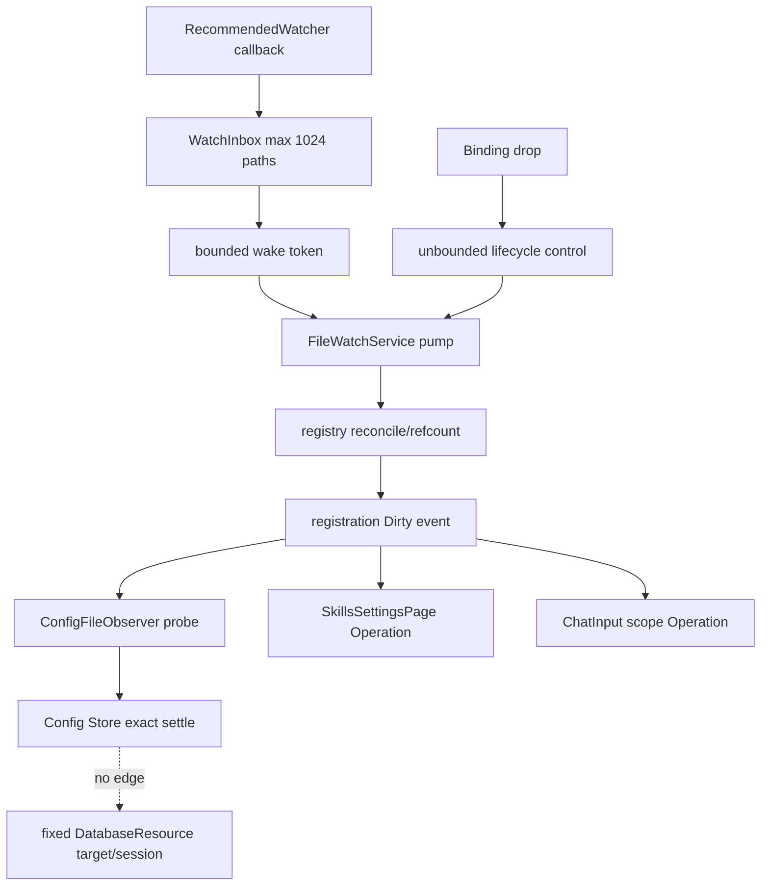

# Issue #178：Jaco 外部文件监听与固定数据目录实施计划

## 根计划与职责

- 状态：`Implemented on branch / 已在分支实施，等待原生/人工/CI验证`。本 owner 的路径、数据库、监听服务、消费者状态机与错误处理已落地；原生 smoke、人工/bundle 与跨平台 CI 尚未完成。
- Plan ID：`issue-178`
- 关联 issue：[#178](https://github.com/suxiaoshao/gpui/issues/178)
- 根计划：[workspace Issue #178 计划](../../../../../docs/dev/issue-178/README.md)
- Owner 目录：`app/jaco`
- Owner 计划：`app/jaco/docs/dev/issue-178/README.md`
- Jaco 开发文档索引：[开发计划](../README.md)
- Root-owned IDs：`S-*`、`E-01`–`E-18`、`D-01`–`D-10`、`C-01`–`C-02`、
  `ERR-01`–`ERR-04`、`R-01`–`R-12`、`T-01`–`T-12`、`F-01`–`F-03`、
  `G-01`、`WP-01`–`WP-02`
- Owner-local IDs：`E-101`–`E-124`、`D-101`–`D-114`、`F-101`–`F-129`、
  `L-101`–`L-115`、`ST-101`–`ST-110`、`R-101`–`R-116`、`T-101`–`T-116`
- Assigned WPs：`WP-101`–`WP-105`
- 实施引用：`codex/178-jaco-monitor-external-file-backed-state-changes`；提交与 PR 见 GitHub 分支历史

本文只定义 Jaco owner 内的实施细节。共享范围、依赖选择、跨 owner 顺序、`C-*`、`ERR-*`、
聚合验证和完成证据由根计划唯一维护；本文消费这些定义，不另起一套含义。

## 子任务

| ID | 子任务 | 状态 | 工作包 | 前置与交接 | 实施引用 |
| --- | --- | --- | --- | --- | --- |
| `JACO-178-01` | 固定 config/data 路径并移除数据库动态 target | `Implemented on branch` | `WP-101` | root `D-01`、`D-02`、`C-02` | `src/foundation/paths.rs`、`src/database.rs`；paths/database focused tests |
| `JACO-178-02` | app-lifetime FileWatchService 与 backend/registry | `Implemented on branch` | `WP-102` | root `D-03`–`D-06`、`C-01`、`ERR-01` | `src/app/file_watch.rs`、`src/app.rs`；deterministic file-watch tests（16 passed） |
| `JACO-178-03` | Config observer、删除恢复与并发草稿安全 | `Implemented on branch` | `WP-103` | `WP-101`、`WP-102`、root `ERR-03`、`ERR-04` | `src/state/config.rs`、`src/state/config/mcp.rs`、`src/features/settings/mcp/dialog.rs`；config/OAuth focused tests |
| `JACO-178-04` | Settings/ChatInput Skill 自动刷新 | `Implemented on branch` | `WP-104` | `WP-102`、root `D-10` | `src/features/settings/skills.rs`、`src/components/chat/input.rs`、`src/features/skills.rs`；consumer focused tests |
| `JACO-178-05` | warning、i18n、历史设计与 owner 验证 | `Implemented on branch` | `WP-105` | `WP-101`–`WP-104` | `locales/{en-US,zh-CN}/main.ftl`、app/history docs；Jaco clippy `-D warnings`通过 |

## Owner-local 证据

### 实施前流程基线

以下基线保留用于追溯 `E-*` 与 `D-*` 的依据；当前实现状态与验证结果见本文顶部子任务表及根计划“完成证据”。

1. `app.rs::init` 先安装 Config Store，随后初始化 layout、database 和 features；
   `quit_app` 在 `AppShutdownPhase::Draining` 后关闭 runtime、保存 layout 并退出。
2. `state/config.rs` 当前同时拥有 `CONFIG_DIR_ENV`、`StorageConfig`、`ConfigData.data_dir`、
   路径词法归一化、配置原始 bytes、atomic compare/write 与 repair Operation。
3. `database.rs` 的 `SelectDatabaseTarget`、`DatabaseConfigObserver` 和 `sync_target` 把
   Config publication 连接到 DatabaseResource/session 替换；数据库 helper 还会检查 Config 必须 Ready。
4. conversation、attachment 和 scratch project 通过 `config::data_dir(cx)` 取得数据根；
   layout 则通过 `JacoConfig::config_dir()` 读写 `state.toml`。
5. `SkillsSettingsPage::start_skill_load` 在 Operation running 时直接返回；`ChatInputController`
   每次加载都会替换 Operation 并清空 composer Skill entries。
6. MCP dialog 已保存 `original_config`，但当前流程会先删除 OAuth credential，再调用
   `upsert_mcp_server`；CAS 或 byte conflict 可以发生在 credential 已被删除之后。

### 证据登记

| E-ID | 当前事实 | 代码证据 | 计划后果 |
| --- | --- | --- | --- |
| `E-101` | Jaco 已有 `foundation.rs` 子模块入口，且仓库禁止新增 `mod.rs` | `src/foundation.rs`、仓库 `AGENTS.md` | 路径边界放 `foundation/paths.rs` |
| `E-102` | `JacoConfig::config_dir` 读取 `JACO_CONFIG_DIR` 并有创建目录副作用 | `state/config.rs::{config_dir,override_dir_from_value}` | 拆成纯解析 helper；创建由使用方负责 |
| `E-103` | `StorageConfig` 与 `ConfigData.data_dir` 决定 DB target | `state/config.rs::{JacoConfig,StorageConfig,ConfigData,data_from_value}` | 完整删除 storage/data target |
| `E-104` | DB resource 有 `AwaitingConfig`/`Bound` 两种 owner 状态 | `database.rs::DatabaseResource` | 收敛成单固定 target 结构 |
| `E-105` | Config observer会动态替换 DB target/session | `database.rs::{SelectDatabaseTarget,DatabaseConfigObserver,sync_target,start_initial_open}` | 删除全部 Config→DB edge |
| `E-106` | DB command helper通过 `ensure_config_ready` 依赖 Config Ready | `database.rs::{is_ready,ensure_config_ready,ready_executor,ready_agent_persistence}` | helper只检查shutdown与DB Ready |
| `E-107` | 多个 UI/feature match `AwaitingConfig` | `app.rs`、`components/resource.rs`、`features/{home/root,settings,temporary}.rs` | 随单结构资源一起收敛 |
| `E-108` | data root消费者仍经 Config Store | `features/conversation.rs`、`features/conversation/attachments.rs`、`state/projects.rs` | 改用 `foundation::paths::data_dir` |
| `E-109` | `state.toml` 有本地 Entity/save debounce，无外部订阅 | `state/layout.rs` | 只换路径 helper，不加 watcher |
| `E-110` | app已有 Entity+私有 Global 与 Subscription owner 范式 | `state/{mcp,theme}.rs`、`features/conversation/resources.rs` | service/observer按同一生命周期实现 |
| `E-111` | GPUI Task drop取消；Subscription drop可执行注销 guard | 当前锁定 GPUI API | pump/probe Task必须由 owner强持有 |
| `E-112` | Jaco 已直接依赖 `smol 2.0.2` | `app/jaco/Cargo.toml` | 复用 bounded/unbounded channel，不加 channel crate |
| `E-113` | Config保存后的 `source_bytes` 等于成功提交的磁盘 bytes | `state/config.rs::{commit_update,write_pending_at}` | probe与当前 bytes相等即可抑制 self-write |
| `E-114` | missing config当前用 `expected=None` 原子写默认，但 `AlreadyExists` 被映射为外部冲突 | `state/config.rs::{load_for_operation,write_pending_at}` | missing-create竞态必须重新读现存文件 |
| `E-115` | Config Operation支持 Ready/Degraded/Unavailable与 Reload/repair | `state/config.rs::{ConfigOperation,request_reload,request_repair}` | 外部 probe复用相同结果语义，不新增 Store |
| `E-116` | Settings Skill running时丢弃新请求 | `features/settings/skills.rs::start_skill_load` | 增加本地 `pending_dirty` |
| `E-117` | ChatInput只用 scope equality拒绝旧结果 | `components/chat/input.rs::{refresh_skill_catalog,load_skill_catalog}` | 增加binding、generation与same-scope refresh |
| `E-118` | project scope的scan会同时包含global与project Skill | `features/skills.rs`、`jaco-agent/src/skills.rs` | project binding必须同时含两个logical target |
| `E-119` | Agent runtime每次运行重新scan/load Skill | `jaco-agent/src/runtime.rs`、`skills.rs` | 不修改jaco-agent或建立共享Skill Store |
| `E-120` | Chat run-settings event目前把model/reasoning/approval三字段一起写回 | `components/chat/input.rs::save_chat_form_config` | 按FormEvent impact只patch变化字段 |
| `E-121` | 普通app settings保存已从最新Ready data执行局部closure | `state/config.rs::update_app_settings` 与callers | 保留该模式；不重置打开控件 |
| `E-122` | MCP dialog保存原fragment，但upsert只检查重复ID | `features/settings/mcp/dialog.rs`、`state/config/mcp.rs::upsert_mcp_server` | 增加fragment CAS |
| `E-123` | MCP保存先删credential、后commit config | `features/settings/mcp/dialog.rs::delete_oauth_credentials_for_save` | 反转顺序，cleanup改为commit后的app task |
| `E-124` | main Root已有非阻塞Notification与窗口发现入口 | `app.rs::{find_main_window,show_or_create_main_window}`、`features/home/root.rs` | watcher warning延迟到首个可用main Root |

## Owner-local 决定

| D-ID | 决定 | 依据 | 放弃的方案 | 实施落点 |
| --- | --- | --- | --- | --- |
| `D-101` | 新建无Store依赖的 `foundation::paths`；解析函数无创建副作用，测试用显式base/override helper | `E-101`–`E-103`、root `C-02` | 路径留在ConfigData；测试并发改进程env | `F-102`、`F-103` |
| `D-102` | DB在启动时解析一次固定target；`DatabaseResource`只含该target和Operation；data root无法解析/创建时启动返回明确错误 | `E-104`–`E-108` | AwaitingConfig、target-unavailable重试、运行时重新解析 | `F-106`、`F-110`–`F-117` |
| `D-103` | FileWatchService是app-lifetime `Entity` + typed private `Global`，不进入`gpui-store` | `E-110`、`E-111`、root `D-06` | 每消费者一个native watcher；Store持backend/task | `F-104`、`F-105` |
| `D-104` | 一个registration可以含多个logical targets；actual roots按path/mode引用计数，binding drop只注销自己的registration | root `C-01` | consumer闭包存进registry；每target独立watcher | `L-103`–`L-105`、`ST-101` |
| `D-105` | native callback写上限1024路径的共享inbox并向容量1 wake channel发token；注销使用独立unbounded control channel | root `D-06`、`ERR-01` | raw event大队列；注销与事件共用bounded channel | `L-106`、`ST-102` |
| `D-106` | Draining后立即显式停止registration、backend与pump；shutdown幂等，late binding drop静默 | `E-111`、root `D-08` | 依赖Entity/Global最终析构 | `F-104`、`F-105`、`ST-103` |
| `D-107` | service只记录/发布`FileWatchProblem`；独立warning owner管理pending/shown和窗口通知 | `E-124`、root `ERR-01` | service直接依赖consumer数据或阻塞启动 | `L-107`、`ST-104` |
| `D-108` | `ConfigFileObserver`持binding、probe Task、Config subscription和pending flag；probe结果不二次读文件 | `E-113`–`E-115` | 每事件直接request_reload并双读；watch thread写Store | `F-107`、`L-108`、`ST-105` |
| `D-109` | missing config创建默认前先建父目录；`expected=None`遇`AlreadyExists`立即读取/解析胜出的文件 | `E-114`、root `D-07` | remove event立即reset；把创建竞态报ExternalChange | `F-107`、`ST-106` |
| `D-110` | 打开草稿不自动rebase；普通即时控件只patch受影响字段；MCP entry按original fragment做CAS，credential cleanup后置 | `E-120`–`E-123`、root `D-09` | 保存整段旧snapshot；同entry盲merge；先删凭据 | `F-107`、`F-108`、`F-120`、`F-122`、`F-123` |
| `D-111` | Skills Settings只注册global tree，running期间折叠为一次follow-up | `E-116`、root `D-10` | running时丢事件或取消当前refresh | `F-119`、`ST-108` |
| `D-112` | ChatInput的Global binding含global target；Project binding含global+当前project target；scope change换binding并递增generation | `E-117`–`E-119` | scope equality单独防陈旧；全app共享Skill projection | `F-120`、`F-121`、`ST-109` |
| `D-113` | `state.toml`、SQLite、prompts、providers、shortcuts、projects和attachments不注册logical target | root `D-05` | 通用file-backed-state watcher | `F-105`、`F-118`、`ST-110` |
| `D-114` | macOS config/data base当前同目录，但路径语义仍分开；删除整个app目录可能同时删除SQLite，本issue只恢复config | root `C-02` | 宣称目录删除无数据损失或恢复DB | 文档、测试与人工验收 |

## Owner-local 目标设计

### 文件与产物拓扑

| F-ID | 动作 | 路径 | Artifact | 来源/消费者与边界 |
| --- | --- | --- | --- | --- |
| `F-101` | Modify | `app/jaco/Cargo.toml` | handwritten manifest | 声明`notify-debouncer-full = "0.7.0"`；lock由root `G-01`生成 |
| `F-102` | Modify | `app/jaco/src/foundation.rs` | handwritten module entry | 增加`pub(crate) mod paths;` |
| `F-103` | Add | `app/jaco/src/foundation/paths.rs` | handwritten Rust | config/data/path纯解析与测试helper |
| `F-104` | Modify | `app/jaco/src/app.rs` | handwritten Rust | file_watch module、init/shutdown、warning flush、DB单结构match |
| `F-105` | Add | `app/jaco/src/app/file_watch.rs` | handwritten Rust | service/backend/registry/binding/warning owner及其测试 |
| `F-106` | Modify | `app/jaco/src/errors.rs` | handwritten Rust | data-dir启动错误与`ConfigEditConflict` |
| `F-107` | Modify | `app/jaco/src/state/config.rs` | handwritten Rust | 删除storage/data_dir；路径helper；observer/probe/missing race/field patch |
| `F-108` | Modify | `app/jaco/src/state/config/mcp.rs` | handwritten Rust | `upsert_mcp_server_if_unchanged` CAS |
| `F-109` | Modify | `app/jaco/src/state/config/tests.rs` | handwritten tests | serialization/path/reload/CAS/field merge回归 |
| `F-110` | Modify | `app/jaco/src/database.rs` | handwritten Rust/tests | 单target resource、删除observer/rebind/config gate |
| `F-111` | Modify | `app/jaco/src/components/resource.rs` | handwritten Rust | 删除`AwaitingConfig` projection |
| `F-112` | Modify | `app/jaco/src/features/home/root.rs` | handwritten Rust | DB单结构projection；保留existing notices |
| `F-113` | Modify | `app/jaco/src/features/settings.rs` | handwritten Rust | DB单结构projection |
| `F-114` | Modify | `app/jaco/src/features/temporary.rs` | handwritten Rust | DB单结构projection |
| `F-115` | Modify | `app/jaco/src/features/conversation.rs` | handwritten Rust | conversation data root改paths |
| `F-116` | Modify | `app/jaco/src/features/conversation/attachments.rs` | handwritten Rust | attachment root改paths |
| `F-117` | Modify | `app/jaco/src/state/projects.rs` | handwritten Rust | scratch root改paths |
| `F-118` | Modify | `app/jaco/src/state/layout.rs` | handwritten Rust/tests | state path改paths；继续只本地save、不监听 |
| `F-119` | Modify | `app/jaco/src/features/settings/skills.rs` | handwritten Rust/tests | global binding、pending dirty、follow-up refresh |
| `F-120` | Modify | `app/jaco/src/components/chat/input.rs` | handwritten Rust/tests | Skill binding/generation与Chat field-level save |
| `F-121` | Modify | `app/jaco/src/features/skills.rs` | handwritten Rust/tests | 唯一global/project Skill root path helper；scan/load不变 |
| `F-122` | Modify | `app/jaco/src/features/settings/mcp/dialog.rs` | handwritten Rust/tests | fragment CAS UI、commit-first、cleanup调度 |
| `F-123` | Modify | `app/jaco/src/state/mcp/oauth.rs` | handwritten Rust/tests | app-context credential cleanup helper |
| `F-124` | Modify | `app/jaco/locales/en-US/main.ftl` | handwritten Fluent | watcher/conflict/cleanup文案 |
| `F-125` | Modify | `app/jaco/locales/zh-CN/main.ftl` | handwritten Fluent | 与en-US同key |
| `F-126` | Modify | `app/jaco/docs/dev/README.md` | handwritten index | `Ready`→实施状态同步 |
| `F-127` | Modify | `app/jaco/docs/dev/issue-178/README.md` | handwritten plan | 本文状态与完成证据 |
| `F-128` | Modify | `app/jaco/docs/dev/issue-177/README.md` | historical plan note | 标明data-dir/rebind由#178取代 |
| `F-129` | Modify | `app/jaco/docs/dev/issue-175/temporary-window-runtime.md` | historical smoke note | `JACO_CONFIG_DIR`已直接隔离data root，无storage设置 |

无文件删除；无Diesel migration/schema、资源asset、bundle plist、bootstrap、`jaco-agent`或
`gpui-store`变更。

### 目标声明

#### L-101：路径边界

```rust
pub(crate) const CONFIG_DIR_ENV: &str = "JACO_CONFIG_DIR";
pub(crate) const CONFIG_FILE_NAME: &str = "config.toml";
pub(crate) const STATE_FILE_NAME: &str = "state.toml";

pub(crate) fn config_dir() -> JacoResult<PathBuf>;
pub(crate) fn config_file() -> JacoResult<PathBuf>;
pub(crate) fn state_file() -> JacoResult<PathBuf>;
pub(crate) fn data_dir() -> JacoResult<PathBuf>;
pub(crate) fn database_file() -> JacoResult<PathBuf>;
pub(crate) fn normalize_lexically(path: PathBuf) -> PathBuf;

#[cfg(test)]
fn roots_from(
    override_dir: Option<OsString>,
    config_base: Option<PathBuf>,
    data_base: Option<PathBuf>,
) -> JacoResult<(PathBuf, PathBuf)>;
```

- 非空override令config/data root完全相同；空值等同未设置。
- production分别在dirs-next config/data base下追加`APP_NAME`。
- 函数只解析，不`create_dir_all`、不读Config Store、不canonicalize。
- config load/default create与layout save负责config parent；DatabaseTarget负责data root；
  attachment/scratch继续负责自己的子目录。

#### L-102：固定数据库资源

```rust
#[derive(Clone, Debug, Eq, Hash, PartialEq)]
pub(crate) struct DatabaseTarget {
    pub(crate) data_dir: PathBuf,
    pub(crate) database_path: PathBuf,
}

pub(crate) struct DatabaseResource {
    pub(crate) target: DatabaseTarget,
    pub(crate) operation: DatabaseOperation,
}

impl DatabaseTarget {
    fn resolve_and_prepare() -> JacoResult<Self>;
}

pub(crate) fn init_store(cx: &mut App) -> JacoResult<()>;
```

- `resolve_and_prepare`只调用`foundation::paths::data_dir/database_file`并创建data root。
- target安装后整个app lifetime不替换；Open/Refresh/Repair只改变同一Operation。
- `SelectDatabaseTarget`、`DatabaseConfigObserver*`、`sync_target`、`start_initial_open`、
  `AwaitingConfig`与`ensure_config_ready`全部删除。
- `database::is_ready`与command helper只检查shutdown和DB exact Ready；
  `app::critical_resources_ready`继续显式组合Config Ready与DB Ready。

#### L-103：logical target与registration

```rust
#[derive(Clone, Copy, Debug, Eq, Hash, PartialEq)]
pub(crate) enum FileWatchTargetKind {
    ExactFile,
    DirectoryTree,
}

#[derive(Clone, Debug, Eq, Hash, PartialEq)]
pub(crate) struct FileWatchTarget {
    kind: FileWatchTargetKind,
    logical_path: PathBuf,
}

#[derive(Clone, Copy, Debug, Eq, Hash, PartialEq)]
struct WatchRegistrationId(u64);

#[derive(Clone, Debug)]
enum FileWatchEvent {
    Dirty { registration_id: WatchRegistrationId },
    Problem(FileWatchProblem),
}
```

- constructors只接受词法归一化后的absolute path；目标可以尚不存在。
- registration持一个或多个targets；一个debounce batch对同一registration最多emit一次Dirty。
- registry不保存consumer闭包；event subscription按registration ID过滤。

#### L-104：service、backend与binding

```rust
type SystemDebouncer = Debouncer<RecommendedWatcher, RecommendedCache>;

pub(crate) struct FileWatchBinding {
    registration_id: Option<WatchRegistrationId>,
    _event_subscription: Subscription,
    _unregister_subscription: Subscription,
}

pub(crate) struct FileWatchService {
    backend: Option<Box<dyn FileWatchBackend>>,
    registry: WatchRegistry,
    inbox: Arc<Mutex<WatchInbox>>,
    control_tx: Sender<WatchControl>,
    initial_problem: Option<FileWatchProblem>,
    stopped: bool,
    _pump_task: Task<()>,
}

impl EventEmitter<FileWatchEvent> for FileWatchService {}

trait FileWatchBackend: Send {
    fn watch(&mut self, root: &Path, mode: RecursiveMode) -> Result<(), notify::Error>;
    fn unwatch(&mut self, root: &Path) -> Result<(), notify::Error>;
    fn shutdown(&mut self);
}

pub(crate) fn init(cx: &mut App);
pub(crate) fn shutdown(cx: &mut App);
pub(crate) fn exact_file(path: PathBuf) -> Result<FileWatchTarget, FileWatchProblem>;
pub(crate) fn directory_tree(path: PathBuf) -> Result<FileWatchTarget, FileWatchProblem>;
pub(crate) fn bind<T: 'static>(
    targets: Vec<FileWatchTarget>,
    cx: &mut Context<T>,
    on_dirty: impl Fn(&mut T, &mut Context<T>) + 'static,
) -> FileWatchBinding;
```

- backend production实现使用`new_debouncer(Duration::from_millis(300), None, callback)`；
  tick为75ms，通过full crate的notify re-export调用RecommendedWatcher API。
- backend初始化/注册失败时`bind`返回可drop的inert binding并报告Problem，consumer仍可构造。
- `FileWatchServiceGlobal(Entity<FileWatchService>)`为private Global；service Entity强持有pump Task。
- `report_problem` 在GPUI foreground执行structured log、保留init阶段首个
  `initial_problem`，并`cx.emit(FileWatchEvent::Problem(problem))`；binding只订阅/过滤
  `Dirty`，warning owner只订阅`Problem`。

#### L-105：registry与actual root

```rust
struct WatchRegistry {
    next_registration_id: u64,
    registrations: HashMap<WatchRegistrationId, RegistrationEntry>,
    roots: HashMap<PathBuf, RootEntry>,
}

struct RegistrationEntry {
    targets: Vec<TargetEntry>,
}

struct TargetEntry {
    target: FileWatchTarget,
    actual_roots: Vec<(PathBuf, RootRequirement)>,
}

#[derive(Clone, Copy, Debug, Eq, PartialEq)]
struct RootRequirement {
    mode: RecursiveMode,
}

struct RootEntry {
    non_recursive_refs: usize,
    recursive_refs: usize,
    active_mode: RecursiveMode,
}
```

path identity只用词法归一化`PathBuf`，不得依赖canonicalization。

#### L-106：有界事件入口与可靠控制入口

```rust
const DEBOUNCE_TIMEOUT: Duration = Duration::from_millis(300);
const WAKE_CHANNEL_CAPACITY: usize = 1;
const MAX_PENDING_PATHS: usize = 1024;

struct WatchInbox {
    paths: BTreeSet<PathBuf>,
    rescan_all: bool,
    runtime_problem: Option<FileWatchProblem>,
}

enum WatchControl {
    Unregister(WatchRegistrationId),
}
```

- callback先写inbox，再`try_send(())`；Full表示已有wake，设置`rescan_all=true`。
- 超过路径上限、`DebouncedEvent::need_rescan()`、无可靠path的notify error同样all-dirty。
- control channel使用`smol::channel::unbounded`，只承载registration lifecycle；
  binding drop发送失败只说明service已shutdown。

#### L-107：一次warning owner

```rust
struct FileWatchWarningOwner {
    pending: bool,
    shown: bool,
    _subscription: Subscription,
}

#[derive(Clone)]
struct FileWatchWarningOwnerGlobal(Entity<FileWatchWarningOwner>);
impl Global for FileWatchWarningOwnerGlobal {}

fn init_warning_owner(
    service: Entity<FileWatchService>,
    cx: &mut App,
);

pub(crate) fn flush_pending_warning(
    window: &mut Window,
    cx: &mut App,
);
```

- `file_watch::init` 先构造service并安装`FileWatchServiceGlobal`，再用service的
  `initial_problem` 创建warning owner/订阅并安装`FileWatchWarningOwnerGlobal`，最后启动pump；
  因此init failure和后续runtime failure都不会落在订阅空窗。
- service负责structured log与Problem event；warning owner不改变任何Config/Skill data。
- 初始化失败令owner初始`pending=true`；后续Problem subscription只在`shown=false`时设置pending。
- main Root不存在时保留pending；显示一次后`shown=true`，后续仅日志。

#### L-108：Config observer与probe

```rust
struct ConfigFileObserver {
    _binding: FileWatchBinding,
    _config_subscription: Subscription,
    probe_task: Option<Task<()>>,
    pending_dirty: bool,
}

struct ConfigProbeStart {
    source_bytes: Option<Vec<u8>>,
}

type ConfigProbeResult = Result<ConfigData, ConfigProblem>;

pub(crate) fn init_file_observer(cx: &mut App);
fn load_or_create_for_observer(path: &Path) -> ConfigProbeResult;
fn apply_observed_probe(
    start: ConfigProbeStart,
    result: ConfigProbeResult,
    cx: &mut App,
);
```

- observer是app-lifetime Entity+private Global；probe Task只由observer持有。
- binding建立后立即probe，关闭startup load→watch gap。
- dirty时若probe或Config Operation running，只置`pending_dirty`。
- completion先取“当前”ConfigData bytes：结果bytes相等则完全静默；当前bytes较start已变化则丢弃旧结果并再probe；
  其他结果用精确读取结果settle Operation，不二次读取磁盘。
- 每次probe或显式Config Operation结束后最多消费一个pending；持续事件可在下一轮再置pending。

#### L-109：Config语义冲突

```rust
#[derive(Clone, Debug, Eq, PartialEq, thiserror::Error)]
pub(crate) enum ConfigEditConflict {
    McpServerChanged { server_id: String },
    McpServerRemoved { server_id: String },
    McpServerIdOccupied { server_id: String },
}

pub(crate) fn upsert_mcp_server_if_unchanged(
    cx: &mut App,
    original_server_id: Option<&str>,
    expected_original: Option<&McpServerTomlConfig>,
    server_id: String,
    server: McpServerTomlConfig,
) -> JacoResult<()>;
```

- `JacoError` 增加 `ConfigEditConflict(#[from] ConfigEditConflict)`，让 dialog 可以 typed match；
  普通 config error 仍走原有 variant。
- Create要求latest中target ID不存在。
- Edit要求latest original entry与dialog baseline完全相等。
- Rename同时要求original未变且new ID空闲。
- 其他Config字段/其他MCP entry变化从latest data保留；磁盘在读取后再变仍由
  `ConfigProblem::ExternalChange`阻止覆盖。

#### L-110：Settings Skill owner字段

```rust
pub(super) struct SkillsSettingsPage {
    // existing fields
    _watch_binding: FileWatchBinding,
    pending_dirty: bool,
}
```

#### L-111：ChatInput Skill owner字段

```rust
pub(crate) struct ChatInputController {
    // existing fields
    skill_watch_binding: FileWatchBinding,
    pending_skill_dirty: bool,
    skill_load_generation: u64,
}
```

#### L-112：Chat config字段patch

```rust
#[derive(Clone, Debug)]
enum ChatFormFieldPatch {
    Model(Option<ChatFormModelConfig>),
    ReasoningSelection(Option<ReasoningSelectionSnapshot>),
    ApprovalMode(ToolApprovalMode),
}
```

一次FormEvent可形成多个patch；每个patch只改latest `ChatFormConfig`的对应字段。

#### L-113：Fluent keys

| Key | en-US | zh-CN |
| --- | --- | --- |
| `file-watch-unavailable-title` | External file monitoring is unavailable | 外部文件监听不可用 |
| `file-watch-unavailable-message` | Jaco may not detect changes made outside the app. Use Refresh to reload files. | Jaco 可能无法检测应用外的修改。请使用刷新操作重新加载文件。 |
| `mcp-notify-save-conflict-title` | MCP server changed outside Jaco | MCP 服务器已在 Jaco 外部发生变化 |
| `mcp-notify-save-conflict-message` | Your draft was kept. Close and reopen the editor to review the latest configuration before saving again. | 草稿已保留。请关闭并重新打开编辑器，查看最新配置后再保存。 |
| `mcp-notify-credential-cleanup-failed` | The MCP server was saved, but old OAuth credentials could not be removed. | MCP 服务器已保存，但旧 OAuth 凭据未能清理。 |

#### L-114：init/shutdown顺序

```text
state::config::init
→ foundation::init_i18n
→ file_watch::init
→ state::config::init_file_observer
→ state::layout::init
→ database::init_store?
→ remaining state/features

AppShutdownStore = Draining
→ file_watch::shutdown
→ hotkey/features/runtime/layout shutdown
```

`database::init_store(cx)?`的target path错误终止startup；数据库文件open/schema错误仍进入既有
DatabaseOperation Unavailable与恢复UI。

#### L-115：credential cleanup task

- config CAS成功后，先更新dialog baseline/runtime与成功反馈，再异步删除不再引用的credential keys。
- cleanup使用可从`AsyncApp`调用的OAuth helper，Task交给`app::tasks::retain_application`，
  不由会关闭的dialog持有。
- cleanup失败不回滚config；记录key数量与error category，不记录credential内容；若窗口存在则显示
  `mcp-notify-credential-cleanup-failed` warning。

### 状态与生命周期契约

#### ST-101：frontier、refcount与事件相关性

1. `ExactFile(config.toml)`的desired actual root是文件parent、`NonRecursive`。
2. `DirectoryTree(<root>/.agents/skills)`的desired actual root是target parent
   `<root>/.agents`、`Recursive`；不得递归监听整个home/project。
3. desired root存在时，同时保留其mode与`desired_root.parent()`的deepest existing ancestor
   `NonRecursive` recovery anchor；相同path需求合并。
4. desired root不存在时，只监听该路径链上deepest existing directory`NonRecursive` frontier。
5. 每个wake batch先重新计算所有registration frontier，再路由dirty。frontier改变本身令所属
   registration dirty。
6. root path改变时先watch新root再释放旧root；同path mode升/降需
   `unwatch → watch(new mode)`，失败时尝试恢复old mode且不伪造active state。
7. 同path Recursive需求支配NonRecursive；最后ref drop才unwatch。
8. target首次注册是transaction：失败只回滚该registration新增的ref/watch，不移除其他registration
   共享root。
9. ExactFile相关路径为logical path自身或其ancestor；DirectoryTree为相等、ancestor或descendant；
   rename的from/to全部参与。无frontier改变的unrelated sibling不dirty。

#### ST-102：event pump、overflow与publication

- callback线程只锁`WatchInbox`，不访问App/Entity/Store。
- pump在GPUI foreground drain inbox、处理全部control、reconcile registry，再emit unique
  registration Dirty。
- Full、路径上限、need_rescan和无path error都对当时全部registration dirty；Full只调用
  `tracing::warn!`，不生成`FileWatchProblem`，不产生用户Notification。
- inbox写发生在wake前；Full说明已有pending wake，因此dirty不会永久搁置。
- callback观察到channel Closed且service stopping时静默；其他runtime failure进入root`ERR-01`。

#### ST-103：binding与shutdown

- binding同时持event subscription与unregister guard；drop先阻止consumer callback，再可靠发送unregister。
- unregister由pump串行处理并递减root refs；service shutdown后late unregister send失败是no-op。
- shutdown设置`stopped=true`，拒绝新registration，清registry/roots，backend
  `stop_nonblocking`，关闭sender/receiver，并drop retained pump Task；重复调用无副作用。
- 退出期间不再向consumer发布dirty。

#### ST-104：watcher失败

- 初始化、watch、unwatch/reconcile、runtime error只影响自动刷新能力。
- consumer保留last-good data、manual Reload/Refresh和现有错误UI；不进入Polling fallback。
- 第一个失败触发进程一次generic warning；每次失败都有structured log。

#### ST-105：Config observer one-in-flight

| 当前状态 | watcher dirty处理 | completion |
| --- | --- | --- |
| Config terminal、无probe | 启动background probe | 对当前bytes做stale/self-write检查后settle精确结果 |
| probe running | `pending_dirty=true` | 当前轮结束后最多再probe一次 |
| Config explicit Refresh/Repair running | `pending_dirty=true` | Store subscription在terminal后启动probe |
| observer/service shutdown | 忽略 | Task drop取消，不发布 |

外部reload不写入任何Form/Input entity；Config Store和既有runtime observers可以更新theme/i18n/hotkey等
committed projection。

#### ST-106：config missing/replace算法

1. debounce后`fs::read(config.toml)`。
2. `NotFound`时`create_dir_all(parent)`。
3. 序列化默认值并用`expected=None`原子创建。
4. 创建成功：应用默认ConfigData。
5. `AlreadyExists`：外部原子replace在read/create间获胜，立即read+decode现存文件。
6. 其他创建错误：有last-good则Degraded，无data则Unavailable；不得覆盖外部文件。
7. invalid TOML直接Parse problem并保留last-good；不当作missing。

transient remove+rename必须应用replacement；持续缺失才重建默认；config目录整体删除遵循同一算法。

#### ST-107：Config草稿与save

- 外部publication不调用Form`replace/rebase`。
- app settings现有局部closure继续从latest Ready Data构造。
- Chat run-settings根据ModelChange对三个leaf key的impact形成patch；未受影响字段不从旧Form snapshot写回。
- MCP conflict前不写disk、不改变Config Operation、不删任何credential、不关闭dialog；
  draft与`original_config`保持，可由用户关闭重开。
- byte-level ExternalChange同样保留draft，但使用既有save-failed/reload路径。

#### ST-108：Settings Skill refresh

- constructor注册global`~/.agents/skills` target并立即执行现有initial Load。
- dirty时Operation running只置pending；idle时按Idle→Load、Ready/Degraded→Refresh、
  Unavailable→Retry。
- completion先transition并同步rows/details；再消费一个pending。
- refresh失败保留refresh Operation已有data、search query与可显示rows。

#### ST-109：ChatInput Skill scope

- Global scope registration targets = `[global]`。
- Project scope registration targets = `[global, project/.agents/skills]`。
- scope改变：递增generation、替换binding、清旧pending、重建Operation、清旧scope composer entries、
  启动新scope Load。
- same scope manual/watch refresh：不换binding、不重建Operation、不清entries；running时合并成一个follow-up。
- completion同时匹配scope与generation；A→B→A旧A结果也必须被拒绝。
- refresh失败保留旧entries；新scope初始Load失败可以显示空entries+既有problem。

#### ST-110：明确不监听的authority

- layout Entity仍是runtime`state.toml` authority；外部修改/删除不改变内存state，后续Jaco save可覆盖它。
- DB session/SQLite不注册watcher；Config reload不替换target/session。
- prompts/providers/shortcuts/projects/attachments仍由各自现有Store/Operation/command管理。
- macOS若用户删除共同的Application Support app目录，config watcher只重建默认config；
  SQLite删除或已打开session的后果不在本issue恢复范围。

### 数据流



### Operation phase到UI

| Owner | 自动事件中的phase行为 | last-good | 用户恢复 |
| --- | --- | --- | --- |
| FileWatchService | 无业务Operation；Problem只到warning owner | 所有consumer数据不变 | manual Reload/Refresh、重启 |
| Config observer | probe期间不改phase；changed completion精确settle为Ready/Degraded/Unavailable | invalid/read error沿repair Operation保留data | 既有Reload/Retry/Backup actions |
| Skills Settings | Ready/Degraded→Refreshing；Unavailable→Retrying | refresh error保留catalog/rows | 既有Refresh按钮 |
| ChatInput Skill | same scope同上；scope change使用新Load | same scope error保留entries | composer内Refresh按钮 |
| MCP save | conflict不转Config phase；成功走既有commit settle | dialog draft保留 | 关闭重开查看latest后再保存 |

### 安全、隐私、可观察性与平台

- 只监听root`D-05`允许的三类logical target；actual recovery anchor只扩大到一层稳定祖先，
  home/project只NonRecursive。
- watcher不读取/记录Config或Skill内容；路径和底层cause只进入本地structured log，generic UI不展示。
- credential日志禁止打印key正文、token、client secret或OAuth payload；只记录数量与error category。
- config原子写/lock协议继续由`foundation::persistence`负责；watcher不新增写路径。
- RecommendedCache在macOS/Windows可使用file-id，Linux可能为NoCache；测试只断言logical dirty，
  不断言backend EventKind、事件数量或顺序。
- 无网络、entitlement、bundle resource、native bootstrap与安装脚本变化。

## Owner-local 工作包

### WP-101：固定运行目录与数据库目标

**Owner**

Jaco foundation/config/database owners。

**前置**

root`D-01`、`D-02`、`C-02`；local`D-101`、`D-102`。

**实施顺序**

1. 完成`F-102`/`F-103`及pure path tests；把`CONFIG_DIR_ENV`从config移入paths。
2. 删除`StorageConfig`、`JacoConfig::storage`、`ConfigData.data_dir`、`ConfigProblem::Target`、
   `config::data_dir`与旧relative normalization tests；默认序列化不得出现`[storage]`。
3. config/layout切到`config_file/state_file`，各自显式保证写入parent。
4. DB改成`L-102`；删除Config selector/observer/rebind/AwaitingConfig/config gate；
   `app::init`使用`database::init_store(cx)?`。
5. 收敛`F-111`–`F-114`的enum matches；`critical_resources_ready`保留组合gate。
6. conversation/attachment/scratch切到`paths::data_dir`。
7. 更新受影响tests与`F-128`/`F-129`的定向说明，但不实现migration/lookup。

**错误/partial effect**

- config root解析失败继续进入Config Operation problem。
- data root无法解析/创建在Database Store安装前终止startup，不创建/移动任何DB文件。
- target解析成功但open/schema失败仍安装固定target的Unavailable Operation并使用既有repair。

**验证**

`T-101`–`T-104`。

**完成条件**

- 生产代码没有storage/data-target/rebind/AwaitingConfig命中；Config degraded时DB Entity/session identity不变。
- 本地实施：`src/foundation/paths.rs`、`src/database.rs` 及 conversation/attachment/scratch data consumers 已切换；`foundation::paths` 与 `database` focused tests 通过。

### WP-102：应用级文件监听服务

**Owner**

Jaco app/file-watch owner。

**前置**

root`D-03`–`D-06`、`C-01`、`ERR-01`；`F-101` manifest可先改，lock交root`WP-01`。

**实施顺序**

1. 添加`F-101`和`F-105` module/types，先实现fake backend与registry纯逻辑。
2. 实现`ST-101` registration transaction、root refcount、frontier reconcile、mode升降/rollback。
3. 实现`ST-102` inbox/wake/control pump，确保native callback不进入GPUI。
4. 接入full 0.7.0 backend、need_rescan/runtime error与`FileWatchProblem`。
5. 实现binding subscription/unregister和duplicate target/root共享。
6. 实现`ST-103` shutdown并接入`L-114`；增加late callback/drop测试。
7. 实现warning owner的problem event/pending状态；UI显示留`WP-105`。
8. 增加真实tempdir parent-watch + atomic replace smoke，断言registration dirty而非raw event。

**错误/partial effect**

- register transaction失败只撤销本registration增量；其他binding继续。
- mode切换失败恢复旧watch；无法恢复时准确移除active状态并Problem，不假装继续监听。
- overflow是dirty-all + `tracing::warn!`，不生成`FileWatchProblem`或用户Notification；
  backend failure才进入进程一次warning。

**验证**

`T-105`–`T-109`。

**完成条件**

- 一个backend实例服务所有consumer；refcount/frontier/overflow/drop/shutdown fake tests与real smoke通过。
- 本地实施：`src/app/file_watch.rs` 与 `src/app.rs` init/shutdown wiring 已落地；deterministic file-watch tests 通过（16 passed）。两个 macOS native smoke 仍默认 ignored，显式运行受 headless FSEvents 环境限制。

### WP-103：Config监听与并发编辑安全

**Owner**

Jaco Config/MCP/Form owners。

**前置**

`WP-101`、`WP-102`；root`D-07`、`D-09`、`D-10`、`ERR-03`、`ERR-04`。

**实施顺序**

1. 在config module实现`L-108` observer，并于watch service之后初始化；binding后立即probe。
2. 将load/default-create抽成`ST-106` race-safe helper，人工Reload与observer共用。
3. 实现probe start/current bytes检查、self-write静默、stale probe重试与pending follow-up。
4. 让observer完成用精确result settle；不二次`fs::read`，不从watch thread更新Store。
5. 调整Chat FormEvent处理为`L-112` leaf patch，并补external unrelated-field test。
6. 实现`L-109` MCP fragment CAS和typed conflict；dialog对conflict保留draft并显示专用文案。
7. 把credential cleanup移到成功commit之后的`L-115` app task；conflict/byte race不删除任何key。
8. 覆盖valid/invalid/delete/transient replace/目录删除/local-save-race/one-follow-up测试。

**错误/partial effect**

- invalid/read/create失败保留last-good；默认重建只发生在authoritative`NotFound`。
- semantic conflict无Config Operation/disk/credential副作用。
- config成功而cleanup失败属于已提交成功 + warning，不回滚。

**验证**

`T-110`–`T-113`。

**完成条件**

- self-write零publication；persistent delete重建默认；atomic replace不误重置；MCP conflict与credential顺序有测试证据。
- 本地实施：`src/state/config.rs`、`src/state/config/mcp.rs` 与 `src/features/settings/mcp/dialog.rs` 已落地；config observer、missing/replace、MCP CAS 与 credential cleanup focused tests 通过。真实 Config event 与 fake credential backend 端到端仍未验证。

### WP-104：Skill消费者监听

**Owner**

Jaco Settings/ChatInput/Skill projection owners。

**前置**

`WP-102`；root`D-05`、`D-06`、`D-10`。

**实施顺序**

1. 在`F-121`提供global与project Skill root path helper；consumer再调用
   `file_watch::directory_tree`，保持scan/load本身不变。
2. Settings实现`L-110`/`ST-108`，binding后保留现有initial load，watch/manual共用一个start入口。
3. ChatInput实现`L-111`/`ST-109`；constructor建立global binding。
4. `refresh_skill_catalog(project_root)`区分scope changed与same scope，项目切换先换binding/generation。
5. async completion同时校验generation+scope；完成后消费一个pending。
6. same-scope Refresh保留entries；scope-change Load才清旧scope entries。
7. 覆盖global/project create/modify/delete/rename、multiple ChatInput shared root、A→B→A stale和failure保留。

**错误/partial effect**

- watcher unavailable时manual按钮保持可用。
- scan/load error沿既有`SkillCatalogProblem`；service不复制problem或清数据。

**验证**

`T-114`、`T-115`。

**完成条件**

- Settings与每个ChatInput均最终看到相关外部变化；running events不丢，旧scope结果不污染新scope。
- 本地实施：`src/features/settings/skills.rs`、`src/components/chat/input.rs` 与 `src/features/skills.rs` 已落地；Settings/ChatInput consumer focused tests 通过。多 controller 的真实 GPUI event 链路仍未验证。

### WP-105：错误反馈与owner文档同步

**Owner**

Jaco app/i18n/docs owner。

**前置**

`WP-101`–`WP-104`。

**实施顺序**

1. 增加`F-124`/`F-125`的`L-113` keys并核对两locale key集合。
2. 在existing/new main window update成功后调用`flush_pending_warning`；later Problem defer一次flush。
3. 验证warning不抢焦点、不阻塞启动、每进程最多一次。
4. 更新`F-126`–`F-129`的状态/取代说明；不改历史实现证据。
5. 执行owner focused validation并把实际命令/结果回填本文；交接root`WP-01`/`WP-02`。

**验证**

`T-109`、`T-116`。

**完成条件**

- warning/conflict/cleanup文案双locale完整；owner docs可发现且不再宣称动态data-dir/rebind有效。
- 本地实施：两套 `main.ftl`、root/owner issue 文档、workspace/Jaco 索引及 #175/#177 定向历史说明已同步；Jaco clippy `-D warnings` 通过。warning UI、bundle/manual 与跨平台 CI 仍未验证。

## 聚焦验证与交接

| R-ID | Requirement | T-ID / evidence | 预期 |
| --- | --- | --- | --- |
| `R-101` | override下config/state/database同根，production config/data base分离 | `T-101` path pure unit tests | 路径精确且无env测试竞态 |
| `R-102` | 默认TOML无storage，旧storage不影响任何path | `T-102` config serialization/load tests | storage被忽略且下次save消失 |
| `R-103` | DB target/session不随Config phase/publication改变 | `T-103` GPUI Store identity tests | 无reopen/rebind，DB helper独立 |
| `R-104` | 所有app data consumer使用paths data root，state仍config root | `T-104` consumer/path tests + residual rg | 无`config::data_dir` |
| `R-105` | duplicate registrations共享watch，last drop才unwatch | `T-105` fake backend tests | refcount与transaction正确 |
| `R-106` | missing frontier推进、directory replacement与mode升降正确 | `T-106` registry reconcile tests | 不递归home/project，old root失败时保留 |
| `R-107` | path filtering/rename/overflow/need_rescan正确 | `T-107` inbox/routing tests | unrelated sibling不dirty；overflow all-dirty |
| `R-108` | shutdown/late drop/runtime error生命周期正确 | `T-108` fake backend + GPUI task tests | stop一次、无迟到publish |
| `R-109` | watcher failure非致命且warning一次 | `T-109` injected failure/UI owner test | data/manual可用，pending→shown一次 |
| `R-110` | external config与self-write publication正确 | `T-110` observer GPUI tests | external一次；self-write零次 |
| `R-111` | delete/replace/invalid/probe竞态最终正确 | `T-111` tempdir race tests | persistent delete默认，transient replacement胜出 |
| `R-112` | field patch与MCP CAS保留并发变化 | `T-112` config/form/MCP tests | unrelated保留；same entry conflict |
| `R-113` | conflict前不删credential，commit后cleanup失败不回滚 | `T-113` fake credential backend/order tests | side-effect顺序精确 |
| `R-114` | Settings watch in-flight coalescing保留catalog | `T-114` GPUI Operation tests | 一次follow-up、failure保留rows |
| `R-115` | ChatInput global/project/scope generation正确 | `T-115` GPUI multi-controller tests | A→B→A陈旧结果拒绝 |
| `R-116` | state/DB/其他排除、i18n/docs/residual一致 | `T-116` target inventory + commands | 无额外registration/残留 |

### 测试清单

- `T-101`：`override_paths_share_root`、
  `production_paths_use_distinct_config_and_data_bases`、
  `empty_override_uses_platform_bases`。
- `T-102`：`default_config_omits_storage_table`、
  `legacy_storage_table_does_not_change_database_target`。
- `T-103`：`config_degraded_does_not_replace_database_resource_or_session`、
  `database_helpers_require_only_database_ready`。
- `T-104`：attachment/conversation/scratch/layout path tests与residual search。
- `T-105`：`duplicate_registrations_share_backend_watch`、
  `dropping_last_binding_unwatches_shared_roots`、
  `registration_failure_rolls_back_only_new_refs`。
- `T-106`：`recursive_ref_promotes_and_demotes_root_mode`、
  `missing_tree_advances_frontier`、`directory_replacement_keeps_recovery_anchor`。
- `T-107`：`ancestor_and_rename_paths_dirty_target`、
  `unrelated_sibling_does_not_dirty`、`full_wake_marks_all_dirty`、
  `need_rescan_marks_all_dirty`。
- `T-108`：`shutdown_stops_backend_once`、`late_binding_drop_is_noop`、
  fake callback→pump→subscription一次且drop后零次。
- `T-109`：`warning_waits_for_root_and_is_shown_once`；backend init/watch/runtime三种failure。
- `T-110`：`external_valid_change_publishes_once`、`self_write_event_does_not_publish`、
  `initial_probe_closes_load_watch_gap`。
- `T-111`：`persistent_delete_recreates_default`、
  `atomic_replace_race_reads_winner`、`invalid_toml_preserves_last_good`、
  `local_save_during_probe_reprobes`、`in_flight_events_queue_one_follow_up`。
- `T-112`：`chat_field_patch_preserves_external_sibling_fields`、
  `mcp_same_entry_change_conflicts`、`mcp_other_entry_change_is_preserved`、
  `mcp_rename_rejects_occupied_target`。
- `T-113`：`mcp_conflict_does_not_delete_credentials`、
  `credential_cleanup_starts_after_config_commit`、
  `cleanup_failure_preserves_committed_config`。
- `T-114`：Settings global create/modify/delete与running follow-up/failure保留。
- `T-115`：ChatInput Global/Project target set、多个controller共享、same-scope refresh、
  project switch与A→B→A stale completion。
- `T-116`：state外部write/delete不改变runtime；target inventory只有三类；locale key parity；
  docs link/status/residual scans。

### Owner focused commands

实施后按工作包执行一次相应最小集合；最终owner handoff执行：

```bash
cargo fmt --all -- --check
cargo test -p jaco foundation::paths --locked
cargo test -p jaco app::file_watch::tests --locked
cargo test -p jaco state::config --locked
cargo test -p jaco database --locked
cargo test -p jaco skills --locked
cargo test -p jaco --locked
cargo check -p jaco --all-features --locked
cargo clippy -p jaco --all-targets --all-features --locked -- -D warnings
git diff --check
rg -n "StorageConfig|storage\.data_dir|ConfigData::data_dir|config::data_dir|SelectDatabaseTarget|DatabaseConfigObserver|AwaitingConfig|sync_target" app/jaco/src
```

真实backend tempdir smoke最多等待5秒，只断言logical registration dirty；三平台完成证据由root
`T-11`/`WP-02`汇总。bundle人工验证沿用root场景，不在owner计划提前写成通过。

### 交接

- `WP-101`完成后把manifest以外的path/DB结果与residual交给`WP-102`/`WP-103`。
- `WP-102`完成后把public(crate) binding/target API和fake backend证据交给两个consumer WP。
- `WP-103`/`WP-104` focused完成后，`WP-105`补i18n/docs并提交owner验证记录。
- owner全部focused done后交root`WP-01`生成/核对lock，再由root`WP-02`跑聚合与CI。
- 分支实现与本地自动化证据已回填；状态为 `Implemented on branch / 已在分支实施，等待原生/人工/CI验证`。
- `T-108`–`T-115`、macOS native smoke、Linux/Windows CI、bundle/manual 以及 GPUI pump/warning/config 真实 event、multi-controller、fake credential backend 端到端场景仍未完成，不能将整项计划标记为 `Done`。
- 已知未消除的实现边界：`expected=Some` compare→rename 的乐观 CAS 尾窗、latest-config check→keychain delete 尾窗，以及已进入 `smol::unblock` 的 I/O 无法强制取消。
