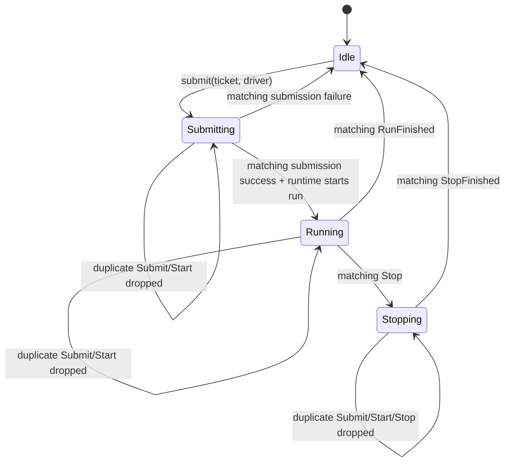

# Jaco：Conversation 提交与 active-run 私有 Transition 实施计划

## 状态、边界与依据

- 状态：`Done`（2026-08-13）。
- 关联 issue：[#199](https://github.com/suxiaoshao/gpui/issues/199)
- 根计划：[Issue #199 多轮任务索引](../../../../../docs/dev/issue-199/README.md)
- 所有者：`app/jaco`
- 本地编号：`E/D/F/L/ST/ERR/R/T-1300..1339`、`WP-1300..1305`。

本文记录 Jaco 内 Conversation 提交准入、运行、停止和迟到 completion 的实际交付。根草稿不再保留
重复的 Conversation 设计；MCP runtime 由 [#201](https://github.com/suxiaoshao/gpui/issues/201) 承接，数据库
schema 和新的 Store 均未改动。

## 目标与非目标

### 目标

1. `ConversationRuntimeStore` 是提交 Task、active-run Task 和生命周期状态的唯一权威 owner；同一
   conversation 的所有页面投影同一状态。
2. 用户消息或新 conversation 的数据库 producer 首次 poll 前同步进入 `Submitting`；重复提交直接丢弃，
   不排队。
3. 以 Jaco 私有 `Transition<Message>` 表达 `Submitting -> Running -> Stopping -> Idle`，保留现有
   agent 运行、取消、approval broker、OpenAI session 清理和 registry 发布。
4. 每次提交/运行使用单调 attempt key。异步完成、停止收尾和页面事件按 key 核验，迟到结果不得覆盖后来
   attempt。
5. 页面只保存自己发起的 ticket 过滤事件；不拥有提交 Task、不在 completion 中调用 `start_run`，也不以
   本地 task 作为重复发送准入。

### 非目标

- 不改 MCP connection/OAuth/tool runtime、MCP payload/schema，且不建立 MCP Transition。
- 不引入 `gpui-store::Store`，不迁移 `ConversationRuntimeStore`，不改 `gpui-operation`。
- 不改变 Jaco DB schema/migration、`AgentPersistence`、provider/secret 读取和 agent 业务失败的持久化模型。
- 不增加队列、替换提交、pause/resume、后台运行、跨窗口 approval handoff、重新发送确认或自动重试。
- 不重做 ChatForm 布局、Fluent key、图标、附件内容或已完成的 Form 迁移。

## Owner-local evidence

| ID | 分类 | 交付事实 | 证据 | 结果 |
| --- | --- | --- | --- | --- |
| `E-1300` | Delivered | app-wide `ConversationRuntimeStore` 的 `ActiveRuns` 以 `Submitting`、`Running`、`Stopping` 三种 `ConversationAttempt` 统一拥有 Task 和生命周期状态。 | `src/features/conversation/runtime.rs:24-119,191-370` | 未新增 Store 或第二个 runtime owner。 |
| `E-1301` | Delivered | Detail、Home、Temporary 与快捷键入口只保存 `ConversationSubmissionTicket`，经 runtime submit API 发起；页面不再保留 submission Task 或调用 `start_run`。 | `src/components/chat/detail.rs`；`src/features/home/new_conversation.rs`；`src/features/temporary.rs`；`src/state/hotkey.rs` | 一次性 UI 副作用按 matching ticket 消费。 |
| `E-1302` | Delivered | `CreateConversationRequest` 带预分配 `ConversationId`；runtime 在 producer 首次 poll 前安装 `Submitting`，并通过 `WeakEntity` 回投 completion。 | `src/features/conversation.rs`；`src/features/conversation/runtime.rs:475-515,999-1011` | create 和 message 使用同一 attempt identity。 |
| `E-1303` | Delivered | `ActiveRunKey` 贯穿 submission、run、stop 和 publication；匹配 key 与 phase 才允许状态迁移或事件发布。 | `src/features/conversation/runtime.rs:120-370,747-997` | 迟到 completion 不会覆盖后续 attempt。 |
| `E-1304` | Delivered | 同一 conversation 的重复 submit/start/stop 被拒绝，不建立队列；不同 conversation 可并行。 | `src/features/conversation/runtime.rs:191-370`；测试 `duplicate_submit_is_ignored_and_drops_its_task`、`different_conversations_can_submit_in_parallel` | `R-1300`–`R-1304` 已闭环。 |
| `E-1305` | Delivered | agent/provider/tool 运行失败保留既有持久化终态；提交或 runtime 基础设施失败按 matching ticket 通知发起页面。 | `src/features/conversation/runtime.rs:847-997` | 未引入重试、回滚或新的错误数据模型。 |

## 目标设计

### `D-1300`：私有 Transition 和唯一 runtime owner

Conversation 是提交、流式运行、approval、停止清理与数据库副作用混合的领域流程，不采用
`gpui_operation::refresh` 或 `repair` family。`runtime.rs` 私有定义 message/state transition；现有 `recovery`
字段继续使用 `refresh::Operation`，两者不镜像。

```rust,ignore
#[derive(Clone, Debug, PartialEq, Eq)]
pub(crate) struct ConversationSubmissionTicket {
    conversation_id: ConversationId,
    attempt_key: ActiveRunKey,
}

struct ActiveRuns(HashMap<ConversationId, ConversationAttempt>);

enum ConversationAttempt {
    Submitting(SubmissionAttempt),
    Running(ActiveRun),
    Stopping(ActiveRun),
}

pub(crate) enum ConversationRunStatus {
    Idle,
    Submitting,
    Running,
    Stopping,
}
```

- `ConversationAttempt` 仅在 `ConversationRuntimeStore` 内部；map 缺席即 `Idle`，页面不能改写它。
- `SubmissionAttempt` 拥有完整 submission driver `Task<()>`。`ActiveRun` 继续拥有 run/stop task、
  cancellation token、approval broker、agent run id 和 event listener task。
- `Submitting`、`Running`、`Stopping` 统一存入
  `active_runs: ActiveRuns`。新 conversation 的 ID 在调用持久化 producer 前预先
  分配，并同时作为 create request 与 runtime map key；不建立第二个无 ID attempt map。
- `ActiveRunKey` 同时用于 submission、run、stop 和所有 completion/event，维持既有 key 的单调分配语义。

### `ST-1300`：提交、运行和停止流转



1. 页面将已验证的 `SendConversationMessageRequest` 或 `CreateConversationRequest` 传入 runtime 的
   `submit_message` / `submit_new_conversation`。runtime 先检查 recovery 和目标 phase。
2. runtime 分配 ticket、构造唯一 driver task，并在同一无 await owner update 中经私有 Transition 安装
   `Submitting`，随后才允许 source producer poll。安装前不得执行 database executor、附件复制或 user entry
   写入。
3. driver 用 `WeakEntity<ConversationRuntimeStore>` 回投带 key 的 success/failure message；仅仍为
   `Submitting` 且 key 匹配的 completion 合法。
4. matching success 由 runtime 清理 `Submitting` 并启动/安装 `Running`。run construction、registry
   retain/release、`RunStarted`/`RunFinished` 都留在 runtime；页面不调用 `start_run`。
5. `Stop` 仅从 matching `Running` 进入 `Stopping`。取消 token、approval cancel、OpenAI session close 与
   `cancel_non_terminal_runs_for_conversation` 的原有顺序不变。
6. matching completion 先写入最终状态/删除 map 项，再 drop retired task/payload，随后 emit/notify；非法或
   stale message 保持当前状态，记录无内容/secret 的 debug 后 drop。

### `ST-1301`：ticketed 页面投影

`ConversationRuntimeEvent` 携带 `ConversationSubmissionTicket`。它覆盖
submission accept/success/failure、run start/finish 和 stop finish；success 携带必要 `conversation_id` 与
create/follow-up 区分，failure 只携带已规范化的可展示 message。

- Detail、Home `NewConversationPage`、TemporaryWindow 仅保存 `Option<ConversationSubmissionTicket>`；它只作
  事件过滤和 UI 投影，绝不保存 Task、取消 handle 或 phase。
- 页面只响应 matching ticket：成功时清空本页 composer，执行既有 open/navigate/timeline 副作用；失败时使用
  既有即时通知并清 ticket。无匹配 event 只触发 runtime observe 刷新，不能清输入、导航或消费错误。
- `AgentRunStatusSource` 扩展为 `Idle / Submitting / Running / Stopping` 的 runtime 只读查询。PrimaryAction
  对 Submitting 显示 loading 且禁用 Send，对 Running 显示 Stop，对 Stopping 禁用；删除
  `PrimaryActionControlState::submission_task`、`begin_submission`、`finish_submission` 和控制器 wrapper。
- 多页打开同一 conversation 时都读同一 runtime phase；只有发起页的 ticket 接收一次性副作用。页面关闭仅
  drop 本页 ticket，不取消 runtime task 或 agent run。

### `D-1301`：新 conversation 预分配 ID

页面在发起 create command 时分配 `ConversationId`，并将它写入 `CreateConversationRequest`。runtime 以该 ID
同步安装 `Submitting`，持久化 producer 必须使用同一个 ID；成功后同一 map entry 转入 `Running`。Home、
TemporaryWindow 与 hotkey 不再因路由、窗口或全局触发器生命周期持有 submission task。

### `D-1302`：错误、取消和 stale completion

| ERR-ID | 触发 | Runtime 结果 | 页面/持久化结果 |
| --- | --- | --- | --- |
| `ERR-1300` | 预检、DB/attachment/create/send 失败 | matching `Submitting -> Idle` | matching ticket 显示现有 send/create 错误；不启动 run。 |
| `ERR-1301` | provider/runtime 初始化或 run start 失败 | matching submission 释放为 Idle | matching ticket 显示 `conversation-run-failed`；已写入 user entry 不回滚。 |
| `ERR-1302` | agent/provider/tool 运行失败 | matching `Running -> Idle` | 保留现有持久化终态和 refresh；不复制为 runtime error data。 |
| `ERR-1303` | Stop cleanup 失败 | matching `Stopping -> Idle` | 保留日志与 `last_errors` 可见路径；不重启 run。 |
| `ERR-1304` | 非法 phase、重复 Submit/Start/Stop、stale key | 当前状态不变 | 无通知、无队列；tracing 仅记录 conversation id、phase、key、message kind。 |

`Submitting` 不增加取消 UI；runtime shutdown 清空 submission/create/run/stop attempt 并 drop 唯一 task，已经
发生的 DB/agent 副作用不回滚。现有 `ActiveRunKey` 必须保留并扩展为 attempt key，因为 event listener、
stop cleanup 和 publication completion 仍可能迟到。

## 文件级改动地图

```text
app/jaco/
├── src/features/conversation/runtime.rs                 # F-1300 [Modify] private transition, key, owner task, ticketed events
├── src/components/chat/detail.rs                         # F-1301 [Modify] runtime command + matching-ticket consumer
├── src/components/chat/input.rs                          # F-1302 [Modify] remove local submission task API; read phase projection
├── src/components/chat/form/controls.rs                 # F-1303 [Modify] remove submission_task; add Submitting state
├── src/components/chat/form.rs                           # F-1304 [Modify] Submitting/Running/Stopping primary action projection
├── src/features/home/new_conversation.rs                 # F-1305 [Modify] runtime create + ticket-driven clear/navigation
├── src/features/temporary.rs                             # F-1306 [Modify] runtime create/open + ticket-driven route
├── src/features/conversation.rs                          # F-1307 [Modify] preallocated create ID and runtime-owned submission lifetime
├── src/app/temporary_window.rs                           # F-1308 [Modify] ticketed temporary-window navigation
├── src/features/temporary/new_conversation.rs            # F-1309 [Modify] temporary pane runtime projection
├── src/state/hotkey.rs                                   # F-1310 [Modify] shortcut create observes matching ticket
└── {conversation/runtime,conversation,components/chat/input}.rs
                                                        # inline tests for transition, producer lifetime, and Submitting projection
```

`features/conversation/resources.rs`、数据库 schema、registry API、MCP runtime 和 resources Store 均未改动。

## 需求、测试与工作包

| R-ID | 要求 | T-ID | 聚焦证据 |
| --- | --- | --- | --- |
| `R-1300` | 同 conversation 的 Submitting/Running/Stopping 拒绝再次 Submit/Start；不同 conversation 可并行。 | `T-1300` | `duplicate_submit_is_ignored_and_drops_its_task`、`different_conversations_can_submit_in_parallel`。 |
| `R-1301` | Submitting 在 user entry/create producer poll 前已安装；页面没有 submission Task。 | `T-1301` | `submission_failure_drops_the_owned_task`、`dropping_create_conversation_task_cancels_uncommitted_submission` 与残留扫描。 |
| `R-1302` | matching submission success 仅 runtime 启动 run；页面仅按 ticket 清空/导航。 | `T-1302` | `RuntimeEventRecorder` 与 Detail、Home、Temporary、hotkey 的 matching-ticket consumer。 |
| `R-1303` | Stop 保持 Stopping 至 cleanup complete；重复 Stop 不重入。 | `T-1303` | `stop_run_keeps_conversation_gated_until_cleanup_finishes`。 |
| `R-1304` | stale submission/run/stop completion 不影响后续 attempt，也不消费后续页面 ticket。 | `T-1304` | `stale_submission_completion_cannot_replace_current_attempt`、`stale_runtime_publication_cannot_mutate_a_new_attempt`、`finish_run_ignores_stale_run_key`。 |
| `R-1305` | agent 失败仍持久化；基础设施失败仍即时通知；无 queue/retry/rollback。 | `T-1305` | `finish_run_records_uncanceled_error` 与既有 conversation persistence tests。 |
| `R-1306` | PrimaryAction 对 Submitting loading、Running Stop、Stopping 禁用，不保留 local task。 | `T-1306` | `submitting_agent_blocks_repeated_submit`、`running_agent_blocks_submit_and_primary_button_stops`、`stopping_agent_blocks_submit_and_primary_button_action`。 |
| `R-1307` | 同一 conversation 的多个页面不会跨 ticket 消费运行错误。 | `T-1307` | `run_error_ticket_is_consumed_only_by_its_owner`。 |

### WP-1300：建立 runtime 私有 attempt Transition（Done）

**文件：** `F-1300`、`F-1309`

1. 将 `active_runs` 变为 owner-local attempts，添加 submission/create attempt、单调 key、ticket。
2. 实现私有 message transition：合法 edge 先安装最终状态再 drop retired task；illegal/stale message 保持
   状态后 debug-drop。
3. 迁移既有 run/stop/event-listener/approval/session/registry 到 Running/Stopping edge，保持 DB 语义。

**Done：** runtime 单独拥有每个生命周期 task；map 缺席表示 Idle；recovery Operation 不变。

### WP-1301：在 producer poll 前取得 runtime 准入（Done）

**文件：** `F-1300`，必要时 `F-1307`、`F-1308`

1. runtime 暴露 existing/create submit command，检查 phase 后同步安装 Submitting + ticket。
2. 仅在安装后构造并允许 send/create producer poll；driver 用 weak runtime 回投 key completion。
3. create success 以同 key 转入目标 conversation 的 Running；failure 仅释放 matching submitting state。

**Done：** 页面/窗口消失不影响 runtime 准入与 completion；不修改 DB schema。

### WP-1302：迁移 Detail、Home、Temporary 为 ticket consumer（Done）

**文件：** `F-1301`、`F-1305`、`F-1306`

1. 删除页面 `window.spawn` submission completion、begin/finish 调用与页面层 `start_run`。
2. 页面保存/清 ticket，只在 matching event 清 composer、导航、跟随 timeline 或显示通知。
3. 保持跨页面状态观察；非发起页面不能消费一次性 completion 副作用。

**Done：** 所有 create/send 入口都经过 runtime，错误和导航不跨 ticket 串扰。

### WP-1303：迁移 ChatForm 的只读 phase 投影（Done）

**文件：** `F-1302`、`F-1303`、`F-1304`、`F-1310`

1. agent control status 加入 Submitting，由 runtime/ticket source 查询。
2. 删除 PrimaryAction 的 task 字段和 ChatInput task wrapper，保留 focus/IME/Form/run-settings 边界。
3. 调整 PrimaryAction action/loading/disabled，不为 Submitting 提供 Stop/Cancel。

**Done：** ChatForm 只读 runtime phase，页面 drop 不取消 submission。

### WP-1304：竞争、错误和页面消费测试（Done）

**文件：** `F-1309`、`F-1310` 与相关 inline tests

1. 用 controlled task/oneshot 覆盖 `R-1300`–`R-1306`，包括预分配 ConversationId 的 create 阶段。
2. 迁移现有 stop/run key、approval cancellation、app-owned completion tests；新增 submission stale 和
   ticket mismatch fixture。
3. 检查测试中的 task 仅由 runtime 或 application resource owner 保留，不 detach lifecycle driver。

**Done：** 自动化证实安装顺序、唯一 task owner、Stopping 门控和迟到 completion 防护。

### WP-1305：验证与计划状态回写（Done）

**文件：** 本文、两个 Issue #199 README、根草稿

1. 运行下列最小充分命令，记录实际输出、未执行 UI/packaged 边界与提交。
2. 删除根草稿中已实施 `CONV-*` 内容或改为实施证据入口，保留 MCP 暂缓范围。
3. 只有 `R-1300`–`R-1306` 有实际证据时将本轮改为 Done。

```bash
cargo fmt --package jaco
cargo test -p jaco conversation::runtime --locked
cargo test -p jaco components::chat --locked
cargo test -p jaco --lib --locked
cargo clippy -p jaco --all-targets --all-features --locked -- -D warnings
git diff --check
```

实现后执行残留扫描：

```bash
! rg -n 'submission_task|begin_submission|finish_submission|submission_pending' \
  app/jaco/src/components/chat \
  app/jaco/src/features/home/new_conversation.rs \
  app/jaco/src/features/temporary.rs
! rg -n '\.start_run\(' app/jaco/src/components app/jaco/src/features/home app/jaco/src/features/temporary.rs
```

允许 runtime 自身保留内部 `start_run` 或替代命令；页面层不得调用。

## 完成证据

| 证据 | 当前结果 |
| --- | --- |
| 实现提交/PR | 实现提交 `99a073a`；本轮未创建 PR。 |
| 实际修改文件 | `src/features/conversation/runtime.rs`、`src/features/conversation.rs`、`src/components/chat/{detail.rs,input.rs,form.rs,form/controls.rs}`、`src/features/{home/new_conversation.rs,temporary.rs,temporary/new_conversation.rs}`、`src/app/temporary_window.rs`、`src/state/hotkey.rs`。 |
| `WP-1300`–`WP-1305` | `Done` |
| 自动化命令 | 聚焦 Conversation 42 tests 通过；Jaco 全量 369 tests 通过；Jaco strict Clippy 通过；workspace build、workspace 全量 tests 与 workspace strict Clippy 通过；`cargo tree -d --locked` 成功完成。 |
| 实际 UI/packaged app | 未执行。 |
| MCP、DB schema、新 Store 变更 | `None（明确排除）` |
| 与根草稿/索引同步 | 已同步根索引、Issue #199 root/Jaco owner 索引和根草稿的单一事实入口。 |
