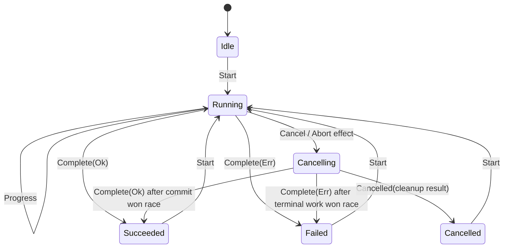

# Novel Download：Form、私有下载 Transition 与文件事务迁移实施计划

## 状态与范围

- 状态：`Done`。`WP-1400`–`WP-1407` 的生产实现、39 项自动化测试和定向门禁已在当前工作树完成；
  实际 UI 操作测试按本轮要求未执行。
- 关联 issue：[#199](https://github.com/suxiaoshao/gpui/issues/199)
- 子任务 ID：`NOVEL-199-01`
- 子任务索引：[Issue #199：Novel Download 子任务跟踪](README.md)
- 根入口：[Issue #199 多轮任务索引](../../../../../docs/dev/issue-199/README.md)
- 决策归档：已由本文完整吸收；总草稿按规则删除了已落地的 Novel Download 内容
- Form producer contract：`C-900`–`C-904`，权威入口为
  [gpui-form 运行时破坏性重构实施计划](../../../../../crates/gpui-form/docs/dev/issue-199/form-runtime-breaking-refactor-plan.md)
- 所有者：`app/novel-download`
- 本地 ID 范围：`E/D/F/L/ST/ERR/R/T-1400..1499`、`WP-1400..1409`
- 实施引用：当前工作树；尚未创建 commit 或 PR

本文是 Novel Download 在 Issue #199 中的首轮完整 owner plan。它负责最小 typed Form、下载输入解析、
私有 `gpui_operation::Transition`、Task 与取消、HTTP/retry、下载范围、`.part` 文件事务、UI、本地化、
依赖和验证。目录 `README.md` 只登记多轮子任务状态与本文链接，不承载执行细节。

本轮已获准并完成代码实施；实际 UI 操作测试不在本轮执行范围内，且当前工作树尚未提交。

## 目标

1. 用 `Entity<Form<DownloadRequest>>` 管理唯一可编辑的 `source` 字段、提交时验证和 prepared snapshot；
   运行中仍允许用户编辑下一次请求。
2. 用页面私有 `DownloadRuntime` + `Transition<DownloadMessage>` 统一单 active download、进度、取消与
   终态，不再维护 `WorkspaceEvent`、`FetchState` 和 detached runner 三套并行状态。
3. 让运行态持有唯一前台 driver `Task<()>`，driver 再持有唯一后台 worker；取消或 owner drop 都能取消
   完整网络、解析与写入链，且不存在独立 completion producer。
4. 严格接受小说 ID、信息页 URL、章节 URL和分页 URL；冻结 typed request，并把远端章节/分页不存在
   建模为失败而不是空流成功。
5. 所有内容只写入同目录 `<final>.part`，本次请求范围全部成功后才执行 no-clobber 原子发布；失败、
   取消或 owner 销毁不产生可见的部分最终文件。
6. 统一 HTTP status、短暂网络重试、结构化错误、字段错误、运行状态 UI、Fluent 文案和诊断。
7. 以纯逻辑测试、文件系统临时目录测试和 GPUI Task/Entity 测试固定行为，再执行 Novel Download 定向
   Cargo 门禁；实际 UI 操作单独登记真实结果。

## 非目标

- 不迁移 HTTP Client、Jaco Conversation 或 Jaco MCP runtime。
- 不引入 `gpui-store`、下载中心、跨窗口共享状态、队列、并行下载、历史或稳定 `DownloadId`。
- 不使用预定义 `refresh::Operation` 或 `repair::Operation`；下载是流式、多阶段、带文件提交点的应用私有
  状态机。
- 不提供 pause、resume、checkpoint、断点续传、逐页手动 Retry、覆盖、自动改名、目录选择或 repair。
- 不增加元数据 preview；元数据只属于已接受下载的运行阶段。
- 不改变 zgzl 页面内容提取规则所表达的文本格式，除非为严格 range、HTTP status、统一 retry 或文件
  原子性所必需。
- 不修改 app icon、运行时 assets、macOS bundle 本地化、窗口类型或打包标识。
- 不为旧 `Fetch` callback trait、`WorkspaceEvent`、`FetchState`、直接 append 路径或任意字符串回退为
  novel ID 的行为保留兼容层。

## 适用性矩阵

| S-ID | 系统表面 | 适用性 | 本轮结论 | 负责工作包 |
| --- | --- | --- | --- | --- |
| `S-01` | workspace/crate 拓扑与模块所有权 | 适用 | 重组 Novel Download 内的 workspace、crawler、source、output 边界，不增加 workspace member | `WP-1400`–`WP-1406` |
| `S-02` | GPUI view、组件、布局与主题 | 适用 | `WorkspaceView` 组合 Form field、Input、Start/Cancel、Progress、Alert；继续使用现有主题 token | `WP-1403`–`WP-1405` |
| `S-03` | Entity、Store、Global、Form 与 identity | 适用 | 页面拥有 Form 与私有 runtime；不使用 Store；native Input 只拥有交互状态 | `WP-1403`、`WP-1404` |
| `S-04` | action、event、subscription、focus 与窗口 | 适用 | 删除 `WorkspaceEvent` 总线；Form observer 只重绘；保留当前单窗口和 focus owner | `WP-1403`–`WP-1405` |
| `S-05` | async Task、并发、取消与 shutdown | 适用 | 唯一 driver Task 持有唯一 worker；AbortHandle 取消；view/window/app drop 取消 | `WP-1404` |
| `S-06` | 数据获取与 Operation 状态 | 适用 | zgzl HTTP/解析/stream 使用私有 `DownloadRuntime`，不套 refresh/repair | `WP-1401`、`WP-1404` |
| `S-07` | Form 与可编辑状态 | 适用 | 一个 `source: String`、Submit-only 验证、`FormInput` 与 frozen typed snapshot | `WP-1400`、`WP-1403` |
| `S-08` | 跨 crate、平台与外部契约 | 适用 | 消费 Form `C-900`–`C-904`、`Transition` trait、reqwest、系统 Downloads 与 tempfile no-clobber | `WP-1400`–`WP-1404` |
| `S-09` | 错误身份、传播、恢复与错误 UI | 适用 | 输入、HTTP、解析、range、输出、冲突、cleanup 全部结构化并映射字段/UI/日志 | `WP-1400`–`WP-1405` |
| `S-10` | 数据库、持久化与 migration | 不适用 | 只有用户选择的文本文件输出；没有数据库或 schema | — |
| `S-11` | generated/synchronized/vendored 内容 | 不适用 | 不增加生成器、同步产物或 vendored 源码 | — |
| `S-12` | 图标与 assets | 无变更 | 继续使用现有 app bundle icon；本轮 UI 不新增 icon contract | — |
| `S-13` | Fluent i18n 与 bundle 本地化 | 适用 | 更新 `en-US`/`zh-CN` runtime Fluent；bundle `InfoPlist.strings` 不变 | `WP-1405` |
| `S-14` | 安全、隐私与文件系统边界 | 适用 | 只请求严格支持的 HTTPS host；安全文件名；不覆盖 final；不记录响应正文 | `WP-1400`–`WP-1402` |
| `S-15` | tracing 与诊断 | 适用 | run span、阶段、URL/status/path/attempt 诊断；非法消息 debug 丢弃 | `WP-1401`、`WP-1404` |
| `S-16` | packaging、平台与 CI/release | 无变更 | app 标识、bundle、workflow 不变；现有 macOS/Linux/Windows CI 继续消费该 app | `WP-1407` |
| `S-17` | 依赖、框架、Git source 与 toolchain | 适用 | 增加三个 workspace crate 和 `tempfile = 3.27.0`；不增加 Store | `WP-1406` |
| `S-18` | owner 文档、索引与 ADR | 适用 | 新建本文与 owner index，并由 app/root index 引用；历史迁移文档不改写 | `WP-1406` |
| `S-19` | 验证与完成证据 | 适用 | R/T 映射、定向 Cargo 门禁、残留扫描和实际 UI 场景分别登记 | `WP-1407` |

## 实施前证据

### 当前执行流

1. `WorkspaceView::new` 创建裸 `InputState` 与另一个 `Entity<Workspace>`，再通过
   `WorkspaceEvent` 订阅连接页面和状态。
2. Start 点击读取 native input，发 `Send`，立即清空输入；没有 typed Form 或提交验证。
3. `WorkspaceView::fetch` 创建前台 Task 后立即 `detach`，Task 内的 `Runner` 通过 `WeakEntity<Workspace>`
   发进度事件。
4. callback 型 `Fetch::__inner_fetch` 获取元数据、打开最终 `.txt`、流式写入内容；`fetch()` 将最终
   `Result` 吞掉并只调用 `on_error`。
5. 文件以 `append(true).create(true)` 打开最终路径；任何中断、重跑或重试都可能留下或重复拼接内容。
6. URL parser 不要求完整消费，分页用浮点 parser；任意解析失败字符串回退为 novel ID。章节/分页在
   元数据中不存在时 stream 可以零条目结束并报告 Success。
7. 只有第二页及之后使用 retry；HTTP 不先检查 status；retry 在最后一次失败后仍多等一次。

### 证据注册表

| ID | 分类 | 已核实事实 | 证据 | 计划后果 |
| --- | --- | --- | --- | --- |
| `E-1400` | 当前事实 | `WorkspaceEvent`、`FetchState` 与 `Workspace` 同时表达同一运行过程 | `src/features/workspace.rs:20-95` | 删除平行 authority，以 `DownloadRuntime` 为唯一运行权威 |
| `E-1401` | 当前事实 | `loading()` 漏掉初始 `Fetching`；Start 总能 emit，输入随后被清空 | `workspace.rs:86-92,264-299` | Start gate 由 Transition 保证；Form 始终保留且运行中可编辑 |
| `E-1402` | 当前事实 | runner 直接 append/create 最终 `.txt`，每个 item 立即写入 | `workspace.rs:118-143` | 改成同目录 staging、单次内容写入与整体 commit |
| `E-1403` | 当前事实 | lifecycle Task 被 detach；`Fetch::fetch` 不返回失败给 owner | `workspace.rs:246-260`、`src/crawler.rs:21-53` | 唯一 Task 必须被状态持有；worker 返回 typed terminal result |
| `E-1404` | 当前事实 | parser 对任意失败回退 raw ID、URL 可部分匹配、page 使用 float；missing range 可空成功 | `crawler/implement/zgzl/novel.rs:103-221` | 建立 all-consuming typed parser 与显式远端 range 校验 |
| `E-1405` | 当前事实 | `get_doc` 未 `error_for_status`；retry 最后失败后仍 sleep，且只覆盖部分页面 | `crawler/implement.rs:11-54`、`crawler/implement/zgzl/novel.rs:114-156` | 所有 HTTP 获取统一三次总尝试，解析/文件错误不 retry |
| `E-1406` | 当前事实 | `NovelError` 过宽，运行映射遇到 `LogFileNotFound` 会 `unimplemented!()` | `src/errors.rs:3-29`、`workspace.rs:156-171` | 分离 app 初始化错误与结构化下载错误，运行错误路径不得 panic |
| `E-1407` | 当前事实 | app manifest 尚无 Form/Operation/Store；workspace 已提供 Form/adapter/Operation | `app/novel-download/Cargo.toml`、根 `Cargo.toml:39-43` | 只新增 Form、adapter、Operation；明确不新增 Store |
| `E-1408` | 当前事实 | 当前仅一个 source parser unit test | `crawler/implement/zgzl/novel.rs:238-256` | 增加 parser、range、retry、output、runtime、Form 与 i18n 测试矩阵 |
| `E-1409` | 用户决定 | 单 active、拒绝重入、Cancel、关闭取消、frozen snapshot、无队列/Store/resume/repair | 根决策文档 `NOVEL-RUN-*`、`NOVEL-STORE-Q01` | 固定 `D-1400`–`D-1405`，实现阶段不重新选择产品语义 |
| `E-1410` | 用户决定 | 四种输入、最小 Form、运行中可编辑、`.part` 整体提交、existing final 拒绝 | 根决策文档 `NOVEL-INPUT-Q01`、`NOVEL-FORM-*`、`NOVEL-FILE-*` | 固定 `D-1401`、`D-1402`、`D-1406`、`D-1409` |
| `E-1411` | crate 事实 | GPUI `Task` drop 取消 future；Operation 测试证明取消后不再投递 completion | scheduler `Task` 实现；`crates/gpui-operation/tests/gpui_task.rs:77-131` | driver/worker 不 detach；owner drop 足以切断 completion route |
| `E-1412` | crate 事实 | `Form::new/with_validator/prepare`、`FormInput::new`、typed path errors 与 source-aware binding 已交付 | Form `C-900`–`C-904`；三个 Form crate 当前源码 | 直接消费最终 API，不建 app-local Form 同步协议 |
| `E-1413` | 依赖事实 | lockfile 已含 `tempfile 3.27.0`；`TempPath::persist_noclobber` 在目标平台提供 no-clobber promotion | `Cargo.lock`、本地 `tempfile-3.27.0` 源码 | 增加 direct runtime dependency，最终 commit 不用 precheck + overwrite rename |

## 消费的生产者契约

| 契约 | Novel Download 消费能力 | 本计划中的消费点 |
| --- | --- | --- |
| `C-900` | `FormSchema`、无失败 Form 构造、total typed path | `DownloadRequest::SOURCE`、`Form::new`、`get/errors` |
| `C-901` | 一次 model 变更/通知与 typed event | Form observer 只重绘，不另建 input 回写或业务事件总线 |
| `C-902` | `FormInput`、source-aware binding 与 native projection | source Input 只由内建 adapter 绑定；不手写 `InputEvent` 双向同步 |
| `C-903` | Submit validation、`Prepared<M>`、snapshot | Start 只使用 `prepare` 返回值；运行不重读 live Form |
| `C-904` | Form 私有 Transition 与原子发布 | app 只消费公开领域 API；下载私有消息属于 app runtime，不泄漏进 Form |

这些 producer contract 已达到 `consumer-complete`，因此 `NOVEL-199-01` 没有外部 producer gate。Novel
Download 不修改三个 Form crate，也不反向要求它们加入下载、Task 或输出文件概念。

## 架构决定

### `D-1400`：`WorkspaceView` 是唯一页面 owner，不引入 Store

- `WorkspaceView` 直接拥有 `DownloadRuntime`、`Arc<dyn DownloadBackend>`、Form entity、native source
  input、adapter、observer 与 focus handle。
- `Entity<Form<DownloadRequest>>` 是可编辑值、baseline/revision、validation 的唯一权威。
- `DownloadRuntime` 是 active/terminal phase、frozen snapshot、progress、Task 和 failure 的唯一权威。
- native `InputState` 只拥有 focus、IME、selection 和未完成编辑交互；业务值由 Form authority 投影。
- 当前没有第二个页面、下载中心、队列、历史或跨窗口 consumer，因此不增加 `Store` 或 typed Global。
- 删除 `Entity<Workspace>`、`WorkspaceEvent` 和 `FetchState`；不把一个旧状态包装进新 runtime。

### `D-1401`：最小 Form 只在 Submit 显示业务错误

- Form model 固定为 `DownloadRequest { source: String }`。
- `#[form(required)]` 使用 schema 默认 Submit trigger；不声明 `on_change`/`on_blur`，因此 mount、输入和 blur
  不主动出现错误。
- 自定义 validator 只调用纯本地 strict parser，不发网络请求；非空但不受支持的字符串在
  `DownloadRequest::SOURCE` 下产生 `download-validation-source-invalid`。
- Start 调用 `prepare(cx)`。失败只显示精确字段 issue，不创建 worker、不改变 runtime terminal state。
- 成功后以同一个纯 parser 把 `Prepared<DownloadRequest>` 转成 `PreparedDownloadRequest`。转换不读取 live
  Form；本任务没有异步保存/rebase，所以转换后不保留 `FormVersion`。
- 运行开始后不 clear、replace、reset 或 rebase Form；后续编辑只属于下一次 Start。

### `D-1402`：输入解析是 all-consuming typed contract

`DownloadSource` 只接受 trim 后完整匹配的以下输入：

1. raw novel ID：ASCII alphanumeric，至少一个字符；
2. `https://www.zgzl.net/info_{novel_id}` 或 `https://m.zgzl.net/info_{novel_id}`，尾部 `/` 与空 `#`
   均可选；
3. `https://m.zgzl.net/read_{novel_id}/{chapter_id}.html`；
4. `https://m.zgzl.net/read_{novel_id}/{chapter_id}_{page}.html`，`page` 是十进制非零 `u32`。

不接受 `http`、其他 host/port/userinfo、query、未知路径、尾随垃圾、浮点/零页码或任意 URL 退化成 ID；
`www.zgzl.net` 只用于详情页，章节与分页链接仍只接受 `m.zgzl.net`。
分页规则先于章节规则并要求完整消费，避免 `_2.html` 被章节 parser 部分接受。raw ID 与信息页都归一为
`ZgzlRange::Novel`；`submitted_source` 仍保留 trim 后原文用于 frozen snapshot UI。

### `D-1403`：下载使用私有 runtime enum 与消息

状态固定为：

```rust,ignore
enum DownloadRuntime {
    Idle,
    Running {
        snapshot: PreparedDownloadRequest,
        progress: DownloadProgress,
        abort: futures::future::AbortHandle,
        task: gpui::Task<()>,
    },
    Cancelling {
        snapshot: PreparedDownloadRequest,
        progress: DownloadProgress,
        task: gpui::Task<()>,
    },
    Succeeded {
        snapshot: PreparedDownloadRequest,
        receipt: DownloadReceipt,
    },
    Failed {
        snapshot: PreparedDownloadRequest,
        progress: DownloadProgress,
        failure: DownloadFailure,
    },
    Cancelled {
        snapshot: PreparedDownloadRequest,
        cleanup_problem: Option<CleanupProblem>,
    },
}

enum DownloadMessage {
    Start {
        snapshot: PreparedDownloadRequest,
        abort: futures::future::AbortHandle,
        task: gpui::Task<()>,
    },
    Progress(DownloadEngineEvent),
    Complete(Result<DownloadReceipt, DownloadFailure>),
    Cancel,
    Cancelled(Option<CleanupProblem>),
}

enum DownloadEffect {
    Ignored,
    None,
    Abort(futures::future::AbortHandle),
}
```

`impl Transition<DownloadMessage> for &mut DownloadRuntime` 是 crate-private，并遵守：

- `Start` 只在 `Idle/Succeeded/Failed/Cancelled` 接受；`Running/Cancelling` 收到 Start 保留状态、debug
  记录并丢弃，不排队、不替换。
- `Progress` 只在 Running 更新；Cancelling/terminal 的进度丢弃。
- `Cancel` 只在 Running 接受：保留同一个 driver Task，转入 Cancelling，并返回 `Abort(handle)` effect；
  owner 在 state 安装完成后才调用 `abort()`。
- `Cancelled` 只在 Cancelling 接受，终止为 Cancelled；cleanup failure 保留给 UI 和诊断。
- `Complete` 在 Running 正常结算。Cancelling 也接受 `Complete`：如果 worker 已越过不可逆 commit point，
  完成结果优先，不能把已经发布的 final 文件谎报为 Cancelled。
- 其他非法消息保留当前状态并丢弃。Transition 不 spawn、不读 Form、不执行 I/O、不直接 notify。



### `D-1404`：唯一 driver 持有唯一后台 worker，不使用 generation

一次 Start 的任务拓扑固定为：

```text
DownloadRuntime::Running.task                     # 唯一 lifecycle owner
└── foreground driver Task                        # WeakEntity<WorkspaceView> completion route
    ├── background worker Task                    # Abortable<DownloadBackend::run>
    │   └── DownloadEngine -> HTTP/source/output  # 不直接访问 GPUI
    └── progress receiver                         # worker 唯一 sender 的有序投影
```

1. Start handler 先同步检查 `runtime.is_active()`；active 时在构造任何 Task 前返回。
2. Form prepare 与 typed conversion 成功后创建 progress channel、AbortHandle/background worker、foreground
   driver 和一次性 start gate；worker 在 gate 打开前不能调用 backend，也不能执行网络或文件副作用。
3. owner 在同一 `Context<WorkspaceView>` update 内先让 Transition 接受 `Start`、安装 Running，再打开 gate。
   正确性不依赖 GPUI 是否会在当前 update 返回前 poll 新建 Task。
4. worker 在 `cx.background_spawn(Compat::new(...))` 上执行网络、scraper 解析和同步文件写入，不阻塞 UI。
5. driver 同时 poll worker 与 progress receiver；每条进度通过自身 `WeakEntity<WorkspaceView>` 同步 update
   runtime。worker 完成时先 drain 已发送进度，再投递一次 `Complete` 或 `Cancelled`。
6. driver 强持有 worker；runtime 强持有 driver。取消 outer Abortable、drop runtime Task 或 owner 消失都会
   切断 worker和唯一 completion route，禁止 worker/HTTP/source 内 detach child Task。
7. 所有 producer 都位于这棵唯一 Task 树内，因此第一轮不增加 run ID/generation。未来引入并行、队列、
   detached producer 或跨窗口 owner 时必须重新打开该决定。

### `D-1405`：Cancel 是协作终止，owner drop 由 RAII 兜底

- 用户 Cancel：Running 先原子转为 Cancelling，再执行 Abort effect。Cancelling 仍是 active，Start disabled、
  Cancel loading/disabled。
- Abortable worker future 被销毁时，只有持有该文件身份的 `StagedOutput`/`TempPath` Drop 可以删除 staging。
  删除失败时把 `CleanupProblem` 写入私有 tracker；wrapper 只取走该结果，不按裸路径重试删除，避免误删
  同名替换文件。
- Cancelled 只有在 worker 已停止且 cleanup 结果已从 tracker 取出后发布；Cancel 不 detach cleanup。
- 页面/窗口/app owner drop 不等待 drain：runtime Task drop 取消 driver/worker，`TempPath` Drop 执行同步
  best-effort cleanup。由于 UI 已不存在，不再投递终态。
- 解析或单次同步写入不会在指令中途抢占；Abort 在下一个 async poll/content 边界生效。它不能产生半个
  `ContentItem` 的重试写入，staging 最终仍整体删除。

### `D-1406`：输出使用 exact `.part` 与 no-clobber promotion

- 元数据取得后，用纯函数安全化小说名、作者名，并保留既有 `"{name}by{author}.txt"` 命名格式。
- 每个文件名组件替换控制字符和 `<>:\"/\\|?*` 为 `_`，去除尾部空格/点，拒绝空、`.`、`..`，处理
  Windows reserved basename，并在 UTF-8 边界内把每个组件限制为 96 bytes。
- `final_path = Downloads/<safe_name>by<safe_author>.txt`；`part_path` 是向 final 文件名追加 `.part`，即
  `<final>.txt.part`，确保同一目录/文件系统。
- metadata 后若 final 已存在，立即返回 `TargetExists`，不创建 staging、不请求内容；这是一项运行前置
  阶段失败，因为文件名在远端 metadata 前无法得知。
- staging 用 `OpenOptions::create_new(true)` 创建 exact part；未知的既有 part 不自动删除，返回
  `StagingExists`，避免误删另一个进程仍在使用的文件。只有本 owner/`TempPath` 明确持有的 part 才自动
  cleanup。
- 用 `tempfile::TempPath::try_from_path` + `NamedTempFile::from_parts` 把 exact part 纳入 RAII；每个完整
  `ContentItem` 只调用一次 `write_all`，成功后才发送 `ContentWritten`。
- commit 顺序固定为 `flush -> sync_all -> close file handle -> TempPath::persist_noclobber(final)`；不能使用
  precheck 后的覆盖式 `std::fs::rename`。
- `persist_noclobber` 永不覆盖并发出现的 final。目标平台支持 no-replace rename；底层 fallback 即使未能
  unlink part，也只能留下指向完整内容的额外 staging link，必须作为 cleanup diagnostic，不得覆盖 final。
- commit 成功并形成 `DownloadReceipt` 后才报告 Success。任一 create/write/flush/sync/promotion 失败都不
  报 Success，并显式清理仍由 app 持有的 part。
- 已存在的旧 `.txt` 或旧版本生成的部分文件一律视为用户文件，只报 TargetExists，绝不修改或删除。

### `D-1407`：HTTP、retry 与远端 range 使用同一个 source engine

- 每个 run 创建一个 `reqwest::Client`；只从 typed `DownloadSource` 生成 `https://m.zgzl.net` URL。
- redirect policy 限制为 HTTPS 且 host 仍是 `m.zgzl.net`，拒绝跨 host/scheme redirect。
- 所有 metadata、chapter first page 与后续 page 都经过同一个 `get_text`，先 `error_for_status`，再按
  UTF-8/charset 解码。
- retry 固定为最多 3 次总尝试、尝试间隔 1 秒；只有 transport/connect/timeout、HTTP 408/429/5xx 可重试。
  其他 4xx、redirect policy、解析、range、文件错误不重试；第三次失败后立即返回，不再 sleep。
- HTML parse 在网络重试成功之后执行一次；一次页面 retry 只产生一个完整 `ContentItem`，writer 不参与
  网络尝试，因此不会重复内容。
- metadata 必须包含非空书名、作者和章节集合，否则 Parse failure。
- Chapter range 必须在 chapter list 找到精确 chapter；Page range 还必须验证 `1 <= page <= page_count`。
  Missing chapter/page 形成结构化 Range failure，不能返回空 stream。
- engine 在 commit 前要求至少写入一个 `ContentItem`；零 item 是 Parse/Range invariant failure，不是
  `Succeeded(empty)`。

### `D-1408`：错误只在一个边界转换为 UI 与诊断

- source 格式错误属于 Form field issue，不进入 DownloadRuntime Failed。
- worker failure 使用 `DownloadFailure { problem, cleanup_problem }`；primary problem 与 staging cleanup
  问题不互相覆盖。
- Cancel cleanup failure 保存在 `Cancelled.cleanup_problem`，UI 显示“下载已取消，但临时文件清理失败”。
- 不把响应正文、小说正文或 HTML selector 内容写入日志；source URL、HTTP status、attempt、阶段和用户
  自己的 output path可以作为结构化诊断字段。
- `LogFileNotFound` 只属于 app 启动错误；下载错误映射不得出现 `unimplemented!()`、`todo!()` 或 panic。

### `D-1409`：UI 只投影 Form 与 runtime 两个 authority

- source 区使用 `gpui_component::form::field`、普通 `Input`、help 文案与字段下 danger `Label`；raw ID 不是
  URL，因此不设置 `InputContentType::Url`。
- `FormInput` 负责 Form/native 双向绑定；`WorkspaceView` 只保留 `cx.observe(&form, ... cx.notify())` 用于
  页面重绘和错误展示，不手写 `InputEvent`、方向 flag 或 FormEvent 值回投。
- Input 在所有 runtime phase 都可编辑；Start 在 Running/Cancelling disabled，运行中不会清空输入或强制
  focus。
- Running 显示 frozen source、indeterminate `Progress`、已解析书名/作者、已写 item 数和当前 URL；不
  伪造百分比。
- Cancel 仅在 Running 可点击；Cancelling 显示 loading 且不可重复点击。
- Succeeded 显示 final path；Failed 使用 error `Alert` 显示 primary problem 和可选 cleanup warning；
  Cancelled 显示取消结果和可选 cleanup warning。
- terminal state 不提供 Retry/Repair/Load snapshot 按钮；用户直接编辑/保留 Form 后再次 Start。

### `D-1410`：兼容、依赖与迁移策略

- 这是 app 内部 breaking migration，不保留旧 callback/runtime API。
- 新增 `gpui-form.workspace = true`、`gpui-form-gpui-component.workspace = true`、
  `gpui-operation = { workspace = true, features = ["tracing"] }`。
- 新增 direct runtime dependency `tempfile = "3.27.0"`。该版本已由 lockfile 解析；实施时仍需按仓库规则
  申请依赖/Cargo.lock 修改权限并核对实际 lock diff。
- 明确不新增 `gpui-store`。继续保留 `futures`、`async-compat`、`smol`（timer）、`reqwest`、`scraper`、
  `nom`、`dirs-next`；实现完成后只删除经 `cargo machete`/源码确认已无消费的依赖，不先预判删除。
- 用户现有 `.txt` 不迁移、不重命名、不清理；新实现遇到同名即拒绝。
- 没有数据库、配置或 checkpoint backfill，也没有 rollback data migration。代码回滚不会改动已成功发布的
  用户文本文件。

## 文件与所有权地图

```text
app/novel-download/
├── Cargo.toml                                                # F-1400 [修改] Form/adapter/Operation/tempfile 直接依赖
├── src/main.rs                                               # F-1402 [修改] app 初始化错误类型与日志边界
├── src/errors.rs                                             # F-1403 [修改] AppError、DownloadFailure/Problem、range/output/cleanup 错误
├── src/features/workspace.rs                                 # F-1404 [重写] 页面组装、Start/Cancel、Task 启动、render；删除旧并行状态
├── src/features/workspace/form.rs                            # F-1405 [新增] DownloadRequest FormSchema、validator、prepared conversion
├── src/features/workspace/runtime.rs                         # F-1406 [新增] DownloadRuntime/Message/Effect/Transition 与 runtime tests
├── src/crawler.rs                                            # F-1407 [重写] backend trait、engine、progress/receipt 与 worker result
├── src/crawler/http.rs                                       # F-1408 [由 implement.rs 移动并重写] Client、redirect、status、retry
├── src/crawler/output.rs                                     # F-1409 [新增] safe path、StagedOutput、commit/abort 与 tempdir tests
├── src/crawler/source.rs                                     # F-1410 [新增] DownloadSource/ZgzlRange strict parser
├── src/crawler/source/zgzl.rs                                # F-1411 [由 implement/zgzl.rs 移动] zgzl source owner
├── src/crawler/source/zgzl/chapter.rs                        # F-1412 [由 implement/zgzl/chapter.rs 移动并改写] chapter/page fetch
├── src/crawler/source/zgzl/novel.rs                          # F-1413 [由 implement/zgzl/novel.rs 移动并改写] metadata/range/content stream
├── src/crawler/chapter.rs                                    # F-1414 [删除] callback trait/content wrapper迁入新 domain
├── src/crawler/novel.rs                                      # F-1415 [删除] callback trait由具体 source contract取代
├── src/crawler/implement.rs 与 src/crawler/implement/**      # F-1416 [删除旧位置] 内容按 F-1408/F-1411..1413 移动
├── src/foundation/i18n.rs                                    # F-1417 [修改] ValidationMessage 转译、test locale/key parity
├── locales/en-US/main.ftl                                    # F-1418 [修改] 英文 Form/runtime/error keys；删除旧 fetch keys
├── locales/zh-CN/main.ftl                                    # F-1419 [修改] 中文对应 keys；变量严格同构
├── docs/dev/README.md                                        # F-1420 [已修改] Issue #199 owner入口
└── docs/dev/issue-199/
    ├── README.md                                             # F-1421 [已新增] 多轮子任务索引
    └── form-operation-download-migration-plan.md             # F-1422 [已新增] 本实施计划/完成证据owner

docs/dev/issue-199/README.md                                  # F-1423 [已修改] root 子任务状态与链接
docs/dev/issue-199/application-migration-decisions.md         # F-1424 [已修改] 产品决定标记为已由Ready计划消费
Cargo.lock                                                    # F-1401 [条件修改] 只接受 Cargo 解析后的 local package dependency diff
```

禁止新增 `mod.rs`。`workspace.rs` 声明 `mod form; mod runtime;`；`crawler.rs` 声明
`mod http; mod output; mod source;`；`source.rs` 声明 `mod zgzl;`。

## 所有者本地类型与方法契约

### `L-1400`：Form model 与 validator（`F-1405`）

```rust,ignore
#[derive(Clone, Debug, Default, PartialEq, Eq, gpui_form::FormSchema)]
pub(super) struct DownloadRequest {
    #[form(required)]
    pub(super) source: String,
}

pub(super) struct DownloadRequestValidator;

impl gpui_form::Validator<DownloadRequest> for DownloadRequestValidator {
    fn validate(
        &self,
        request: gpui_form::ValidationRequest<'_, DownloadRequest>,
        out: &mut gpui_form::ValidationSink<'_, DownloadRequest>,
    );
}

impl TryFrom<gpui_form::Prepared<DownloadRequest>> for PreparedDownloadRequest {
    type Error = DownloadInputError;
    fn try_from(prepared: gpui_form::Prepared<DownloadRequest>) -> Result<Self, Self::Error>;
}
```

Validator 与 conversion 必须调用同一个 `parse_download_source`。空白只产生内建
`gpui-form-error-required`；不得同时产生 source-invalid。

### `L-1401`：typed source（`F-1410`）

```rust,ignore
#[derive(Clone, Debug, PartialEq, Eq)]
pub(crate) enum DownloadSource {
    Zgzl(ZgzlRange),
}

#[derive(Clone, Debug, PartialEq, Eq)]
pub(crate) enum ZgzlRange {
    Novel { novel_id: String },
    Chapter { novel_id: String, chapter_id: String },
    Page {
        novel_id: String,
        chapter_id: String,
        page: std::num::NonZeroU32,
    },
}

#[derive(Clone, Debug, PartialEq, Eq)]
pub(crate) struct PreparedDownloadRequest {
    submitted_source: String,
    source: DownloadSource,
}

pub(crate) fn parse_download_source(input: &str)
    -> Result<DownloadSource, DownloadInputError>;
```

`DownloadInputError` 只用于本地 Form/preflight，不持有网络或 I/O error。

### `L-1402`：backend、engine event 与终态（`F-1407`）

```rust,ignore
pub(crate) type DownloadFuture = std::pin::Pin<Box<
    dyn std::future::Future<Output = Result<DownloadReceipt, DownloadFailure>> + Send,
>>;

pub(crate) trait DownloadBackend: Send + Sync + 'static {
    fn run(
        &self,
        request: PreparedDownloadRequest,
        events: futures::channel::mpsc::UnboundedSender<DownloadEngineEvent>,
        staging: StagingTracker,
    ) -> DownloadFuture;
}

pub(crate) struct DownloadEngine {
    output_root: OutputRoot,
}

pub(crate) enum OutputRoot {
    SystemDownloads,
    Fixed(std::path::PathBuf), // tests only constructor exposure
}

#[derive(Clone, Debug, PartialEq, Eq)]
pub(crate) enum DownloadEngineEvent {
    MetadataResolved(NovelMetadata),
    ContentWritten { url: String, items_written: usize },
}

#[derive(Clone, Debug, Default, PartialEq, Eq)]
pub(crate) struct DownloadProgress {
    metadata: Option<NovelMetadata>,
    items_written: usize,
    current_url: Option<String>,
}

#[derive(Clone, Debug, PartialEq, Eq)]
pub(crate) struct DownloadReceipt {
    metadata: NovelMetadata,
    final_path: std::path::PathBuf,
    items_written: usize,
}
```

生产 backend 使用 `DownloadEngine::system_downloads()`；测试以 `Fixed(tempdir)` 和 fake backend 注入。

### `L-1403`：HTTP 与 retry（`F-1408`）

```rust,ignore
pub(crate) struct HttpClient {
    client: reqwest::Client,
    retry: RetryPolicy,
}

#[derive(Clone, Copy, Debug, PartialEq, Eq)]
pub(crate) struct RetryPolicy {
    max_attempts: std::num::NonZeroU8,
    delay: std::time::Duration,
}

impl HttpClient {
    pub(crate) fn new() -> Result<Self, HttpProblem>;
    pub(crate) async fn get_text(&self, url: &reqwest::Url) -> Result<String, HttpProblem>;
}

async fn retry_with<T, E, Attempt, Fut, Sleep, SleepFut>(
    policy: RetryPolicy,
    should_retry: impl Fn(&E) -> bool,
    attempt: Attempt,
    sleep: Sleep,
) -> Result<T, RetryFailure<E>>;
```

`retry_with` 的 sleeper 可注入，因此 tests 不等待真实一秒。

### `L-1404`：source metadata 与范围（`F-1411`–`F-1413`）

```rust,ignore
#[derive(Clone, Debug, PartialEq, Eq)]
pub(crate) struct NovelMetadata {
    name: String,
    author: String,
    novel_id: String,
    chapter_ids: Vec<String>,
}

pub(crate) struct ZgzlNovel { /* metadata and source-owned parsing state */ }
pub(crate) struct ZgzlChapter { title: String, page_count: u32, first_page: String }

impl ZgzlNovel {
    pub(crate) async fn fetch_metadata(
        source: &DownloadSource,
        http: &HttpClient,
    ) -> Result<Self, DownloadProblem>;

    pub(crate) fn validate_range(&self, range: &ZgzlRange)
        -> Result<ResolvedRange, RangeProblem>;

    pub(crate) fn content_stream(
        &self,
        range: ResolvedRange,
        http: HttpClient,
    ) -> impl futures::Stream<Item = Result<ContentItem, DownloadProblem>> + Send;
}
```

`ResolvedRange` 只能由成功的 metadata-bound validation 构造，stream 不再包含“找不到则什么也不做”的
分支。

### `L-1405`：staging output（`F-1409`）

```rust,ignore
pub(crate) struct OutputPaths {
    final_path: std::path::PathBuf,
    part_path: std::path::PathBuf,
}

pub(crate) struct StagedOutput {
    paths: OutputPaths,
    file: Option<tempfile::NamedTempFile<std::fs::File>>,
    written_items: usize,
    tracker: StagingTracker,
}

pub(crate) struct OutputCommit {
    final_path: std::path::PathBuf,
    items_written: usize,
}

impl StagedOutput {
    pub(crate) fn create(
        root: &std::path::Path,
        metadata: &NovelMetadata,
        tracker: StagingTracker,
    ) -> Result<Self, OutputProblem>;

    pub(crate) fn write_item(&mut self, item: &ContentItem) -> Result<(), OutputProblem>;
    pub(crate) fn commit(self) -> Result<OutputCommit, DownloadFailure>;
    pub(crate) fn abort(self) -> Result<(), CleanupProblem>;
}

#[derive(Clone, Default)]
pub(crate) struct StagingTracker(/* Arc<Mutex<Option<CleanupProblem>>> */);
```

`StagingTracker` 只跨 Abortable 边界传递 owner cleanup failure，不保存可供稍后删除的裸路径，不向 UI
暴露，也不是 run identity。
`DownloadEngine` 把 `OutputCommit` 与同一次 run 的 `NovelMetadata` 合成为 `DownloadReceipt`；output 模块
不反向拥有 source metadata。

### `L-1406`：runtime（`F-1406`）

```rust,ignore
impl DownloadRuntime {
    pub(super) fn is_active(&self) -> bool;
    pub(super) fn snapshot(&self) -> Option<&PreparedDownloadRequest>;
    pub(super) fn progress(&self) -> Option<&DownloadProgress>;
    pub(super) fn status(&self) -> DownloadStatus<'_>;
}

impl gpui_operation::Transition<DownloadMessage> for &mut DownloadRuntime {
    type Output = DownloadEffect;
    fn transition(self, message: DownloadMessage) -> DownloadEffect;
}
```

`DownloadStatus<'_>` 仅为 render 的借用投影，不复制 state、Task、failure 或 snapshot。

### `L-1407`：WorkspaceView（`F-1404`）

```rust,ignore
pub struct WorkspaceView {
    form: gpui::Entity<gpui_form::Form<DownloadRequest>>,
    source_input: gpui::Entity<gpui_component::input::InputState>,
    _source_control: gpui_form_gpui_component::FormInput,
    runtime: DownloadRuntime,
    backend: std::sync::Arc<dyn DownloadBackend>,
    focus_handle: gpui::FocusHandle,
    _form_observer: gpui::Subscription,
}

impl WorkspaceView {
    pub fn new(window: &mut gpui::Window, cx: &mut gpui::Context<Self>) -> Self;
    #[cfg(test)]
    fn new_with_backend(
        backend: std::sync::Arc<dyn DownloadBackend>,
        window: &mut gpui::Window,
        cx: &mut gpui::Context<Self>,
    ) -> Self;

    fn start(&mut self, cx: &mut gpui::Context<Self>);
    fn cancel(&mut self, cx: &mut gpui::Context<Self>);
    fn apply_effect(&mut self, effect: DownloadEffect, cx: &mut gpui::Context<Self>);
}
```

driver/worker 创建逻辑只在 `start` 的私有 helper；render 不创建 Task、不改 Form、不 re-enter entity。

### `L-1408`：本地化 validation message（`F-1417`）

```rust,ignore
pub(crate) fn validation_message(
    message: &gpui_form::ValidationMessage,
    cx: &gpui::App,
) -> gpui::SharedString;
```

`ValidationMessage::Literal` 直接显示；`Key { key, params }` 把所有 `ErrorParamValue` 转为 `FluentArgs` 后
调用 `I18n::t_with_args`。测试构造器提供 en-US/zh-CN bundle，不改变 production locale detection。

## 状态权威与数据流

### `ST-1400`：可编辑 source

- **权威：** `Entity<Form<DownloadRequest>>`。
- **初始化/生命周期：** `WorkspaceView::new` 创建，随 view drop。
- **读者：** FormInput projector、字段错误 render、Start prepare。
- **写入：** 只由 FormInput writer 或明确 Form API；runtime/worker 不写。
- **发布：** FormInput 内部同步 native value；view observer 只 `cx.notify()`。
- **reset：** 本轮没有自动 reset/rebase；用户清空 Input 即为普通编辑。

### `ST-1401`：native Input 交互

- **权威：** `Entity<InputState>` 只拥有 focus/IME/selection/native editor buffer。
- **生命周期：** `_source_control` 强持有 binding；view drop 同时 drop adapter、subscription、Input。
- **同步：** `FormInput` 的 source-aware writer/projector；不增加手工 subscribe 或方向 guard。
- **运行关系：** Running/Cancelling 时仍可编辑；Start gate不等于 Input disabled。

### `ST-1402`：下载生命周期

- **权威：** `WorkspaceView.runtime: DownloadRuntime`。
- **写入：** Start/Cancel handler和唯一 driver投递 `DownloadMessage`；render只借用。
- **发布：** 每次接受的消息完成 state/effect 后最多一次 `cx.notify()`；非法消息不 notify。
- **持久化：** 无；terminal 只保留到下一 Start 或 view drop。
- **取消：** Running -> Cancelling -> Cancelled/terminal race；owner drop直接取消。

### `ST-1403`：Task 与 progress channel

- **权威：** runtime 的 driver Task；driver内部拥有worker Task和receiver。
- **sender：** 只有该worker克隆；source/output不得保存到detached task。
- **顺序：** metadata -> content writes；terminal由worker Task结果产生，driver先drain progress再terminal。
- **owner消失：** WeakEntity update失败使driver退出并drop worker；不再记录/投递。

### `ST-1404`：staging 文件

- **权威：** worker future内唯一 `StagedOutput`。
- **清理结果投影：** `StagingTracker` 只把 `TempPath` owner 的 cleanup failure 交给 cancellation wrapper，
  wrapper 不再次删除路径，tracker 也不进入 runtime UI。
- **写入：** 成功网络/解析后的完整ContentItem一次写入。
- **commit：** 全范围成功后单次 no-clobber promotion；commit后tracker清空。
- **取消/失败：** explicit abort + TempPath Drop；cleanup failure独立记录。

## 错误契约

目标声明：

```rust,ignore
#[derive(Clone, Debug, PartialEq, Eq, thiserror::Error)]
pub(crate) enum DownloadInputError {
    #[error("download source is empty")]
    Empty,
    #[error("download source is unsupported")]
    Unsupported,
}

#[derive(Debug, thiserror::Error)]
pub(crate) enum AppError {
    #[error("log directory unavailable")]
    LogDirectoryUnavailable,
    #[error("failed to initialize logging")]
    LogInitialization(#[source] std::io::Error),
}

#[derive(Debug, thiserror::Error)]
pub(crate) enum DownloadProblem {
    #[error(transparent)] Http(#[from] HttpProblem),
    #[error(transparent)] Parse(#[from] ParseProblem),
    #[error(transparent)] Range(#[from] RangeProblem),
    #[error(transparent)] Output(#[from] OutputProblem),
}

#[derive(Debug)]
pub(crate) struct DownloadFailure {
    problem: DownloadProblem,
    cleanup_problem: Option<CleanupProblem>,
}

#[derive(Debug, thiserror::Error)]
#[error("HTTP request failed after {attempts} attempt(s): {url}")]
pub(crate) struct HttpProblem {
    url: reqwest::Url,
    attempts: u8,
    #[source]
    source: reqwest::Error,
}

#[derive(Clone, Copy, Debug, PartialEq, Eq)]
pub(crate) enum ParseStage {
    NovelMetadata,
    ChapterList,
    ChapterMetadata,
    ChapterContent,
    PageContent,
}

#[derive(Debug, thiserror::Error)]
#[error("failed to parse {stage:?}: {url}")]
pub(crate) struct ParseProblem {
    url: reqwest::Url,
    stage: ParseStage,
}

#[derive(Clone, Debug, PartialEq, Eq)]
pub(crate) enum RangeProblemKind {
    MissingChapter { chapter_id: String },
    PageOutOfRange { page: u32, page_count: u32 },
    EmptyRange,
}

#[derive(Debug, thiserror::Error)]
#[error("requested range is unavailable")]
pub(crate) struct RangeProblem {
    requested: ZgzlRange,
    kind: RangeProblemKind,
}

#[derive(Clone, Copy, Debug, PartialEq, Eq)]
pub(crate) enum OutputOperation {
    Create,
    Write,
    Flush,
    Sync,
    Promote,
}

#[derive(Debug, thiserror::Error)]
pub(crate) enum OutputProblem {
    #[error("system Downloads directory is unavailable")]
    DownloadDirectoryUnavailable,
    #[error("novel metadata cannot form a safe output filename")]
    InvalidFileName,
    #[error("target already exists: {path:?}")]
    TargetExists { path: std::path::PathBuf },
    #[error("staging file already exists: {path:?}")]
    StagingExists { path: std::path::PathBuf },
    #[error("output {operation:?} failed for {path:?}")]
    Io {
        operation: OutputOperation,
        path: std::path::PathBuf,
        #[source]
        source: std::io::Error,
    },
}

#[derive(Debug, thiserror::Error)]
#[error("failed to clean staging file {path:?}")]
pub(crate) struct CleanupProblem {
    path: std::path::PathBuf,
    #[source]
    source: std::io::Error,
}
```

| ERR-ID | 身份与产生点 | partial/cleanup | runtime 与 UI | Retry/恢复 | 诊断 |
| --- | --- | --- | --- | --- | --- |
| `ERR-1400` | `DownloadInputError::Empty/Unsupported`；strict parser | 无 Task/文件 | 精确 SOURCE field issue；runtime不变 | 用户编辑后Start | 只debug类别，不记录正文 |
| `ERR-1401` | `HttpProblem`；client build、transport、redirect、最终status/body | staging若已创建则abort | Failed + `download-error-network`/status | 内部可重试类别最多3次；终态由新Start | URL、status、attempt、error chain |
| `ERR-1402` | `ParseProblem`；metadata/chapter/page selector或page count | abort staging | Failed + `download-error-parse` | 不内部重试解析；新Start | URL、parse stage；无HTML正文 |
| `ERR-1403` | `RangeProblem::MissingChapter/PageOutOfRange/EmptyRange` | 尚未或已创建前拒绝 | Failed + 对应range文案 | 新Start；无repair | typed requested range、可用page count |
| `ERR-1404` | `OutputProblem::DownloadDirectoryUnavailable/InvalidFileName` | 未创建part | Failed + output 文案 | 修复系统目录后新Start | path仅在存在时记录 |
| `ERR-1405` | `TargetExists/StagingExists` | final/unknown part均不修改 | Failed + 精确冲突path | 用户自行处理后新Start；无覆盖按钮 | path、冲突种类 |
| `ERR-1406` | write/flush/sync/persist I/O | explicit abort；cleanup另存 | Failed + output 文案 | 新Start从范围起点重来 | operation、part/final path、source chain |
| `ERR-1407` | `CleanupProblem`；failure/cancel后remove part失败 | final仍不被覆盖；可能遗留part | Failed的secondary warning或Cancelled warning | 无内建repair；新Start对unknown part仍拒绝 | path、I/O chain |
| `ERR-1408` | app logging初始化 | 下载UI尚未创建 | `main`返回错误；不得落入download mapping | 重新启动 | stderr/启动日志可用范围 |

## UI、交互与本地化

### phase 到 UI 投影

| Runtime phase | 状态面板 | source Input | Start | Cancel | 组件 |
| --- | --- | --- | --- | --- | --- |
| Idle | 使用说明 | 可编辑 | 可点击；点击执行prepare | 不显示/disabled | form field、Input、Button |
| Running/解析metadata | frozen source + 正在解析 | 可编辑 | disabled/loading | 可点击 | indeterminate Progress |
| Running/下载 | frozen source、name/author、count、current URL | 可编辑 | disabled/loading | 可点击 | Progress、Label/Link |
| Cancelling | frozen source + 正在取消 | 可编辑 | disabled | loading/disabled | Progress、Button |
| Succeeded | frozen source、成功与final path | 可编辑 | 可点击新run | 不显示/disabled | success Alert |
| Failed | frozen source、primary error、可选cleanup warning | 可编辑 | 可点击新run | 不显示/disabled | error/warning Alert |
| Cancelled | frozen source、取消结果、可选cleanup warning | 可编辑 | 可点击新run | 不显示/disabled | info/warning Alert |

Start/Cancel 的 disabled/loading 只是 UI 投影；handler和Transition仍做权威 gate。source field issue只显示
该字段第一条 active error，不做页面级 validation 汇总。

### Fluent key 契约

`F-1418` 与 `F-1419` 必须逐键同构：

| Key | 变量 | 消费位置 |
| --- | --- | --- |
| `gpui-form-error-required` | — | 内建required field issue |
| `download-field-source` | — | field label |
| `download-source-placeholder` | — | InputState placeholder |
| `download-source-help` | — | 支持的四种输入说明 |
| `download-validation-source-invalid` | — | strict parser field issue |
| `download-action-start` | — | Start Button |
| `download-action-cancel` | — | Cancel Button |
| `download-state-idle-title` / `download-state-idle-description` | — | Idle panel |
| `download-state-resolving` | — | metadata phase |
| `download-state-downloading` | — | content phase |
| `download-state-cancelling` | — | Cancelling phase |
| `download-state-succeeded` | — | success Alert title/body |
| `download-state-failed` | — | failure Alert title |
| `download-state-cancelled` | — | cancelled Alert |
| `download-snapshot-source` | `$source` | frozen snapshot |
| `download-progress-novel` | `$name`, `$author` | metadata projection |
| `download-progress-items` | `$count` | progress count |
| `download-progress-current` | `$url` | current source URL |
| `download-output-path` | `$path` | success output |
| `download-error-network` | — | transport/client failure |
| `download-error-http-status` | `$status` | terminal HTTP status |
| `download-error-parse` | — | source parse failure |
| `download-error-range-chapter` | — | missing chapter |
| `download-error-range-page` | `$page` | invalid/missing page |
| `download-error-output` | — | generic output I/O |
| `download-error-download-directory` | — | system Downloads unavailable |
| `download-error-target-exists` | `$path` | final conflict |
| `download-error-staging-exists` | `$path` | unknown part conflict |
| `download-error-cleanup` | `$path` | secondary cleanup warning |

迁移完成后删除旧 `button-send` 与 `fetch-state-*`，因为没有旧 render consumer；不保留双套文案。

## 可观察需求与测试矩阵

| R-ID | 需求 | T-ID/测试位置 | fixture | 核心断言 |
| --- | --- | --- | --- | --- |
| `R-1400` | mount/change/blur不校验；Submit才显示required/source invalid | `T-1400` `workspace/form.rs` | Form + TestAppContext | 初始/编辑无issue；空白只有required；unsupported只在SOURCE |
| `R-1401` | 四种输入严格类型化，非法/部分匹配被拒绝 | `T-1401` `crawler/source.rs` | table-driven strings | raw/info/chapter/page exact enum；query/http/page0/trailing拒绝 |
| `R-1402` | remote missing chapter/page不得空Success | `T-1402` `source/zgzl/novel.rs` | metadata fixture | missing chapter、page0/out-of-range均RangeProblem；有效range至少1 item |
| `R-1403` | 所有网络读取统一3次、只在间隔sleep、内容只写一次 | `T-1403` `crawler/http.rs` | scripted attempts + fake sleep | attempts=3、sleep=2；nonretry=1；第三次后无sleep |
| `R-1404` | 成功前final不可见，成功后part消失且内容完整 | `T-1404` `crawler/output.rs` | `tempfile::tempdir` | write期间仅part；commit后仅final；字节精确 |
| `R-1405` | existing final/part绝不覆盖或append | `T-1405` `crawler/output.rs` | precreated sentinel files | 返回Target/StagingExists；sentinel bytes不变 |
| `R-1406` | write/commit失败与abort删除app-owned part | `T-1406` `crawler/output.rs` | failing writer/permission seam | final不存在；part删除；cleanup错误独立保留 |
| `R-1407` | 同一时间一个active；非法Start/Cancel/progress丢弃 | `T-1407` `workspace/runtime.rs` | `Task::ready` + pure messages | state/task/snapshot不被非法消息替换；debug之外无effect |
| `R-1408` | Cancel保留Task到worker停止，之后无late completion | `T-1408` `workspace/runtime.rs` GPUI test | controlled Abortable worker | Running→Cancelling→Cancelled；worker drop；旧completion不可回写 |
| `R-1409` | prepared snapshot冻结，运行中Form编辑不影响run也不被清空 | `T-1409` `workspace.rs` GPUI fixture | fake backend + bound FormInput | snapshot=A、Form=B；Start disabled；terminal仍不replace Form |
| `R-1410` | owner/window drop取消完整Task树并清理part | `T-1410` runtime/output integration | controlled worker + tempdir | weak owner失效、worker future drop、无terminal route、part无残留 |
| `R-1411` | error类别映射正确且不泄漏response/body | `T-1411` `workspace.rs`/errors tests | constructed failures | key/params正确；debug/log fixture不含HTML/content |
| `R-1412` | en-US/zh-CN key和变量同构 | `T-1412` `foundation/i18n.rs` | 两个embedded bundles | 所有key可解析；变量名集合一致；required可翻译 |
| `R-1413` | 不再存在旧runtime/callback/append/detach或Store依赖 | `T-1413` residual scan | `rg` + manifest | 禁止模式零命中；gpui-store零依赖 |
| `R-1414` | app在定向Cargo门禁无warning | `T-1414` commands | locked workspace | fmt/test/check/clippy成功 |
| `R-1415` | 真实交互符合phase/input/button/error/文件行为 | `T-1415` 实际UI场景 | 隔离Downloads目录/可控fixture | 按手工场景记录真实结果；不能用编译冒充 |

## 工作包

### `WP-1400`：建立 strict input、Form domain 与错误骨架

**前置与契约**

- `D-1401`、`D-1402`、`L-1400`、`L-1401`、`ERR-1400`；Form `C-900`–`C-904`。

**文件**

- `F-1400`、`F-1401`、`F-1403`、`F-1405`、`F-1410`、`F-1413`。

**实施顺序**

1. 按仓库规则取得依赖/lockfile 修改权限，一次性加入 Form、adapter、Operation 和
   `tempfile = "3.27.0"`；记录实际 lock diff，后续并行工作包不再同时修改 manifest。
2. 定义 `DownloadSource/ZgzlRange/PreparedDownloadRequest/DownloadInputError` 与 all-consuming parser。
3. 把当前 zgzl URL 解析测试迁入 `source.rs`，补完整合法/非法矩阵；page 改 `NonZeroU32`。
4. 建立 `DownloadRequest` FormSchema/validator/Prepared conversion；复用同一 parser。
5. 先定义新的 download error骨架，使后续 HTTP/source/output只返回 typed错误。

**失败与生命周期**

- parser/prepare失败为同步零副作用；不创建Task、不碰Downloads、不改变terminal runtime。

**测试与聚焦验证**

- `T-1400`、`T-1401`。
- `cargo test -p novel-download --bin novel-download --locked workspace::form`。
- `cargo test -p novel-download --bin novel-download --locked crawler::source`。

**完成条件**

- 四种输入和Submit-only验证可独立通过；当前任意字符串fallback与float page parser不存在。

### `WP-1401`：重构 HTTP、zgzl metadata/range 与内容流

**前置与契约**

- `WP-1400`；`D-1407`、`L-1403`、`L-1404`、`ERR-1401`–`ERR-1403`。

**文件**

- `F-1407`、`F-1408`、`F-1411`–`F-1416`。

**实施顺序**

1. 将 `implement.rs` 重命名/重写为 `http.rs`，建立单Client、redirect/status/retry contract。
2. 把 zgzl 模块移动到 `source/zgzl*`；删除 `ChapterFn/NovelFn/Fetch` callback trait。
3. metadata先构建`NovelMetadata`，再生成`ResolvedRange`；missing chapter/page在stream前失败。
4. 所有页面获取统一调用`HttpClient::get_text`；解析成功后才构造一个ContentItem。
5. engine返回Result与progress event，不访问GPUI、不吞terminal error。

**失败与生命周期**

- 网络可重试边界只包围一次页面获取；parser/range不会触发网络重试。
- source stream 不spawn/detach；caller drop即取消当前await与后续页面。

**测试与聚焦验证**

- `T-1402`、`T-1403`，使用scripted HTTP/fake sleeper，不访问真实zgzl。
- `cargo test -p novel-download --bin novel-download --locked crawler::`。

**完成条件**

- 全部network call共享同一retry/status实现；不存在空range Success或最后失败额外sleep。

### `WP-1402`：实现 staging、no-clobber commit 与取消清理

**前置与契约**

- `WP-1400`；`D-1406`、`L-1405`、`ERR-1404`–`ERR-1407`。

**文件**

- `F-1409`。

**实施顺序**

1. 消费 `WP-1400` 已加入的 `tempfile`，实现safe filename、OutputPaths、exact part create_new、
   TempPath RAII与StagingTracker。
2. 实现一次item写入、flush/sync、关闭handle、persist_noclobber与`OutputCommit`。
3. 实现正常 error 显式 abort、Abortable drop fallback，以及 wrapper 对 owner cleanup failure 的一次性读取；
   禁止 wrapper 按路径再次删除。
4. 固定供`DownloadEngine`消费的output接口与错误契约；不在本并行分支修改`F-1407`，实际接线由
   `WP-1404`在source/output汇合后完成。

**失败与生命周期**

- final/unknown part从不覆盖；所有error保留primary与cleanup两条信息。
- owner crash无法保证用户态代码继续运行，但TempPath Drop覆盖正常Task/view/app drop；进程被强杀后的
  unknown part下次明确报StagingExists，不擅自删除。

**测试与聚焦验证**

- `T-1404`–`T-1406`，全部在tempdir，不触碰真实Downloads。
- `cargo test -p novel-download --bin novel-download --locked crawler::output`。

**完成条件**

- success才出现final；error/cancel无可见partial final；并发final race也不覆盖。

### `WP-1403`：接入 Entity<Form> 与 FormInput

**前置与契约**

- `WP-1400`；`D-1400`、`D-1401`、`D-1409`、`ST-1400`、`ST-1401`。

**文件**

- `F-1400`、`F-1404`、`F-1405`。

**实施顺序**

1. 消费`WP-1400`已加入的`gpui-form`与`gpui-form-gpui-component`依赖。
2. WorkspaceView创建Form、FormInput、source Input与只重绘observer，并强持有adapter/subscription。
3. Start handler改为prepare+typed conversion；删裸Input读取/clear/WorkspaceEvent Send路径。
4. render字段级first error；input在active时仍可编辑。

**失败与生命周期**

- invalid submit保持Input/Form原值和runtime；adapter drop随view，不保留Weak Form业务handle。

**测试与聚焦验证**

- `T-1400`、`T-1409`中Form部分。

**完成条件**

- 用户输入只有Form一个业务authority；未提交不校验，提交后精确字段显示。

### `WP-1404`：接入私有 Transition、Task 树与 Cancel

**前置与契约**

- `WP-1401`–`WP-1403`；`D-1403`–`D-1405`、`L-1402`、`L-1406`、`L-1407`、
  `ST-1402`–`ST-1404`。

**文件**

- `F-1400`、`F-1404`、`F-1406`、`F-1407`。

**实施顺序**

1. 消费`WP-1400`已加入的`gpui-operation` tracing依赖；实现runtime/message/effect与纯Transition tests。
2. 汇合`WP-1401`的source engine和`WP-1402`的output接口，在`F-1407`完成metadata、range、staging、
   content与`DownloadReceipt`接线。
3. 实现progress channel、Abortable background worker和foreground driver；driver持有worker。
4. Start在spawn前gate并在第一条消息前安装Running；progress/terminal只经driver投递。
5. Cancel先转Cancelling再执行Abort effect；worker停止/cleanup后投递Cancelled。
6. 删除旧Workspace Entity/Event/FetchState/Runner和所有detach lifecycle路径。

**失败与生命周期**

- illegal消息丢弃；owner update失败立即退出driver并drop worker。
- Cancelling与Complete race按`D-1403`处理，不能删除已经成功commit的final。

**测试与聚焦验证**

- `T-1407`–`T-1410`。
- `cargo test -p novel-download --bin novel-download --locked workspace::runtime`。

**完成条件**

- runtime是唯一运行authority；同一时刻一个active；没有detached producer或generation。

### `WP-1405`：完成 phase UI、错误投影与双语 Fluent

**前置与契约**

- `WP-1403`、`WP-1404`；`D-1408`、`D-1409`、`L-1408`、`ERR-1400`–`ERR-1407`。

**文件**

- `F-1404`、`F-1417`–`F-1419`。

**实施顺序**

1. 用form field/Input/Start/Cancel/Progress/Alert重组单页布局，继续使用现有theme tokens。
2. 为每个runtime phase建立唯一render分支；running/terminal只读frozen snapshot/runtime。
3. 实现ValidationMessage与DownloadProblem的Fluent映射，添加表中全部双语keys/变量。
4. 删除旧button/fetch-state keys和consumer；补locale parity tests。

**失败与生命周期**

- cleanup warning不覆盖primary failure；不存在response正文/小说正文泄漏。
- disabled/loading不是唯一gate；非法click仍由handler/Transition拒绝。

**测试与聚焦验证**

- `T-1411`、`T-1412`。

**完成条件**

- 所有phase、字段错误和terminal error均有双语投影；Input在active时可编辑且run snapshot不变。

### `WP-1406`：完成依赖、模块删除、索引与残留清理

**前置与契约**

- `WP-1400`–`WP-1405`；`D-1410`。

**文件**

- `F-1400`–`F-1424`。

**实施顺序**

1. 完成旧文件move/delete，确保无`mod.rs`、无双模块入口、无callback compatibility shim。
2. 执行精准residual scan，删除确定无consumer的旧imports/dependencies/locales。
3. 核对Cargo.lock只含预期direct dependency变化，不手改lockfile。
4. 将实现状态、实际文件diff和验证证据回写本文、owner README、app/root index；决策草稿只在代码真正
   落地后删除已经实施的Novel内容，不能在计划阶段提前删除。

**残留扫描**

```text
WorkspaceEvent
FetchState
trait Fetch
trait NovelFn
trait ChapterFn
task.detach()
.append(true)（仅扫描 `src/crawler/output.rs`、`src/crawler/source.rs` 与 `src/crawler/source/`；
`src/main.rs` 的日志文件 append 是允许项）
get_start_from_url
unimplemented!()
todo!()
gpui-store / gpui_store（限定 app/novel-download）
button-send / fetch-state-（限定production/locales）
```

**测试与聚焦验证**

- `T-1413`；`git diff --check -- app/novel-download docs/dev/issue-199`。

**完成条件**

- 下载 output/source 路径中的旧运行、append/fallback 路径零命中；`main.rs` 的日志 append 保留；索引状态
  与实际实施一致；历史迁移文档保持原样。

### `WP-1407`：执行定向门禁并登记完成证据

**前置与契约**

- `WP-1400`–`WP-1406`；`R-1400`–`R-1415`。

**实施顺序**

1. 先运行focused tests，再运行完整app test/check/clippy/fmt/diff-check；同一状态下不重复相互覆盖门禁。
2. 使用fake HTTP与tempdir执行自动化；自动化不得访问真实zgzl或真实Downloads。
3. 若实施轮获授权，再按`T-1415`执行实际UI；未授权则明确登记“未执行”，不能写成通过。
4. 将每条R-ID对应的实际结果、失败、偏差和批准决定回写完成证据。

**完成条件**

- 所有自动化required gate成功；任何未执行实际UI边界被准确记录；没有以编译代替文件/取消语义测试。

## 实施顺序与并行边界

```text
WP-1400 strict source/Form/error skeleton
├── WP-1401 HTTP + zgzl range/content
├── WP-1402 staging output + no-clobber
└── WP-1403 Entity<Form> + FormInput
        └──────────────┬──────────────┘
                       v
                  WP-1404 runtime/Task/Cancel
                       v
                  WP-1405 UI/i18n
                       v
                  WP-1406 cleanup/docs/dependencies
                       v
                  WP-1407 validation/evidence
```

`WP-1401`、`WP-1402`、`WP-1403` 可在 `WP-1400` 完成依赖与类型冻结后并行；三者分别拥有
source、output、Form/UI边界，不同时修改`Cargo.toml`或`Cargo.lock`，且`WP-1402`不提前改`F-1407`。
`WP-1404` 必须等三条 producer 通道汇合后统一接线，不能先用旧callback/append路径临时接Transition。

## 验证命令与手工场景

### 自动化命令

本轮实际执行并通过以下自动化命令：

```bash
cargo fmt --package novel-download -- --check
cargo test -p novel-download --bin novel-download --all-features --locked
cargo check -p novel-download --bin novel-download --all-features --locked
cargo clippy -p novel-download --all-targets --all-features --locked -- -D warnings
git diff --check -- app/novel-download docs/dev/issue-199
```

若 dependency graph 发生变化，再运行并保存一次：

```bash
cargo tree -p novel-download --locked
```

不把全 workspace `cargo test/build/clippy` 自动扩入本 owner plan；只有本 app 改动导致共享门禁需要复核，
或用户要求最终 workspace 验收时才运行。

### `T-1415` 实际 UI 场景

实际 UI 验证必须使用隔离的输出目录注入或明确可删除的测试数据，不能污染用户真实小说文件：

1. 启动后不显示校验错误；空白Start才显示required，继续输入后按既定Submit策略更新。
2. 分别输入raw ID、info/chapter/page URL，确认frozen source和从指定位置开始的范围。
3. Running时编辑Form为另一个source，确认当前snapshot/progress不变、Start disabled、Cancel可用。
4. Cancel后确认进入Cancelling再Cancelled，final不存在、part被清理；随后可从当前Form启动新run。
5. 预建同名final和part，确认明确错误且sentinel内容不变。
6. 注入网络、range和output失败，确认错误类型/路径/cleanup warning与按钮状态。
7. 成功时确认只在terminal出现完整final，part消失，Form仍保留用户当前编辑。
8. 运行中关闭窗口/退出app，确认进程内无后台继续写入，part由RAII清理。

计划阶段未执行上述场景。实施阶段若没有实际UI授权，完成记录必须逐项标记未执行。

## 完成证据

| 证据 | 当前结果 |
| --- | --- |
| 产品决定 | `NOVEL-*` 已全部确认并由 `D-1400`–`D-1410` 消费 |
| 实施 commit/PR | 尚未创建；实现位于当前工作树 |
| 实际 added/modified/moved/deleted 文件 | 已完成 `F-1400`–`F-1419` 的 manifest、crawler、workspace、错误与 Fluent 改动/重组，以及 `F-1420`–`F-1424` 文档同步；以当前 `git diff --name-status -- app/novel-download docs/dev/issue-199` 为准 |
| 已交付工作包 | `WP-1400`–`WP-1407` 全部完成 |
| focused/完整自动化命令与结果 | `cargo fmt --package novel-download -- --check`、39 项 app tests、`cargo check`、全 targets/features Clippy `-D warnings`、`cargo tree -p novel-download --locked` 和限定路径 `git diff --check` 均通过 |
| actual dependency/Cargo.lock diff | 新增 `gpui-form`、`gpui-form-gpui-component`、带 tracing 的 `gpui-operation` 与 `tempfile 3.27.0`；`reqwest 0.13.4` 显式启用 `rustls`；删除未再使用的 direct `nom 8.0.0`；lockfile 仅更新 Novel Download package 的 direct dependency 列表 |
| 实际 UI 操作测试 | 未执行（本轮未授权） |
| 接受的偏差 | `None` |
| 未验证边界 | 真实 zgzl、真实 Downloads 与桌面 UI 未验证；自动化全部使用纯 fixture、fake backend 与 tempdir |

## 完成交接

- [x] 产品选择无待确认项；单active、拒绝重入、取消、关闭、文件、输入、Form、Store与retry语义均固定。
- [x] owner、Form/native/runtime/Task/staging五类authority与生命周期明确。
- [x] custom Transition 的状态、消息、effect、非法消息和completion/cancel race明确。
- [x] driver/worker/task/channel/WeakEntity边界明确，不需要实现者决定是否detach或增加generation。
- [x] strict parser、remote range、HTTP status/retry与ContentItem单次写入明确。
- [x] exact `.part`、safe filename、no-clobber commit、existing file与cleanup失败明确。
- [x] Form public API、FormInput、字段错误、运行中编辑与frozen snapshot明确。
- [x] Error到runtime/UI/i18n/logging的完整映射明确。
- [x] 文件动作、依赖版本、Fluent keys、R/T矩阵、WP依赖和验证命令明确。
- [x] 明确不引入Store、preview、queue、resume、repair、compat shim或新assets。
- [x] 生产代码、依赖与文档索引已在当前工作树实施；历史迁移文档未改写。
- [x] 实际自动化命令、39 项测试、依赖核对与残留扫描已回填；当前未创建 commit 或 PR。
- [x] 实际 UI 操作测试明确记录为未执行，不以编译或自动化代替。
