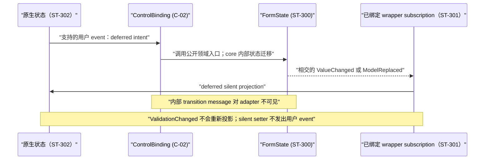

# Issue #199：gpui-form-gpui-component 子任务跟踪

## 根计划与所有权

- 状态：历史 `WP-300`–`WP-304` 保持 `Done`；本轮 adapter 更新计划为 `Done`
- 跟踪 issue：[#199](https://github.com/suxiaoshao/gpui/issues/199)
- 计划 ID：`issue-199`
- 根计划：[docs/dev/issue-199/README.md](../../../../../docs/dev/issue-199/README.md)
- 所有者目录：`crates/gpui-form-gpui-component`
- 所有者计划：`crates/gpui-form-gpui-component/docs/dev/issue-199/README.md`
- 所有者索引：[crates/gpui-form-gpui-component/docs/dev/README.md](../README.md)
- 引用的根所有 ID：`S-01`–`S-12`、`C-01`、`C-02`、`C-04`、`ERR-01`–`ERR-04`。本 owner 直接实现 `C-02`；`C-01` 是其 producer gate，`C-04` 是其 consumer gate。
- owner 编写的本地 ID/范围：`E/D/F/L/ST/R/T-300`–`399`；`WP-300`–`309`。
- 分配的 WP：`WP-300`–`WP-304`。
- 负责：把 core 提供的 total/partial descriptor 与 `ControlBinding` 契约落实为 gpui-component 的输入、选择、组合框和精确整数 owning controls，并删除 adapter 旧表单句柄 API。
- 不负责：descriptor/runtime/validation/submit 的定义（root 与 core）、宏生成（`C-01`）、Jaco 调用点迁移（`C-04`）、页面选项/焦点/保存策略（`S-12`），以及根计划、索引和历史 `docs/dev/issue-175/README.md` 的改写。

## 本轮新计划

- [Form binding adapter 更新实施计划](form-binding-adapter-update-plan.md)：消费 core `C-900`–`C-904`，
  使用 `E/D/F/L/ST/ERR/R/T-1100..1199` 与 `WP-1100..1109`；状态 `Done`。
- 本轮允许 breaking 且不保留兼容层；只规划 GPUI 自动化测试与 Cargo 门禁，不安排实际 UI 操作测试。
- 下文 `WP-300`–`WP-304` 及其证据是上一轮原始实施记录，不作为本轮执行计划。

## 本轮实施结果（2026-08-09）

- `WP-1100`–`WP-1103` 已完成；四个 adapter 已统一接入 binding/writer/projector 生命周期。
- 2 个 unit 与 15 个 adapter integration tests、Clippy、workspace check 和残留扫描通过。
- 实际 UI 操作测试未执行；完整证据见[本轮实施计划](form-binding-adapter-update-plan.md#实施证据)。

## 实施结果（2026-08-02）

- Input、Select、Combobox 与精确整数 wrapper 已提供 total `new` / partial `try_new`，仅保存
  subscriptions 与 native state；binding 只由 closure 捕获。
- 集成测试覆盖 total/partial、blur/change、peer projection、drop、精确整数 control issue、
  typed policy error 与当前 delegate；2 个单元测试和 9 个 adapter 测试通过。
- adapter manifest/source 未依赖 `gpui-operation`，旧 `FormControl`/`FormControlError` surface 零残留。

## 所有者本地证据

| E-ID | 分类 | 主张 | 证据 | 计划后果 |
| --- | --- | --- | --- | --- |
| E-300 | 当前事实 | 当前四个 wrapper 已按 `subscriptions` 后 native `Entity` 布局并 `Deref`，但构造器接收携带 `WeakEntity` 的 v1 `FormField`，且都返回 `FormControlError`。 | `src/{input,select,combobox,integer_input}.rs` | 保持最小 handle 的物理布局，替换全部 v1 field/trait/error 边界。 |
| E-301 | 当前事实 | 当前普通投影通过 `field.subscribe_in` 捕获 field 与 weak native entity；整数投影额外捕获 attachment 并在成功 setter 后清 issue。 | `src/{input,select,combobox,integer_input}.rs` | 保留该生命周期形状，但以 `C-02` 的 `ControlBinding` 和显式 form/descriptors 实现。 |
| E-302 | 当前事实 | 当前整数 parser 已用 ASCII sign/digits、`FromStr`、typed min/max 与 checked arithmetic；`NumberInput` 仅承载表现与 step event。 | `src/integer_input/{parse,policy}.rs`, `src/integer_input.rs:20-180` | 保留精确整数边界，补齐完整原语、构造/partial 错误和事件生命周期测试。 |
| E-303 | 当前事实 | 现有集成测试仍 derive `FormStore`、使用 `*_field(&form)` 并以 v1 `FormControl` 构造器绑定；当前 crate 没有 story/stories 路径。 | `tests/adapters.rs`, `rg --files crates/gpui-form-gpui-component | rg -i 'story|stories'` | 将 adapter test harness 重写为 `FormModel`/associated const；不创建没有消费者的 story。 |
| E-304 | 当前事实 | `Cargo.toml` 仅依赖 workspace 的 `gpui`、`gpui-component`、`gpui-form`，没有 adapter 专属 feature 或生成步骤。 | `Cargo.toml` | 不改 manifest、lockfile、feature 或生成链；依赖边界以 root Applicability 和发布 gate 为准。 |
| E-305 | 用户决定 | wrapper 不得缓存 descriptor、binding、form/value/options/focus/error flags；仅 `ControlBinding` 是可保存 form `WeakEntity` 的 UI/deferred 边界。 | Issue #199 任务说明；`S-01`–`S-12`、`C-02` | 所有构造/订阅实现以捕获而非 wrapper 字段保留 binding；删除兼容 shim。 |
| E-306 | 用户决定 | total 与 partial descriptor 必须在 API 中区分；调用 `bind_control` 时显式传 `&Entity<Form>`。 | Issue #199 任务说明；`S-03`、`C-02`、`ERR-01` | total 构造器无 structural `Result`，partial 构造器只公开 `FieldAccessError`。 |
| E-307 | 用户决定 | `gpui-form` core 内部使用 `gpui_operation::Transition` 与私有 message/effect；component adapter 继续调用 descriptor、form 与 `ControlBinding` 的公开领域方法，不发送或匹配内部消息。 | Core `E-110`/`D-109`；Issue #199 后续设计讨论 | 此 owner 只补消费边界；不修改 Issue、公开 README/guide、根计划或 Jaco 文档。 |

## 所有者本地决策

| D-ID | 决策 | 证据 | 实质性排除的替代方案 | 后果/owner |
| --- | --- | --- | --- | --- |
| D-300 | 每个 stateful adapter 提供 inherent `new`（total）和 `try_new`（partial），两者都将 `&Entity<Form>` 与 descriptor 作为最前两个参数；不再实现或导出 adapter 级 `FormControl` trait。 | E-300, E-305, E-306; S-01–S-04; C-02 | 继续让 descriptor 捕获 form，或用一个把 total/partial 都擦成 `Result` 的 trait。 | adapter API 直接表现强 form 与路径可用性；C-04 的所有消费者一次迁移。 |
| D-301 | `ControlBinding` 只由 `field.bind_control(form, cx)` / `field.try_bind_control(form, cx)?` 在有状态 control 构造时创建；adapter 只调用 `FormField`/`PartialFormField` 的公开领域方法和 `ControlBinding::{defer_set, defer_blur, defer_set_issue, defer_clear_issue}`，binding clone 只由 subscription closure 持有。 | E-301、E-305、E-307；S-07、C-02 | wrapper 字段保存 binding；让 adapter 自己 upgrade form weak handle；直接构造/发送 core message。 | 由 core 统一 defer、lease、drop、path disappearance 和内部 transition；wrapper drop 自动释放 subscriptions 中最后的 binding clone。 |
| D-302 | 与 descriptor path 相交的 `ValueChanged` 以及所有 `ModelReplaced` 都经公开 `subscribe_in`/`try_subscribe_in` 重新读取 descriptor 并 defer silent native setter；`ValidationChanged` 不投影。 | E-301；S-05–S-07、S-11 | origin/equality 过滤、read-back reconcile、echo skip，或把 `FormEvent` 转换为内部 message。 | origin、peer、equal lifecycle replacement 与 sibling-dependent projection 有相同的权威值投影；silent setter 是回路终点，adapter 不驱动 runtime transition。 |
| D-303 | Select/Combobox 的 delegate、items、不可用值、动态校验、disabled/placeholder/focus 保留在页面与 native state；adapter 没有 setter 包装、缓存或 fallback。 | E-300, E-304; S-11–S-12 | adapter 缓存 delegate/value-index map、选第一个值、写回 form，或刷新选项时自动动态校验。 | 调用方更新原生 items 后在同一操作内显式读取 form 并重投影，随后按应用策略运行动态校验。 |
| D-304 | `IntegerInputState<N>` 是唯一自定义 native state：保存 typed `N`、private editor text、typed policy 与 editor subscriptions；form 永远只保存 `N`。 | E-302; S-07, S-11, ERR-03 | 经过 `String`/`f64`、把 raw draft 放进 form，或在越界时 clamp。 | 支持全部标准有符号/无符号原语与 `u64 > 2^53`；invalid editor text 以 binding 生命周期 control issue 阻断 submit。 |
| D-305 | 此 owner 的 API 是有意破坏性变更：删除 v1 weak-field accessor、`FormControl`、`FormControlError` 和所有旧 constructor；不提供 alias、deprecated shim 或双路径。 | E-300, E-305; S-10, C-04 | 保留兼容 wrapper。 | 旧 consumer 编译失败即按 C-04 迁移；完成后 active source 无 legacy surface。 |
| D-306 | Adapter manifest、exports、active source 与 tests 不直接依赖 `gpui-operation`，不导入/re-export `Transition`，也不命名、构造或匹配 gpui-form 私有 message/effect。`ControlBinding::defer_*` 和 descriptor 领域方法是唯一写入入口。 | E-304、E-307；core `D-109`；C-02 | Adapter 自建 dispatch/message adapter；根据 operation phase 驱动 native UI；公开 core 内部协议以减少一层调用。 | `F-300`、`L-300`–`L-304`、`ST-300`–`ST-303`、`WP-300`–`WP-304`。 |

## 所有者本地目标设计

### 文件与所有权树

```text
crates/gpui-form-gpui-component/
├── Cargo.toml                                      # F-300 [不修改，手写] 不新增 gpui-operation 依赖/feature；Transition 仅属 core
├── src/lib.rs                                      # F-301 [修改，手写] 仅导出 v2 adapter 公开表面；移除 v1 trait/error exports
├── src/error.rs                                    # F-302 [修改，手写] integer policy 与 partial-integer build error；ERR-03 本地表示
├── src/input.rs                                    # F-303 [修改，手写] FormInput total/partial constructors 和两个 subscription
├── src/select.rs                                   # F-304 [修改，手写] FormSelect 当前 delegate 投影和 Confirm intent
├── src/combobox.rs                                 # F-305 [修改，手写] FormCombobox 当前 delegate 投影和 Change intent
├── src/integer_input.rs                            # F-306 [修改，手写] 精确 state、element、binding wrapper、issue mapping
├── src/integer_input/error.rs                      # F-307 [修改，手写] editor parsing 分类
├── src/integer_input/parse.rs                      # F-308 [修改，手写] 精确 parse shape/overflow/range 路径
├── src/integer_input/policy.rs                     # F-309 [修改，手写] typed bounds/step invariant
├── tests/adapters.rs                               # F-310 [修改，手写] GPUI v2 生命周期/integration tests
├── README.md 和 README.zh-CN.md                    # F-311 [修改，手写] 已实现的公开 API、英文默认版本及语义镜像
└── docs/{README.md,guide.md,guide.zh-CN.md}        # F-312 [修改，手写] 最终 contract/examples；实现后不再保留 preview 声明
```

不存在 adapter 自有的 story（E-303），因此不新增 `stories` F-ID。story/demo 覆盖不能替代 `tests/adapters.rs`；除非未来限定任务新增具名 consumer，否则不得新建 story。

`F-303`–`F-310` 依赖 `C-02`，但不依赖直接的 adapter 依赖变更。`F-311`–`F-312` 仅在最终签名和
行为实现后同步；本计划不修改它们。

### 所有者本地契约

#### L-300：total/partial 构造与最小 wrapper 布局

每个有状态 wrapper 严格只有两个字段，声明顺序如下，并实现 `Deref<Target = Entity<State>>`。它没有自定义 `Drop`；Rust 会因声明顺序先 drop `subscriptions`，再 drop native entity。

```rust,ignore
pub struct FormInput {
    subscriptions: Vec<Subscription>,
    input: Entity<InputState>,
}

pub struct FormSelect<D: SearchableListDelegate + 'static> {
    subscriptions: Vec<Subscription>,
    select: Entity<SelectState<D>>,
}

pub struct FormCombobox<D: SearchableListDelegate + 'static> {
    subscriptions: Vec<Subscription>,
    combobox: Entity<ComboboxState<D>>,
}

pub struct FormIntegerInput<N: IntegerValue> {
    subscriptions: Vec<Subscription>,
    input: Entity<IntegerInputState<N>>,
}
```

inherent constructors 是公开 binding API。`Build` 始终只配置 native state；它既不接收也不返回 descriptor/binding/form 数据。

```rust,ignore
impl FormInput {
    pub fn new<Form, Owner, Build>(
        form: &Entity<Form>,
        field: FormField<Form, String>,
        build: Build,
        window: &mut Window,
        cx: &mut Context<Owner>,
    ) -> Self
    where
        Form: FormState,
        Owner: 'static,
        Build: FnOnce(&mut Window, &mut Context<InputState>) -> InputState;

    pub fn try_new<Form, Owner, Build>(
        form: &Entity<Form>,
        field: PartialFormField<Form, String>,
        build: Build,
        window: &mut Window,
        cx: &mut Context<Owner>,
    ) -> Result<Self, FieldAccessError>
    where
        Form: FormState,
        Owner: 'static,
        Build: FnOnce(&mut Window, &mut Context<InputState>) -> InputState;
}
```

`FormSelect`、`FormCombobox` 和 `FormIntegerInput` 使用相同的参数顺序和分流方式。它们的 total/partial 结果类型由下文 L-302 和 L-303 固定。total field 绝不暴露 `ERR-01`，因为调用方拥有 `&Entity<Form>` 且 generated static path 有保证；`try_new` 仅将缺失的 projection/identified item 映射为 root-owned `ERR-01`。两条路径都不暴露 released-form error。

上述构造器只消费 descriptor、`FormField`/`PartialFormField` 和 `ControlBinding` 的公开领域 API。core 内部
使用 `gpui_operation::Transition` 对本 crate 完全透明；本 crate 不新增该依赖、不导入 `Transition`，也不构造、
匹配或缓存内部 message/effect。

#### L-301：`FormInput` 事件契约

`FormInput::new` 绑定 `FormField<Form, String>`；`try_new` 绑定 `PartialFormField<Form, String>`。total/partial 初始读取和 `C-02` binding 创建均成功后，二者共享一个私有内部构造器。

1. 经显式 form 调用 total `value` 或 partial `try_value` 读取初始 typed `String`；构建 `InputState`；在 subscriptions 存在前静默调用 `InputState::set_value`。
2. 通过 `field.bind_control(form, cx)` 或 `field.try_bind_control(form, cx)?` 创建 `ControlBinding`。
3. 仅用 `field.subscribe_in` 或 `field.try_subscribe_in` 安装 form subscription：捕获 descriptor（static 或 located）和 `WeakEntity<InputState>`；在相交的 `ValueChanged` 或任意 `ModelReplaced` 时 defer、upgrade native state，再以 `value`/`try_value` 重读并静默设置。忽略 `ValidationChanged`。
4. 安装 native subscription：捕获一个 `ControlBinding` clone；在 `InputEvent::Change` 时复制 `input.value()` 并只调用 `ControlBinding::defer_set`；在 `Blur` 时只调用 `defer_blur`；忽略 `Focus` 和 `PressEnter`。
5. 仅返回两个 L-300 字段。在 subscription 安装前失败时，不留下已 mount 的 binding/subscription。

projection subscription 绝不存储/捕获 binding 或 interaction flags。其 form/control/path 已不再存活的排队 binding intent，按 `C-02` 静默 no-op；adapter 既不默认 value，也不把修改 native state 作为 fallback。
任何 callback 都不构造 transition message；partial 重读失败时按公开领域 API 结果停止，不退化为直接 runtime mutation。

#### L-302：select 和 combobox 的精确 value 契约

```rust,ignore
impl<D> FormSelect<D>
where
    D: SearchableListDelegate + 'static,
    D::Item: SearchableListItem,
{
    pub fn new<Form, Owner, Build>(
        form: &Entity<Form>,
        field: FormField<Form, Option<<D::Item as SearchableListItem>::Value>>,
        build: Build,
        window: &mut Window,
        cx: &mut Context<Owner>,
    ) -> Self
    where Form: FormState, Owner: 'static,
          Build: FnOnce(&mut Window, &mut Context<SelectState<D>>) -> SelectState<D>;

    pub fn try_new<Form, Owner, Build>(/* same, PartialFormField */)
        -> Result<Self, FieldAccessError>
    where Form: FormState, Owner: 'static,
          Build: FnOnce(&mut Window, &mut Context<SelectState<D>>) -> SelectState<D>;
}

impl<D> FormCombobox<D>
where
    D: SearchableListDelegate + 'static,
    D::Item: SearchableListItem,
{
    pub fn new<Form, Owner, Build>(
        form: &Entity<Form>,
        field: FormField<Form, Vec<<D::Item as SearchableListItem>::Value>>,
        build: Build,
        window: &mut Window,
        cx: &mut Context<Owner>,
    ) -> Self
    where Form: FormState, Owner: 'static,
          Build: FnOnce(&mut Window, &mut Context<ComboboxState<D>>) -> ComboboxState<D>;

    pub fn try_new<Form, Owner, Build>(/* same, PartialFormField */)
        -> Result<Self, FieldAccessError>
    where Form: FormState, Owner: 'static,
          Build: FnOnce(&mut Window, &mut Context<ComboboxState<D>>) -> ComboboxState<D>;
}
```

初始及后续 Select projection 将 `Some(value)` 映射为 `set_selected_value(value, ...)`，将 `None` 映射为 `set_selected_index(None, ...)`；它使用 state 的当前 delegate。Select 只通过 binding clone 消费 `SelectEvent::Confirm(Option<Value>)` 并调用 `ControlBinding::defer_set`。Combobox projection 对其当前 delegate 调用 `set_selected_values(&values, ...)`，且只消费 `ComboboxEvent::Change(Vec<Value>)` 并调用 `defer_set`；忽略 `Confirm`。两个 subscription 都不实现 blur，也不构造 form 内部 message。

application 修改 native items/delegate 后，必须在同一次 owner update 中经显式 form 读取当前 value 并调用该 native setter（或重建此 wrapper）。缺失的 native options 只影响 selection presentation：不得 typed form write、fallback、control issue 或隐式 dynamic validation。

#### L-303：精确整数契约与构造失败

```rust,ignore
#[derive(Clone, Copy, Debug, PartialEq, Eq)]
pub enum IntegerInputPolicyError {
    NonPositiveStep,
    ReversedRange,
}

#[derive(Debug)]
pub enum FormIntegerInputBuildError {
    Field(FieldAccessError),
    Policy(IntegerInputPolicyError),
}

pub enum IntegerInputError<N> {
    Incomplete,
    InvalidSyntax,
    Overflow,
    OutOfRange { min: Option<N>, max: Option<N> },
}

impl<N: IntegerValue> FormIntegerInput<N> {
    pub fn new<Form, Owner, Build>(
        form: &Entity<Form>, field: FormField<Form, N>, build: Build,
        window: &mut Window, cx: &mut Context<Owner>,
    ) -> Result<Self, IntegerInputPolicyError>
    where Form: FormState, Owner: 'static,
          Build: FnOnce(&mut Window, &mut Context<IntegerInputState<N>>) -> IntegerInputState<N>;

    pub fn try_new<Form, Owner, Build>(
        form: &Entity<Form>, field: PartialFormField<Form, N>, build: Build,
        window: &mut Window, cx: &mut Context<Owner>,
    ) -> Result<Self, FormIntegerInputBuildError>
    where Form: FormState, Owner: 'static,
          Build: FnOnce(&mut Window, &mut Context<IntegerInputState<N>>) -> IntegerInputState<N>;
}
```

`IntegerInputPolicyError` 和 `FormIntegerInputBuildError` 是本 owner 对 root `ERR-03` 的 typed representation；其 `Display`/`Error` 实现保留 variant，`From<FieldAccessError>`/`From<IntegerInputPolicyError>` 只用于 partial build boundary。`FormControlError` 被删除，不会改名或 re-export。`IntegerInputError<N>` 绝不是 constructor error：L-303 将它映射为 C-02 lifecycle control issue codes/messages。

`IntegerValue` 保持 sealed，且严格支持 `i8`、`i16`、`i32`、`i64`、`i128`、`isize`、`u8`、`u16`、`u32`、`u64`、`u128` 和 `usize`。`IntegerInputState<N>` 拥有 `editor_subscriptions`、`Entity<InputState>`、typed `value` 及 `IntegerInputPolicy<N>`。它必须：

- 解析可选 ASCII 符号加数字，然后执行 `FromStr`，再作类型化范围检查；将空值/仅符号归类为 `Incomplete`，格式错误归类为 `InvalidSyntax`，解析失败归类为 `Overflow`，边界失败归类为 `OutOfRange`；
- 保留 invalid raw editor text 与最后一个有效 typed `N`；不访问 form 即发出 `IntegerInputEvent::Change(Result<N, IntegerInputError<N>>)`；
- 静默 `set_value` 替换 typed projection 和 canonical editor text，且不发出 user event；
- 在安装任意 `ControlBinding` 或 wrapper subscription 前验证 `step > N::ZERO` 和 `min <= max`；
- 对 step 使用 `checked_add`/`checked_sub` 加类型化 bounds；overflow/out-of-range 时不作处理，绝不 clamp 或转换为 `f64`。

整数 native-event subscription 捕获 binding clone：valid edit 依次调用 `ControlBinding::defer_clear_issue`、`defer_set`；invalid edit 调用 `defer_set_issue` 且不写 form；blur 调用 `defer_blur`。将 editor errors 映射至 `integer_input_incomplete`、`integer_input_invalid`、`integer_input_overflow` 或 `integer_input_out_of_range`，以及既有 `gpui-form-error-integer-{incomplete,invalid,overflow,min,max,range}` messages；只传 Display-string `min`/`max` params。整数 form projection 是 L-301 允许的唯一例外：仅在 descriptor read、weak-state upgrade 与静默 `set_value` 全部成功后，捕获同一 binding clone 并调用 `defer_clear_issue`。projection failure 保持 issue active。这些调用都是 C-02 的公开领域 intent；adapter 不构造与之对应的内部 message。

#### L-304：exports 与删除边界

`src/lib.rs` 仅导出 `FormInput`、`FormSelect`、`FormCombobox`、`FormIntegerInput`、`IntegerInput`、`IntegerInputState`、`IntegerInputEvent`、`IntegerInputError`、`IntegerInputPolicy`、`IntegerInputPolicyError`、`FormIntegerInputBuildError` 和 `IntegerValue`。

它不 export `FormControl`、`FormControlError`、weak form-bound field constructors、旧 matching-element helpers、configuration/delegate wrappers、focus/blur/error-visibility mirrors、source/control IDs 或 binding read-back APIs，也不 re-export `Transition`、任何 `gpui-operation` 类型或 gpui-form 内部 message/effect。任何旧 active source import 都是由 C-04 处理的有意 compile error；不存在 adapter-level compatibility type。

### 边界实现

#### C-02 / ERR-01 / ERR-03：core descriptor 与 `ControlBinding` 消费

core 拥有 definition、weak-form storage、deferred scheduling、lease liveness、`FieldAccessError` 与 control-issue state。本 crate 如下消费它：

- total constructors 将 `&Entity<Form>` 传给 total `FormField`；initial read 和 `bind_control` 是不失败的 structural operations；
- partial constructors 使用 `try_*` descriptor reads 和 `try_bind_control(form, cx)`；仅在 projection/item 无法 resolve 时精确返回 root `ERR-01`，没有 synthetic `FormReleased`/fallback case；
- 只有 component event subscriptions 捕获 `ControlBinding` clones 并调用其公开 `defer_set`/`defer_blur`/`defer_set_issue`/`defer_clear_issue`；没有 callback 读取 weak form、执行 immediate field mutation、观察 source/control identity 或构造内部 message；
- 最后一个 binding clone drop 会结束其 private lease 并使其 issue/queued intents inactive；普通 projections 不保持 lease 存活（integer 有 L-303 例外）；
- `IntegerInputPolicyError` 和 `FormIntegerInputBuildError` 在本地呈现 constructor failures，不改变 root `ERR-03` 的含义。

gpui-form 私有拥有 message/effect 类型与 `Transition` 实现。本 crate 只消费公开 descriptor/field 领域方法和
`ControlBinding::defer_*`；core 在 deferred callback 内部把 intent 转成 transition message。adapter 不直接依赖、
转发、记录或测试该协议的具体名称。

#### C-04：adapter 消费者迁移

所有 Jaco 和其他 consumers 都将 v1 `*_field(&form)`/`FormControl` calls 替换为显式 `&Entity<Form>` 加 generated associated const descriptor calls。adapter owner 提供最终 APIs、integration tests 和 public examples；consumer-specific rendering、form declaration、catalog refresh、focus 与 persistence 保持为 C-04 owner work。该 rollout 是有意 breaking 的：`WP-300` 在 C-04 consumers 迁移前于同一 atomic worktree 中移除 adapter legacy symbols，因此 workspace 可暂时不可构建；不发布 intermediate state，也不存在 mixed-version behavior。

### GPUI 应用契约

#### 状态与所有权契约

##### ST-300：类型化字段值与验证

- **权威：** generated `FormState` runtime，遵循 S-01–S-08；本 crate 不拥有 business-value field。
- **初始化与生命周期：** caller 在 L-300 construction 前创建 strong `Entity<Form>`；form lifetime 仍由 caller 所有。
- **读取者：** L-301–L-303 initial/projection paths，以及经显式 descriptor + form 的 application render code。
- **变更：** stateful native event 的唯一 form 写入口是 `ControlBinding::defer_*` 公开领域方法；stateless app-owned controls 使用 root total/partial descriptor API。core 如何用 `Transition` 落实调用对 adapter 不可见。
- **发布与投影：** core 发出 `ValueChanged`/`ModelReplaced`；每个 mounted L-301–L-303 subscription 都为相交 value path 或 model replacement defer 一次 silent native projection，而 `ValidationChanged` 不 reproject values。
- **持久化边界：** adapter 中无；submit/save 属于 S-08/S-12。
- **重置与取消：** form lifecycle replacement 即使 value 相等也触发 projection；binding lease/drop 静默取消 deferred control intent。

##### ST-301：owning wrapper 订阅与 binding lease

- **权威：** 每个 L-300 plain wrapper 严格拥有其 `Vec<Subscription>`。
- **初始化与生命周期：** constructor 在 initial projection 后安装；Rust field drop 在 native entity 前释放 subscriptions。Binding clones 仅存在于 closures 中，最后一次 drop 由 C-02 管理。
- **读取者：** 仅 native event callbacks 和 form event callbacks；closure 只能读取公开 descriptor/field API 或调用 `ControlBinding`，不得读取 `FormRuntime`、匹配 transition state 或创建内部 message。
- **变更：** 没有 mutable public wrapper state；app 经 dereferenced entity 改变 native configuration。
- **发布与投影：** subscriptions 桥接 ST-300 events 和 native events；wrapper 既不通知第二个 business store，也不缓存 projection。
- **持久化边界：** 无。
- **重置与取消：** wrapper drop 取消 subscriptions；弱原生状态升级失败会取消 form-to-native 工作；form/path 消失会取消 C-02 intent，或仅在显式 partial API 调用中产生 `ERR-01`。

##### ST-302：原生组件交互状态

- **权威：** `InputState`、`SelectState<D>`、`ComboboxState<D>` 或 L-303 `IntegerInputState<N>`。
- **初始化与生命周期：** L-300 construction closure 创建 entity；wrapper 是其 strong handle；native weak handles 只出现在 deferred projection closures 中。
- **读取者：** upstream elements 和 L-301–L-303 event/projection callbacks。
- **变更：** supported user events 更新 native interaction state；L-301–L-303 静默应用 form values；page/controller 直接更新 configuration/items。
- **发布与投影：** native state 为 user intent 发出一次 upstream event；silent setters 不发出 binding event。
- **持久化边界：** 无。
- **重置与取消：** programmatic form projection 覆盖 stale native display；integer successful projection 还只清除自己的 editor issue。

#### 交互与运行时流程

##### ST-303：有状态控件往返流程

1. L-300 读取显式 form value、构建 native state、静默初始化它并创建 C-02 binding。
2. supported native event 复制 owned typed payload，并调用相应的 `ControlBinding::defer_*` 公开方法；它绝不同步更新 emitting entity 或 form，也不创建 transition message。(`R-300`, `T-301`–`T-304`)
3. `ControlBinding` 在 emitter update 结束后检查 weak form/path/lease，并在 core 内部完成排队和状态迁移；adapter 看不到 message/effect。有效且变化的值提交一次、运行根验证/事件语义并发布 `ValueChanged`；过期 binding 静默结束。(`R-301`, `T-305`)
4. 每个 mounted adapter 通过 `subscribe_in`/`try_subscribe_in` 看到相交的 `ValueChanged` 或任意 `ModelReplaced` 后，仅 weak-upgrade 自己的 native state，经公开 `value`/`try_value` 重读 authoritative value，并使用 silent setter。(`R-302`, `T-306`–`T-309`)
5. silent setter 不产生新的 user event。仅对 L-303，successful programmatic projection 会排队 clear-issue；invalid user text 保持 native，直至 valid edit、successful projection 或 binding lease 结束。(`R-303`, `T-310`–`T-314`)

### 状态与数据流



options 在此 sequence 之外变更：page/controller 更新当前 native delegate/items，立即重读 ST-300，使用 native setter 投影或重建 wrapper，并独立决定是否调用 dynamic validation。adapter 不会以 form mutation 响应 options changes。

### Fluent i18n 与 Bundle 本地化

本 crate 不拥有 locale file。L-303 只发出 root validation-message keys 和 scalar Display parameters；由 application localization 渲染。此 owner 不新增 user-visible static copy、macOS bundle string、asset、icon、telemetry event、database、network、async task、packaging input 或 platform branch。

## 所有者本地工作包

### WP-300：以显式 total/partial constructors 替换 generic weak-field binding

**负责人**

`crates/gpui-form-gpui-component`

**前置条件与契约**

- C-02 提供最终的 total/partial 描述符、explicit-form `bind_control`/`try_bind_control`、`subscribe_in`/`try_subscribe_in`、`ControlBinding::defer_*` 和共享 lease 语义；core-private transition protocol 不属于 C-02。
- S-01–S-07、D-300–D-302 和 D-306。

**文件 ID**

- F-301, F-303, F-310.

**实施顺序**

1. 从 `input.rs` 删除 v1 `FormControl`、`FormStore`、弱绑定的 `FormField` 构造方式和 `FormControlError` 的 imports/impls。
2. 实现 L-300/L-301 total 和 partial constructors，并保证初始 `value`/`try_value`、`bind_control`/`try_bind_control`、`subscribe_in`/`try_subscribe_in`、`ControlBinding::defer_set`/`defer_blur` 与 error 的精确顺序；不得直接访问 runtime 或发送内部消息。
3. 仅在所有替换符号编译后更新 `lib.rs`；不得给 v1 callers 保留 alias。

**失败与生命周期行为**

按 L-301 的规定消费 C-02/ERR-01；adapter code 不存在 native fallback、同步重入、binding 字段或 form 弱引用升级。

**测试**

| R-ID | T-ID/文件 | 拟议场景 | 固件/mock | 断言 |
| --- | --- | --- | --- | --- |
| R-300 | T-300 `tests/adapters.rs` | total 输入构造器 | 生成的静态 `String` descriptor | 返回 `FormInput`；初始读取/绑定/订阅只使用公开 field/binding API；没有结构性 `Result` |
| R-301 | T-301 `tests/adapters.rs` | input Change 后延迟清空队列 | blur/change 校验固件 | 只调用 `ControlBinding::defer_set`；form 在清空队列后变更，validator 看到新 value |
| R-302 | T-302 `tests/adapters.rs` | input Blur | 必填且仅在 blur 校验的字段 | 没有 focus mirror；只调用 `defer_blur`，blur validation 经 binding 运行 |
| R-303 | T-303 `tests/adapters.rs` | partial path 在 bind 前消失 | identified/projection 固件 | `try_new` 仅返回 `FieldAccessError`；不保留 control |

**定向验证**

| 命令/手动场景 | 目的 | 所需环境 | 预期证据 |
| --- | --- | --- | --- |
| `cargo test -p gpui-form-gpui-component --test adapters --locked form_input` | v2 input 构造/event 生命周期 | 最终 C-02/core+macro APIs | 全部 T-300–T-303 通过 |

**完成条件**

`FormInput` 仅有 L-300 字段，total/partial 签名精确；manifest/source/test 不新增 `gpui-operation` 直接依赖、
`Transition` import 或内部 message 构造，且 `input.rs` 中不残留 v1 form-handle 或通用 binding trait。

### WP-301：通过当前 native delegate 绑定 Select 与 Combobox

**负责人**

`crates/gpui-form-gpui-component`

**前置条件与契约**

- WP-300；L-302；C-02；D-302–D-303。

**文件 ID**

- F-304, F-305, F-310.

**实施顺序**

1. 以 L-302 total/partial explicit-form constructors 和 C-02 closure-captured bindings 替换 v1 constructors；initial/subsequent projection 只调用公开 field read/subscription 与 native setter。
2. 仅保留 Select Confirm 与 Combobox Change 作为 native-to-form events，并都只调用 `ControlBinding::defer_set`；将所有字段/模型替换 events 接到正确的静默当前 delegate setters。
3. 删除 adapter-owned delegate/item/value-index availability behavior；记录/测试 application-owned immediate re-projection，而不是新增 adapter APIs。

**失败与生命周期行为**

partial construction 报告 ERR-01；缺失 delegate value 时类型化 value 保持不变，既不是 error 也不是 fallback。

**测试**

| R-ID | T-ID/文件 | 拟议场景 | 固件/mock | 断言 |
| --- | --- | --- | --- | --- |
| R-304 | T-304 `tests/adapters.rs` | 带 `Some` 和 `None` 的 Select Confirm | 当前 delegate | 每次 confirm 恰好调用一次 `defer_set` |
| R-305 | T-305 `tests/adapters.rs` | Combobox Change 后接 Confirm | 多个 delegate | Change 调用一次 `defer_set`；忽略 Confirm |
| R-306 | T-306 `tests/adapters.rs` | option 重排/移除 | 不触发 form event 地更新原生 items | 经公开 field read/native setter 立即按当前 delegate 投影；类型化 form 保持不变 |
| R-307 | T-307 `tests/adapters.rs` | 原生 entity 更新期间发出 event | 真实 GPUI event | 不出现 already-being-updated panic |

**定向验证**

| 命令/手动场景 | 目的 | 所需环境 | 预期证据 |
| --- | --- | --- | --- |
| `cargo test -p gpui-form-gpui-component --test adapters --locked select combobox` | selection value/event 行为 | 最终 gpui-component source identity | T-304–T-307 通过 |

**完成条件**

selection wrappers 不保留 descriptor/binding/delegate/options state；native APIs 投影当前 values，C-02 拥有每一次 form mutation。

### WP-302：完成精确整数 state 与 control-issue lifecycle

**负责人**

`crates/gpui-form-gpui-component`

**前置条件与契约**

- WP-300；L-303；C-02；ERR-03；D-304。

**文件 ID**

- F-302, F-306, F-307, F-308, F-309, F-310.

**实施顺序**

1. 在不进行浮点转换的前提下完成 sealed `IntegerValue`、policy validation、parser classifications 和 checked step。
2. 在创建 binding/subscriptions 前验证 native policy；根据 L-303 实现 total policy 和 partial field-or-policy error surfaces。
3. 将 integer events 精确接到 `defer_clear_issue`/`defer_set`/`defer_set_issue`/`defer_blur`，并且只允许 successful-programmatic-projection binding capture exception；editor error 不映射为 adapter 自建 transition message。
4. 保留 upstream `NumberInput` presentation/focus，同时将所有类型化数字逻辑保留在 `IntegerInputState`。

**失败与生命周期行为**

`NonPositiveStep`/`ReversedRange` 在没有 bound control 的情况下停止 construction。无效的 raw editor text 仅存在于 native，保持 form `N` 不变并经 C-02 issue 阻断 submit；failed weak projection 不会清除它。step bounds/overflow 是 no-op。

**测试**

| R-ID | T-ID/文件 | 拟议场景 | 固件/mock | 断言 |
| --- | --- | --- | --- | --- |
| R-308 | T-308 `src/integer_input.rs` | 每种标准 primitive 的边界 | min/max 字面量 | parse/format 精确往返 |
| R-309 | T-309 `src/integer_input.rs` | `9_007_199_254_740_993u64` | 精确字面量 | 不发生 `f64` 转换或精度损失 |
| R-310 | T-310 `tests/adapters.rs` | 无效文本分类 | empty/sign/letters/overflow/range | 保留 form；只经 `defer_set_issue` 使匹配 control issue active |
| R-311 | T-311 `tests/adapters.rs` | 带 origin 和 peer 的有效编辑 | 两个 integer controls | 一次 typed write；两者都有 canonical native texts |
| R-312 | T-312 `tests/adapters.rs` | 无效 raw text 之后的程序化覆盖 | 已 mounted 的 integer | successful projection 只经 `defer_clear_issue` 清除 editor issue；failed projection 保留它 |
| R-313 | T-313 `tests/adapters.rs` | lease/drop 与 blur | queued intent + wrapper drop | blur 只经 `defer_blur`；最终 clone 使 issue inactive；没有 stale write |
| R-314 | T-314 `tests/adapters.rs` | checked signed/unsigned stepping | bounds 和 extrema | 没有 clamp/overflow；保留精确 value |

**定向验证**

| 命令/手动场景 | 目的 | 所需环境 | 预期证据 |
| --- | --- | --- | --- |
| `cargo test -p gpui-form-gpui-component --locked integer` | integer 单元与集成生命周期 | 最终 C-02/core API | T-308–T-314 通过 |

**完成条件**

所有标准 primitives、parser states、policy/build errors、issue lifetime、programmatic replacement 和 checked step behavior 均有定向覆盖；没有类型化 numeric path 使用 `f64`。

### WP-303：验证 legacy removal 并重写 adapter integration coverage

**负责人**

`crates/gpui-form-gpui-component`

**前置条件与契约**

- WP-300–WP-302、Jaco `WP-400..405` 和 C-04 `consumer-complete`；D-305、D-306。

**文件 ID**

- F-300, F-301, F-310.

**实施顺序**

1. 将 `AdapterHarness` 和全部 tests 重写为 `FormModel`、associated const descriptors、显式 `Entity<Form>` 与 total/partial APIs。
2. 验证 `WP-300` 移除的 v1 exports；只删除 C-04 consumers 迁移后发现的 residual `FormControl`/`FormControlError` exports、过期 imports、constructors、helpers 或 fixtures。
3. 新增在 active Rust matches 时失败的 boundary residual test/CI command，覆盖 `Cargo.toml`、`src` 和 `tests`；除 legacy symbol 外，还认证没有 `gpui-operation` dependency、`Transition` import/re-export 或 core-private message 构造。不得保留 compatibility symbol 或复制内部协议来让它通过。

**失败与生命周期行为**

旧 imports 是有意的编译期中断。既有 production rendering 必须经 C-04 迁移，不得测试 mixed old/new adapter boundary。

**测试**

| R-ID | T-ID/文件 | 拟议场景 | 固件/mock | 断言 |
| --- | --- | --- | --- | --- |
| R-315 | T-315 `tests/adapters.rs` | origin、peer 和相等的 `ModelReplaced` | 两个 controls/static 及 sibling projection fields | 每个 mounted control 都经公开 subscription/read API 静默投影，不匹配 runtime transition state |
| R-316 | T-316 `tests/adapters.rs` | 仅 runtime 的更新 | validation/context change | 不调用 value setter |
| R-317 | T-317 边界残留检查命令 | manifest/active source/test scan | adapter `Cargo.toml`、`src/**/*.rs`、`tests/**/*.rs` | 不存在 v1 API、`gpui-operation` dependency/path、`Transition` import/re-export 或 core-private message 构造 |

**定向验证**

| 命令/手动场景 | 目的 | 所需环境 | 预期证据 |
| --- | --- | --- | --- |
| `rg -n 'FormControl|FormControlError|FormStore|_field\\(|gpui[_-]operation|\\bTransition\\b' crates/gpui-form-gpui-component/Cargo.toml crates/gpui-form-gpui-component/src crates/gpui-form-gpui-component/tests` | 检测禁止的 v1 API 与 transition 越界 | source checkout | manifest/生效源码/positive test 零匹配；负向 fixture 如有则逐项说明 |
| `cargo test -p gpui-form-gpui-component --all-features --locked` | 完整 adapter crate | C-02/C-04 迁移完成 | 全部 adapter tests 通过 |

**完成条件**

tests 证明 v2 领域 API 下的 projection/event/drop 行为，且 adapter manifest/active source 不含 legacy compatibility
surface 或 core-private transition protocol。

### WP-304：在代码最终确定后同步 public contract

**负责人**

`crates/gpui-form-gpui-component`

**前置条件与契约**

- WP-303；最终 L-300–L-304 签名；C-02。

**文件 ID**

- F-311, F-312, F-310.

**实施顺序**

1. 仅在代码和测试确立精确公开 API 后替换设计预览措辞；同步英文 README/guide 与中文语义镜像。
2. 使 examples 覆盖 total/partial constructors、显式 form argument、event/projection rule、options immediate re-projection、integer issue behavior 与无 fake boolean wrapper。
3. 为每个不能用 GPUI fixtures doctest 的 public example 新增 compile-equivalent integration coverage；不保留 stale `FormControl` 或 weak-field example。

本次内部 `Transition` 决策不改变 adapter 的公开签名或使用方式，因此不会单独触发 `F-311`/`F-312`
修改，公开文档也不得新增 message、dispatch、phase 或 `Transition` 示例。`WP-304` 仍只在整体 v2 API 实现并
最终确定后，完成原计划中的中英文公开文档同步。

**失败与生命周期行为**

文档区分 total 的不失败 structural path 与 partial `ERR-01`，以及 integer policy constructor error 与 lifecycle editor issue。它不暴露 binding internals、weak handles、IDs 或 read-back APIs。

**测试**

| R-ID | T-ID/文件 | 拟议场景 | 固件/mock | 断言 |
| --- | --- | --- | --- | --- |
| R-318 | T-318 `tests/adapters.rs` | 已文档化的 total/partial/自定义 adapter 构造 | 最终 core 夹具 | 公开领域签名和捕获边界可编译；示例不导入消息或 `Transition` |
| R-319 | T-319 文档对等性/链接检查 | 英文/中文 README/guide | 仓库路径 | 链接存在，语义章节匹配，没有预览/v1 术语，也没有内部 transition 协议 |

**定向验证**

| 命令/手动场景 | 目的 | 所需环境 | 预期证据 |
| --- | --- | --- | --- |
| `cargo test -p gpui-form-gpui-component --doc --locked` | 公开文档片段 | 最终公开 API | doctest 通过；有意忽略的 GPUI 等价夹具由 T-318 覆盖 |
| `git diff --check -- crates/gpui-form-gpui-component` | 文档/源码空白完整性 | 工作树 | 没有错误 |

**完成条件**

公开文档仅描述已实现的 v2 行为，英文/中文保持语义镜像，代表性 API 示例由 doctest 或 T-318 验证。

## 定向验证与交接

| R-ID | 所有者/WP | 自动化/手动证据 | 预期结果 | 外部前置条件 |
| --- | --- | --- | --- | --- |
| R-300–R-303 | WP-300 | T-300–T-303；定向 input test | total/partial input 和 deferred blur/change behavior | C-02 可用 |
| R-304–R-307 | WP-301 | T-304–T-307；定向 selection tests | 精确 events/current delegate/no reentrancy | C-02 和所需 gpui-component setter |
| R-308–R-314 | WP-302 | T-308–T-314；定向 integer test | 精确 parse/format/policy/issue/step lifecycle | C-02 |
| R-315–R-317 | WP-303 | T-315–T-317；完整 adapter test 和边界残留扫描 | 覆盖全部 projection events；没有 v1 source 或 transition 越界 | C-04 callers 已迁移 |
| R-318–R-319 | WP-304 | T-318–T-319；文档检查 | examples 可编译，且公开文档与 code 匹配 | 最终 API 完整 |

现在运行仅文档检查：root/owner links、所需 IDs、Markdown code fences，以及 `git diff --check -- crates/gpui-form-gpui-component/docs/dev/issue-199/README.md`。上面的 Cargo commands 是未来 implementation evidence，不得报告为已在此次 owner-plan creation 中运行。
