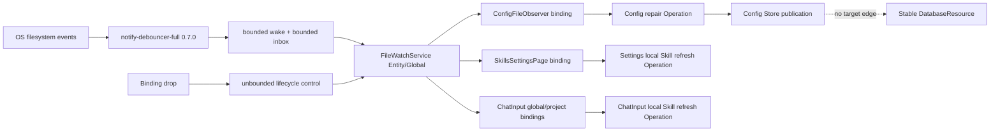

# Issue #178：Jaco 自动同步外部配置与 Skill 变更

## 状态与范围

- 状态：`Implemented on branch / 已在分支实施，等待原生/人工/CI验证`。核心代码路径与本地自动化验证已完成；原生 smoke、人工/bundle 与跨平台 CI 尚未完成。
- 关联 issue：[#178](https://github.com/suxiaoshao/gpui/issues/178)
- Plan ID：`issue-178`
- 根计划：`docs/dev/issue-178/README.md`
- 根索引：[Workspace development plans](../README.md)
- 分支：`codex/178-jaco-monitor-external-file-backed-state-changes`
- 受影响 owner：`app/jaco`、workspace `Cargo.lock` 与开发文档索引
- Release gate：无；首次实现必须通过现有 macOS、Linux、Windows CI，Linux 不承担历史数据迁移
- 最近证据刷新：2026-08-18
- 实施引用：`codex/178-jaco-monitor-external-file-backed-state-changes`；提交与 PR 见 GitHub 分支历史

### 高影响变更摘要

| 审计门 | 结果 | 权威 ID |
| --- | --- | --- |
| Workspace/crate topology and ownership | [Add] Jaco 新增 app-owned 路径与文件监听模块；不新增 crate，不修改 `jaco-agent` | `D-03`、`D-04`、`F-01`、`WP-101`、`WP-102` |
| Public or cross-owner contracts | None；所有新 Rust surface 均为 `pub(crate)`，`jaco-agent` 每次运行扫描 Skill 的契约保持不变 | `D-05`、`C-01` |
| Global/shared authority | [Add] `FileWatchService` 是唯一 native watcher authority；Config observer 与 warning owner 是私有 app-lifetime Entity，业务消费者只持本地 binding/dirty/Operation | `D-04`、`D-06`、`WP-102`–`WP-104` |
| Persistence, data, configuration, or credentials | [Breaking] 删除 `storage.data_dir` 与 Config→Database target/rebind；数据库成为启动时固定的单目标资源；[Security-sensitive] MCP 长期草稿使用语义冲突检查，凭据清理后置 | `D-01`、`D-02`、`D-09`、`ERR-02`–`ERR-04`、`WP-101`、`WP-103` |
| Runtime, concurrency, performance, or shutdown | [Add] 300 ms debounce、容量 1 wake channel、1024 path 上限、独立可靠注销通道、overflow all-dirty、稳定祖先监听、显式 shutdown | `D-04`、`D-06`、`D-08`、`C-01`、`ERR-01`、`WP-102` |
| Security, privacy, or external access | [Security-sensitive] 只监听用户明确范围内的本地路径；不记录文件内容/凭据，通知不暴露路径或底层 cause | `D-05`、`D-08`、`R-09`、`WP-102`、`WP-105` |
| Dependencies, toolchains, generated, or vendored artifacts | [Add] Jaco 直接依赖 `notify-debouncer-full = "0.7.0"`；Cargo 生成 lock diff，并接受既有 notify 7 与新增 notify 8 并存 | `D-04`、`F-01`、`G-01`、`WP-01` |
| Platform, packaging, CI, or release | [Modify] 使用各平台 RecommendedWatcher；无新增 bundle/native bootstrap 配置；三平台 CI 验证真实临时目录 smoke | `D-04`、`D-08`、`C-01`、`R-11`、`WP-02` |
| User-visible compatibility, defaults, or removals | [Breaking] `storage` 不再生成或生效；持久删除 `config.toml` 表示恢复默认配置；`state.toml` 不跟随外部变化；不迁移旧数据库 | `D-01`、`D-02`、`D-05`、`D-07`、`R-01`–`R-06` |

### 目标

1. Jaco 运行期间自动应用外部对 `config.toml`、`~/.agents/skills` 与当前项目
   `.agents/skills` 的新增、修改、删除和原子替换。
2. 数据库位置与 Config Store 完全解耦：生产固定为
   `dirs_next::data_dir()/top.sushao.jaco/jaco.sqlite3`，配置变化不再切库。
3. `JACO_CONFIG_DIR` 只作为测试/打包 smoke 的隔离根，同时承载 config、state、database、附件和
   scratch project；生产配置目录与数据目录仍按各自平台语义解析。
4. 外部事件只产生 invalidation；配置和 Skill 的既有 owner/Operation 继续负责读取、状态、错误和 UI。
5. 文件监听失败不阻止启动，保留手动 Reload/Refresh，并在整个进程中最多显示一次非阻塞警告。

### 非目标

- 不监听 SQLite 主库或 sidecar、`state.toml`、prompts、providers、shortcuts、projects 或附件。
- 不给 `state.toml` 增加 reload/merge/conflict；运行期间内存状态仍是唯一 authority，后续 Jaco save
  可以覆盖外部写入。
- 不迁移、复制、查找或合并旧数据库，不读取旧 `storage.data_dir`，不保留动态 rebind 兼容层。
- 不修改 Diesel schema、migration、repository 数据模型或 `jaco-db`。
- 不修改 `jaco-agent` Skill 扫描/加载；Agent run 继续每次读取当前文件。
- 首版不启用 `PollWatcher`、周期轮询、内容扫描 fallback、跨进程事件总线或通用 workspace watcher crate。
- 不自动覆盖无效 TOML，不自动合并同一 MCP server 的并发编辑，不重置已打开的表单草稿。
- 不为 watcher 增加新设置项、图标、对话框或阻塞式错误页。

### 用户决定

- 删除 `StorageConfig`、`JacoConfig::storage` 和 `storage.data_dir`；数据库使用 data dir。
- `config.toml` 与 `state.toml` 留在 config dir；`state.toml` 不跟随外部变化。
- `JACO_CONFIG_DIR` 只用于测试/打包 smoke，并隔离 config、state 和 database。
- Linux 尚未真正发布；不做迁移；用户从未自定义 `storage.data_dir`。
- 不再根据 Config Store 变化重绑数据库；旧 issue 评论中的动态切库设计由本计划取代。
- 监听 `config.toml`、全局 Skill 和当前项目 Skill；排除数据库及其他 file-backed state。
- 使用 `notify-debouncer-full = "0.7.0"`；接受 notify 7/8 双版本。
- 采用一个 app-lifetime watcher service；使用方持本地 binding、dirty 状态及自己的 Operation。
- 300 ms debounce；bounded channel overflow 视为需要重新扫描；运行中收到事件后完成一次再补一次。
- 持久删除 `config.toml` 表示用户希望恢复默认配置；原子保存中的短暂缺失不得触发重置。
- 其余技术问题采用本文推荐：稳定祖先监听、内容相等抑制 self-write、无 PollWatcher fallback、
  watcher 失败降级、打开草稿保留并在不安全保存时报告冲突。

### 兼容与迁移策略

- 本次是有意 breaking cleanup。序列化输出不再包含 `[storage]`；serde 对未知 `[storage]` 的既有
  宽松解析只会忽略它，运行时绝不读取其值，下一次 Jaco 写配置时自然移除该段。
- 生产数据目录没有 migration、legacy lookup、copy 或 fallback。macOS 的 platform config/data
  base 当前落在同一 Application Support 位置；其他平台直接采用 data-dir 目标。
- 因此 macOS 上删除整个 `top.sushao.jaco` Application Support 目录也会删除 SQLite 文件；
  本 issue 只让 config watcher 重建默认配置，不承诺恢复数据库或保持已打开 SQLite session 可用。
- `JACO_CONFIG_DIR` 设置时，所有 app data helper 返回同一隔离根；未设置时不得让 config dir
  反向决定 data dir。
- SQLite schema/data 原样保留；只改变未发布平台上的文件定位。回滚代码不会主动搬运或删除文件。
- 配置文件丢失只在 debounce 后仍不存在时创建默认文件。存在但无效时保留原 bytes 和 last-good
  `ConfigData`，继续使用既有 Degraded/Unavailable 与人工 repair。
- watcher 是可选运行能力。初始化、注册或运行失败时 manual Reload/Refresh 是兼容路径；应用仍可运行。

### 计划映射

| 范围 | 文档 | 职责 | ID / 工作包 |
| --- | --- | --- | --- |
| 根计划 | 本文 | 状态、范围、S/C/ERR、共享决定、依赖、顺序、聚合验证和完成证据 | `S-*`、`E-01`–`E-18`、`D-01`–`D-10`、`C-01`–`C-02`、`ERR-01`–`ERR-04`、`R-01`–`R-12`、`T-01`–`T-12`、`F-01`–`F-03`、`G-01`、`WP-01`–`WP-02` |
| Jaco | [owner 计划](../../../app/jaco/docs/dev/issue-178/README.md) | app-local 路径、数据库、watch service、config/Skill 消费者、草稿冲突、i18n、测试和 owner 文档 | `E-101+`、`D-101+`、`F-101+`、`L-101+`、`ST-101+`、`R-101+`、`T-101+`、`WP-101`–`WP-105` |

## 适用性

除 `S-19` 的完成状态外，本表保留实施前基线，供设计决定追溯；当前实施与验证结果以文末“完成证据”为准。

| S-ID | Canonical surface | 状态 | 当前证据 | 目标决定或负面理由 | Owner / WP |
| --- | --- | --- | --- | --- | --- |
| `S-01` | Workspace, files, modules, and owner boundaries | Applicable | `foundation.rs` 与 `app.rs` 已是 app-local 子模块入口；仓库没有 Jaco path/file-watch owner | 新增 `foundation/paths.rs` 与 `app/file_watch.rs`，不新增 crate/`mod.rs` | `D-03`、`F-01`–`F-03`、`WP-01`、`WP-101`–`WP-105` |
| `S-02` | GPUI components, layout, interaction, and accessibility | Applicable | Config/Skill 已有 recovery、banner、manual Refresh；Notification 已用于非阻塞反馈 | 复用现有 UI，仅增加一次 watcher warning 和 MCP conflict 文案；不改布局/焦点 | `D-08`、`ERR-01`、`ERR-04`、`WP-105` |
| `S-03` | Entity, Store, Global, identity, and projections | Applicable | Config 在 Store；Skill Operation 在页面/controller；app 已有 Entity+Global owner 范式 | service 为唯一native watcher authority；Config observer/warning owner私有；Store不拥有watcher I/O | `D-04`、`D-06`、`WP-102`–`WP-104` |
| `S-04` | Actions, events, subscriptions, focus, and windows | Applicable | Skill manual action与项目 scope handler 已存在；GPUI `Subscription` drop 可注销 | binding 用 `Subscription` 管理注册+事件；项目切换替换 project binding；warning 不抢焦点 | `D-06`、`C-01`、`WP-102`、`WP-104`、`WP-105` |
| `S-05` | Async tasks, concurrency, cancellation, and shutdown | Applicable | Config/Skill Operation 保存 Task；`quit_app` 有 Draining 顺序 | service Entity 保存 event task；consumer 保存 probe/Operation task；shutdown 显式 stop/cancel | `D-06`、`D-08`、`ERR-01`、`WP-102`–`WP-104` |
| `S-06` | Data acquisition and Operation state | Applicable | `ConfigOperation` 为 repair；两个 Skill consumer 各有 refresh Operation | watcher 仅 dirty；content probe、one-in-flight、pending extra refresh 固定 | `D-06`、`D-07`、`R-03`、`R-05`、`WP-103`、`WP-104` |
| `S-07` | Forms and editable state | Applicable | Config command 读取最新 Ready data；MCP dialog 保存原始 config 与 typed draft | 不自动 rebase；即时控件按实际变更字段保存；MCP baseline 不一致则保留 draft 并冲突 | `D-09`、`ERR-04`、`WP-103` |
| `S-08` | Cross-crate, provider, Rig, MCP, platform, and external contracts | Applicable | 文件事件来自 OS；目录映射来自 dirs-next；Skill scan 位于 jaco-agent | 固定 `C-01`/`C-02`；不改变 jaco-agent/Rig/MCP wire API | `C-01`、`C-02`、`WP-101`、`WP-102` |
| `S-09` | Error identity, propagation, recovery, and error UI | Applicable | Config/Skill 已有 Problem UI；watcher 尚无错误通道 | `ERR-01`–`ERR-04` 连接 producer、恢复、通知、日志和测试 | `WP-101`–`WP-105` |
| `S-10` | Database, persistence, and migrations | Applicable | Config 当前推导 DB target并可 rebind；layout 独立写 state | 固定 data dir，删除 rebind；无 schema/migration；state 外部写不消费 | `D-01`、`D-02`、`ERR-02`、`WP-101` |
| `S-11` | Generated, synchronized, copied, or vendored content | Applicable | `Cargo.lock` 当前由 Cargo 管理并含 notify 7 | 通过 Cargo 更新 `G-01`，禁止手改；无其他 generated/copied 内容 | `F-01`、`G-01`、`WP-01` |
| `S-12` | Icons and assets | N/A | warning 使用 Notification 现有样式；无新图标/SVG/bundle asset | 不增加或修改资产 | `D-08` |
| `S-13` | Fluent i18n and bundle localization | Applicable | runtime 文案位于 `locales/{en-US,zh-CN}/main.ftl` | 两 locale 增加 watcher warning 与 MCP conflict；macOS bundle strings 无变化 | `ERR-01`、`ERR-04`、`WP-105` |
| `S-14` | Security, privacy, and credentials | Applicable | 监听路径含 home/project；MCP save 会清理 OAuth credential key | 不读/记事件内容；UI 隐藏 path/cause；冲突前不删除凭据，配置提交后再清理 | `D-08`、`D-09`、`ERR-01`、`ERR-04`、`WP-102`、`WP-103` |
| `S-15` | Observability and diagnostics | Applicable | Jaco 使用 structured tracing；watcher 尚无 diagnostics | 失败记录 kind/operation/path/cause；overflow WARN；shutdown 可观察；不记录内容/credential | `D-08`、`ERR-01`、`WP-102`、`WP-105` |
| `S-16` | Packaging, platform behavior, and CI/release | Applicable | CI 覆盖 macOS/Linux/Windows；无现有 watcher native bootstrap | RecommendedWatcher 三平台；bundle 无新增配置；真实 backend smoke 跑三平台 | `C-01`、`R-11`、`WP-02` |
| `S-17` | Dependencies, frameworks, Git sources, and toolchains | Applicable | Jaco 无 watcher direct dep；gpui-component 锁定 notify 7.0.0 | 新增 full 0.7.0/notify 8.2 family；接受双版本；不启用 PollWatcher | `D-04`、`F-01`、`G-01`、`WP-01`、`WP-102` |
| `S-18` | Owner documentation, indexes, and ADRs | Applicable | #178 目前仅骨架；#177 仍记录被取代的动态 data-dir/rebind | 补全 root/owner plan与索引；实施时给 #177/#175 加定向 supersession/隔离说明；无需 ADR | `F-02`、`F-03`、`WP-105` |
| `S-19` | Validation and completion evidence | Applicable | 本地实现与自动化结果已回填；原生、人工与跨平台 CI 仍待执行 | `R-*` 映射 `T-*`；focused→aggregate→三平台 CI；未运行项保持未完成，不提前标记计划 Done | `WP-02`、`T-01`–`T-12` |

## 证据

### 当前流程

1. `app/jaco/src/app.rs::init` 先安装 Config Store，再初始化 layout、Database 和 feature；
   `quit_app` 通过 Draining、runtime drain、layout save 后退出。
2. `state/config.rs::JacoConfig` 当前序列化 `storage`；`ConfigData` 保存由 config parent/字段推导的
   `data_dir`；`commit_update` 用 `source_bytes` 与 atomic replace 防止覆盖外部 bytes。
3. `database.rs::init_store` 从 Config Operation 选择 `DatabaseTarget`，并由
   `DatabaseConfigObserver::sync_target` 在 Config target 变化时替换 DatabaseResource/session。
4. conversation、attachments 与 scratch project 均调用 `config::data_dir(cx)`，所以当前 app data
   仍错误地从 Config Store 派生。
5. `layout.rs::JacoLayoutState` 在 config dir 读写 `state.toml`，用本地 Entity、300 ms save debounce
   和退出 save；没有外部 reload 路径。
6. `features/settings/skills.rs::SkillsSettingsPage` 与
   `components/chat/input.rs::ChatInputController` 各自持有 `SkillCatalogOperation`；前者在 running 时
   丢弃刷新请求，后者切 project scope 时用 scope equality 忽略旧结果。
7. `features/skills.rs::load_catalog` 调用 `jaco_agent::SkillCatalog::scan` 并加载详情；
   `jaco-agent/src/skills.rs` 扫描全局 `~/.agents/skills` 和可选 project `.agents/skills`，目录不存在
   返回空；Agent runtime 每次运行重新 scan/load。
8. Settings/ChatInput 已有 Refresh/Retry/Degraded UI。外部事件只需复用这些读取路径，不能在 watcher
   thread 扫描、解析、写 Store 或更新 Entity。

### 证据登记

| E-ID | 分类 | 结论 | 证据 | 计划后果 |
| --- | --- | --- | --- | --- |
| `E-01` | Current fact | Config 仍拥有 `StorageConfig` 和 derived `ConfigData.data_dir` | `app/jaco/src/state/config.rs::{JacoConfig,StorageConfig,ConfigData,data_from_value}` | 删除 storage/derived target，路径移交 app owner |
| `E-02` | Current fact | DB target 由 Config selection 驱动并动态 rebind | `app/jaco/src/database.rs::{SelectDatabaseTarget,DatabaseConfigObserver,sync_target}` | 删除 observer/rebind，固定 target |
| `E-03` | Current fact | app 有明确 init/Draining/shutdown 界面 | `app/jaco/src/app.rs::{init,quit_app,show_or_create_main_window}` | service init、stop、warning flush 插入这些点 |
| `E-04` | Current fact | Config 保留原始 bytes、atomic compare/write 和 repair Operation | `state/config.rs::{commit_update,write_pending_at,request_reload}` | self-write 用 bytes equality probe；observer应用精确probe结果，不二次读取 |
| `E-05` | Current fact | layout 的 `state.toml` 只由 Entity save，不 observe filesystem | `state/layout.rs::{path,schedule_save,save_now}` | 明确保持不监听 |
| `E-06` | Current fact | Settings Skill running 时直接 return，存在漏事件窗口 | `features/settings/skills.rs::start_skill_load` | 增加 `pending_dirty` 并在完成后补刷新 |
| `E-07` | Current fact | ChatInput 保存 scope+Operation，切换 project 时只做 scope equality | `components/chat/input.rs::{refresh_skill_catalog,load_skill_catalog}` | global/project binding、generation、same-scope refresh |
| `E-08` | Current fact | missing Skill directory 是空 catalog；Agent run 自行读取最新文件 | `crates/jaco-agent/src/skills.rs::{scan,scan_root,SkillLoader::load}`、`runtime.rs` | 不改 jaco-agent；目录删除正常刷新为空/降级 |
| `E-09` | Current fact | Config save 重新取得 Ready data；大多数 command 只改局部字段 | `state/config.rs::{ready_data,update_app_settings,update_chat_form_config,update_config}` | 保留 latest-data save，收紧 Chat/MCP 冲突语义 |
| `E-10` | Current fact | lock 只有 notify 7.0.0，由 gpui-component 0.5.2 引入 | `Cargo.lock` package `gpui-component`/`notify 7.0.0` | 新增 notify 8 family 时允许双版本 |
| `E-11` | Framework fact | GPUI Task drop 取消；`Subscription::new` drop callback 可组成 binding guard | 当前锁定 GPUI `subscription.rs` 与 repo-local gpui skill | event task强持有；binding drop注销 |
| `E-12` | Upstream fact | full 0.7.0 依赖 notify 8.2.0，合并 rename/重复 create/modify，并提供 `new_debouncer` | [notify-debouncer-full 0.7.0 docs](https://docs.rs/notify-debouncer-full/0.7.0/notify_debouncer_full/) | 直接复用 upstream debounce/rename |
| `E-13` | Upstream fact | `new_debouncer(300ms, None, ...)` 的 tick 为 timeout/4；Debouncer 可 watch/unwatch/stop | [new_debouncer API](https://docs.rs/notify-debouncer-full/0.7.0/notify_debouncer_full/fn.new_debouncer.html) | timeout 300ms、tick 75ms、显式 stop |
| `E-14` | Upstream fact | editor 可 truncate/replace；目录删除需监听 parent | [notify 8.2 known problems](https://docs.rs/notify/8.2.0/notify/) | 监听稳定 parent/最近存在祖先，不依赖单一 EventKind |
| `E-15` | User decision | data dir、JACO_CONFIG_DIR isolation、无 migration/rebind | 本轮技术讨论 | `D-01`、`D-02` |
| `E-16` | User decision | 只监听 config/global+active-project skills；state 不跟随 | 本轮技术讨论 | `D-05` |
| `E-17` | User decision | 单 service、300ms、bounded overflow、pending refresh、失败降级 | 本轮技术讨论 | `D-04`、`D-06`、`D-08` |
| `E-18` | User decision | 删除 config 表示默认配置；打开草稿保留，危险保存冲突 | 本轮技术讨论 | `D-07`、`D-09` |

### 依赖清单

| Dependency | Scope/kind | 当前 declaration/resolution | 目标 source/version | 权威证据 | 本地使用/耦合 | 平台约束 | 分类/迁移 |
| --- | --- | --- | --- | --- | --- | --- | --- |
| `notify-debouncer-full` | Jaco direct runtime | 无 | crates.io `0.7.0` | [crate docs](https://docs.rs/notify-debouncer-full/0.7.0/notify_debouncer_full/) | `app/file_watch.rs`、`app/jaco/Cargo.toml`、`Cargo.lock` | RecommendedWatcher；default macOS FSEvents | Compatible；新增 |
| `notify` | material transitive runtime | `7.0.0`，gpui-component consumer | full 0.7.0 引入 `8.2.0` family；不替换 notify 7 | [full dependency list](https://docs.rs/notify-debouncer-full/0.7.0/notify_debouncer_full/)、[notify 8.2](https://docs.rs/notify/8.2.0/notify/) | 仅通过 full re-export 使用 8 API | macOS/inotify/Windows native backend | Compatible；双版本有意保留 |
| `notify-types`/`file-id`/`walkdir` | material transitive | notify-types 1.x、walkdir 已在 graph；file-id 未作为本功能 owner | 由 full 0.7.0 的 `notify-types ^2.0.0`、`file-id ^0.2.3`、`walkdir ^2.4.0` 约束解析 | full 0.7.0 docs dependency list | Debouncer cache/rename；不直接 import | RecommendedCache 在 macOS/Windows 使用 file-id，其他目标可为 NoCache | Cargo 生成精确 lock；实施完成证据登记实际版本 |
| `smol` | existing direct runtime | `2.0.2` | No change | `app/jaco/Cargo.toml` | bounded wake channel、独立unbounded lifecycle channel与pump task | 无新增 runtime | Reuse existing |
| `dirs-next` | existing direct runtime | `2.0.0` | No change | `app/jaco/Cargo.toml` | config/data/home directory resolution | 平台映射不同 | Reuse existing；改变调用所有权 |

### 上游变化与本地迁移

| 上游能力/变化 | 旧本地 use | 目标 API/行为 | 必须编辑/删除 | R/T |
| --- | --- | --- | --- | --- |
| full 0.7.0 debounce 与 rename stitching | 无 watcher | `new_debouncer(DEBOUNCE_TIMEOUT, None, callback)`；使用 Debouncer `watch/unwatch` | 新增 owner adapter；不自写 debounce/rename state machine | `R-07`、`T-07` |
| notify editor behavior 不稳定 | 无 watcher | 只把任意相关 path 视为 invalidation，不断言原始 kind/order | fake+real backend 测试只断言 logical target dirty | `R-03`、`R-05`、`T-03`、`T-05` |
| parent folder deletion要求 parent watch | 无 watcher | desired root + recovery ancestor/frontier | registry reconcile；禁止只 watch target file/dir | `R-07`、`T-07` |
| PollWatcher 可作部分环境 workaround | 无 watcher | 首版不启用；错误降级、manual refresh | 不增加 poll interval/content compare/settings | `R-09`、`T-09` |
| Debouncer stop/drop | 无长期 watcher | app Draining 调用 `stop_nonblocking` 并取消 event task | `quit_app` 接 shutdown | `R-08`、`T-08` |

### 生成/耦合产物

| G-ID | Source | 产物 | 管理入口 | 预期 diff | 漂移检查 |
| --- | --- | --- | --- | --- | --- |
| `G-01` | `app/jaco/Cargo.toml` 的 direct dependency | root `Cargo.lock` | 获批后的 Cargo resolution；禁止手改 lock | 新增 full 0.7.0、notify 8.2 family/material transitives；保留 notify 7 | `cargo tree -p jaco --locked` 与 lock package 检查 |

### 上游复用审计

| D-ID | 本地范围 | 上游能力 | 语义差异 | 决定 | 文件 | R/T |
| --- | --- | --- | --- | --- | --- | --- |
| `D-04` | debounce/rename/backend | full 0.7.0 已提供 recommended debouncer/cache | 不知道 Jaco logical target、GPUI 或消费者 | Reuse directly；不自写 debounce | `F-01`、owner `F-101`/`F-104` | `R-07`/`T-07` |
| `D-06` | target/refcount/frontier/GPUI bridge | notify 只管理 raw roots/events | Jaco 需共享 roots、过滤、dirty publication、binding drop | Adapt；保留薄 app adapter | owner `F-104` | `R-07`/`T-07` |
| `D-08` | watcher fallback | notify 有 PollWatcher | 首版产品政策不接受持续轮询成本/设置面 | Defer；不写 fallback | owner `F-104` | `R-09`/`T-09` |
| `D-05` | Skill scan/load | jaco-agent 已每次 scan/load | 不提供 app UI invalidation | Retain；app 只 watch 并调用既有 loader | owner `F-114`–`F-116` | `R-05`/`T-05` |

## 决定

| D-ID | 决定 | 证据 | 放弃的实质替代 | 后果/owner |
| --- | --- | --- | --- | --- |
| `D-01` | production config/state 用 config dir；DB/附件/scratch 用 data dir；`JACO_CONFIG_DIR` 设置时两类目录统一为该隔离根 | `E-01`、`E-15` | 继续让 ConfigData/storage 决定 data dir | Jaco paths owner，`WP-101` |
| `D-02` | 删除 StorageConfig、ConfigData data target、DatabaseConfigObserver/rebind；DatabaseResource收敛为启动时固定的单target+Operation；无 migration/legacy lookup | `E-02`、`E-15` | AwaitingConfig/target-unavailable重试；启动/运行时迁移旧DB或兼容rebind | DB session target app-lifetime 稳定，`WP-101` |
| `D-03` | 纯路径边界属于 `foundation/paths.rs`，watcher属于 `app/file_watch.rs`；不建共享 crate、不改 jaco-agent | `E-03`、`E-08` | 路径留在config module；提前抽workspace watcher crate | 私有依赖方向清楚，`WP-101`/`WP-102` |
| `D-04` | full 0.7.0、300ms、tick None(75ms)、RecommendedWatcher；接受 notify 7/8 | `E-10`–`E-14`、`E-17` | raw notify、自写 debounce、升级 gpui-component notify | `WP-01`、`WP-102` |
| `D-05` | logical targets 仅 config file、global skills tree、active project skills tree；明确排除 state/DB/其他 state | `E-05`、`E-08`、`E-16` | 通用目录/全 state watcher | 最小权限与刷新边界，`WP-103`/`WP-104` |
| `D-06` | 一个 service 管native watcher/root registry/pump；bounded事件入口与独立unbounded注销通道分离；每个consumer持binding、pending dirty和自己的probe/Operation | `E-03`、`E-06`、`E-07`、`E-11`、`E-17` | 每consumer一个watcher/task；注销与拥塞事件共用队列；Store执行I/O | `WP-102`–`WP-104` |
| `D-07` | 相关事件后先等debounce；config仍缺失则建父目录并atomic create default；create竞态由现存文件获胜；bytes相等不转Operation；invalid保留last-good | `E-04`、`E-14`、`E-18` | delete进入永久error；按remove kind立即reset；竞态报冲突；无效自动覆盖 | `ERR-03`、`WP-103` |
| `D-08` | watcher failure非致命：结构化日志+进程一次用户warning；overflow all-dirty且只记`tracing::warn!`，不生成Problem/Notification；无PollWatcher；Draining显式stop | `E-03`、`E-13`、`E-17` | 启动失败、静默失败、轮询fallback | `ERR-01`、`WP-102`/`WP-105` |
| `D-09` | 外部 config reload 不重置打开草稿；save 从最新 ConfigData 做字段级 mutation；MCP original fragment 变化则 conflict；先提交 config再清理旧 credential | `E-09`、`E-18` | 自动 rebase/覆盖外部同字段；冲突前删除 credential | `ERR-04`、`WP-103` |
| `D-10` | 同一 consumer 同时至多一个 probe/refresh；运行中事件只置 bool；完成后至多启动一个补刷新；scope/generation拒绝旧完成 | `E-06`、`E-07`、`E-17` | 排队每个 raw event或丢弃 running 事件 | `WP-103`/`WP-104` |

## 目标设计

### Root-owned 文件与拓扑

```text
Cargo.lock                         # F-01 [Modify, Cargo-managed] G-01 dependency resolution
docs/dev/
├── README.md                      # F-02 [Modify, handwritten] root plan discovery
└── issue-178/README.md            # F-03 [Modify, handwritten] 本 root hub
```

Jaco 具体文件、类型与测试只在 [owner 计划](../../../app/jaco/docs/dev/issue-178/README.md) 定义。

### 共享状态与数据流



- native callback只写有上限的inbox和容量1 wake token，不接触GPUI；binding drop走独立可靠的
  lifecycle channel，不受事件拥塞影响。
- service只发布 logical dirty target，不读取 config/Skill 内容。
- Config Store仍是 parsed config authority；`gpui-store` 不拥有 task、backend或持久化。
- Skill Settings 与每个 ChatInput 的 Operation 仍是各自 projection authority；Agent runtime不消费它们。
- DatabaseTarget 从 app data path一次解析；Config publication与 DB 无边。

### C-01：OS 文件事件到 logical target invalidation

**权威定义**：`notify-debouncer-full 0.7.0` / re-exported notify 8.2 API。

```rust
type SystemDebouncer = notify_debouncer_full::Debouncer<
    notify_debouncer_full::notify::RecommendedWatcher,
    notify_debouncer_full::RecommendedCache,
>;

const DEBOUNCE_TIMEOUT: Duration = Duration::from_millis(300);
// new_debouncer(DEBOUNCE_TIMEOUT, None, handler): tick = 75 ms
```

- **Producer**：平台 RecommendedWatcher；callback产出 `DebounceEventResult`。
- **Adapter**：Jaco `FileWatchBackend` 只负责 root watch/unwatch/stop；registry把 path/errors/rescan映射为
  logical target dirty。
- **Consumers**：ConfigFileObserver、SkillsSettingsPage、ChatInputController。
- **兼容**：消费者不得 match特定原始 EventKind/顺序；rename from/to、ancestor remove/recreate、
  `need_rescan` 与无 path error 均有定义。
- **Rollout**：同一 app只有一实例；三平台 CI 验证；无 PollWatcher。
- **测试**：owner `T-107`–`T-116`，root `T-07`–`T-09`。

### C-02：平台目录与测试隔离

| 条件 | Config root | Data root | Consumers |
| --- | --- | --- | --- |
| `JACO_CONFIG_DIR` 为非空 | env path | 同一 env path | config/state 与 DB/附件/scratch smoke isolation |
| env 未设置 | `dirs_next::config_dir()/top.sushao.jaco` | `dirs_next::data_dir()/top.sushao.jaco` | production |

- path helper只解析、不创建。Config load/default-create与layout save显式创建config parent；
  DatabaseTarget在Store安装前创建data root。
- config root解析/写入失败进入Config Operation；data root无法解析/创建返回startup
  `JacoError`，不安装一个可变或等待Config的DatabaseResource。
- 路径做词法归一化，不 canonicalize 不存在路径，不读取 `storage`。
- `JACO_LOG_DIR` 与 log path不在本 contract；smoke若需日志隔离仍单独设置。
- owner测试用显式 base helper/临时目录，不并发修改 process env。

### 错误契约

#### ERR-01：FileWatchProblem

```rust
#[derive(Clone, Debug)]
enum FileWatchProblem {
    Initialize { message: String },
    InvalidTarget { kind: FileWatchTargetKind, path: PathBuf, message: String },
    Watch { path: PathBuf, recursive: bool, message: String },
    Unwatch { path: PathBuf, message: String },
    Runtime { paths: Vec<PathBuf>, message: String },
}
```

- producer为 backend创建、target注册/reconcile或 runtime error；不写 Config/Skill Operation problem。
- watch/register transaction只回滚本次 target/root增量；已工作 target继续工作。overflow不是此错误。
- service在GPUI foreground实现`EventEmitter<FileWatchEvent>`并emit Problem；app-lifetime warning
  owner用独立Subscription消费。init阶段首个Problem由service交给owner初始pending，后续走事件。
- recovery为 manual Refresh/Reload或重启；不 retry loop、不 PollWatcher；已有 data不清空。
- 首次 occurrence设置 pending warning；Root可用时显示 generic localized warning，整个进程一次。
- tracing记录 `kind/operation/target_kind/path/cause`，不记录文件 bytes、Skill正文或 credential；UI不展示
  path/cause。

#### ERR-02：固定data root启动失败

```rust
enum JacoError {
    DataDirUnavailable,
    CreateDataDir { path: PathBuf, message: String },
    // existing variants
}
```

- producer为启动期 `DatabaseTarget::resolve_and_prepare`；Config Store不参与。
- `dirs_next::data_dir` unavailable或data root无法创建时，`database::init_store(cx)?`返回错误，
  app记录startup failure并退出；不安装`AwaitingConfig`、不提供运行时重新解析target的Refresh。
- `create_dir_all`可能已创建部分目录组件，但不创建、迁移、复制或删除数据库文件。
- target解析成功后的DB open/schema/lock错误仍使用既有固定target DatabaseOperation与恢复UI。
- 用户修复环境/权限后重启；该错误不进入watcher一次warning。

#### ERR-03：Config external reload

- bytes相同：watch probe结束且不改变 Config Operation phase。
- file仍缺失：先创建config parent，再用 `expected=None` atomic create default；若
  `AlreadyExists`，立即读取并解析外部获胜文件，不能转成默认draft冲突。
- valid bytes不同：observer用本次probe的精确bytes/decode result settle并发布新ConfigData，
  不二次读取磁盘。
- invalid/read/write/lock/race：沿用既有 `ConfigProblem::{Read,Parse,Locked,ExternalChange,Write,...}`；有旧
  data则 Degraded，无 data则 Unavailable；原文件不被自动覆盖。
- probe期间Jaco本地save改变了当前 `source_bytes`：旧probe结果丢弃并置dirty重读，禁止旧快照覆盖新提交。
- 运行中再来事件：`pending_dirty=true`；完成后重新 probe一次最新磁盘，不复放 raw event。

#### ERR-04：ConfigEditConflict

```rust
enum ConfigEditConflict {
    McpServerChanged { server_id: String },
    McpServerRemoved { server_id: String },
    McpServerIdOccupied { server_id: String },
}
```

- producer为 MCP dialog baseline与最新 ConfigData fragment的 compare-and-set检查；disk byte race仍由
  `ConfigProblem::ExternalChange` 负责。
- conflict不写 disk、不改变 Config Operation、不删除旧/draft OAuth credential、不关闭/重置 dialog。
- UI用 localized title/message告知 draft已保留、需关闭后重开查看最新值；日志只含 server id/variant。
- config commit成功后才异步清理不再引用的 credential；清理失败单独 warning/log，不能回报为 config save
  失败或回滚已提交配置。

### 共享依赖、持久化、安全与发布政策

- direct dep固定在 app manifest；只通过 full crate re-export使用 notify 8，避免再声明 direct notify。
- Cargo负责 `G-01`；实施时记录精确新增 transitives和 duplicate tree。若出现 duplicate native `links`、
  MSRV高于仓库 Rust 1.95或三平台 compile blocker，只阻断 `WP-102`–`WP-105`，不得换未讨论库。
- 监听最小路径：config directory non-recursive + recovery parent；`.agents` recursive + project/home
  recovery parent non-recursive。不得递归监听整个 home或 project。
- runtime不向网络发送数据，不打开 file content；实际读取仍由 config/Skill owner执行。
- 无 package metadata、entitlement、Linux bootstrap、Windows resource或macOS bundle改动。
- rollback为删除 watcher integration/direct dep并恢复 lock；不得删除/搬运用户文件。

## 工作包

### 顺序图

| WP | Owner | 可观察结果 | 前置 | 详细计划 |
| --- | --- | --- | --- | --- |
| `WP-101` | Jaco | app paths与稳定 DatabaseTarget完成，storage/rebind消失 | `D-01`、`D-02`、`C-02` | [owner WP-101](../../../app/jaco/docs/dev/issue-178/README.md#wp-101固定运行目录与数据库目标) |
| `WP-102` | Jaco | FileWatchService、manifest与fake/real backend测试完成 | `D-03`、`D-04`、`C-01`；可与 `WP-101` source edit并行 | [owner WP-102](../../../app/jaco/docs/dev/issue-178/README.md#wp-102应用级文件监听服务) |
| `WP-01` | Root dependency owner | Cargo生成 `F-01/G-01`，精确 dependency tree登记 | owner `F-101` manifest完成 | 本文下方 |
| `WP-103` | Jaco | config外部刷新、删除默认、draft安全完成 | `WP-101`、`WP-102`、`ERR-03`、`ERR-04` | [owner WP-103](../../../app/jaco/docs/dev/issue-178/README.md#wp-103config监听与并发编辑安全) |
| `WP-104` | Jaco | Settings/ChatInput global/project Skill自动刷新完成 | `WP-102`、`D-10` | [owner WP-104](../../../app/jaco/docs/dev/issue-178/README.md#wp-104skill消费者监听) |
| `WP-105` | Jaco | warning/i18n/owner历史文档定向同步完成 | `WP-101`–`WP-104` | [owner WP-105](../../../app/jaco/docs/dev/issue-178/README.md#wp-105错误反馈与owner文档同步) |
| `WP-02` | Root completion owner | focused、workspace、三平台CI与完成证据闭环 | `WP-01`、`WP-101`–`WP-105` | 本文下方 |

### WP-01：依赖与 lock resolution

**Owner**

Workspace dependency owner。

**前置与契约**

- `D-04`、`F-01`、`G-01`；owner `F-101` 已声明 full 0.7.0。

**实施顺序**

1. 使用获批的 Cargo 命令解析 lock，禁止手改 `Cargo.lock`。
2. 核对 Jaco direct tree只通过 full re-export消费 notify 8；notify 7仍只由既有 dependency graph消费。
3. 登记实际 full/notify/notify-types/file-id/walkdir及普通 leaf diff；发现超出已批准的 runtime/native冲突
   时停止 watcher packages并回写根计划。

**失败与生命周期**

- 网络/registry不可用只阻断 lock/compile验证，不改变已选版本或切换依赖。

**验证**

| R | T/命令 | 场景 | 断言 |
| --- | --- | --- | --- |
| `R-11` | `T-11` / `cargo tree -p jaco --locked` | dependency resolution | full 0.7.0与notify 8.2 family存在；notify 7来源可解释；无意外 direct notify |

**完成条件**

- manifest/lock与依赖清单一致，实际 transitive diff已写入完成证据。

### WP-02：聚合验证与计划完成

**Owner**

Root completion owner。

**前置与契约**

- `WP-01`、`WP-101`–`WP-105` 全部达到 focused done。

**实施顺序**

1. 先执行 owner focused tests，再执行 Jaco全量 check/test/clippy/fmt。
2. 执行 workspace baseline和 residual searches；随后让 GitHub Actions 在三平台运行真实 backend smoke。
3. 把实际命令、平台、文件 diff、dependency tree、人工/打包场景与未验证边界回填本文。
4. 只有所有必须项完成或有用户接受的明确限制时，更新 root/owner/index 为 `Done`。

**验证**见下一节；owner focused 与本地聚合验证已完成，macOS native smoke、人工/bundle、Linux/Windows CI 和若干 GPUI 端到端场景仍未验证。

**完成条件**

- `R-01`–`R-12` 均有实际 evidence，文档不把未运行项写成通过。

## 验证

| R-ID / requirement | Owner/WP | Automated/manual evidence | 预期结果 | 外部前置 |
| --- | --- | --- | --- | --- |
| `R-01` production DB固定 data dir，config/state固定 config dir | `WP-101` | `T-01` owner path/database unit+GPUI tests | 路径映射精确，Config不含storage | 平台 dirs API |
| `R-02` `JACO_CONFIG_DIR` 隔离全部 app data | `WP-101` | `T-02` pure helper tests + isolated bundle smoke | config/state/DB/附件/scratch只落临时根 | macOS bundle smoke |
| `R-03` valid config外部变更自动发布；self-write相等不刷新 | `WP-103` | `T-03` fake event+ConfigOperation tests | 一次 publish；self-write不离开 Ready | 无 |
| `R-04` delete重建默认；invalid保留文件/last-good | `WP-103` | `T-04` delete/atomic rename/invalid/race tests | 持久缺失才默认；invalid Degraded/Unavailable | 无 |
| `R-05` global/project Skill变化刷新所有相关local consumer | `WP-104` | `T-05` Settings/ChatInput GPUI tests | create/modify/delete/rename可见；project切换隔离 | 无 |
| `R-06` state/DB/其他排除范围不跟随事件 | `WP-101`/`WP-102` | `T-06` target filtering + layout authority test | 无 registration；内存 state不变；DB session不变 | 无 |
| `R-07` root共享、frontier、rename、overflow语义 | `WP-102` | `T-07` fake backend registry/inbox tests | refcount正确；不递归home/project；overflow all-dirty | 无 |
| `R-08` one-in-flight、补一次、stale completion与shutdown | `WP-102`–`WP-104` | `T-08` pending/generation/drop/shutdown tests | 无漏刷新、无迟到发布、stop一次 | 无 |
| `R-09` watcher failure非致命且进程一次 warning | `WP-102`/`WP-105` | `T-09` failure injection+warning state/UI test | app/consumer可用，manual action可用，warning一次 | 无 |
| `R-10` 外部reload保留草稿，字段级save，MCP conflict无副作用 | `WP-103` | `T-10` form/config/OAuth ordering tests | unrelated字段保留；冲突不写/不删credential | test credential backend |
| `R-11` exact dependency与三平台 native watcher | `WP-01`/`WP-02` | `T-11` cargo tree + macOS/Linux/Windows tempdir smoke/CI | logical dirty到达；不依赖 raw kind | registry网络、CI runners |
| `R-12` repository gates与文档/残留同步 | `WP-02` | `T-12` commands below + link/residual scan | 无 storage/rebind生产命中；docs/index一致 | CI |

聚合命令（实施后按顺序执行并记录实际结果）：

```bash
cargo fmt --all -- --check
cargo test -p jaco app::file_watch::tests --locked
cargo test -p jaco state::config --locked
cargo test -p jaco database --locked
cargo test -p jaco skills --locked
cargo test -p jaco --locked
cargo check -p jaco --all-features --locked
cargo clippy -p jaco --all-targets --all-features --locked -- -D warnings
cargo build --locked
cargo test --locked
cargo clippy --all-targets --all-features --locked -- -D warnings
git diff --check
rg -n "StorageConfig|storage\.data_dir|SelectDatabaseTarget|DatabaseConfigObserver|sync_target" app/jaco/src
```

人工/打包验证：设置独立 `JACO_CONFIG_DIR`/`JACO_LOG_DIR` 启动 bundle，分别执行 config valid edit、
invalid edit、delete、Jaco self-save、global/project Skill create/modify/delete/atomic replace、project切换、
state.toml外部编辑与正常 quit；记录实际路径、UI、manual recovery和shutdown日志。

## 完成证据

| 证据 | 实际结果 |
| --- | --- |
| Implementation PR and commits | `codex/178-jaco-monitor-external-file-backed-state-changes`；提交与 PR 见 GitHub 分支历史。 |
| 实际新增/修改/删除/生成/同步文件 | 新增 `app/jaco/src/foundation/paths.rs`、`app/jaco/src/app/file_watch.rs`；修改 Jaco 路径/数据库/Config/Skill/Chat/MCP/app shutdown、i18n、`app/jaco/Cargo.toml` 与 Cargo 生成的 `Cargo.lock`；同步 root/owner issue 文档、两个索引及 #175/#177 定向历史说明。 |
| 已交付 D/F/L/C/ERR/G/ST/R/T/WP | `WP-101`–`WP-105` 的本地代码路径与 focused tests 已实施；不把 `T-108`–`T-115` 或整项计划标记为 Done，原生/端到端验收保留在未验证边界。 |
| 自动化命令与结果 | workspace `cargo test --locked` 全通过；最终 Jaco `cargo test -p jaco --bin jaco --all-features --locked` 为 `414 passed, 2 ignored`；workspace 与最终 Jaco `cargo clippy --all-targets --all-features --locked -- -D warnings` 均通过；`cargo fmt --all -- --check`、`git diff --check` 通过，旧 storage/DB rebind API residual search 无匹配；`cargo tree -p jaco --locked` 显示 `notify-debouncer-full 0.7.0` 使用 `notify 8.2.0`，既有 `notify 7.0.0` 仍由 `gpui-component` 保留。 |
| 人工、bundle与真实平台场景 | 尚未执行。macOS 两个 native smoke 默认 `ignore`；显式 `--ignored` 运行结果为 `0 passed, 2 failed`，headless 测试进程在 5 秒内没有收到 FSEvents；Linux/Windows CI、bundle/manual 流程均未运行。 |
| schema/migration/dependency/generated diff | Diesel schema 与 migration 无变化；依赖变更由 Cargo 生成 lock，保留 notify 7/8 双版本，未引入迁移或 legacy lookup。 |
| Owner README、index与历史设计定向同步 | 已同步 root/owner README、workspace/Jaco 索引，以及 `app/jaco/docs/dev/issue-175/temporary-window-runtime.md` 与 `app/jaco/docs/dev/issue-177/README.md` 的定向说明。 |
| Accepted deviations and approving decision | 未记录用户已接受的偏差；以下边界作为实现与验证记录保留。 |
| Unverified boundaries and reason | GPUI pump/warning/config 真实 event、multi-controller、fake credential backend 的端到端链路未跑；`expected=Some` compare→rename 存在乐观 CAS 尾窗；latest-config check→keychain delete 存在尾窗；已进入 `smol::unblock` 的 I/O 无法强制取消。 |

## 执行交接审计

- [x] root hub与唯一受影响 owner plan同 ID、双向链接，两个索引可发现。
- [x] root拥有状态、完整S矩阵、共享决定、C/ERR、顺序、聚合验证与完成证据；owner只写Jaco局部实现。
- [x] root consumed IDs与owner `100+` ranges明确；C/ERR只在root定义语义。
- [x] 19个S-row均有状态、当前证据、目标决定与owner。
- [x] 所有实质选择均有D-ID，并已由用户决定或由已确认推荐闭环。
- [x] root与owner受影响路径均有F-ID、动作、artifact kind、source/consumer；lock有G-ID。
- [x] 所有L/C/ERR均有目标声明、owner、调用/恢复/测试，不留“实现时决定”。
- [x] Entity/Store/Global/Operation/Task/Subscription/window ownership、identity、publication与drop/shutdown固定。
- [x] 每个 mutable value只有一个authority；config/Skill projection的dirty/reset/stale规则固定。
- [x] C-01/C-02定义权威来源、producer、consumer、compatibility、rollout与测试。
- [x] ERR-01–ERR-04连接producer、partial effect、Operation/runtime recovery、UI/i18n、diagnostics与测试。
- [x] DB schema无变化、无migration/legacy lookup；config atomicity、lock lineage与dependency evidence完整。
- [x] 每个root R-ID映射T-ID和验证证据。
- [x] 无宽泛调研任务、重复定义、投机API或无退出条件兼容层。
- [x] Release gate为None；三平台CI是完成门，不阻断实现开始。
- [x] 高影响审计每行均为None或引用权威ID；breaking/security决策含数据/回滚政策。
- [x] 实施无需再发明架构、GPUI primitive、migration或验收标准。
