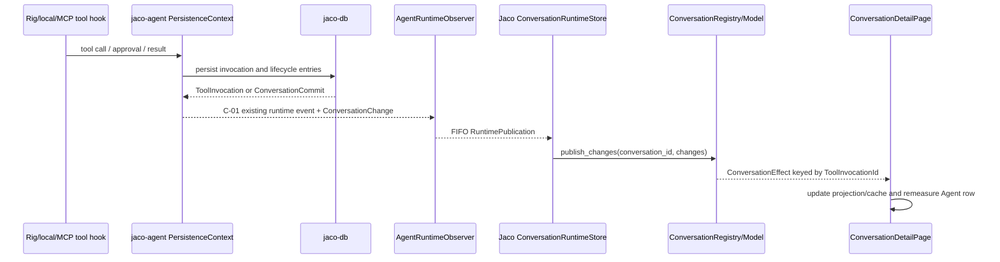

# Issue #190：在 Jaco 时间线中检查完整工具调用生命周期

## 状态与范围

- 状态：`Implemented`（生产实现与本地自动化已验证；完整 Local/MCP 人工场景与远端三平台 CI 尚未验证）
- 关联 issue：[#190](https://github.com/suxiaoshao/gpui/issues/190)
- 父 issue：[#159](https://github.com/suxiaoshao/gpui/issues/159)
- Plan ID：`issue-190`
- 根计划：`docs/dev/issue-190/README.md`
- 根索引：[Workspace development plans](../README.md)
- 分支：`codex/190-jaco-inspect-tool-invocation-details`
- 受影响 owner：`app/jaco`、`crates/jaco-agent`
- 明确不修改：`crates/jaco-core`、`crates/jaco-db`、`crates/jaco-conversation`、workspace manifests、`Cargo.lock`
- Release gate：无外部 release gate；完成状态要求通过 `R-01`–`R-13` 的自动化与人工验收
- 最近证据刷新：2026-08-19
- 实施引用：分支 `codex/190-jaco-inspect-tool-invocation-details` 的提交与对应 GitHub PR；精确 commit 与 PR 状态以 Git/GitHub 元数据为准

### 高影响变更摘要

| 审计门 | 结果 | 权威 ID |
| --- | --- | --- |
| Workspace/crate topology and ownership | [Add] `app/jaco` 新增 invocation 详情模块；`crates/jaco-agent` 补齐现有事件协议的发布点；不新增 crate | `D-01`、`D-04`、`F-01`–`F-02`、`WP-101`、`WP-201` |
| Public or cross-owner contracts | [Cross-owner] `jaco-agent` 在初始插入与强制终态持久化后发布既有 `ToolInvocationChanged`，Jaco 按 ID 消费 | `C-01`、`D-04`、`WP-201`、`WP-103` |
| Global/shared authority | None；`Conversation` 继续是持久化生命周期事实源，页面只保存可丢弃的展开状态与 preview cache | `D-01`、`D-06`、`ST-101`–`ST-103` |
| Persistence, data, configuration, or credentials | None；现有表、JSON 字段、repository hydration 与审批事务不变，无 migration/backfill | `D-08`、`E-03`、`E-04` |
| Runtime, concurrency, performance, or shutdown | [Modify] 初始/强制终态 invocation 增量发布完整 snapshot；大 JSON 采用首次展开生成的硬预算 preview | `D-03`、`D-04`、`D-06`、`C-01`、`R-05`、`R-07`、`R-11` |
| Security, privacy, or external access | [Security-sensitive] canonical参数、结构化输出、文本、错误与 access字段按原值生成有界字面量 preview；默认 UI/clipboard不包含 provider raw envelope，也不做启发式 secret/token 改写 | `D-03`、`ERR-01`、`R-06`、`WP-101` |
| Dependencies, toolchains, generated, or vendored artifacts | None；复用当前锁定的 `gpui-component`、`serde_json`、`url` 与现有图标 | `E-10`、`D-06` |
| Platform, packaging, CI, or release | None；无 bundle、asset、bootstrap 或平台分支变更 | `S-16` |
| User-visible compatibility, defaults, or removals | [Modify] 多个通用 lifecycle card 合并为一个 invocation 单元；旧数据和缺失关联仍安全可见 | `D-02`、`D-08`、`R-01`–`R-04`、`R-10` |

### 目标

1. 每个持久化 `ToolInvocationId` 在 Agent 时间线详情中只对应一个可展开单元。
2. 折叠态准确展示模型可见名称、来源、MCP server、七种生命周期状态、持久化 duration 与成功/失败摘要。
3. 展开态展示原始名称、invocation/call ID、参数、access request、审批、时间、文本/结构化输出及 normalized error。
4. 同名并发调用、增量状态更新与数据库重载始终保持正确的 invocation 关联和 keyed UI 状态。
5. 大值和 provider raw envelope不会阻塞初始时间线渲染或进入默认 UI/clipboard；展开后的 canonical字符串保持原值，只在硬预算处截断并明确标记。

### 非目标

- 不实现 #198 的真实工具进度、百分比、参数 delta、刷新 timer、spinner 或基于当前时间持续增长的 elapsed UI。
- 不修改 `ToolInvocation`、`ConversationChange`、数据库 schema、migration、repository query 或序列化格式。
- 不按名称、参数、provider call ID、payload 内部 ID 或相邻顺序推断 invocation identity。
- 不实现 tool-specific UI、持久化展开状态、完整 raw reveal、导出文件或绕过 preview 限额的复制入口。
- 不新增 workspace 通用 redaction crate，也不在 Jaco UI 中猜测 token、secret、header 或路径是否敏感；credential保护继续由 tool/provider/transport边界负责。
- 不改变一次性审批业务语义、approval persistence、MCP wire protocol、Rig adapter 或 provider tool protocol。

### 用户决定

- 用户明确要求创建 Issue #190 的开发文档骨架，并在没有待确认问题时直接完成执行计划。
- 身份、聚合、事件顺序、GPUI ownership、审批 authority、预算、兼容与验证路径没有待确认问题。
- 用户质疑为工具详情新增启发式脱敏的依据，并要求对照本地 Codex、Zed、Pi；`E-13` 的源码核对确认三者都保留 tool-visible canonical内容，只用折叠、截断或专用 renderer 控制展示。
- 因此 #190 固定为：不做启发式 secret/token/path 改写；显示 canonical字段的有界字面量 preview；默认省略 provider raw envelope。当前没有待确认问题。

### 兼容与迁移策略

- 现有 SQLite 数据原样读取。`ConversationService::load` 已把每个 run 的 invocation 与 entries 一并 hydrate；无需 migration、backfill、rebuild 或双读。
- 新 UI 只把既有 lifecycle entries 投影为一个单元。record缺失时相同 outer ID仍聚合成一个安全 unresolved单元；outer association也缺失时才逐 Entry降级，绝不按其他字段补关联。
- `C-01` 使用现有 `AgentRuntimeEvent::{ConversationTimelineChanged, ConversationCommitted}` 与现有 `ConversationChange::ToolInvocationChanged`；无新公开 event variant，兼容类为行为兼容。
- 回滚只需恢复 app projection 与 agent publication 调用点；没有数据回滚步骤，也不会删除已持久化 invocation。
- `runtime_tool_name` 作为 model-visible alias，`tool_name` 作为持久化原始名称。#184 对真实 wire 调用名称的修复可独立进行，本 issue 只展示当前持久化事实。

### 计划映射

| 范围 | 文档 | 职责 | Assigned IDs / WPs |
| --- | --- | --- | --- |
| 根计划 | 本文 | 状态、范围、适用性、共享证据/决定、`C-01`、`ERR-01`、跨 owner 顺序、聚合验证与完成证据 | `S-*`、`E-01`–`E-13`、`D-01`–`D-08`、`F-01`–`F-02`、`C-01`、`ERR-01`、`R-01`–`R-13`、`T-01`–`T-12` |
| Jaco | [owner 计划](../../../app/jaco/docs/dev/issue-190/README.md) | 有界 preview、ID-only projection、GPUI block、页面状态、审批可操作性、i18n、reload/UI 验证 | `E-101`–`E-114`、`D-101`–`D-106`、`F-101`–`F-113`、`L-101`–`L-111`、`ST-101`–`ST-104`、`R-101`–`R-113`、`T-101`–`T-113`、`WP-101`–`WP-104` |
| jaco-agent | [owner 计划](../../../crates/jaco-agent/docs/dev/issue-190/README.md) | 初始与强制终态 invocation 的完整 snapshot 发布及 runtime tests | `E-201`–`E-209`、`D-201`–`D-204`、`F-201`–`F-208`、`L-201`–`L-204`、`ST-201`、`R-201`–`R-205`、`T-201`–`T-205`、`WP-201` |

## 适用性

| S-ID | Canonical surface | 状态 | 当前证据 | 目标决定或负面理由 | Owner / WP |
| --- | --- | --- | --- | --- | --- |
| `S-01` | Workspace, files, modules, and owner boundaries | Applicable | Jaco detail 分为 `detail.rs` 与 `detail/{timeline,message,tool_blocks}.rs`；agent publication 位于 persistence/runtime | 新增 app-local `tool_invocation.rs` 与 `copy_button.rs`，修改两个既有 owner，不新增 shared crate | `D-01`、`D-06`、`WP-101`、`WP-201` |
| `S-02` | GPUI components, layout, interaction, and accessibility | Applicable | 当前每个 Entry 建一个 `DetailBlock`；列表使用 measure-all `ListState` | 复用 `Collapsible`、`Button`；preview 用只创建普通 text nodes 的私有 literal renderer，受控展开并精确 remeasure Agent row | `D-02`、`D-06`、`WP-102`、`WP-103` |
| `S-03` | Entity, Store, Global, identity, and projections | Applicable | `ConversationModel` 已按 invocation ID upsert；页面只保存 Agent 展开状态 | domain仍是 authority；页面按 `ToolInvocationId` 保存展开/cache，增量 revision用 `updated_at`，reload清空 cache | `D-01`、`D-06`、`ST-101`–`ST-103` |
| `S-04` | Actions, events, subscriptions, focus, and windows | Applicable | 页面订阅 model/runtime；审批按钮调用 runtime；tool block toggle 只 notify child | 新增 invocation toggle 与审批 availability event，均复用现有订阅并重测拥有行；按钮提供键盘/tooltip label | `D-05`、`D-06`、`WP-103` |
| `S-05` | Async tasks, concurrency, cancellation, and shutdown | Applicable | agent observer publication 经现有 FIFO channel drain；approval broker 可并发注册/resolve/cancel | 不新增 Task；在现有 publication 顺序内补 snapshot，并让 broker availability 走同一 retained event task | `C-01`、`D-04`、`D-05`、`WP-201`、`WP-103` |
| `S-06` | Data acquisition and Operation state | Applicable | `ConversationModel` 的 refresh Operation 从 DB reload 完整 Conversation | 不新增 Operation；preview 是有界同步 cache，源为当前 Ready Conversation，reload/revision 精确失效 | `D-03`、`D-06`、`ST-102`、`WP-101`、`WP-104` |
| `S-07` | Forms and editable state | N/A | invocation inspector 没有编辑字段、表单或保存流程 | 不引入 Form 或 native input state | — |
| `S-08` | Cross-crate, provider, Rig, MCP, platform, and external contracts | Applicable | `jaco-agent` 已发布 Conversation change；Jaco runtime registry 消费 | 固定 `C-01`；仅补现有事件的发布完整性，不改 Rig/MCP/provider wire protocol | `C-01`、`WP-201`、`WP-103` |
| `S-09` | Error identity, propagation, recovery, and error UI | Applicable | `ToolInvocation.error` 是 `RunErrorPayload`，当前 generic formatter 直接显示 message/raw output | `ERR-01` 展示原值的 bounded code/message/retryable/provider，provider raw envelope不进入默认 inspector | `ERR-01`、`WP-101`、`WP-102` |
| `S-10` | Database, persistence, and migrations | No change | `conversation_timeline_records` 已加载每个 run 的 invocations；表含 input/output/error/approval/timestamps | 不改表、query、transaction、migration；app-level reopen test消费现有契约 | `E-03`、`E-04`、`D-08`、`WP-104` |
| `S-11` | Generated, synchronized, copied, or vendored content | N/A | 目标文件均为 handwritten Rust/Fluent/Markdown | 无 generator、snapshot、vendored 或 copied artifact | — |
| `S-12` | Icons and assets | N/A | 当前 `IconName` 已覆盖 chevron、copy、tool、success/error/approval | 只复用现有 typed icons，不改 asset enum/SVG/bundle icon | `D-06` |
| `S-13` | Fluent i18n and bundle localization | Applicable | conversation 文案位于 Jaco 两个 `main.ftl` | 两 locale 增加同 key 的 invocation metadata/status/preview/accessibility 文案；bundle strings 不变 | `D-06`、`WP-102` |
| `S-14` | Security, privacy, and credentials | Applicable | 当前 tool formatter无界展示 arguments、structured/raw output和 approval preview；仓库没有 Jaco tool-preview helper | canonical内容保持原值并受统一预算约束；provider raw envelope默认省略；literal renderer阻止内容被解释成链接/图片/HTML | `D-03`、`ERR-01`、`R-06`、`WP-101` |
| `S-15` | Observability and diagnostics | No change | 当前 lifecycle persistence 有结构化运行时日志；inspector 不记录 payload | 不新增 preview/payload tracing；保留既有运行时诊断与 correlation ID | `D-03` |
| `S-16` | Packaging, platform behavior, and CI/release | No change | 改动只在 Rust UI/runtime 与 Fluent runtime locale | 无 bundle、entitlement、bootstrap、平台 API 或 workflow 修改；现有三平台 CI 仍是最终门 | `R-13`、`T-12` |
| `S-17` | Dependencies, frameworks, Git sources, and toolchains | No change | Jaco 已依赖 `serde_json`、`url`、`gpui-component`; lock 固定 component SHA `57a9903f` | 不加依赖、不改 features/manifests/lockfile | `E-10`、`D-06` |
| `S-18` | Owner documentation, indexes, and ADRs | Applicable | root/Jaco 已有 dev index；jaco-agent 尚无 owner index | 创建 root + 两个 owner plan，新增 jaco-agent index并同步入口；issue-specific policy无需 ADR | `F-01`–`F-02`、owner F-IDs |
| `S-19` | Validation and completion evidence | Applicable | issue 要求 domain/UI/reload/live/manual 验证 | `R-*` 全量映射 `T-*`，focused 后 aggregate，再做 Local/MCP 人工与三平台 CI | `WP-104`、`T-01`–`T-12` |

## 证据

### 当前流程



当前初始 insertion 和强制 finalization 在 `Agent -> Event` 处缺失 invocation snapshot；当前 Page 也忽略收到的 `ToolInvocationChanged`。`C-01` 同时补齐两侧。

### 证据登记

| E-ID | 分类 | 结论 | 证据 | 计划后果 |
| --- | --- | --- | --- | --- |
| `E-01` | Current fact | #190 要求 ID-only 聚合、七状态、restart 等价、大 JSON、安全 preview 与 Local/MCP 手测 | GitHub #190，2026-08-19 通过 `gh issue view` 刷新，`updatedAt=2026-07-31T12:20:09Z` | `R-01`–`R-13` 为完成边界 |
| `E-02` | Current fact | 父 #159 禁止为 #190 模拟 live progress；真实 progress 属于 #198 | GitHub #159，2026-08-19 通过 `gh issue view` 刷新 | `D-07` |
| `E-03` | Current fact | `Conversation` 已含 `tool_invocations`，record 包含 identity/source/name/status/input/output/error/approval/timestamps；transition 按 ID upsert | `crates/jaco-core/src/domain.rs::{Conversation,ToolInvocation,Transition<ConversationChange>}` | 不改 jaco-core；它继续是权威事实 |
| `E-04` | Current fact | repository load 会按 run 加载 invocation 并由 ConversationService 放入 snapshot | `crates/jaco-db/src/repository/conversations.rs::conversation_timeline_records`；`crates/jaco-conversation/src/lib.rs::conversation_from_records` | 无 migration；reopen test直接消费现有 hydration |
| `E-05` | Current fact | `AgentTurnRow::render_details` 逐 Entry 建 `DetailBlock`，approval action 由 Decision/Result Entry 集合推断 | `app/jaco/src/components/chat/detail/message.rs::{AgentTurnRow::render_details,approval_request_decidable}` | 改为 `AgentDetailItem` 和 runtime broker authority |
| `E-06` | Current fact | 页面忽略 `ToolInvocationChanged`，并在 reload/insert 时为每个 Entry eager 建 TextView source | `app/jaco/src/components/chat/detail.rs::{apply_conversation_effect,sync_message_text_states}` | 增加精确 update；grouped lifecycle entry 不进 eager formatter |
| `E-07` | Current fact | formatter 直接 pretty-print arguments、structured/raw output 与 `arguments_preview`，agent copy 复用同一路径 | `app/jaco/src/foundation/conversation_format.rs::item_markdown`；`detail/message.rs::agent_copy_text` | `D-03` 必须在 render/clipboard 前生效 |
| `E-08` | Current fact | 初始 invocation 插入后只发布 ToolCall Entry，没有发布 `ToolInvocationChanged` | `crates/jaco-agent/src/persistence/tool_hook.rs::insert_tool_invocation_and_append_call`；`persistence/conversation_entries.rs::append_tool_item` | `WP-201` 补 `ConversationTimelineChanged` |
| `E-09` | Current fact | 普通 approval/result commit 已发布 entry + invocation；强制 finalization 的 commit 未发布 | `persistence/conversation_entries.rs::{emit_tool_entry_commit,emit_tool_entries_commit}`；`runtime/finalization.rs::append_error_tool_result_and_update_tool_invocation` | `WP-201` 只补缺口，不重复已有 event |
| `E-10` | Current fact | 当前锁定的 gpui-component 提供 controlled `Collapsible::open/content`；`TextView` 只接受 Markdown/HTML，支持 active Link/Image，图片最终进入 `img(url)` | Cargo.lock SHA `57a9903f`; checkout `crates/ui/src/{collapsible.rs,text/text_view.rs,text/inline_flow.rs}` | disclosure 复用 `Collapsible`/`Button`；不把不可信 preview 交给 `TextView`，实现 app-private literal text renderer |
| `E-11` | Current fact | pending record已保存 conversation/run/invocation，但query只校验 run/invocation、resolve只按 invocation；approve/deny还在 exact成功前清理 `last_errors` | `app/jaco/src/features/conversation/runtime/approval.rs::{PendingApproval,is_pending_for_run,resolve}`；`runtime.rs::{approve_tool_invocation,deny_tool_invocation}` | `D-05` 收紧为三元组原子resolve、补 availability，并把 error清理移到成功后；一次性决策语义不变 |
| `E-12` | Current fact | `rg -i 'redact|redaction|safe-preview' app/jaco crates/jaco-*` 未找到 Jaco tool payload 策略 | 2026-08-19 本地源码检查；仅其他 app/OAuth Debug 有局部 redaction | `D-03` 不能声称复用不存在的 helper，也不新增启发式脱敏策略 |
| `E-13` | Comparative fact | 本地 Codex、Zed、Pi 的工具详情均保留 tool-visible 参数/结果原值；主要控制点是折叠、截断与专用 renderer，默认卡片不倾倒 provider raw envelope | Codex `codex-rs/tui/src/history_cell/mcp.rs::{format_mcp_invocation,McpToolCallCell}`；Zed `crates/agent_ui/src/conversation_view/thread_view.rs::{render_tool_call,render_markdown_output}` 与 `crates/agent/src/tools/terminal_tool.rs`；Pi `@earendil-works/pi-coding-agent@0.84.2/dist/modes/interactive/components/tool-execution.js`、`dist/core/tools/truncate.js`，2026-08-19 本地源码/安装包检查 | `D-03` 采用 canonical原值 + bounded preview，不增加 secret/token/path猜测 |

## 决定

| D-ID | 决定 | 依据 | 放弃的方案 | 后果 / owner |
| --- | --- | --- | --- | --- |
| `D-01` | `Conversation.tool_invocations` 是生命周期唯一 authority；所有 UI identity、state 和 update key 都来自 persisted `ToolInvocationId` | `E-03`、#190 | name/arguments/call ID/ordering 推断；复制一份业务状态到 Store | Jaco 只保存轻量 projection 与可丢弃 cache |
| `D-02` | 顶层时间线继续以 User/AgentRun 分行；run details 使用 `Entry | ToolInvocation | UnresolvedToolLifecycle`，persisted或missing-record outer ID都只发出一个 block | `E-05`、#190 | 顶层新增 tool row；保留多个 generic card | 保持对话布局与滚动结构，精确吸收 lifecycle entries |
| `D-03` | tool-visible canonical参数、结果、错误与 metadata保持原值，通过统一硬预算生成 preview；默认 UI/clipboard省略 provider `raw_output`/`error.raw`；copy等于当前 bounded preview；内容只按 literal text渲染，不做启发式 secret/token/path改写 | `E-07`、`E-10`、`E-12`、`E-13`、S-14 | 展示完整 provider raw envelope；活动 Markdown/HTML；先完整 serialize 再截断；clipboard绕过预算；UI猜测并改写凭据形态 | app owner实现纯函数与边界测试；工具内容含敏感值时会按实际值显示，保护责任在tool/provider/transport边界 |
| `D-04` | 使用现有 `AgentRuntimeEvent` 和 `ConversationChange` 补齐初始/强制终态完整 snapshot 发布；不新增 runtime protocol variant | `E-08`、`E-09`、#190 Impact | UI polling/reload；新增平行 tool event | `C-01` 由 jaco-agent 生产、Jaco 消费 |
| `D-05` | approval action需同时满足 persisted pending状态与当前 app broker精确持有 conversation/run/invocation三元组；broker availability变化经现有 runtime event task通知页面 | `E-11` | 只看 persisted Entry；页面另存 `is_deciding`；只按 invocation ID resolve | restart后保留 audit、隐藏 stale action；一次 resolve语义不变 |
| `D-06` | 页面拥有 expansion/cache；增量更新用 `updated_at` 校验 revision、任何 reload 清空 preview cache；controlled `Collapsible`、`Button`、bounded literal text 组成 block；所有交互/copy key 派生自 invocation ID | `E-06`、`E-10` | child-local keyed expansion；index key；活动 Markdown/HTML；完整 ToolInvocation clone 进每次 list render | 展开/update 显式 remeasure所属 Agent row；reload 后保留有效 expansion并重建其 preview |
| `D-07` | duration 只使用持久化时间：终态为 `completed_at-started_at`，活跃态为 `updated_at-started_at` 并标注“截至上次更新”；缺失值显示 unavailable | `E-02`、#190 | `now_utc` timer、spinner、伪进度 | 折叠摘要稳定、reload 等价 |
| `D-08` | 不改 schema/domain/load contract；旧数据、orphan 与 missing association 采用安全降级，且无 migration/rebuild/rollback 数据步骤 | `E-03`、`E-04` | 新 projection table；按 payload 修复历史关联 | 生产改动限定在 app + agent publication |

## 目标设计

### 根拥有的文件

```text
docs/dev/
├── README.md                 # F-01 [Modify, handwritten] 登记 #190 root hub
└── issue-190/
    └── README.md             # F-02 [Add, handwritten] 本计划、共享契约与完成证据
```

owner-local Rust、Fluent、测试和索引文件只在对应 owner plan 中登记。

### C-01：持久化 ToolInvocation snapshot 发布

| Contract ID | Direction | Mechanism | 权威定义 | Producer | Consumers | Compatibility | ERR-IDs | WPs |
| --- | --- | --- | --- | --- | --- | --- | --- | --- |
| `C-01` | `jaco-agent -> app/jaco` | Rust runtime event / conversation change | `AgentRuntimeEvent` + `ConversationChange::ToolInvocationChanged` | `crates/jaco-agent` | Jaco runtime registry、ConversationModel、detail projection | Behavior-compatible；无新 variant/serialized wire shape | `ERR-01` | `WP-201`、`WP-103` |

```rust
// Existing authoritative types; signatures remain unchanged.
pub enum AgentRuntimeEvent {
    ConversationCommitted {
        conversation: Box<ConversationSummary>,
        changes: Vec<ConversationChange>,
    },
    ConversationTimelineChanged {
        conversation_id: ConversationId,
        changes: Vec<ConversationChange>,
    },
    // existing variants unchanged
}

pub enum ConversationChange {
    ToolInvocationChanged { invocation: Box<ToolInvocation> },
    // existing variants unchanged
}
```

发布规则：

1. 初始 `insert_tool_invocation` 成功后，producer 先发 `ConversationTimelineChanged`，其中仅含该 persisted invocation 的 `ToolInvocationChanged`。
2. ToolCall Entry 随后按既有 `ConversationCommitted` 路径发布。若 append 失败，已持久化 invocation 仍作为 orphan 被 UI/重载检查。
3. approval/result 的既有原子 commit 按 transaction entry 顺序发布所有 `EntryAppended`，最后发布同一 commit 返回的 `ToolInvocationChanged`。
4. cancel/fail/stop 的强制 finalization 也发布步骤 3 的完整 commit；有 observer 的 active/cancel 路径实时发布，启动恢复没有 observer，依赖下一次 DB reload。
5. Consumer 先按 ID upsert domain，再只更新该 invocation 所属 Agent row；新增/anchor 变化才做结构性 rebuild。
6. event 丢失不会改变持久化权威；reload 通过 `E-04` 恢复相同 association。

### ERR-01：持久化工具失败的安全检查视图

| ERR-ID | Category | Meaning / trigger | Safe details | Retry / recovery | Compatibility |
| --- | --- | --- | --- | --- | --- |
| `ERR-01` | persisted tool failure | invocation 为 `Failed`、`Denied` 或 `Canceled` 且带 `RunErrorPayload` | `code`、经 `D-03` 处理的 `message`、`retryable`、`provider`; `raw` 永久省略 | Inspector 只读；不增加 retry action，后续用户 turn 沿用现有恢复 | Existing error identity preserved；仅收紧展示 |

映射规则：

- tool invocation 的 `RunErrorPayload.raw` 不进入 inspector projection、literal renderer、clipboard、Fluent 参数或 tracing；普通 conversation-level `ConversationEntryPayload::Error` 不在本 issue 范围内。
- 缺失 `error` 的终态显示 localized unavailable，不从 ToolResult 文本、Entry error 或相邻事件补造。
- `message`、`code`、`provider` 保持 persisted原值并使用对应 bounded text/metadata preview；`retryable` 直接作为 typed metadata展示。
- 当前 runtime persistence 和 run recovery 完全不变。

### 共享安全与性能策略

`D-03` 的固定默认预算：

```rust
ToolPreviewLimits {
    max_depth: 12,
    max_nodes: 2_048,
    max_input_bytes: 256 * 1_024,
    max_string_bytes: 8 * 1_024,
    max_output_bytes: 64 * 1_024,
    max_lines: 1_000,
}
```

- JSON object key与string value按 persisted内容写入，不按 key名、header形态、token前缀、URL userinfo或路径模式替换；key和value仍分别受单 string、input与output预算约束。
- JSON visitor 直接写入同时跟踪 input bytes、depth、nodes、单 string bytes、final output bytes 与 lines 的 bounded sink；不得建立 bounded tree后再 pretty-print，也不得对原值调用 `to_string_pretty`。sink 为最终 `"[TRUNCATED]"` 预留空间，在任一预算耗尽时停止遍历并在 UTF-8 边界写 marker；最终 `BoundedPreview.text` 本身必须满足 byte/line budget。
- `ContentPart` 逐项处理且每个 part计入 node budget；只单遍扫描 `ContentPart::Text`，共享同一 input/output/line预算，禁止先 join。非文本 part只输出 bounded metadata/unavailable，不读取 attachment payload。
- `ToolInvocationOutput.raw_output`、`RunErrorPayload.raw` 与重复的 `ApprovalRequestPayload.arguments_preview` 不进入默认 inspector。参数只来自 canonical `ToolInvocation.input.arguments`；access request展示 bounded原值的 `target`、可选 `normalized_path`、`kind`、`within_project`、`reason_key`。
- agent-level Copy 排除 grouped/unresolved tool lifecycle payload；每个 invocation 的 Copy只复制已展示的 bounded preview，并带 localized truncation/raw-hidden marker，不提供绕过预算的 full/raw copy。
- preview 仅通过普通 GPUI text nodes逐行渲染；禁止 Markdown/HTML parser、Link/Image node、URI opener和点击回调。包含 Markdown image、HTML、link、本地 URI 与嵌套 fence的内容必须按原字符显示且不产生外部访问。
- preview 内容禁止进入 tracing；测试 fixture 只能使用虚构 credential。

## 需求与验收

| R-ID | 可观察要求 |
| --- | --- |
| `R-01` | 每个 persisted `ToolInvocationId` 在所属 AgentRun details 中恰好出现一次。 |
| `R-02` | 折叠态准确显示 model-visible name、source/server、status、persisted duration 和 outcome 摘要。 |
| `R-03` | 展开态显示 issue 列出的全部 canonical可见字段；缺失字段明确显示 unavailable。 |
| `R-04` | Requested、AwaitingApproval、Running、Succeeded、Failed、Denied、Canceled 全部有稳定、本地化投影。 |
| `R-05` | arguments、text output、structured output 和 normalized error 首次展开才生成 bounded preview；structured preview 可复制。 |
| `R-06` | `D-03` 对首次展示、更新、reload和 clipboard一致生效；canonical字符串不被启发式改写，provider raw envelope不可达，截断/raw-hidden边界明确。 |
| `R-07` | 初始、approval、running、terminal 与强制 finalization 更新同一 ID 单元，不添加模拟 progress。 |
| `R-08` | approval action 只在 broker 持有 exact conversation/run/invocation 时可用；restart/stale/duplicate action 安全 no-op。 |
| `R-09` | 同名、同参数、并发 invocation 使用不同 ID、ElementId、expand/cache/copy/action state。 |
| `R-10` | outer ID 缺失、record 缺失、orphan invocation、payload 内 ID 不一致和 optional data 缺失均不触发推断或泄露。 |
| `R-11` | collapsed render 为 O(1) metadata；preview 遵守固定深度/节点/字符串/字节/行预算并显式标注截断。 |
| `R-12` | en-US/zh-CN key 对齐；toggle/copy/approve/deny 使用 Button 的键盘行为与明确 label/tooltip。 |
| `R-13` | focused tests、app/agent checks、workspace门禁、Local/MCP人工场景和三平台 CI 结果被如实记录。 |

## 工作包顺序

| 阶段 | WP | Owner | 可观察结果 | 前置 | 详细计划 |
| --- | --- | --- | --- | --- | --- |
| 1a | `WP-101` | `app/jaco` | bounded preview 与 ID-only detail projection 的纯函数和测试落地 | `D-01`–`D-03` | [Jaco owner plan](../../../app/jaco/docs/dev/issue-190/README.md) |
| 1b（可与 1a 并行） | `WP-201` | `crates/jaco-agent` | 初始与强制终态 commit 均通过 `C-01` 发布完整 invocation snapshot | `C-01` | [jaco-agent owner plan](../../../crates/jaco-agent/docs/dev/issue-190/README.md) |
| 2 | `WP-102` | `app/jaco` | controlled invocation block、展开/cache、copy、i18n 和列表重测落地 | `WP-101` | [Jaco owner plan](../../../app/jaco/docs/dev/issue-190/README.md) |
| 3 | `WP-103` | `app/jaco` | 页面消费实时 invocation/approval availability，精确更新并 remeasure 同一 Agent row | `WP-102`、`WP-201` | [Jaco owner plan](../../../app/jaco/docs/dev/issue-190/README.md) |
| 4 | `WP-104` | `app/jaco` | DB reopen、keyed UI、large JSON 与 Local/MCP 全生命周期完成聚合验证 | `WP-101`–`WP-103`、`WP-201` | [Jaco owner plan](../../../app/jaco/docs/dev/issue-190/README.md) |

## 验证

| R-ID | T-ID / owner | 自动化或人工证据 | 期望结果 | 外部前提 |
| --- | --- | --- | --- | --- |
| `R-01`、`R-09` | `T-01` / Jaco `T-101` | `timeline` pure tests：同名/同参/交错 entry | 不同 ID 两单元；同一 ID 单单元 | None |
| `R-02`–`R-04` | `T-02` / Jaco `T-102` | summary/detail projection table tests | 七状态、三 source、缺失值准确 | None |
| `R-05`、`R-06`、`R-11` | `T-03` / Jaco `T-103`–`T-105` | credential-shaped synthetic strings、所有 JSON string/metadata、active-markup literal、wide/deep JSON、Unicode、copy parity tests | canonical字符串保持原值；无 provider raw/active content；预算内；marker明确 | None |
| `R-07` | `T-04` / jaco-agent `T-201`–`T-205` | observer publication/recovery tests | 初始/结果/finalization 同 ID完整 snapshot、正确顺序且无重复；无 observer恢复依赖reload | None |
| `R-08` | `T-05` / Jaco `T-111` | broker availability/register/resolve/cancel/restart/wrong-conversation/stale-error tests | action 与 exact authority同步；no-op不清理 error | None |
| `R-10` | `T-06` / Jaco `T-106` | missing/orphan/outer-inner mismatch tests | 同 outer ID 聚合；无 fallback identity；安全 unresolved/orphan | None |
| `R-04`、`R-06`、`R-10` | `T-07` / Jaco `T-113` | temp SQLite close/reopen + real model Reloaded/page cache lifecycle | association相同；expansion retain/prune、cache rebuild、restart action清空 | Local filesystem + GPUI test support |
| `R-07`、`R-09`、`R-12` | `T-08` / Jaco `T-107`–`T-112` | keyed identity/toggle/copy/remeasure、snapshot-first orphan→anchor与 terminal batch | sibling/update不串状态；expansion/cache保留；按钮可键盘触发 | GPUI test support |
| `R-13` | `T-09` | `cargo fmt`、`cargo test -p jaco-agent`、`cargo test -p jaco`、focused clippy/check、`git diff --check` | 全部通过 | dependencies available |
| `R-13` | `T-10` | `cargo build --workspace --locked`、`cargo test --workspace --locked`、`cargo clippy --workspace --all-targets --all-features --locked -- -D warnings` | 与 `.github/workflows/ci.yml` 的 workspace gate 一致且通过 | full workspace environment |
| `R-01`–`R-12` | `T-11` | Jaco Local/MCP approve、deny、fail、cancel、success、same-name、large JSON、restart 手测 | UI、copy、scroll、action 与 persisted facts 一致 | configured local and MCP tools |
| `R-13` | `T-12` | GitHub macOS/Linux/Windows CI | `.github/workflows/ci.yml` 全平台通过 | pushed PR / CI |

验证只在实现完成后执行一次对应层级；同一未变化状态不重复运行相互覆盖的门禁。

## 完成证据

| Evidence | Actual result |
| --- | --- |
| Implementation PR and commits | 分支 `codex/190-jaco-inspect-tool-invocation-details` 的提交与对应 GitHub PR；精确 commit、PR 编号与 checks 状态以 Git/GitHub 元数据为准 |
| Actual added/modified/deleted/generated files | 新增 `detail/{copy_button,tool_invocation}.rs` 与 root/Jaco/jaco-agent 三份 issue plan、jaco-agent dev index；修改 Jaco detail/timeline/message/tool_blocks、conversation runtime/approval、legacy formatter、i18n/两 locale、jaco-agent persistence/runtime/finalization/tests 及两个既有 dev index；删除 source 文件 `None`；生成 bundle 位于忽略的 `target/` |
| Delivered D/F/L/C/ERR/ST/R/T/WP IDs | root `D-01`–`D-08`、`F-01`–`F-02`、`C-01`、`ERR-01` 及对应 owner `D/F/L/ST` 均已实施；`WP-101`–`WP-103`、`WP-201` 和 `WP-104` 的生产/自动化部分已完成；`R-01`–`R-12` 已有自动化覆盖，`R-13` 的本地门禁已完成；`T-01`–`T-10` 已验证，`T-11` 仅完成隔离 bundle 启动，`T-12` 未执行 |
| Automated commands and results | `cargo fmt --all -- --check`、Jaco/jaco-agent focused 与完整 crate tests、`cargo build --workspace --locked`、`cargo test --workspace --locked --no-fail-fast`、`cargo clippy --workspace --all-targets --all-features --locked -- -D warnings`、`git diff --check` 均通过；最终测试数量见下方实施验证记录 |
| Manual Local/MCP/restart scenarios and environment | `cargo run -p xtask --locked -- bundle jaco` 成功；使用独立临时配置启动生成的 `Jaco.app` 并确认窗口进入初始 onboarding，随后终止进程并删除临时数据库/日志。未接入真实 provider/MCP 凭据，因此 approve、deny、fail、cancel、success、同名并发、large JSON、restart/scroll 全流程未验证 |
| Schema/migration/dependency/generated diff | `None`：未修改 schema、migration、manifest、dependency、`Cargo.lock`、workflow、asset 或 bundle 配置；只有忽略的 `target/` bundle 生成物 |
| Owner README/index/ADR updates | root、Jaco、jaco-agent issue plan 与三个 dev index 已同步为实施状态；ADR `None` |
| Accepted deviations and approving decision | `None`；未执行项保留为 unverified，没有视为已接受偏差 |
| Unverified boundaries and reason | `T-11` 完整 Local/MCP/视觉交互：隔离环境没有可安全复用的 provider/MCP fixture 或凭据；`T-12` macOS/Linux/Windows CI：以对应 GitHub PR 的远端 checks 结果为准，本地实施记录不预先标记通过 |

### 实施验证记录（2026-08-19）

- `cargo fmt --all -- --check`：通过。
- `cargo test -p jaco --locked --no-fail-fast`：462 passed，2 ignored，0 failed；其中真实页面回归覆盖增量 `ToolInvocationChanged`、availability/`RunFinished` 与 SQLite reopen/reload 前后安全 preview/copy 一致性。
- `cargo test -p jaco-agent --locked --no-fail-fast`：122 passed，0 failed；`T-201`–`T-205` 固定测试全部通过。
- `cargo build --workspace --locked`：通过；macOS linker 报告非阻断的 `__eh_frame section too large` warning。
- `cargo test --workspace --locked --no-fail-fast`：最终工作树通过；涉及 loopback listener 的测试在获批的沙盒外环境执行。
- `cargo clippy --workspace --all-targets --all-features --locked -- -D warnings`：最终工作树通过；仅报告依赖的 future-incompatibility notice。
- `git diff --check`：通过。
- `cargo run -p xtask --locked -- bundle jaco`：通过并生成 `target/release/bundle/macos/Jaco.app`；`actool` 因本机 CoreSimulator 状态跳过 Liquid Glass icon 注入，普通 app icon 与 bundle 保留。隔离配置启动该 bundle 后确认 Jaco 初始窗口可见，随后终止并删除临时数据。

只有所有必需 evidence 完成或准确记录为用户接受的范围限制后，才能把状态改为 `Done`。

## 执行交接审计

- [x] root hub 与两个受影响 owner plan 使用同一 `issue-190` ID，并双向链接。
- [x] root 拥有完整 S/C/ERR、共享决定、跨 owner 顺序与聚合验证；owner 只定义本地实现。
- [x] 所有 S-row 已分类并给出当前证据或负面理由。
- [x] 字符串披露、copy与provider raw envelope边界已由用户要求的 Codex/Zed/Pi 对照固定，无待确认问题。
- [x] identity、排序、literal rendering、duration、approval authority、reload 与兼容策略均已固定。
- [x] `C-01` 使用已验证的现有 Rust event/change 类型，未留下 runtime protocol 选择。
- [x] `ERR-01` 固定 bounded detail allowlist、provider raw omission、UI 与恢复边界。
- [x] 每个 mutable projection/cache/interaction state 的 authority、revision、reset 与 remeasure 由 Jaco owner plan 定义。
- [x] 没有 migration、dependency、generated、asset、packaging 或平台实现待选择。
- [x] 所有 root `R-ID` 均映射到 owner tests、aggregate commands 或人工/CI evidence。
- [x] 实施者无需发明披露策略、GPUI primitive、stable key、预算、event ordering 或 acceptance criteria。
